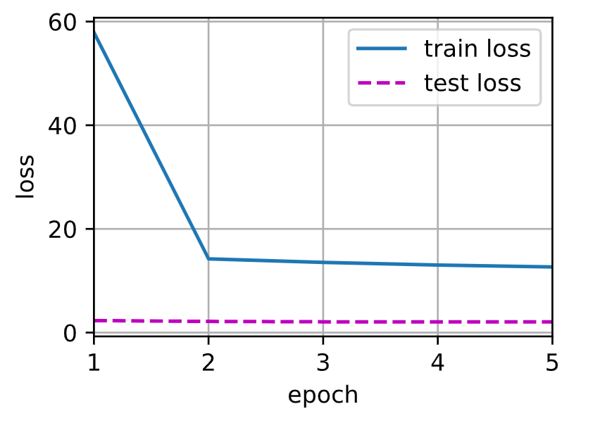

## 注意力机制

### 注意力提示

- 注意力可以分为非自主性和自主性两种，非自主性可以理解为感官的输入（例如有一个颜色鲜艳的东西），而自主性可以理解为是由人的主观意愿推动的（选择力量更加强大）。

- 考虑一个相对简单的状况，即只使用非自主性提示，要想将选择偏向于感官输入，我们可以简单地使用参数化的全连接层，甚至是非参数化的最大汇聚层或平均汇聚层。

- 因此，**“是否包含自主性提示”将注意力机制 与全连接层或汇聚层区别开来。**在注意力机制的背景下，我们将自主性提示称为查询（query）。给定任意查询，注意力机制通过注意力汇聚（attention pooling）将选择引导至感官输入（sensory inputs，例如中间特征表示）。在注意力机制中，这些感官输入被称为*值*（value）。更通俗的解释，每个值都与一个*键*（key）配对，这些键可以理解为感官输入的非自主性提示。**我们可以设计注意力汇聚，以便给定的查询（自主性提示）可以与键（非自主性提示）进行匹配，这将引导得出最匹配的值（感官输入）。**

  

### 注意力汇聚：Nadaraya-Watson 核回归

- 注意力机制的主要成分是：查询（自主提示）和键（非自主提示）之间的交互形成了注意力汇聚，注意力汇聚有选择地聚合了值（感官输入）以生成最终的输出。

- 通过 Nadaraya-Watson 核回归模型演示具有注意力机制的机器学习，首先生成数据：
  $$
  y_i = 2\sin(x_i) + x_i^{0.8} + \epsilon
  $$

  ```python
  from torch import nn
  
  # 50 个训练样本和 50 个测试样本
  n_train = 50
  x_train, _ = torch.sort(torch.rand(n_train) * 5) # 排序后的训练样本
  
  def f(x):
      return 2 * torch.sin(x) + x ** 0.8
  
  y_train = f(x_train) + torch.normal(0.0, 0.5, (n_train, )) # 加入噪声得到输出
  x_test = torch.arange(0, 5, 0.1)
  y_truth = f(x_test)
  n_test = len(x_test)
  ```

- 绘制函数

  ```python
  def plot_kernel_reg(y_hat):
      d2l.plot(x_test, [y_truth, y_hat], 'x', 'y', legend=['Truth', 'Pred'],
               xlim=[0, 5], ylim=[-1, 5])
      d2l.plt.plot(x_train, y_train, 'o', alpha=0.5)
  ```

- 平均汇聚：用最简单的估计器来解决这个回归问题：
  $$
  f(x) = \frac{1}{n}\sum_{i=1}^n y_i
  $$

  ```python
  y_hat = torch.repeat_interleave(y_train.mean(), n_test)
  # .repeat_interleave(): 传入的数据为 tensor repeats: 复制的份数 dim: 要复制的维度
  plot_kernel_reg(y_hat)
  ```

  

- 非参数注意力汇聚：平均汇聚忽略了输入 $x_i$，也许可以根据输入的位置对输出 $y_i$ 进行加权：
  $$
  f(x) = \sum_{i=1}^n \frac{K(x - x_i)}{\sum_{j=1}^n K(x - x_j)} y_i
  $$
  其中 $K$ 是核，上式描述的估计器被称为 *Nadaraya-Watson 核回归*（Nadaraya-Watson kernel regression）。如果从注意力机制框架的角度重写，就可以得到一个更加通用的*注意力汇聚*（attention pooling）公式：
  $$
  f(x) = \sum_{i=1}^n \alpha(x, x_i) y_i
  $$
  考虑一个*高斯核*（Gaussian kernel）：
  $$
  K(u) = \frac{1}{\sqrt{2\pi}} \exp(-\frac{u^2}{2})
  $$
  可以得到：
  $$
  \begin{split}\begin{aligned} f(x) &=\sum_{i=1}^n \alpha(x, x_i) y_i\\ &= \sum_{i=1}^n \frac{\exp\left(-\frac{1}{2}(x - x_i)^2\right)}{\sum_{j=1}^n \exp\left(-\frac{1}{2}(x - x_j)^2\right)} y_i \\&= \sum_{i=1}^n \mathrm{softmax}\left(-\frac{1}{2}(x - x_i)^2\right) y_i
  \end{aligned}\end{split}
  $$
  即，如果一个键 $x_i$ 越是接近给定的查询 $x$，那么分配给这个键对应值 $y_i$ 的注意力权重就会越大，上面的回归是一个非参数模型。

  ```python
  # X_repeat 的形状：(n_test, n_train)
  # 每一行都包含着相同的测试输入（例如，同样的查询 [0, 0, ..., 0]）
  X_repeat = x_test.repeat_interleave(n_train).reshape((-1, n_train))
  # x_train 包含着键 attention_weights 的形状：(n_test, n_train)
  # 每一行都包含着要在给定的每个查询的值（y_train）之间分配的注意力权重 dim=1 按行计算
  # X_repeat 就是输入的 x，x_train 就是 xi
  attention_weights = nn.functional.softmax(-(X_repeat - x_train) ** 2 / 2, dim=1)
  # y_hat 的每个元素都是值的加权平均值，其中的权重是注意力权重
  # (n_test, n_train) x (n_train) = (n_test)
  y_hat = torch.matmul(attention_weights, y_train)
  plot_kernel_reg(y_hat)
  ```

  

  新的模型预测线是平滑的，并且比平均汇聚的预测更接近真实。

  现在，我们来观察注意力的权重。这里测试数据的输入相当于查询，而训练数据的输入相当于键。因为两个输入都是经过排序的，因此由观察可知“查询-键”对越接近，注意力汇聚的注意力权重就越高。

  ```python
  show_heatmaps(attention_weights.unsqueeze(0).unsqueeze(0),
                xlabel='Sorted training inputs',
                ylabel='Sorted testing inputs')
  ```

  

  非参数的 Nadaraya-Watson 核回归具有*一致性*（consistency）的优点：如果有足够的数据，此模型会收敛到最优结果。

- 带参数的注意力汇聚：在查询 $x$ 和键 $x_i$ 之间加入可学习参数 $w$：
  $$
  \begin{split}\begin{aligned}f(x) &= \sum_{i=1}^n \alpha(x, x_i) y_i \\&= \sum_{i=1}^n \frac{\exp\left(-\frac{1}{2}((x - x_i)w)^2\right)}{\sum_{j=1}^n \exp\left(-\frac{1}{2}((x - x_j)w)^2\right)} y_i \\&= \sum_{i=1}^n \mathrm{softmax}\left(-\frac{1}{2}((x - x_i)w)^2\right) y_i\end{aligned}\end{split}
  $$

  - 定义模型：采用小批量矩阵乘法 $(n, a, b)\times (n, b, c) = (n, a, c)$

    ```python
    class NWKernelRegression(nn.Module):
        def __init__(self, **kwargs):
            super().__init__(**kwargs)
            self.w = nn.Parameter(torch.rand((1, ), requires_grad=True)) # 标量
            
        def forward(self, queries, keys, values):
            # queries 和 attention_weights 的形状为（查询个数，键值对个数）
            # 在下面的示例中即 (n_train, n_train - 1)
            # queries 一行中的所有值都相同，代表 x
            # keys 代表 xi
            queries = queries.repeat_interleave(keys.shape[1]) \
                             .reshape((-1, keys.shape[1]))
            self.attention_weights = nn.functional.softmax(
                -((queries - keys) * self.w) ** 2 / 2, dim=1)
            # values 的形状为（查询个数，键值对个数），代表 yi
            # (n_train, 1, n_train - 1) x (n_train, n_train - 1, 1)
            # => (n_train)
            return torch.bmm(self.attention_weights.unsqueeze(1),
                             values.unsqueeze(-1)).reshape(-1)
    ```

  - 训练：任何一个训练样本的输入都会和**除自己以外**的所有训练样本的“键－值”对进行计算， 从而得到其对应的预测输出。

    ```python
    # X_title 的形状：(n_train, n_train) 每一行都包含着相同的训练输入
    X_tile = x_train.repeat((n_train, 1))
    # Y_title 的形状：(n_train, n_train) 每一行都包含着相同的训练输出
    Y_tile = y_train.repeat((n_train, 1))
    
    # 下面把每一行中，把 x_train 对应的那个元素抹去
    # 因为用的是 x_train 来训练，而 keys values 都是用 x_train 来构造的
    # 也就是说 key 每一行都有一个值 key[row, i] == x_train[i]（对角线上的元素）
    # 任何一个训练样本的输入都会和 [除自己以外] 的所有训练样本的“键－值”对进行计算， 
    # 从而得到其对应的预测输出，我觉得目的应该是为了防止过拟合？
    # 因为加上自己的话，x-xi = 0，softmax 后导致学习到的权重太大？
    
    # keys 的形状：(n_train, n_train - 1)
    keys = X_tile[(1 - torch.eye(n_train)).type(torch.bool)].reshape((n_train, -1))
    # values 的形状：(n_train, n_train - 1)
    values = Y_tile[(1 - torch.eye(n_train)).type(torch.bool)].reshape((n_train, -1))
    ```

    使用平方损失函数和随机梯度下降：

    ```python
    net = NWKernelRegression()
    loss = nn.MSELoss(reduction='none')
    trainer = torch.optim.SGD(net.parameters(), lr=0.5)
    animator = d2l.Animator(xlabel='epoch', ylabel='loss', xlim=[1, 5],
                            legend=['train loss', 'test loss'])
    
    # epoch 太大也会过拟合，因为有噪声存在，很容易过拟合
    for epoch in range(5):
        trainer.zero_grad()
        l = loss(net(x_train, keys, values), y_train)
        l.sum().backward()
        trainer.step()
        print(f'epoch {epoch + 1}, loss {float(l.sum()):.6f}')
        with torch.no_grad(): # 看一下测试集的情况（主要是为了观察过拟合）
            l_test = loss(net(x_test, X_tile, Y_tile, y_truth)
        animator.add(epoch + 1, (float(l.sum()), float(l_test.sum())))
    ```

    

  - 绘制曲线：

    ```python
    keys = x_train.repeat((n_test, 1))
    values = y_train.repeat((n_test, 1))
    y_hat = net(x_test, keys, values).unsqueeze(1).detach() # 不需要 .unsqueeze(1) ?
    plot_kernel_reg(y_hat)
    ```

    

    在尝试拟合带噪声的训练数据时，预测结果绘制的线不如之前非参数模型的平滑。

    为什么新的模型更不平滑了呢？我们看一下输出结果的绘制图：与非参数的注意力汇聚模型相比，带参数的模型加入可学习的参数后，曲线在注意力权重较大的区域变得更不平滑。

    ```python
    show_heatmaps(net.attention_weights.unsqueeze(0).unsqueeze(0),
                  xlabel='Sorted training inputs',
                  ylabel='Sorted testing inputs')
    ```

    

    权重 $w$ 是一个标量，但它会使可视化的权重更加尖锐：$w$ 的存在会将差距很大的 $x$ 和 $x_i$ 的 softmax 值缩小（趋向于 0，过滤作用），从而达到注意力的效果。

- 总结：注意力机制可以理解为，查询和键进行匹配（相似度、距离）得到注意力权重，再对值进行选择（加权、抽取）：
  $$
  Attention(Query, Source)=\sum_{i=1}^{L_{key-value}}Similarity(Query, Key_i)*Value_i
  $$

### 注意力评分函数

- 上一节中我们采用了高斯核对查询和键进行关系建模，高斯核指数部分视为*注意力评分函数*（attention scoring function），简称*评分函数*（scoring function），然后把这个函数的输出结果输入到softmax函数中进行运算。通过上述步骤，我们将得到**与键对应的值的概率分布（即注意力权重）**。最后，**注意力汇聚的输出就是基于这些注意力权重的值的加权和**。

  

  用数学语言描述：$\mathbf q\in \mathbb R^q、\mathbf k_i\in \mathbb R^k、\mathbf v_i\in \mathbb R^v$
  $$
  f(\mathbf{q}, (\mathbf{k}_1, \mathbf{v}_1), \ldots, (\mathbf{k}_m, \mathbf{v}_m)) = \sum_{i=1}^m \alpha(\mathbf{q}, \mathbf{k}_i) \mathbf{v}_i \in \mathbb{R}^v
  $$
  其中查询 $\mathbf{q}$ 和键 $\mathbf{k}_i$ 的注意力权重（标量）是通过注意力评分函数 $a$ 将两个向量映射成标量，再通过 softmax 运算得到：
  $$
  \alpha(\mathbf{q}, \mathbf{k}_i) = \mathrm{softmax}(a(\mathbf{q}, \mathbf{k}_i)) = \frac{\exp(a(\mathbf{q}, \mathbf{k}_i))}{\sum_{j=1}^m \exp(a(\mathbf{q}, \mathbf{k}_j))} \in \mathbb{R}
  $$
  选择不同的注意力评分函数 $a$ 会导致不同的注意力汇聚操作。

- 掩蔽 softmax 操作：softmax 操作用于输出一个概率分布作为注意力权重，但某些情况下，并非所有的值都应该被纳入到注意力汇聚中，例如文本序列中的无意义填充词元。我们可以指定一个有效序列的长度，以便在计算 softmax 时过滤掉超出指定范围的位置。

  ```python
  def masked_softmax(X, valid_lens):
      '''通过在最后一个轴上掩蔽元素来执行 softmax 操作'''
      # X: 3D 张量，valid_lens: 1D 或 2D 张量
      # X: (batch_size, n, m), valid_lens: (batch_size) 或 (batch_size, n)
      if valid_lens is None:
          return nn.functional.softmax(X, dim=-1)
      else:
          shape = X.shape
          if valid_lens.dim() == 1:
              # valid_lens 是 1D，则每个元素是每个 batch 的长度
              # 需要在每个 batch 中复制 n 份(shape[1])
              # 这个 n 指的是 batch 中的查询个数（步数）
              valid_lens = torch.repeat_interleave(valid_lens, shape[1])
          else:
              # valids_len 是 2D，则其中包含了对每个 batch 的每个查询的长度限制
              # 所以直接铺平即可
              valid_lens = valid_lens.reshape(-1)
          # 最后一轴上被掩蔽的元素使用一个非常大的负值替换，从而使其 softmax 输出为 0
          # sequence_mask 函数要求 X: 2D, valid_lens: 1D 或 2D
          # 因此 X 前两维需要铺平
          X = d2l.sequence_mask(X.reshape(-1, shape[-1]), valid_lens,
                                value=-1e6)
          return nn.functional.softmax(X.reshape(shape), dim=-1)
      
  masked_softmax(torch.rand(2, 2, 4), torch.tensor([2, 3]))
  
  >>>
  tensor([[[0.7098, 0.2902, 0.0000, 0.0000],
           [0.5420, 0.4580, 0.0000, 0.0000]],
  
          [[0.4726, 0.2021, 0.3253, 0.0000],
           [0.3383, 0.3567, 0.3050, 0.0000]]])
  
  masked_softmax(torch.rand(2, 2, 4), torch.tensor([[1, 3], [2, 4]]))
  
  >>>
  tensor([[[1.0000, 0.0000, 0.0000, 0.0000],
           [0.4570, 0.2462, 0.2969, 0.0000]],
  
          [[0.4560, 0.5440, 0.0000, 0.0000],
           [0.1949, 0.3371, 0.2767, 0.1914]]])
  ```

- 加性注意力：**当查询和键是不同长度的矢量时**，我们可以使用加性注意力作为评分函数：
  $$
  a(\mathbf q, \mathbf k) = \mathbf w_v^\top \text{tanh}(\mathbf W_q\mathbf q + \mathbf W_k \mathbf k) \in \mathbb{R}
  $$
  其中可学习的参数是 $\mathbf W_q\in\mathbb R^{h\times q}、\mathbf W_k\in\mathbb R^{h\times k}、\mathbf w_v\in\mathbb R^{h}$，等价于将查询和键**拼接**，输入到一个输出大小为 1 （相关度）的单隐藏层 MLP 中，其隐藏单元数是一个超参数 $h$。通过使用 $\tanh$ 作为激活函数，并且禁用偏置项。

  ```python
  class AdditiveAttention(nn.Module):
      '''加性注意力'''
      def __init__(self, key_size, query_size, num_hiddens, dropout, **kwargs):
          super(AdditiveAttention, self).__init__(**kwargs)
          self.W_k = nn.Linear(key_size, num_hiddens, bias=False)
          self.W_q = nn.Linear(query_size, num_hiddens, bias=False)
          self.w_v = nn.Linear(num_hiddens, 1, bias=False)
          self.dropout = nn.Dropout(dropout)
      
      # queries: (batch_size, 查询的个数 n, q)
      # keys: (batch_size, 键值对的个数 m, k)
      # values: (batch_size, m, v)
      def forward(self, queries, keys, values, valid_lens):
          queries, keys = self.W_q(queries), self.W_k(keys)
          # queries: (batch_size, n, 1, num_hiddens)
          # keys: (batch_size, 1, m, num_hiddens)
          # 使用广播的方式进行求和 features: (batch_size, n, m, num_hiddens)
          features = queries.unsqueeze(2) + keys.unsqueeze(1)
          features = torch.tanh(features)
          # self.w_v 仅有一个输出，因此从形状中移除最后那个维度
          # scores: (batch_size, n, m)
          scores = self.w_v(features).squeeze(-1)
          self.attention_weights = masked_softmax(scores, valid_lens)
          # values: (batch_size, m, v)
          # output: (batch_size, n, v)
          return torch.bmm(self.dropout(self.attention_weights), values)
  ```

  实验：查询、键和值的形状为（批量大小，步数或词元序列长度，特征大小），注意力汇聚输出的形状为（批量大小，查询的步数，值的维度）

  ```python
  queries, keys = torch.normal(0, 1, (2, 1, 20)), torch.ones((2, 10, 2))
  # values 的小批量，两个值矩阵是相同的
  values = torch.arange(40, dtype=torch.float32).reshape(1, 10, 4).repeat(
      2, 1, 1)
  valid_lens = torch.tensor([2, 6])
  attention = AdditiveAttention(key_size=2, query_size=20, num_hiddens=8,
                                dropout=0.1)
  attention.eval()
  attention(queries, keys, values, valid_lens)
  
  >>>
  tensor([[[ 2.0000,  3.0000,  4.0000,  5.0000]],
  
          [[10.0000, 11.0000, 12.0000, 13.0000]]], grad_fn=<BmmBackward0>)
  ```

- 缩放点积注意力：使用点积可以得到计算效率更高的评分函数，但是点积操作要求**查询和键具有相同的长度** $d$。假设查询和键的所有元素都是独立的随机变量，并且都满足零均值和单位方差，那么两个向量的点积的均值为 $0$，方差为 $d$。为确保无论向量长度如何，点积的方差在不考虑向量长度的情况下仍然是 $1$，我们将点积除以 $\sqrt d$，则*缩放点积注意力*（scaled dot-product attention）评分函数为：
  $$
  a(\mathbf q, \mathbf k) = \mathbf{q}^\top \mathbf{k}  /\sqrt{d}
  $$
  小批量情况下，基于 $n$ 个查询和 $m$ 个键值对计算注意力：
  $$
  \mathrm{softmax}\left(\frac{\mathbf Q \mathbf K^\top }{\sqrt{d}}\right) \mathbf V \in \mathbb{R}^{n\times v}
  $$
  其中，$\mathbf Q\in\mathbb R^{n\times d}、\mathbf K\in\mathbb R^{m\times d}、\mathbf V\in\mathbb R^{m\times v}$

  ```python
  class DotProductAttention(nn.Module):
      '''缩放点积注意力'''
      def __init__(self, dropout, **kwargs):
          super(DotProductAttention, self).__init__(**kwargs)
          self.dropout = nn.Dropout(dropout)
      
      # queries: (batch_size, 查询的个数 n, d)
      # keys: (batch_size, 键值对的个数 m, d)
      # values: (batch_size, m, v)
      # valid_lens: (batch_size, ) 或者 (batch_size, n)
      def forward(self, queries, keys, values, valid_lens=None):
          d = queries.shape[-1]
          # 设置 transpose_b = True 为了交换 keys 的最后两个维度
          scores = torch.bmm(queries, keys.transpose(1, 2)) / math.sqrt(d)
          # attention_weights: (batch_size, n, m)
          self.attention_weights = masked_softmax(scores, valid_lens)
          # output: (batch_size, n, v)
          return torch.bmm(self.dropout(self.attention_weights), values)
  ```

- 加性注意力评分函数需要学习参数，而缩放点积注意力评分函数不需要，后者可以直接通过点积计算矢量的相似度，前者通过神经网络来求相似度。但缩放点积注意力评分函数要求查询和键具有相同的矢量长度，而加性注意力评分函数不要求。

### Bahdanau 注意力

- 在传统的 Seq2Seq 模型中，encoder 输出的上下文变量 $c$，在 decoder 解码过程的每一个时间步 $t'$ 中都是不变的。然而，并非所有输入词元都对解码某个词元有用，每个解码步骤中注意力需要集中在不同的输入词元上，也即每一个时间步的上下文变量应该不同（将上下文变量视为注意力集中后得到的输出）。

  因此，在每一个时间步 $t'$ 时，上下文变量为：
  $$
  \mathbf{c}_{t'} = \sum_{t=1}^T \alpha(\mathbf{s}_{t' - 1}, \mathbf{h}_t) \mathbf{h}_t,
  $$
  其中，时间步 $t'-1$ 时的解码器隐状态 $\mathbf s_{t'-1}$ 作为 Query，编码器隐状态 $h_t$ 既是 key，也是 value，注意力权重 $\alpha$ 使用加性注意力评分函数计算。

  

- 定义注意力解码器

  首先是基本接口：

  ```python
  class AttentionDecoder(d2l.Decoder):
      '''带有注意力机制解码器的基本接口'''
      def __init__(self, **kwargs):
          super(AttentionDecoder, self).__init__(**kwargs)
          
      @property
      def attention_weights(self):
          raise NotImplementedError
  ```

  **具体实现：解码器的初始状态需要以下输入：**

  1. **编码器在最后一层、所有时间步的隐状态，这将作为注意力的 key 和 value（outputs）**
  2. **编码器在最后一个时间步、所有层的隐状态，这将作为解码器的初始隐状态（hidden_state）**
  3. **编码器中文本序列的有效长度（排除填充词元）（valid_lens）**

  **同时，解码器在 $t'-1$ 时间步、最后一层的隐状态将作为第 $t'$ 时间步的 Query（$\mathbf s'_{t-1}$），查询后得到的注意力的输出将作为上下文 $\mathbf c_t$ 与输入 $x$ 连结作为解码器真正的输入。**

  ```python
  # 关键就是在于将 Attention 的输出作为新的 context
  class Seq2SeqAttentionDecoder(AttentionDecoder):
      def __init__(self, vocab_size, embed_size, num_hiddens, num_layers,
                   dropout=0, **kwargs):
          super(Seq2SeqAttentionDecoder, self).__init__(**kwargs)
          # key, value 都是 encoder 最后一层所有时间步的隐状态:
          # (batch_size, num_steps, num_hiddens)
          # query 是上一时间步最后一层 decoder 的隐状态: 
          # (batch_size, 1, num_hiddens)
          self.attention = DotProductAttention(dropout)
          # self.attention = AdditiveAttention(
              # num_hiddens, num_hiddens, num_hiddens, dropout)
          self.embedding = nn.Embedding(vocab_size, embed_size)
          self.rnn = nn.GRU(
              embed_size + num_hiddens, num_hiddens, num_layers, 
              dropout=dropout)
          self.dense = nn.Linear(num_hiddens, vocab_size)
          
      def init_state(self, enc_outputs, enc_valid_lens, *args):
          # outputs: (batch_size, num_steps, num_hiddens) 
          # 最后一层所有时间步的隐状态
          # hidden_state: (num_layers, batch_size, num_hiddens) 
          # 最后一个时间步每一层的隐状态
          outputs, hidden_state = enc_outputs
          return (outputs.permute(1, 0, 2), hidden_state, enc_valid_lens)
      
      def forward(self, X, state):
          # enc_outputs: (batch_size, num_steps, num_hiddens)
          # hidden_state: (num_layers, batch_size, num_hiddens)
          enc_outputs, hidden_state, enc_valid_lens = state
          # X: (num_steps, batch_size, embed_size)
          X = self.embedding(X).permute(1, 0, 2)
          outputs, self._attention_weights = [], []
          for x in X:
              # query: (batch_size, 1, num_hiddens)
              query = torch.unsqueeze(hidden_state[-1], dim=1)
              # context: (batch_size, 1, num_hiddens)
              context = self.attention(
                  query, enc_outputs, enc_outputs, enc_valid_lens)
              # cat: x and context 在特征维度上连结
              # x: (batch_size, embed_size)
              # .unsqueeze => (batch_size, 1, embed_size)
              # .cat => (batch_size, 1, num_hiddens + embed_size)
              x = torch.cat((context, torch.unsqueeze(x, dim=1)), dim=-1)
              # 将 x 变形为: (1, batch_size, embed_size + num_hiddens)
              out, hidden_state = self.rnn(x.permute(1, 0, 2), hidden_state)
              outputs.append(out)
              self._attention_weights.append(self.attention.attention_weights)
          # outputs: (num_steps, batch_size, vocab_size)
          outputs = self.dense(torch.cat(outputs, dim=0))
          return outputs.permute(1, 0, 2), [enc_outputs, hidden_state,
                                            enc_valid_lens]
      
      @property
      def attention_weights(self):
          return self._attention_weights
  ```

- 训练

  ```python
  embed_size, num_hiddens, num_layers, dropout = 32, 32, 2, 0.1
  batch_size, num_steps = 64, 10
  lr, num_epochs, device = 0.005, 250, d2l.try_gpu()
  
  train_iter, src_vocab, tgt_vocab = d2l.load_data_nmt(batch_size, num_steps)
  encoder = d2l.Seq2SeqEncoder(
      len(src_vocab), embed_size, num_hiddens, num_layers, dropout)
  decoder = Seq2SeqAttentionDecoder(
      len(tgt_vocab), embed_size, num_hiddens, num_layers, dropout)
  net = d2l.EncoderDecoder(encoder, decoder)
  d2l.train_seq2seq(net, train_iter, lr, num_epochs, tgt_vocab, device)
  ```

  

- 预测

  ```python
  engs = ['go .', "i lost .", 'he\'s calm .', 'i\'m home .']
  fras = ['va !', 'j\'ai perdu .', 'il est calme .', 'je suis chez moi .']
  for eng, fra in zip(engs, fras):
      translation, dec_attention_weight_seq = d2l.predict_seq2seq(
          net, eng, src_vocab, tgt_vocab, num_steps, device, True)
      print(f'{eng} => {translation}, ',
            f'bleu {my.bleu(translation, fra, k=2):.3f}')
      
  >>>
  go . => va !,  bleu 1.000
  i lost . => j'ai perdu .,  bleu 1.000
  he's calm . => il est riche .,  bleu 0.658
  i'm home . => je suis chez moi .,  bleu 1.000
  ```

- 注意力的可视化

  ```python
  # dec_attention_weight_seq: (6, 1, 1, 1, 10) => attention_weights: (1, 1, 6, 10)
  # 6 是预测时的 time_steps，说明到第 6 个时间步就预测 <eos> 了（不然就是 10）
  # 1 是因为在预测时 decoder 中每次只输入一个时间步，导致 decoder._attention_weights 长度为 1
  # 剩下的 1, 1, 10 是因为在 AdditiveAttention 计算中，输出的 weights 形状是 (batch_size, n, m)
  # 而 batch_size = 1, n = 1(时间步), m = 10(编码器的 time_steps，即键值对个数)
  attention_weights = torch.cat([step[0][0][0] for step in dec_attention_weight_seq], 0).reshape((
      1, 1, -1, num_steps))
  
  # 加上一个包含序列结束的词元
  d2l.show_heatmaps(
      attention_weights[:, :, :, :len(engs[-1].split()) + 1].cpu(), # 因为用的是最后一个测试用例的 weights
      xlabel='Key positions', ylabel='Query positions')
  ```

  

### 多头注意力

- 用独立学习得到 $h$ 组不同的*线性投影*来变换 Query、key 和 value，然后将这 $h$ 组变换后的 Query、key 和 value 并行地送到注意力汇聚中，最后将这 $h$ 个注意力汇聚的输出拼接在一起，通过另一个可以学习的线性投影进行变换，以产生最终的输出。其中，每个注意力汇聚都被称作一个头。

  

- 模型：给定查询 $\mathbf{q} \in \mathbb{R}^{d_q}$，键 $\mathbf{k} \in \mathbb{R}^{d_k}$ 和值 $\mathbf{v} \in \mathbb{R}^{d_v}$，每个注意力头 $i = 1, \ldots, h$ 的计算方法为：
  $$
  \mathbf{h}_i = f(\mathbf W_i^{(q)}\mathbf q, \mathbf W_i^{(k)}\mathbf k,\mathbf W_i^{(v)}\mathbf v) \in \mathbb R^{p_v}
  $$
  其中，可学习的参数包括 $\mathbf W_i^{(q)}\in\mathbb R^{p_q\times d_q}、\mathbf W_i^{(k)}\in\mathbb R^{p_k\times d_k}、\mathbf W_i^{(v)}\in\mathbb R^{p_v\times d_v}$，$f$ 是代表注意力汇聚的函数，它可以是加性注意力或缩放点积注意力。多头注意力的输出需要经过另一个线性变换，它对应着 $h$ 个头连结后的结果，因此其可学习参数是 $\mathbf W_o\in\mathbb R^{p_o\times h p_v}$：
  $$
  \begin{split}\mathbf W_o \begin{bmatrix}\mathbf h_1\\\vdots\\\mathbf h_h\end{bmatrix} \in \mathbb{R}^{p_o}\end{split}
  $$
  基于这种设计，每个头都可能会关注输入的不同部分，可以表示比简单加权平均值更复杂的函数。

- 实现：为了避免计算代价和参数代价的大幅增长，设定 $p_q = p_k = p_v = p_o / h$。此时，如果将 Query、key 和 value 的线性变换的输出维度设置为 $p_o(=p_q h = p_k h = p_v h)$，则可以并行计算 $h$ 个头。

  ```python
  class MultiHeadAttention(nn.Module):
      '''多头注意力'''
      def __init__(self, query_size, key_size, value_size, num_hiddens,
                   num_heads, dropout, bias=False, **kwargs):
          super(MultiHeadAttention, self).__init__(**kwargs)
          # p_o = num_hiddens
          self.num_heads = num_heads
          self.attention = DotProductAttention(dropout)
          self.W_q = nn.Linear(query_size, num_hiddens, bias=bias)
          self.W_k = nn.Linear(key_size, num_hiddens, bias=bias)
          self.W_v = nn.Linear(value_size, num_hiddens, bias=bias)
          # h 个头，其实每个头的维度应该是 num_hiddens / num_heads
          # 这里直接用 num_hiddens(p_q * h = p_k * h = p_v * h)，实际上就是 h 个头一起计算了
          # 相当于将 h 个注意力汇聚连结成 1 个大的注意力汇聚
          # 其中这里 W_q, W_k 的输出维度不是一定要设置成 num_hiddens
          # 设置成其他也不会影响结果，在这里是将 p_q, p_k 设置为 p_o / h 了
          self.W_o = nn.Linear(num_hiddens, num_hiddens, bias=bias)
          
      def forward(self, queries, keys, values, valid_lens):
          # queries, keys, values: (batch_size, n or m, num_hiddens)
          # valid_lens: (batch_size, ) or (batch_size, n)
          # => queries, keys, values: 
          # (batch_size * num_heads, n or m, num_hiddens / num_heads)
          queries = transpose_qkv(self.W_q(queries), self.num_heads)
          keys = transpose_qkv(self.W_k(keys), self.num_heads)
          values = transpose_qkv(self.W_v(values), self.num_heads)
          
          if valid_lens is not None:
              # 在轴 0，将第一项（标量或者矢量）复制 num_heads 次
              # 然后如此复制第二项，然后诸如此类
              # (batch_size, ) => (batch_size * num_heads, )
              # (batch_size, n) => (batch_size * num_heads, n)
              valid_lens = torch.repeat_interleave(
                  valid_lens, repeats=self.num_heads, dim=0)
              
          # output: (batch_size * num_heads, n, num_hiddens / num_heads)
          # 这里 h 个头同时计算注意力汇聚
          output = self.attention(queries, keys, values, valid_lens)
          
          # output_concat: (batch_size, n, num_hiddens)
          # 再把 h 个头连结到一起，最后进行线性变换
          output_concat = transpose_output(output, self.num_heads)
          return self.W_o(output_concat)
  ```

  为了能够使多个头并行计算，上面的 `MultiHeadAttention` 类将使用下面定义的两个转置函数。具体来说， `transpose_output` 函数反转了 `transpose_qkv` 函数的操作。

  ```python
  def transpose_qkv(X, num_heads):
      '''为了多注意力头的并行计算而变换形状'''
      # X: (batch_size, n or m, num_hiddens)
      # => (batch_size, n or m, num_heads, num_hiddens / num_heads)
      X = X.reshape(X.shape[0], X.shape[1], num_heads, -1)
      
      # X: (batch_size, num_heads, n or m, num_hiddens / num_heads)
      X = X.permute(0, 2, 1, 3)
      
      # X: (batch_size * num_heads, n or m, num_hiddens / num_heads)
      return X.reshape(-1, X.shape[2], X.shape[3])
  
  def transpose_output(X, num_heads):
      '''transpose_qkv 函数的逆操作'''
      X = X.reshape(-1, num_heads, X.shape[1], X.shape[2])
      X = X.permute(0, 2, 1, 3)
      return X.reshape(X.shape[0], X.shape[1], -1)
  ```

- 测试：多头注意力输出的形状是（batch_size, num_queries, num_hiddens）

  ```python
  num_hiddens, num_heads = 100, 5
  # 这里传参进去的 query_size, key_size, value_size 不是一定要为 num_hiddens
  # 换成其他的，对结果没有影响
  attention = MultiHeadAttention(num_hiddens, num_hiddens, num_hiddens,
                                 num_hiddens, num_heads, 0.5)
  attention.eval()
  
  >>>
  MultiHeadAttention(
    (attention): DotProductAttention(
      (dropout): Dropout(p=0.5, inplace=False)
    )
    (W_q): Linear(in_features=100, out_features=100, bias=False)
    (W_k): Linear(in_features=100, out_features=100, bias=False)
    (W_v): Linear(in_features=100, out_features=100, bias=False)
    (W_o): Linear(in_features=100, out_features=100, bias=False)
  )
  ```

  ```python
  batch_size, num_queries = 2, 4
  num_kvpairs, valid_lens = 6, torch.tensor([3, 2])
  X = torch.ones((batch_size, num_queries, num_hiddens))
  Y = torch.ones((batch_size, num_kvpairs, num_hiddens))
  Z = torch.ones((batch_size, num_kvpairs, num_hiddens))
  attention(X, Y, Z, valid_lens).shape
  
  >>>
  torch.Size([2, 4, 100])
  ```

- 总结：多头注意力融合了来自于多个注意力汇聚的不同知识，这些知识的不同来源于相同的查询、键和值的不同的子空间表示。

### 自注意力和位置编码

- **当查询、键和值来自同一组输入时**，就被称为自*注意力*（self-attention）或*内部注意力*（intra-attention）。

- 自注意力：给定一个由次元组成的序列 $\mathbf{x}_1, \ldots, \mathbf{x}_n$，该序列的自注意力输出为一个长度相同的序列 $\mathbf{y}_1, \ldots, \mathbf{y}_n$，则：
  $$
  \mathbf{y}_i = f(\mathbf{x}_i, (\mathbf{x}_1, \mathbf{x}_1), \ldots, (\mathbf{x}_n, \mathbf{x}_n)) \in \mathbb{R}^d
  $$
  简单来说，在多头注意力的计算代码中：

  ```python
  attention(X, X, X, valid_lens).shape
  ```

  自注意力的输出实际上就是输入序列的加权和，权重就是当前的输入向量 $\mathbf x_i$ 与其他输入向量的相似度。
  
- 比较卷积神经网络、循环神经网络和自注意力

  假设下面几个架构的目标都是将由 $n$ 个词元组成的序列映射到另一个长度相等的序列，其中的每个输入词元或输出词元都由 $d$ 维向量表示。具体而言，需要比较的是架构的**计算复杂性、顺序操作和最大路径长度，顺序操作会妨碍并行计算，而任意的序列位置组合之间的路径越短，就代表能更轻松地学习序列中的远距离依赖关系。**

  

  - 卷积神经网络：序列长度为 $n$，卷积核大小为 $k$，输入和输出通道数量都是 $d$
    - 计算复杂度：$\mathcal{O}(knd^2)$
    - 顺序操作：$\mathcal O(1)$，与层数相关
    - 最大路径长度：$\mathcal O(n/k)$，例如 $\mathbf x_1$ 和 $\mathbf x_5$ 处于卷积核大小为 $3$ 的双层卷积神经网络的感受野内
    
  - 循环神经网络：序列长度为 $n$，隐状态维度为 $d$
    - 计算复杂度：$\mathcal O(nd^2)$，其中更新隐状态复杂度为 $\mathcal O(d^2)$（因为 $W_{hh}$ 的维度是 $d\times d$，与 $d$ 维隐状态相乘进行更新），再乘上序列长度
    - 顺序操作：$\mathcal O(n)$
    - 最大路径长度：$\mathcal O(n)$
    
  - 自注意力：查询、键和值都是 $n\times d$ 的矩阵，考虑缩放点积注意力
    - 计算复杂度：$\mathcal O(n^2d)$，其中缩放点积注意力中 $n\times d$ 矩阵乘以 $d\times n$ 矩阵（每一个 Query 都要和 $n$ 个维度为 $d$ 的 key 做点积，一共 $n$ 个 Query），之后输出的 $n\times n$ 矩阵乘以 $n\times d$ 矩阵
    
      ```python
      for i in range(n):
          for j in range(d):
              for k in range(n):
                  C[i, k] += A[i, j] * B[j, k]
                  
      for i in range(n):
          for j in range(n):
              for k in range(d):
                  C[i, j] += A[i, k] * B[k, j]
      ```
    
    - 顺序操作：$\mathcal O(1)$
    
    - 最大路径长度：$\mathcal O(1)$，每个词元都通过自注意力直接连接到任何其他词元
    
  - 总而言之，**卷积神经网络和自注意力都拥有并行计算的优势，而且自注意力的最大路径长度最短**。但是因为其计算复杂度是关于序列长度的二次方，所以**在很长的序列中计算会非常慢**。

- 位置编码

  在处理词元序列时，循环神经网络逐个的重复地处理词元，而自注意力则因为并行计算而放弃了顺序操作，即键值对的位置与结果无关。为了使用序列的顺序信息，我们可以在输入表示中添加*位置编码*（positional encoding）来注入绝对的或相对的位置信息。位置编码可以通过学习得到也可以直接固定得到。

  **基于正弦函数和余弦函数的固定位置编码**：假设输入表示 $\mathbf X \in \mathbb R^{n\times d}$，位置编码使用相同形状的位置嵌入矩阵 $\mathbf P\in \mathbb R^{n\times d}$ 输出 $\mathbf X+\mathbf P$，矩阵第 $i$ 行、第 $2j$ 列和 $2j+1$ 列的元素为：
  $$
  \begin{split}\begin{aligned} p_{i, 2j} &= \sin\left(\frac{i}{10000^{2j/d}}\right)\\p_{i, 2j+1} &= \cos\left(\frac{i}{10000^{2j/d}}\right)\end{aligned}\end{split}
  $$

  ```python
  class PositionalEncoding(nn.Module):
      '''位置编码'''
      def __init__(self, num_hiddens, dropout, max_len=1000):
          super(PositionalEncoding, self).__init__()
          self.dropout = nn.Dropout(dropout)
          # 创建一个足够长的 P，最外层维度是 batch_size
          self.P = torch.zeros((1, max_len, num_hiddens))
          # 通过广播对 i = 0 ~ max_len 进行计算 2j
          X = torch.arange(max_len, dtype=torch.float32).reshape(
              -1, 1) / torch.pow(10000, torch.arange(
              0, num_hiddens, 2, dtype=torch.float32) / num_hiddens)
          self.P[:, :, 0::2] = torch.sin(X)
          self.P[:, :, 1::2] = torch.cos(X)
          
      def forward(self, X):
          X = X + self.P[:, :X.shape[1], :].to(X.device)
          return self.dropout(X)
  ```

  在位置嵌入矩阵 $\mathbf P$ 中，行代表词元在序列中的位置，列代表位置编码的不同维度。在下面的例子中，我们可以看到位置嵌入矩阵的第 $6$ 列和第 $7$ 列的频率高于第 $8$ 列和第 $9$ 列。第 $6$ 列和第 $7$ 列之间的偏移量（第 $8$ 列和第 $9$ 列相同）是由于正弦函数和余弦函数的交替。

  ```python
  encoding_dim, num_steps = 32, 60
  pos_encoding = PositionalEncoding(encoding_dim, 0)
  pos_encoding.eval()
  X = pos_encoding(torch.zeros((1, num_steps, encoding_dim)))
  P = pos_encoding.P[:, :X.shape[1], :]
  d2l.plot(torch.arange(num_steps), P[0, :, 6:10].T, xlabel='Row (position)',
           figsize=(6, 2.5), legend=["Col %d" % d for d in torch.arange(6, 10)])
  ```

  

- 绝对位置信息

  为了明白沿着编码维度单调降低的频率与绝对位置信息的关系， 让我们打印出 $0, 1, \ldots, 7$ 的二进制表示形式。正如我们所看到的，每个数字、每两个数字和每四个数字上的比特值在第一个最低位、第二个最低位和第三个最低位上分别交替：

  ```python
  for i in range(8):
      print(f'{i} 的二进制是: {i:>03b}')
      
  >>>
  0 的二进制是: 000
  1 的二进制是: 001
  2 的二进制是: 010
  3 的二进制是: 011
  4 的二进制是: 100
  5 的二进制是: 101
  6 的二进制是: 110
  7 的二进制是: 111
  ```

  在二进制表示中，较高比特位的交替频率低于较低比特位，与下面的热图所示相似，只是位置编码通过使用三角函数在编码维度上降低频率。由于输出是浮点数，因此此类连续表示比二进制表示法更节省空间。

  ```python
  P = P[0, :, :].unsqueeze(0).unsqueeze(0)
  show_heatmaps(P, xlabel='Column (encoding dimension)',
                ylabel='Row (posistion)', figsize=(3.5, 4), cmap='Blues')
  ```

  

- 相对位置信息

  对于任何确定的位置偏移 $\delta$，位置 $i+\delta$ 处的位置编码可以线性投影位置 $i$ 处的位置编码来表示。令 $\omega_j = 1/10000^{2j/d}$，对于任何确定的位置偏移 $\delta$，任何一对 $(p_{i, 2j}, p_{i, 2j+1})$ 都可以线性投影到 $(p_{i+\delta, 2j}, p_{i+\delta, 2j+1})$：
  $$
  \begin{split}\begin{aligned}
  &\begin{bmatrix} \cos(\delta \omega_j) & \sin(\delta \omega_j) \\  -\sin(\delta \omega_j) & \cos(\delta \omega_j) \\ \end{bmatrix}
  \begin{bmatrix} p_{i, 2j} \\  p_{i, 2j+1} \\ \end{bmatrix}\\
  =&\begin{bmatrix} \cos(\delta \omega_j) \sin(i \omega_j) + \sin(\delta \omega_j) \cos(i \omega_j) \\  -\sin(\delta \omega_j) \sin(i \omega_j) + \cos(\delta \omega_j) \cos(i \omega_j) \\ \end{bmatrix}\\
  =&\begin{bmatrix} \sin\left((i+\delta) \omega_j\right) \\  \cos\left((i+\delta) \omega_j\right) \\ \end{bmatrix}\\
  =&
  \begin{bmatrix} p_{i+\delta, 2j} \\  p_{i+\delta, 2j+1} \\ \end{bmatrix}
  \end{aligned}\end{split}
  $$
  其中投影矩阵不依赖于任何位置的索引 $i$。

### Transformer

- 模型：Transformer 的编码器和解码器是基于自注意力的模块叠加而成，源序列和目标序列的 Embedding 表示加上位置编码，分别输入到编码器和解码器中。

  

  - 编码器：由多个相同的层叠加而成，每个层都有两个子层：***多头自注意力*（multi-head self-attention）汇聚层和*基于位置的前馈网络*（positionwise feed-forward network）层**。
    - 在计算编码器的自注意力时，查询、键和值都来自前一个编码器层的输出。
    - 并且每个子层都采用了残差连接。对于序列中任何位置的任何输入 $\mathbf x \in \mathbb R^d$，都要求满足 $\mathrm{sublayer}(\mathbf x)\in \mathbb R^d$，以便残差连接满足 $\mathbf x + \mathrm{sublayer}(\mathbf x) \in \mathbb R^d$。
    - 在残差连接相加计算后，应用*层规范化*（layer normalization）。因此，输入序列对应的每个位置，编码器都将输出一个 $d$ 维表示向量。
  - 解码器：由多个相同的层叠加而成，并且层中使用了残差连接和层规范化。每个层都有三个子层：***多头自注意力*汇聚层、*编码器－解码器注意力*（encoder-decoder attention）层和*基于位置的前馈网络*层**。
    - 在编码器-解码器注意力中，Query 是来自前一个解码器层的输出，而 key 和 value 来自整个编码器的输出。（对应图中的 Muti-head attention 层）
    - 在解码器的多头自注意力中，查询、键和值来自上一个解码器层的输出。但是，解码器中的每个位置只能考虑（包括）该位置之前的所有位置，这种*掩蔽*（masked）注意力保留了*自回归*（auto-regressive）属性，确保预测仅依赖于已生成的输出词元。（因为自注意力默认是辐射全局的，包括未来的位置）
  - 编码器和解码器隐藏层的维度应该一致，这样的好处是可以用编码器的状态初始化解码器的状态，并且之后各个 attention 层中的 Query、key、value 的维度可以确保一致（= num_hiddens）。

- 基于位置的前馈网络

  基于位置的前馈网络对序列中的所有位置的表示进行变换时使用的是**同一个**多层感知机（MLP），因此称其是*基于位置的*（positionwise），即除了位置信息，其他信息都相同。作用是对所有序列位置的表示进行转换。

  正常而言，输入 $\mathbf X$ 形状为 (b, n, h)，需要线性变换为 (b, n, ffn_num_outputs)。

  - 在卷积神经网络中，可以直接将 $\mathbf X$ 变为 (b, n * h)，再进行变换，因为通道数 n 是模型的一部分，与输入数据无关，在创建 `nn.Linear` 时可以直接将维度定死；
  - 而在 transformer 中，n 是序列的时间步（长度），会随着输入数据的不同发生改变，不属于模型的一部分，所以不能利用上述的方法，而是需要将 $\mathbf X$ 先变为 (b * n, h)，再进行变换。
  - 在 PyTorch 中，不需要考虑上述的变换，因为 `dense` 层默认会把最后一个维度以外的所有维度都看作是在 batch 中，所以高于二维也可以正常线性变换。

  ```python
  class PositionWiseFFN(nn.Module):
      '''基于位置的前馈网络'''
      def __init__(self, ffn_num_input, ffn_num_hiddens, ffn_num_outputs,
                   **kwargs):
          super(PositionWiseFFN, self).__init__(**kwargs)
          self.dense1 = nn.Linear(ffn_num_input, ffn_num_hiddens)
          self.relu = nn.ReLU()
          self.dense2 = nn.Linear(ffn_num_hiddens, ffn_num_outputs)
          
      def forward(self, X):
          return self.dense2(self.relu(self.dense1(X)))
  ```

- 残差连接和层规范化

  层规范化和批量规范化的目标相同，但层规范化是基于特征维度进行规范化。如何理解呢？批量规范化是对一组 batch 的某个特征维度进行归一，而层规范化是对一个样本的所有特征进行归一。（Layer 是对一个样本的所有字归一，而 Batch 是对所有样本的一个字归一）

  尽管批量规范化在计算机视觉中被广泛应用，但在自然语言处理任务中（输入通常是变长序列）批量规范化通常不如层规范化的效果好（对变长序列计算均值和方差更加稳定）。

  ```python
  class AddNorm(nn.Module):
      '''残差连接后进行层规范化'''
      def __init__(self, normalized_shape, dropout, **kwargs):
          super(AddNorm, self).__init__(**kwargs)
          self.dropout = nn.Dropout(dropout)
          self.ln = nn.LayerNorm(normalized_shape)
      
      def forward(self, X, Y):
          return self.ln(self.dropout(Y) + X)
  ```

  残差连接要求两个输入的形状相同，以便加法操作后输出张量的形状相同：

  ```python
  add_norm = AddNorm([3, 4], 0.5)
  add_norm.eval()
  add_norm(torch.ones((2, 3, 4)), torch.ones((2, 3, 4))).shape
  
  >>>
  torch.Size([2, 3, 4])
  ```

- 编码器

  先实现编码器块，其中包含两个子层：多头自注意力层和基于位置的前馈网络层，并且两个子层都使用了残差连接和紧随的层规范化：

  ```python
  class EncoderBlock(nn.Module):
      '''transformer 编码器块'''
      def __init__(self, query_size, key_size, value_size, num_hiddens,
                   norm_shape, ffn_num_input, ffn_num_hiddens, num_heads,
                   dropout, use_bias=False, **kwargs):
          super(EncoderBlock, self).__init__(**kwargs)
          self.attention = MultiHeadAttention(
              query_size, key_size, value_size, num_hiddens, num_heads, 
              dropout, use_bias)
          self.addnorm1 = AddNorm(norm_shape, dropout)
          # 对于序列中任何位置的任何输入 $\mathbf x \in \mathbb R^d$，
          # 都要求满足 $\mathrm{sublayer}(\mathbf x)\in \mathbb R^d$，
          # 以便残差连接满足 
          # $\mathbf x+\mathrm{sublayer}(\mathbf x)\in \mathbb R^d$。
          self.ffn = PositionWiseFFN(
              ffn_num_input, ffn_num_hiddens, num_hiddens)
          self.addnorm2 = AddNorm(norm_shape, dropout)
          
      def forward(self, X, valid_lens):
          Y = self.addnorm1(X, self.attention(X, X, X, valid_lens)) # self-attention
          return self.addnorm2(Y, self.ffn(Y))
  ```

  编码器中的任何层都不会改变其输入的形状：

  ```python
  X = torch.ones((2, 100, 24))
  valid_lens = torch.tensor([3, 2])
  encoder_blk = EncoderBlock(24, 24, 24, 24, [100, 24], 24, 48, 8, 0.5)
  encoder_blk.eval()
  encoder_blk(X, valid_lens).shape
  
  >>>
  torch.Size([2, 100, 24])
  ```

  在 transformer 编码器中，堆叠了 `num_layers` 个编码器块。由于我们使用的是值范围在 $-1$ 和 $1$ 之间的固定位置编码，因此通过学习得到的输入的 Embedding 需要先乘以嵌入维度的平方根进行缩放，再与位置编码相加。

  ```python
  class TransformerEncoder(d2l.Encoder):
      '''transformer 编码器'''
      def __init__(self, vocab_size, query_size, key_size, value_size,
                   num_hiddens, norm_shape, ffn_num_input, ffn_num_hiddens,
                   num_heads, num_layers, dropout, use_bias=False, **kwargs):
          super(TransformerEncoder, self).__init__(**kwargs)
          self.num_hiddens = num_hiddens
          self.embedding = nn.Embedding(vocab_size, num_hiddens)
          self.pos_encoding = PositionalEncoding(num_hiddens, dropout)
          self.blks = nn.Sequential()
          for i in range(num_layers):
              self.blks.add_module("block" + str(i),
                  EncoderBlock(query_size, key_size, value_size, num_hiddens, 
                               norm_shape, ffn_num_input, ffn_num_hiddens,
                               num_heads, dropout, use_bias))
              
      def forward(self, X, valid_lens, *args):
          # 位置编码值在 -1 ~ 1 之间
          # 需要将 Embedding 值乘以嵌入维度的平方根进行缩放
          # 然后再与位置编码相加
          X = self.pos_encoding(self.embedding(X) * math.sqrt(self.num_hiddens))
          self.attention_weights = [None] * len(self.blks)
          for i, blk in enumerate(self.blks):
              X = blk(X, valid_lens)
              self.attention_weights[i] = blk.attention.attention. \
                                              attention_weights
          return X
  ```

  测试：(batch_size, num_steps) => (batch_size, num_steps, num_hiddens)

  ```python
  encoder = TransformerEncoder(200, 24, 24, 24, 24, [100, 24], 24, 48, 8,
                               2, 0.5)
  encoder.eval()
  encoder(torch.ones((2, 100), dtype=torch.long), valid_lens).shape
  
  >>>
  torch.Size([2, 100, 24])
  ```

- 解码器

  在解码器块中包含三个子层：解码器自注意力、“编码器-解码器”注意力和基于位置的前馈网络，这些子层也都被残差连接和紧随的层规范化围绕。

  在第一个子层中，查询、键和值都来自上一个解码器层的输出。而在 Seq2Seq 模型的训练阶段，所有时间步的输入数据是一起输入、并行计算的，但预测阶段，输出序列的词元是逐个生成的。所以，在训练任何解码器时间步中，只有已经生成的词元（直到该查询位置为止）才能用于解码器的自注意力计算中，因此需要进行掩蔽。

  ```python
  class DecoderBlock(nn.Module):
      '''transformer 解码器块'''
      def __init__(self, query_size, key_size, value_size, num_hiddens,
                   norm_shape, ffn_num_input, ffn_num_hiddens, num_heads,
                   dropout, i, **kwargs):
          super(DecoderBlock, self).__init__(**kwargs)
          self.i = i # i 是深度方向上的层数（块数），表明目前是第 i 层（块）
          self.attention1 = MultiHeadAttention(
              query_size, key_size, value_size, num_hiddens, num_heads, dropout)
          self.addnorm1 = AddNorm(norm_shape, dropout)
          self.attention2 = MultiHeadAttention(
              query_size, key_size, value_size, num_hiddens, num_heads, dropout)
          self.addnorm2 = AddNorm(norm_shape, dropout)
          self.ffn = PositionWiseFFN(ffn_num_input, ffn_num_hiddens, 
                                     num_hiddens)
          self.addnorm3 = AddNorm(norm_shape, dropout)
          
      def forward(self, X, state):
          enc_outputs, enc_valid_lens = state[0], state[1]
          # 训练阶段，输出序列的所有词元都在同一时间并行处理
          # 因此 state[2][self.i] 初始化为 None
          # 预测阶段，输出序列是通过词元一个接着一个解码的
          # 因此 state[2][self.i] 包含着直到当前时间步第 i 个块解码的输出表示
          if state[2][self.i] is None:
              key_values = X
          else:
              # 在时间步维度拼接前 i-1 个输出和第 i 个输出（X）
              key_values = torch.cat((state[2][self.i], X), axis=1)
          state[2][self.i] = key_values
          if self.training:
              batch_size, num_steps, _ = X.shape
              # dec_valid_lens: (batch_size, num_steps)
              # 其中每一行是 [1, 2, ..., num_steps]
              # 即对第 i 个时间步，训练时只考虑前 i 个词元（键值对）的信息
              dec_valid_lens = torch.arange(
                  1, num_steps + 1, device=X.device).repeat(batch_size, 1)
          else:
              # 预测时，key_values 只包含前 i 个（拼接得到），不会有未来的信息
              # 所以不需要设置有效长度
              dec_valid_lens = None
          
          # 自注意力
          X2 = self.attention1(X, key_values, key_values, dec_valid_lens)
          Y = self.addnorm1(X, X2)
          # 编码器-解码器注意力：query 是前一层的输出
          # key 和 value 是 encoder 的输出
          # enc_outputs: (batch_size, num_steps, num_hiddens)
          Y2 = self.attention2(Y, enc_outputs, enc_outputs, enc_valid_lens)
          Z = self.addnorm2(Y, Y2)
          return self.addnorm3(Z, self.ffn(Z)), state
  ```

  测试：

  ```python
  decoder_blk = DecoderBlock(24, 24, 24, 24, [100, 24], 24, 48, 8, 0.5, 0)
  decoder_blk.eval()
  X = torch.ones((2, 100, 24))
  state = [encoder_blk(X, valid_lens), valid_lens, [None]]
  decoder_blk(X, state)[0].shape
  
  >>>
  torch.Size([2, 100, 24])
  ```

  构建由 `num_layers` 个解码器块组合而成的解码器：

  ```python
  class TransformerDecoder(AttentionDecoder):
      def __init__(self, vocab_size, query_size, key_size, value_size,
                   num_hiddens, norm_shape, ffn_num_input, ffn_num_hiddens,
                   num_heads, num_layers, dropout, **kwargs):
          super(TransformerDecoder, self).__init__(**kwargs)
          self.num_hiddens = num_hiddens
          self.num_layers = num_layers
          self.embedding = nn.Embedding(vocab_size, num_hiddens)
          self.pos_encoding = PositionalEncoding(num_hiddens, dropout)
          self.blks = nn.Sequential()
          for i in range(num_layers):
              self.blks.add_module("block" + str(i),
                  DecoderBlock(query_size, key_size, value_size, num_hiddens,
                               norm_shape, ffn_num_input, ffn_num_hiddens,
                               num_heads, dropout, i))
          self.dense = nn.Linear(num_hiddens, vocab_size)
          
      def init_state(self, enc_outputs, enc_valid_lens, *args):
          return [enc_outputs, enc_valid_lens, [None] * self.num_layers]
      
      def forward(self, X, state):
          X = self.pos_encoding(self.embedding(X) * math.sqrt(self.num_hiddens))
          # self._attention_weights: (2, len(self.blks))
          self._attention_weights = [[None] * len(self.blks) for _ in range(2)]
          for i, blk in enumerate(self.blks):
              X, state = blk(X, state)
              # 解码器自注意力权重
              self._attention_weights[0][i] = \
                  blk.attention1.attention.attention_weights
              # 编码器-解码器自注意力权重
              self._attention_weights[1][i] = \
                  blk.attention2.attention.attention_weights
          return self.dense(X), state
      
      @property
      def attention_weights(self):
          return self._attention_weights
  ```

- 训练：编码器和解码器都用 2 层，并且都使用 4 头注意力

  ```python
  num_hiddens, num_layers, dropout, batch_size, num_steps = 32, 2, 0.1, 64, 10
  lr, num_epochs, device = 0.005, 200, d2l.try_gpu()
  ffn_num_inputs, ffn_num_hiddens, num_heads = 32, 64, 4
  query_size, key_size, value_size = 32, 32, 32
  norm_shape = [32]
  
  train_iter, src_vocab, tgt_vocab = d2l.load_data_nmt(batch_size, num_steps)
  
  # num_hiddens, query_size, key_size, value_size, ffn_num_inputs, norm_shape 数值都一样
  # encoder 和 decoder 中 Embedding 的维度设置相同（都为 num_hiddens）
  encoder = TransformerEncoder(
      len(src_vocab), query_size, key_size, value_size, num_hiddens,
      norm_shape, ffn_num_inputs, ffn_num_hiddens, num_heads,
      num_layers, dropout)
  decoder = TransformerDecoder(
      len(tgt_vocab), query_size, key_size, value_size, num_hiddens,
      norm_shape, ffn_num_inputs, ffn_num_hiddens, num_heads,
      num_layers, dropout)
  net = d2l.EncoderDecoder(encoder, decoder)
  d2l.train_seq2seq(net, train_iter, lr, num_epochs, tgt_vocab, device)
  ```

  

- 预测

  ```python
  engs = ['go .', "i lost .", 'he\'s calm .', 'i\'m home .']
  fras = ['va !', 'j\'ai perdu .', 'il est calme .', 'je suis chez moi .']
  for eng, fra in zip(engs, fras):
      translation, dec_attention_weight_seq = d2l.predict_seq2seq(
          net, eng, src_vocab, tgt_vocab, num_steps, device, True)
      print(f'{eng} => {translation}, ',
            f'bleu {d2l.bleu(translation, fra, k=2):.3f}')
      
  >>>
  go . => va !,  bleu 1.000
  i lost . => j'ai perdu .,  bleu 1.000
  he's calm . => il est calme .,  bleu 1.000
  i'm home . => je suis chez moi .,  bleu 1.000
  ```

- 注意力的可视化：

  - 编码器的自注意力

    ```python
    # shape: (num_layers, num_heads, n, n or m) 在本例中 n == m (= num_steps)
    enc_attention_weights = torch.cat(net.encoder.attention_weights, 0).reshape(
        (num_layers, num_heads, -1, num_steps))
    show_heatmaps(
        enc_attention_weights.cpu(), xlabel='Key positions',
        ylabel='Query positions', titles=['Head %d' % i for i in range(1, 5)],
        figsize=(7, 3.5))
    # 行是每层的权重矩阵
    # 列是每个头在各层的权重矩阵
    ```

    

  - 解码器的注意力：解码器的自注意力权重和“编码器－解码器”的注意力权重都有相同的查询：即以*序列开始词元*（beginning-of-sequence, BOS）打头，再与后续输出的词元共同组成序列。

    - 解码器的自注意力权重：查询不会对当前位置之后的“键－值”对进行注意力计算。
  
      ```python
      import pandas as pd
      
      dec_attention_weights_2d = [head[0].tolist()
                                  for step in dec_attention_weight_seq
                                  for attn in step for blk in attn for head in blk]
      dec_attention_weights_filled = torch.tensor(
          pd.DataFrame(dec_attention_weights_2d).fillna(0.0).values)
      dec_attention_weights = dec_attention_weights_filled.reshape((-1, 2, 
                                              num_layers, num_heads, num_steps))
      dec_self_attention_weights, dec_inter_attention_weights = \
          dec_attention_weights.permute(1, 2, 3, 0, 4)
      
      show_heatmaps(
          dec_self_attention_weights[:, :, :, :len(translation.split()) + 1],
          xlabel='Key positions', ylabel='Query positions',
          titles=['Head %d' % i for i in range(1, 5)], figsize=(7, 3.5))
      ```

      

    - 编码器-解码器的注意力权重：输出序列的查询不会与输入序列中填充位置的词元进行注意力计算。
  
      ```python
      show_heatmaps(
          dec_inter_attention_weights[:, :, :, :len(translation.split()) + 1],
          xlabel='Key positions', ylabel='Query positions',
          titles=['Head %d' % i for i in range(1, 5)], figsize=(7, 3.5))
      ```
  
      
