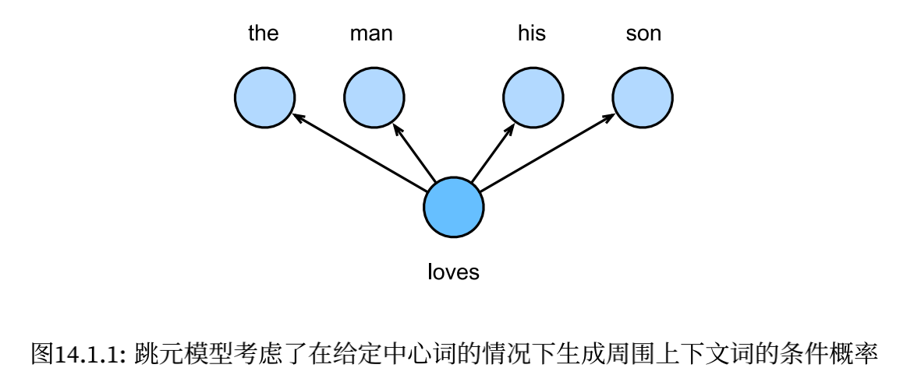
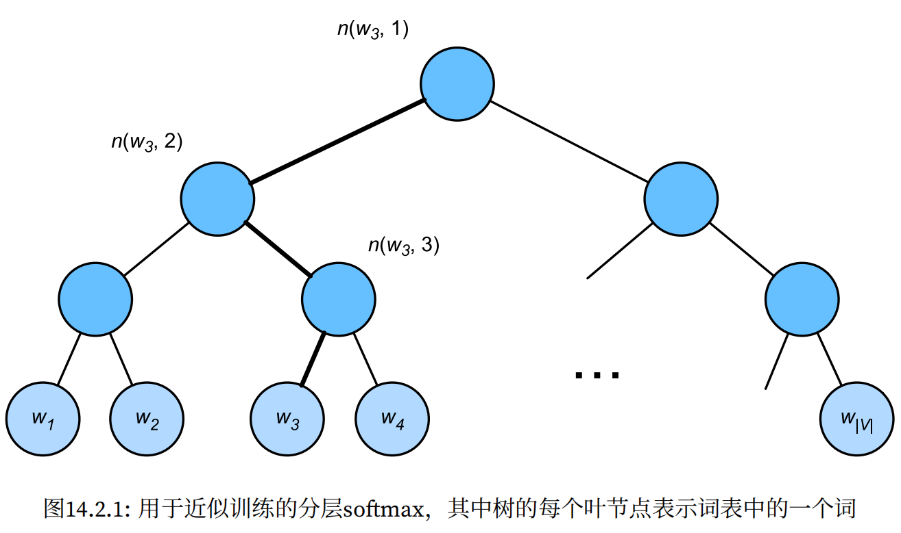
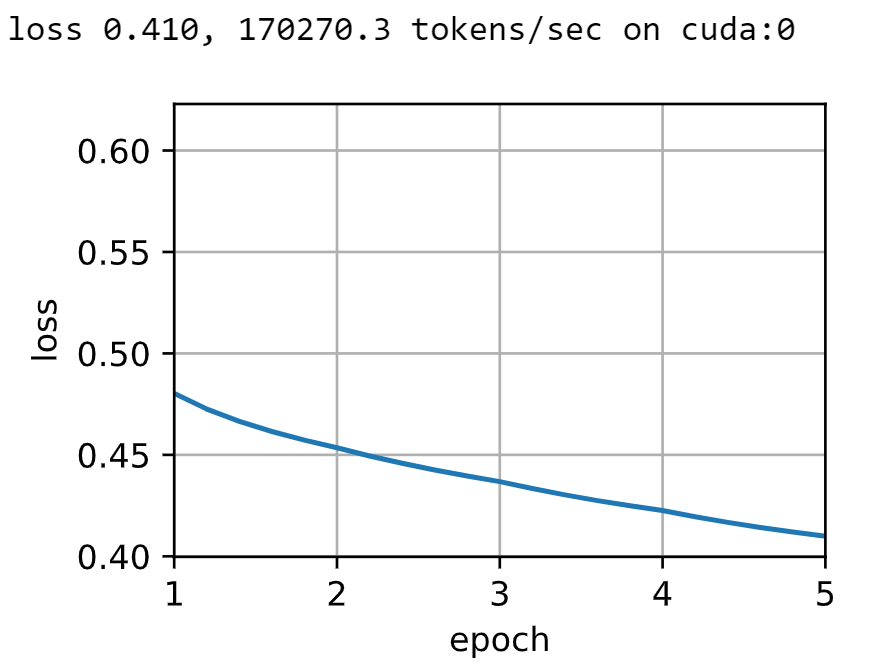
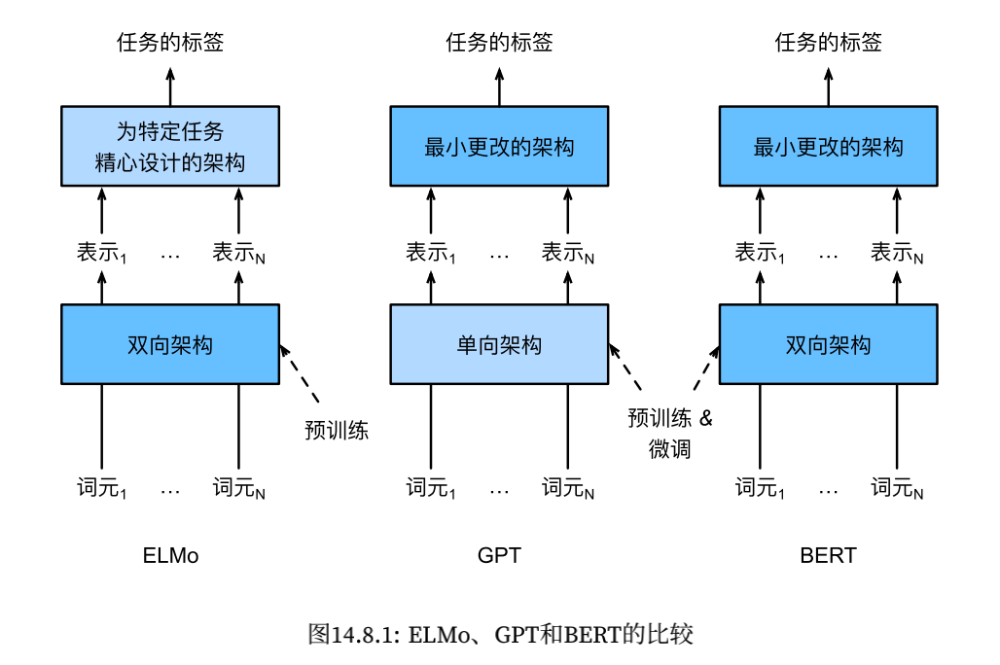
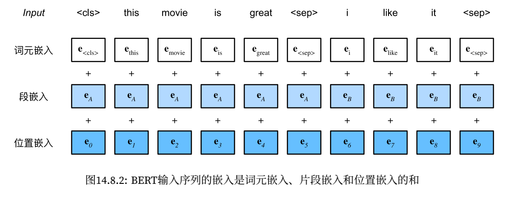
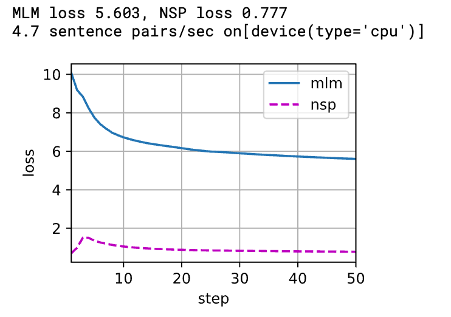

## 自然语言处理：预训练

- 可以通过*自监督学习*（self-supervised learning）来进行预训练文本表示，例如通过使用周围文本的其他部分来预测文本的隐藏部分。
- 使用 word2vec、Glove 或子词嵌入模型进行预训练，每个词元在不同上下文中的向量表示都相同；而许多新的预训练模型使相同词元的表示适应于不同的上下文，其中包括基于 transformer 编码器的更深的自监督模型 BERT。

### 词嵌入（Word2vec）

- *词向量*是用于表示单词意义的向量，并且还可以被认为是单词的特征向量或表示。将单词映射到实向量的技术称为*词嵌入*。

- 独热向量的缺点：不能准确表达不同词之间的相似度，例如任意两个不同词的独热向量之间的余弦相似度为 0.

- 自监督的 word2vec 包含两个模型：*跳元模型*（skip-gram）和*连续词袋*（CBOW），它们都是使用语料库中的一些词来预测另一些词。

- **跳元模型（Skip-Gram）：给定中心词，预测上下文**

    例：the man loves his son，选定中心词 "loves"，上下文窗口为 2，则条件概率为：
    $$
    P(\textrm{“the"},\textrm{“man"},\textrm{“his"},\textrm{“son"}\mid\textrm{“loves"}) \\
    =P(\textrm{“the”}\mid\textrm{“loves”})\cdot P(\textrm{“man”}\mid\textrm{“loves”})\cdot P(\textrm{“his”}\mid\textrm{“loves”})\cdot P(\textrm{“son”}\mid\textrm{“loves”}).
    $$
    

    具体而言，给定词典中索引为 $i$ 的任何词，分别用 $\mathbf v_i \in \mathbb R^d$ 和 $\mathbf u_i \in \mathbb R^d$ 表示其用作*中心词*和*上下文词*时的两个向量。给定中心词 $w_c$，**生成任何**上下文词 $w_o$ 的<span id="1">条件概率</span>为（softmax）：
    $$
    P(w_o\mid w_c)=\frac{\exp(\mathbf u_o^\top \mathbf v_c)}{\sum_{i\in \mathcal V}\exp(\mathbf u_i^\top \mathbf v_c)}
    $$
    给定长度为 $T$ 的文本序列，其中时间步 $t$ 处的词表示为 $w^{(t)}$，假设上下文词是在给定任何中心词的情况下独立生成的，则对于上下文窗口 $m$，**跳元模型的似然函数是在给定任何中心词的情况下生成所有上下文词的概率**：
    $$
    \prod_{t=1}^T \prod_{-m\le j\le m,j\ne 0}P(w^{(t+j)}\mid w^{(t)})
    $$

    - 训练

        极大似然估计/最小化损失函数：
        $$
        - \sum_{t=1}^{T} \sum_{-m \leq j \leq m,\ j \neq 0} \text{log}\, P(w^{(t+j)} \mid w^{(t)})
        $$
        更新梯度（假设中心词为 $w_c$，上下文词为 $w_o$）：可以获得其关于中心词向量 $\mathbf v_c$ 的梯度
        $$
        \log P(w_o \mid w_c) =\mathbf{u}_o^\top \mathbf{v}_c - \log\left(\sum_{i \in \mathcal{V}} \text{exp}(\mathbf{u}_i^\top \mathbf{v}_c)\right)\\
        
        \begin{split}\begin{aligned}\frac{\partial \text{log}\, P(w_o \mid w_c)}{\partial \mathbf{v}_c}&= \mathbf{u}_o - \frac{\sum_{j \in \mathcal{V}} \exp(\mathbf{u}_j^\top \mathbf{v}_c)\mathbf{u}_j}{\sum_{i \in \mathcal{V}} \exp(\mathbf{u}_i^\top \mathbf{v}_c)}\\&= \mathbf{u}_o - \sum_{j \in \mathcal{V}} \left(\frac{\text{exp}(\mathbf{u}_j^\top \mathbf{v}_c)}{ \sum_{i \in \mathcal{V}} \text{exp}(\mathbf{u}_i^\top \mathbf{v}_c)}\right) \mathbf{u}_j\\&= \mathbf{u}_o - \sum_{j \in \mathcal{V}} P(w_j \mid w_c) \mathbf{u}_j.\end{aligned}\end{split}
        $$
        对词典中索引为 $i$ 的词进行训练后，得到 $\mathbf v_i$（作为中心词）和 $\mathbf u_i$（作为上下文词）两个词向量。在自然语言处理应用中，**跳元模型的中心词向量通常用作词表示**。

- **连续词袋（CBOW）模型：给定上下文，预测中间词**

    例：the man loves his son，选定中心词 "loves"，上下文窗口为 2，则条件概率为：
    $$
    P(\textrm{“loves"} \mid \textrm{“the"},\textrm{“man"},\textrm{“his"},\textrm{“son"})
    $$
    由于连续词袋模型中存在多个上下文词，因此在计算条件概率时对这些上下文词向量进行**平均**。分别用 $\mathbf v_i \in \mathbb R^d$ 和 $\mathbf u_i \in \mathbb R^d$ 表示用作*上下文*词和*中心*词的两个向量（符号与跳元模型中相反），则：
    $$
    P(w_c \mid w_{o_1}, \ldots, w_{o_{2m}}) = \frac{\text{exp}\left(\frac{1}{2m}\mathbf{u}_c^\top (\mathbf{v}_{o_1} + \ldots, + \mathbf{v}_{o_{2m}}) \right)}{ \sum_{i \in \mathcal{V}} \text{exp}\left(\frac{1}{2m}\mathbf{u}_i^\top (\mathbf{v}_{o_1} + \ldots, + \mathbf{v}_{o_{2m}}) \right)}
    $$
    令 $\mathcal{W}_o= \{w_{o_1}, \ldots, w_{o_{2m}}\}$ 和 $\bar{\mathbf{v}}_o = \left(\mathbf{v}_{o_1} + \ldots, + \mathbf{v}_{o_{2m}} \right)/(2m)$，上式可以简化为：
    $$
    P(w_c \mid \mathcal{W}_o) = \frac{\exp\left(\mathbf{u}_c^\top \bar{\mathbf{v}}_o\right)}{\sum_{i \in \mathcal{V}} \exp\left(\mathbf{u}_i^\top \bar{\mathbf{v}}_o\right)}
    $$
    所以，**连续词袋模型的似然函数是在给定其上下文词的情况下生成所有中心词的概率**：
    $$
    \prod_{t=1}^{T}  P(w^{(t)} \mid  w^{(t-m)}, \ldots, w^{(t-1)}, w^{(t+1)}, \ldots, w^{(t+m)})
    $$

    - 训练

        极大似然函数/最小化损失函数：
        $$
        -\sum_{t=1}^T  \text{log}\, P(w^{(t)} \mid  w^{(t-m)}, \ldots, w^{(t-1)}, w^{(t+1)}, \ldots, w^{(t+m)})
        $$
        更新梯度：可以获得其关于任意上下文词向量 $\mathbf v_{o_i}(i = 1, \ldots, 2m)$ 的梯度 
        $$
        \log\,P(w_c \mid \mathcal{W}_o) = \mathbf{u}_c^\top \bar{\mathbf{v}}_o - \log\,\left(\sum_{i \in \mathcal{V}} \exp\left(\mathbf{u}_i^\top \bar{\mathbf{v}}_o\right)\right)\\
        \frac{\partial \log\, P(w_c \mid \mathcal{W}_o)}{\partial \mathbf{v}_{o_i}} = \frac{1}{2m} \left(\mathbf{u}_c - \sum_{j \in \mathcal{V}} \frac{\exp(\mathbf{u}_j^\top \bar{\mathbf{v}}_o)\mathbf{u}_j}{ \sum_{i \in \mathcal{V}} \text{exp}(\mathbf{u}_i^\top \bar{\mathbf{v}}_o)} \right) = \frac{1}{2m}\left(\mathbf{u}_c - \sum_{j \in \mathcal{V}} P(w_j \mid \mathcal{W}_o) \mathbf{u}_j \right)
        $$
        与跳元模型不同，**连续词袋模型通常使用上下文词向量作为词表示**。

- 总结：跳元模型是给定中心词，预测上下文，可以得到中心词向量作为词表示；连续词袋模型是给定上下文，预测中心词，可以得到上下文词向量用作词表示。

### 近似训练

- 梯度中有个求和项，如果对全词表 $\mathcal V$ 进行求和，计算复杂度太高，为此有两种近似训练方法：*负采样*和*分层softmax*。

- 负采样：考虑跳元模型（sigmoid）

    给定中心词 $w_c$ 的上下文窗口，任意上下文词 $w_o$ 来自该上下文窗口的概率事件为（D = 1 表示正例）：
    $$
    P(D=1\mid w_c,w_o)=\sigma(\mathbf u_o^\top \mathbf v_c)\\
    \sigma(x)=\frac{1}{1+\exp(-x)}
    $$
    最大化联合概率为：
    $$
    \prod_{t=1}^T\prod_{-m\le j\le m, j\ne 0}P(D=1\mid w^{(t)},w^{(t+j)})
    $$
    上式只考虑正样本事件，仅当所有词向量都等于无穷大时，上式的联合概率才最大化。但这样毫无意义，为了使目标函数更有意义，*负采样*添加从预定义分布中采样的负样本。

    **用 $S$ 表示上下文词 $w_o$ 来自中心词 $w_c$ 的上下文窗口的事件**。**对于这个**涉及 $w_o$ 的**事件**，从预定义分布 $P(w)$ 中采样 $K$ 个不是来自这个上下文窗口的噪声词。**用 $N_k$ 表示噪声词 $w_k(k=1,\dots, K)$ 不是来自 $w_c$ 的上下文窗口的事件**。则负采样将上述的联合概率重写为（每个单独事件包括一个正例和 $K$ 个负例）：
    $$
    \prod_{t=1}^T\prod_{-m\le j\le m,j\ne 0}P(w^{(t+j)}\mid w^{(t)})
    $$
    其中：
    $$
    P(w^{(t+j)}\mid w^{(t)})=P(D=1\mid w^{(t)}, w^{(t+j)})\prod_{k=1,w_k\sim P(w)}P(D=0\mid w^{(t)},w_k)
    $$
    分别用 $i_t$ 和 $h_k$ 表示词 $w^{(t)}$ 和噪声词 $w_k$ 在文本序列的时间步 $t$ 处的索引，则上述条件概率的对数损失为：
    $$
    \begin{split}\begin{aligned}
    -\log P(w^{(t+j)} \mid w^{(t)})
    =& -\log P(D=1\mid w^{(t)}, w^{(t+j)}) - \sum_{k=1,\ w_k \sim P(w)}^K \log P(D=0\mid w^{(t)}, w_k)\\
    =&-  \log\, \sigma\left(\mathbf{u}_{i_{t+j}}^\top \mathbf{v}_{i_t}\right) - \sum_{k=1,\ w_k \sim P(w)}^K \log\left(1-\sigma\left(\mathbf{u}_{h_k}^\top \mathbf{v}_{i_t}\right)\right)\\
    =&-  \log\, \sigma\left(\mathbf{u}_{i_{t+j}}^\top \mathbf{v}_{i_t}\right) - \sum_{k=1,\ w_k \sim P(w)}^K \log\sigma\left(-\mathbf{u}_{h_k}^\top \mathbf{v}_{i_t}\right)
    \end{aligned}\end{split}
    $$
    现在每个训练步的梯度计算成本与词表大小无关，而是线性依赖于 $K$。

- 层序 Softmax：考虑跳元模型

    采用二叉树，其中树的每个叶节点表示词表 $\mathcal V$ 中的一个词。

    

    用 $L(w)$ 表示二叉树中表示字 $w$ 的从根节点到叶节点的路径上的节点数（包括两端），例如上图中 $L(w_3)=4$。设 $n(w,j)$ 为该路径上的 $j^{th}$ 节点，其上下文字向量为 $\mathbf u_{n(w,j)}$。

    分层 softmax 将<a href="#1">该条件概率</a>近似为：
    $$
    P(w_o\mid w_c)=\prod_{j=1}^{L(w_o)-1}\sigma([\![n(w_o,j+1)=\text{leftChild}(n(w_o,j))]\!]\cdot \mathbf u_{n(w_o,j)}^\top\mathbf v_c)
    $$
    其中 $\text{leftChild}(n)$ 是节点 $n$ 的左子节点：如果 $x$ 为真，$[\![x]\!]=1$，否则为 $-1$。

    计算上图中的加粗路径：给定词 $w_c$ 生成词 $w_3$ 的条件概率，这需要 $w_c$ 的词向量 $v_c$ 和从根到 $w_3$ 的路径上的非叶子节点向量之间的点积：
    $$
    P(w_3 \mid w_c) = \sigma(\mathbf{u}_{n(w_3, 1)}^\top \mathbf{v}_c) \cdot \sigma(-\mathbf{u}_{n(w_3, 2)}^\top \mathbf{v}_c) \cdot \sigma(\mathbf{u}_{n(w_3, 3)}^\top \mathbf{v}_c)
    $$
    由 $\sigma(x)+\sigma(-x)=1$，它认为基于任何词 $w_c$ 生成词表 $\mathcal V$ 中所有词的条件概率总和为 $1$：
    $$
    \sum_{w\in \mathcal V}P(w\mid w_c)=1
    $$
    由于二叉树结构，$L(w_o)-1$ 大约与 $\mathcal O(\log_2|\mathcal V|)$ 是一个数量级。

- 总结：

    1. 负采样通过考虑相互独立的事件来构造损失函数，这些事件同时涉及正例和负例。训练的计算量与每一步的噪声词数成线性关系。
    2. 分层 softmax 使用二叉树中从根节点到叶节点的路径构造损失函数。训练的计算成本取决于词表大小的对数。

### 用于预训练词嵌入的数据集

- 读取数据集

    ```python
    d2l.DATA_HUB['ptb'] = (d2l.DATA_URL + 'ptb.zip',
                           '319d85e578af0cdc590547f26231e4e31cdf1e42')
    
    def read_ptb():
        '''将 PTB 数据集加载到文本行的列表中'''
        data_dir = d2l.download_extract('ptb')
        with open(os.path.join(data_dir, 'ptb.train.txt')) as f:
            raw_text = f.read()
        return [line.split() for line in raw_text.split('\n')]
    ```

- 下采样：对一些高频词（停用词）概率性地抛弃：
    $$
    P(w_i) = \max\left(1 - \sqrt{\frac{t}{f(w_i)}}, 0\right)
    $$
    其中 $f(w_i)$ 是 $w_i$ 的词数与数据集中的总词数的比率，常量 $t$ 是超参数（在实验中为 $10^{-4}$）。只有当相对比率 $f(w_i)>t$ 时，词 $w_i$ 才可能被丢弃，且该词的相对比率越高，被丢弃的概率越大。

    ```python
    def subsample(sentences, vocab):
        '''下采样高频词'''
        # 排除未知词元 <unk>
        sentences = [[token for token in line if vocab[token] != vocab.unk]
                     for line in sentences]
        counter = d2l.count_corpus(sentences)
        num_tokens = sum(counter.values()) # 总词数
        
        # 如果在下采样期间保留词元，则返回 True
        def keep(token):
            return (random.uniform(0, 1) <
                    math.sqrt(1e-4 / counter[token] * num_tokens))
        
        return ([[token for token in line if keep(token)] for line in sentences], 
                counter)
    ```

- 中心词和上下文词的提取：随机采样 $1$ 到 `max_window_size` 之间的整数作为上下文窗口的大小。对于任一中心词，与其距离不超过采样上下文窗口大小的词为其上下文词。

    ```python
    def get_centers_and_contexts(corpus, max_window_size):
        '''返回跳元模型中的中心词和上下文词'''
        centers, contexts = [], []
        for line in corpus:
            # 要形成 中心词-上下文词对，每个句子至少需要有两个词
            if len(line) < 2:
                continue
            centers += line
            for i in range(len(line)): # 上下文窗口中间 i
                window_size = random.randint(1, max_window_size)
                indices = list(range(max(0, i - window_size),
                                     min(len(line), i + 1 + window_size)))
                # 从上下文词中排除中心词
                indices.remove(i)
                contexts.append([line[idx] for idx in indices])
        return centers, contexts
    
    tiny_dataset = [list(range(7)), list(range(5, 10))]
    print('数据集', tiny_dataset)
    for center, context in zip(*get_centers_and_contexts(tiny_dataset, 2)):
        print('中心词', center, '的上下文词是', context)
        
    >>>
    数据集 [[0, 1, 2, 3, 4, 5, 6], [5, 6, 7, 8, 9]]
    中心词 0 的上下文词是 [1]
    中心词 1 的上下文词是 [0, 2, 3]
    中心词 2 的上下文词是 [1, 3]
    中心词 3 的上下文词是 [2, 4]
    中心词 4 的上下文词是 [2, 3, 5, 6]
    中心词 5 的上下文词是 [3, 4, 6]
    中心词 6 的上下文词是 [5]
    中心词 5 的上下文词是 [6, 7]
    中心词 6 的上下文词是 [5, 7]
    中心词 7 的上下文词是 [5, 6, 8, 9]
    中心词 8 的上下文词是 [7, 9]
    中心词 9 的上下文词是 [7, 8]
    ```

- 负采样

    ```python
    class RandomGenerator:
        '''根据 n 个采样权重在 {1, ..., n} 中随机抽取'''
        def __init__(self, sampling_weights):
            self.population = list(range(1, len(sampling_weights) + 1))
            self.sampling_weights = sampling_weights
            self.candidates = []
            self.i = 0
            
        def draw(self):
            if self.i == len(self.candidates):
                # 缓存 k 个随机采样结果
                self.candidates = random.choices(
                    self.population, self.sampling_weights, k=10000)
                self.i = 0
            self.i += 1
            # 当 i < k 时，直接用之前存储的结果，不用重新抽
            return self.candidates[self.i - 1]
    ```

    对于一对中心词和上下文词，随机抽取 $K$ 个噪声词。将噪声词 $w$ 的采样频率 $P(w)$ 设置为其在字典中的相对频率，并设幂为 $0.75$（防止低频词被忽略）。

    ```python
    def get_negatives(all_contexts, vocab, counter, K):
        '''返回负采样中的噪声词'''
        # 索引为 1、2、...（索引 0 是词表中排除的 <unk>）
        # 得到相对频率
        sampling_weights = [counter[vocab.to_tokens(i)] ** 0.75
                            for i in range(1, len(vocab))]
        all_negatives, generator = [], RandomGenerator(sampling_weights)
        for contexts in all_contexts:
            negatives = []
            # 每一个正例对应 K 个负例
            while len(negatives) < len(contexts) * K:
                neg = generator.draw()
                # 噪声词不能是上下文词
                if neg not in contexts:
                    negatives.append(neg)
            all_negatives.append(negatives)
        return all_negatives
    ```

- 小批量加载实例

    对每个样本，将上下文词和噪声词连结起来，并填充零，直到连结长度达到 $\max_i\{n_i+m_i\}$，其中 $n_i$ 和 $m_i$ 是上下文词和噪声词的数量。

    为了在计算误差时排除填充，定义掩码变量 `masks`，`masks` 中的元素为 0 代表该位置在连结后的列表中是填充。

    为了区分正反例，定义变量 `labels`，`labels` 中的元素为 1 代表该位置在连结后的列表中是正例，否则是反例。

    下面的函数其输入 `data` 是长度等于批量大小的列表，其中每个元素是由中心词 `center`、其上下文词 `context` 和其噪声词 `negative` 组成的样本：

    ```python
    def batchify(data):
        '''返回带有负采样的跳元模型的小批量样本'''
        # data: [(中心词 center, 上下文词 context, 噪声词 negative)] 长度为批量大小
        max_len = max(len(c) + len(n) for _, c, n in data) 
        # 最长的一组上下文词 + 噪声词 列表
        centers, contexts_negatives, masks, labels = [], [], [], []
        for center, context, negative in data:
            cur_len = len(context) + len(negative)
            centers += [center]
            contexts_negatives += \
                [context + negative + [0] * (max_len - cur_len)]
            masks += [[1] * cur_len + [0] * (max_len - cur_len)]
            labels += [[1] * len(context) + [0] * (max_len - len(context))]
        return (torch.tensor(centers).reshape((-1, 1)), torch.tensor(
            contexts_negatives), torch.tensor(masks), torch.tensor(labels))
    
    x_1 = (1, [2, 2], [3, 3, 3, 3])
    x_2 = (1, [2, 2, 2], [3, 3])
    batch = batchify((x_1, x_2))
    
    names = ['centers', 'contexts_negatives', 'masks', 'labels']
    for name, data in zip(names, batch):
        print(name, '=', data)
    
    >>>
    centers = tensor([[1],
            [1]])
    contexts_negatives = tensor([[2, 2, 3, 3, 3, 3],
            [2, 2, 2, 3, 3, 0]])
    masks = tensor([[1, 1, 1, 1, 1, 1],
            [1, 1, 1, 1, 1, 0]])
    labels = tensor([[1, 1, 0, 0, 0, 0],
            [1, 1, 1, 0, 0, 0]])
    ```

- 整合代码：返回数据迭代器和词表

    ```python
    def load_data_ptb(batch_size, max_window_size, num_noise_words):
        '''下载 ptb 数据集，然后将其加载到内存中'''
        num_workers = d2l.get_dataloader_workers()
        sentences = read_ptb()
        vocab = d2l.Vocab(sentences, min_freq=10)
        subsampled, counter = subsample(sentences, vocab)
        corpus = [vocab[line] for line in subsampled]
        all_centers, all_contexts = get_centers_and_contexts(
            corpus, max_window_size)
        all_negatives = get_negatives(
            all_contexts, vocab, counter, num_noise_words)
        
        class PTBDataset(torch.utils.data.Dataset):
            def __init__(self, centers, contexts, negatives):
                assert len(centers) == len(contexts) == len(negatives)
                self.centers = centers
                self.contexts = contexts
                self.negatives = negatives
            
            def __getitem__(self, index):
                return (self.centers[index], self.contexts[index],
                        self.negatives[index])
            
            def __len__(self):
                return len(self.centers)
            
        dataset = PTBDataset(all_centers, all_contexts, all_negatives)
        
        # collate_fn 允许对抽取出来的 batch 作进一步处理
    	'''
    	indices = next(self.sample_iter)
    	batch = self.collate_fn([dataset[i] for i in indices])
    	'''
        data_iter = torch.utils.data.DataLoader(
            dataset, batch_size, shuffle=True,
            collate_fn=batchify, num_workers=num_workers)
        return data_iter, vocab
    ```

### 预训练 word2vec

- 采用跳元模型和负采样方法进行预训练。

- 读入数据

    ```python
    from torch import nn
    
    batch_size, max_window_size, num_noise_words = 512, 5, 5
    data_iter, vocab = load_data_ptb(batch_size, max_window_size,
                                     num_noise_words)
    ```

- 嵌入层：将词元的索引映射到其特征向量，该层的权重是一个矩阵 `(input_size, embed_size)`，每一行就是每个词元的词表示

    ```python
    embed = nn.Embedding(num_embeddings=20, embedding_dim=4)
    # x: (batch_size, 1) => (batch_size, 1, embed_size)
    ```

- 前向传播：将输入的中心词 `center` 和上下文与噪声词 `contexts_and_negatives` 通过嵌入层，之后进行批量矩阵相乘，输出中的每个元素是中心词向量和上下文或噪声词向量的点积。

    ```python
    def skip_gram(center, contexts_and_negatives, embed_v, embed_u):
        v = embed_v(center) # (batch_size, 1, embed_size)
        u = embed_u(contexts_and_negatives) # (batch_size, max_len, embed_size)
        pred = torch.bmm(v, u.permute(0, 2, 1)) # (batch_size, 1, max_len)
        # 输出的每个元素是中心词向量和上下文或噪声词向量的点积
        return pred
    ```

- 二元交叉熵损失：将 `skip_gram` 函数的输出作为预测值，我们数据中的 `labels` 和 `masks` 分别作为标签和掩码进行计算，由于：
    $$
    L=-(t\log P+(1-t)\log (1-P))
    $$
    当 `labels` 中对应元素为 1 时，取前半项；当 `labels` 中对应元素为 0 时，取后半项。这也是我们这么设计 `label` 的原因。

    ```python
    class SigmoidBCELoss(nn.Module):
        # 带掩码的二元交叉熵损失
        def __init__(self):
            super().__init__()
            
        def forward(self, inputs, target, mask=None):
            out = nn.functional.binary_cross_entropy_with_logits(
                inputs, target, weight=mask, reduction='none')
            return out.mean(dim=1)
        
    loss = SigmoidBCELoss()
    ```

    测试：

    ```python
    pred = torch.tensor([[1.1, -2.2, 3.3, -4.4]] * 2)
    label = torch.tensor([[1.0, 0.0, 0.0, 0.0], [0.0, 1.0, 0.0, 0.0]])
    mask = torch.tensor([[1, 1, 1, 1], [1, 1, 0, 0]])
    # 需要进行缩放，因为 Loss 中求平均默认是 除以 mask.shape[1]
    # 但对应 mask[1] 中应该除以 2 而不是除以 4
    loss(pred, label, mask) * mask.shape[1] / mask.sum(axis=1)
    
    >>> tensor([0.9352, 1.8462])
    ```

    手动分解步骤来计算：
    $$
    \because 1-\sigma(x)=1-\frac{1}{1+\exp(-x)}=\frac{\exp(-x)}{1+\exp(-x)}=\frac{1}{1+\exp(x)}=\sigma(-x) \\
    \therefore 1-P=1-\sigma(\mathbf u_o^\top \mathbf v_c)=\sigma(-\mathbf u_o^\top \mathbf v_c)
    $$

    ```python
    def sigmd(x):
        return -math.log(1 / (1 + math.exp(-x)))
    
    print(f'{(sigmd(1.1) + sigmd(2.2) + sigmd(-3.3) + sigmd(4.4)) / 4:.4f}')
    print(f'{(sigmd(-1.1) + sigmd(-2.2)) / 2:.4f}')
    
    >>>
    0.9352
    1.8462
    ```

- 初始化模型参数

    ```python
    embed_size = 100
    net = nn.Sequential(nn.Embedding(num_embeddings=len(vocab),
                                     embedding_dim=embed_size),
                        nn.Embedding(num_embeddings=len(vocab),
                                     embedding_dim=embed_size))
    ```

- 训练

    ```python
    def train(net, data_iter, lr, num_epochs, device=d2l.try_gpu()):
        def init_weights(m):
            if type(m) == nn.Embedding:
                nn.init.xavier_uniform_(m.weight)
        net.apply(init_weights)
        net = net.to(device)
        optimizer = torch.optim.Adam(net.parameters(), lr=lr)
        animator = d2l.Animator(xlabel='epoch', ylabel='loss',
                                xlim=[1, num_epochs])
        # 规范化的损失之和，规范化的损失数
        metric = d2l.Accumulator(2)
        for epoch in range(num_epochs):
            timer, num_batches = d2l.Timer(), len(data_iter)
            for i, batch in enumerate(data_iter):
                optimizer.zero_grad()
                center, context_negative, mask, label = [
                    data.to(device) for data in batch]
                pred = skip_gram(center, context_negative, net[0], net[1])
                # pred: (batch_size, 1, max_len) => (batch_size, max_len)
                l = (loss(pred.reshape(label.shape).float(), label.float(), mask)
                     / mask.sum(axis=1) * mask.shape[1])
                l.sum().backward()
                optimizer.step()
                metric.add(l.sum(), l.numel())
                if (i + 1) % (num_batches // 5) == 0 or i == num_batches - 1:
                    animator.add(epoch + (i + 1) / num_batches, 
                                 (metric[0] / metric[1], ))
        print(f'loss {metric[0] / metric[1]:.3f}, '
              f'{metric[1] / timer.stop():.1f} tokens/sec on {str(device)}')
        
    lr, num_epochs = 0.002, 5
    train(net, data_iter, lr, num_epochs)
    ```

    

- 应用词嵌入：通过词向量的余弦相似度来从词表中找到与输入单词语义最相似的单词。

    ```python
    def get_similar_tokens(query_token, k, embed):
        W = embed.weight.data # (vocab_size, embed)
        x = W[vocab[query_token]] # (embed)
        # 计算余弦相似性，增加 1e-9 以获得数值稳定性
        # torch.mv: 矩阵乘以向量
        # .mv => (vocab_size, 1) 与每个词元的 embedding 点乘后除以 模的乘积
        cos = torch.mv(W, x) / torch.sqrt(torch.sum(W * W, dim=1) *
                                          torch.sum(x * x) + 1e-9)
        topk = torch.topk(cos, k=k+1)[1].cpu().numpy().astype('int32')
        # topk()[0]: values, topk()[1]: indices
        for i in topk[1:]: # 删除输入词（第一个）
            print(f'cosine sim={float(cos[i]):.3f}: {vocab.to_tokens(i)}')
    
    get_similar_tokens('chip', 3, net[0]) # 选择中心词向量，net[1] 是上下文词向量
    
    >>>
    cosine sim=0.645: microprocessor
    cosine sim=0.602: drives
    cosine sim=0.585: semiconductors
    ```

- 当训练语料库很大时，在更新模型参数时，我们经常对当前小批量的*中心词*进行上下文词和噪声词的采样。换言之，同一中心词在不同的训练迭代轮数可以有不同的上下文词或噪声词。

### 全局向量的词嵌入（GloVe）

- 上下⽂窗口内的词共现可以携带丰富的语义信息。可以预先计算词共现的全局语料库统计数据，这可以提高训练效率。

- 带全局语料统计的跳元模型

    用 $q_{ij}$ 表示词 $w_j$ 的条件概率 $P(w_j\mid w_i)$，其中 $w_i$ 为中心词，则：
    $$
    q_{ij}=\frac{\exp(\mathbf{u}_j^\top \mathbf{v}_i)}{ \sum_{k \in \mathcal{V}} \text{exp}(\mathbf{u}_k^\top \mathbf{v}_i)}
    $$
    考虑词 $w_i$ 可能在语料库中出现多次。在整个语料库中，所有以 $w_i$ 为中心词的上下文词形成一个词索引的*多重集* $\mathcal C_i$，该索引允许同一元素的多个实例。对于任何元素，其实例数称为其*重数*。

    例如，$w_i$ 在语料库中出现两次，并且两个上下文窗口中的词为 $k,j,m,k$ 和 $k,l,k,j$，则多重集 $\mathcal C_i=\{j,j,k,k,k,k,l,m\}$，其中元素 $j,k,l,m$ 的重数分别是 $2、4、1、1$。

    设多重集 $\mathcal C_i$ 中的元素 $j$ 的重数表示为 $x_{ij}$，这是上下文词 $w_j$ 和中心词 $w_i$ 在整个语料库的同一上下文窗口中的全局共现次数，使用这样的全局语料库统计，损失函数等价于：
    $$
    -\sum_{i\in \mathcal V}\sum_{j\in \mathcal V}x_{ij}\log q_{ij}
    $$
    用 $x_i$ 表示中心词 $w_i$ 的上下文窗口中的所有上下文词数量，这相当于 $|\mathcal C_i|$。设 $p_{ij}$ 为用于生成上下文词 $w_j$ 的条件概率 $x_{ij}/x_i$，则损失函数可以重写为：
    $$
    -\sum_{i\in \mathcal V}x_i\sum_{j\in \mathcal V}p_{ij}\log q_{ij}
    $$
    上式中，$-\sum_{j\in \mathcal V}p_{ij}\log q_{ij}$ 计算全局语料统计的条件分布 $p_{ij}$ 和模型预测的条件分布 $q_{ij}$ 的交叉熵，然后按 $x_i$ 加权。最小化该损失函数将使预测的条件分布接近全局语料库统计中的条件分布。

    虽然**交叉熵损失函数通常用于测量概率分布之间的距离**，但在这里可能不是一个好的选择。首先，规范化 $q_{ij}$ 的计算代价太高；其次，来自大型语料库的大量罕见事件往往被交叉熵损失建模，从而赋予过多的权重。

- GloVe 模型

    基于平方损失对跳元模型做了三个修改：

    1. 使用变量 $p_{ij}'=x_{ij}$ 和 $q_{ij}'=\exp(\mathbf u_j^\top \mathbf v_i)$ 而非概率分布，并取两者的对数。所以平方损失项是：
        $$
        L=(\log p_{ij}'-\log q_{ij}')^2=(\mathbf u_j^\top\mathbf v_i-\log x_{ij})^2
        $$

    2. 为每个词 $w_i$ 添加两个标量模型参数：中心词偏置 $b_i$ 和上下文词偏置 $c_i$

    3. 用权重函数 $h(x_{ij})$ 替换每个损失项的权重，其中 $h(x)$ 在 $[0, 1]$ 的间隔内递增

    则总的损失函数为：
    $$
    \sum_{i\in\mathcal V}\sum_{j\in\mathcal V}h(x_{ij})(\mathbf u_j^\top\mathbf v_i+b_i+c_j-\log x_{ij})^2
    $$
    权重函数的选择：当 $x<c$（例如 $c=100$）时，$h(x)=(x/c)^\alpha$（例如 $\alpha=0.75$）；否则 $h(x)=1$。在这种情况下，由于 $h(0)=0$，为了提高计算效率，可以省略任意 $x_{ij}=0$ 的平方损失项。例如，当使用小批量随机梯度下降进行训练时，在每次迭代中，我们随机抽样一小批量*非零*的 $x_{ij}$ 来计算梯度并更新模型参数。注意，这些非零的 $x_{ij}$ 是预先计算的全局语料库统计数据；因此，该模型 GloVe 被称为*全局向量*。

    当词 $w_i$ 出现在词 $w_j$ 的上下文窗口时，词 $w_j$ 也出现在词 $w_i$ 的上下文窗口。因此，$x_{ij}=x_{ji}$。这与拟合非对称条件概率 $p_{ij}$ 的 word2vec 不同，GloVe 拟合对称概率 $\log x_{ij}$。所以，在 GloVe 模型中，任意词的中心词向量和上下文词向量在数学上是等价的（但实际上由于初始值不同，可能会不一样），最终 GloVE 将它们相加作为输出向量。

- 从条件概率比值理解 GloVe 模型

    设 $p_{ij}$ 是中心词为 $w_i$，生成上下文词 $w_j$ 的条件概率，**共现概率的比值 $p_{ij}/p_{ik}$ 可以直观地表达词与词之间的关系**，因此我们可以通过设计函数来拟合这个比值。

    > 比值很大说明 $w_j$ 与 $w_i$ 相关，而 $w_k$ 与 $w_i$ 不相关；
    >
    > 比值很小说明 $w_k$ 与 $w_i$ 相关，而 $w_j$ 与 $w_i$ 不相关；
    >
    > 比值接近于 $1$ 说明要么 $w_j$ 和 $w_k$ 都与 $w_i$ 相关，要么都不相关。

    因为这个比值是个标量，所以我们的函数必须是标量函数，且必须确保 $f(x)f(-x)=1$，所以可以设计为：
    $$
    f(\mathbf u_j, \mathbf u_k, \mathbf v_i)=\frac{\exp(\mathbf u_j^\top \mathbf v_i)}{\exp (\mathbf u_k^\top \mathbf v_i)}\approx \frac{p_{ij}}{p_{ik}}
    $$
    所以我们可以选择 $\exp(\mathbf u_j^\top\mathbf v_i)=\alpha p_{ij}$，其中 $\alpha$ 是常数，由 $p_{ij}=x_{ij}/x_i$，两边取对数得到：
    $$
    \mathbf u_j^\top \mathbf v_i\approx \log \alpha + \log x_{ij} - \log x_i
    $$
    其中，$-\log \alpha$ 和 $\log x_i$ 都是常数，可以使用偏置项来拟合：
    $$
    \mathbf u_j^\top \mathbf v_i + b_i + c_j \approx \log x_{ij}
    $$
    因此可以使用加权平方误差的损失函数。

- 总结：

    1. 词-词共现计数的全局语料库统计可以来解释跳元模型。
    2. 交叉熵损失可能不是衡量两种概率分布差异的好选择，特别是对于大型语料库。GloVe 使用平方损失来拟合预先计算的全局语料库统计数据。
    3. 对于 GloVe 中的任意词，中心词向量和上下文词向量在数学上是等价的。
    4. GloVe 可以从词-词共现概率的比率来解释。

### 子词嵌入

- word2vec 和 GloVe 没有对词的内部结构进行探讨，例如词性、词的变形等，直接将它们用不同的向量表示，不需要共享参数。

- fastText 模型：提出了一种*子词嵌入*方法，其中子词是一个字符 $n$-gram。fastText 可以被认为是子词级跳元模型，而非词级向量表示，其中每个*中心词*由其子词级向量之和表示。

    例如对单词 "where" 提取子词：首先在词的开头和末尾添加特殊字符 "<" 和 ">"，以将前缀和后缀与其他子词区分开来。然后，从词中提取字符 $n$-gram。当 $n=3$ 时，获得所有长度为 $3$ 的子词："<wh"、"whe"、 "her"、"ere"、"re>" 和特殊子词 "\<where>"。

    在 fastText 中，对于任意词 $w$，用 $\mathcal G_w$ 表示其长度在 $3$ 和 $6$ 之间的所有子词与其特殊子词的并集。词表时所有词的子词的集合。假设 $\mathbf z_g$ 是词典中的子词 $g$ 的向量，则跳元模型中作为中心词的词 $w$ 的向量 $\mathbf v_w$ 是其子词向量的和：
    $$
    \mathbf v_w=\sum_{g\in \mathcal G_w} \mathbf z_g
    $$
    fastText 的其余部分与跳元模型相同。与跳元模型相比，fastText 的词量更大，模型参数也更多。此外，为了计算一个词的表示，它的所有子词向量都必须求和，这导致了更高的计算复杂度。然而，由于具有相似结构的词之间共享来自子词的参数，罕见词甚至词表外的词在 fastText 中可能获得更好的向量表示。

- 字节对编码（Byte Pair Encoding）：在 fastText 中，词表大小不能预定义。为了在固定大小的词表中允许可变长度的子词，我们可以应用一种称为*字节对编码*（Byte Pair Encoding，BPE）的压缩算法来提取子词。

    字节对编码执行训练数据集的统计分析，以发现单词内的公共符号，诸如任意长度的连续字符。从长度为 $1$ 的符号开始，字节对编码迭代地合并最频繁的连续符号对以产生新的更长的符号。最后，使用整理完后的子词来切分单词。通过规定迭代的次数，可以得到固定大小的词表。

    - 首先，将符号词表初始化为所有英文小写字符、特殊的词尾字符 `'_'` 和特殊的位置符号 `'[UNK]'`

        ```python
        import collections
        
        symbols = ['a', 'b', 'c', 'd', 'e', 'f', 'g', 'h', 'i', 'j', 'k', 'l', 'm',
                   'n', 'o', 'p', 'q', 'r', 's', 't', 'u', 'v', 'w', 'x', 'y', 'z',
                   '_', '[UNK]']
        ```

    - 用空格将数据集中的每个词进行分隔，即用空格分隔单词内的子词，因为初始化每个字母都是子词

        ```python
        # 词: 频率
        raw_token_freqs = {'fast_': 4, 'faster_': 3, 'tall_': 5, 'taller_': 4}
        token_freqs = {}
        for token, freq in raw_token_freqs.items():
            token_freqs[' '.join(list(token))] = raw_token_freqs[token]
        token_freqs
        
        >>> {'f a s t _': 4, 'f a s t e r _': 3, 't a l l _': 5, 't a l l e r _': 4}
        ```

    - 找出词内最频繁的符号对

        ```python
        def get_max_freq_pair(token_freqs):
            pairs = collections.defaultdict(int)
            for token, freq in token_freqs.items():
                symbols = token.split()
                for i in range(len(symbols) - 1):
                    # pairs 的键是两个连续符号的元组
                    pairs[symbols[i], symbols[i + 1]] += freq
            
            return max(pairs, key=pairs.get) # 具有最大值的 pairs 键
        
        >>> # pairs 打印
        defaultdict(<class 'int'>, {('f', 'a'): 7, ('a', 's'): 7, ('s', 't'): 7, ('t', '_'): 4, ('t', 'e'): 3, ('e', 'r'): 7, ('r', '_'): 7, ('t', 'a'): 9, ('a', 'l'): 9, ('l', 'l'): 9, ('l', '_'): 5, ('l', 'e'): 4})
        ```

    - 将最频繁的符号对加入符号词表，并在分隔后的原数据集中合并该符号对（贪心方法）

        ```python
        def merge_symbols(max_freq_pair, token_freqs, symbols):
            symbols.append(''.join(max_freq_pair))
            new_token_freqs = dict()
            for token, freq in token_freqs.items():
                # 例如，最频繁字节对为 ta
                # 则将 token 中的 t a 替换为 ta
                new_token = token.replace(' '.join(max_freq_pair),
                                          ''.join(max_freq_pair))
                new_token_freqs[new_token] = token_freqs[token]
            return new_token_freqs
        ```

    - 对数据集迭代地执行字节对编码算法，每次都合并产生新符号

        ```python
        num_merges = 10
        for i in range(num_merges):
            max_freq_pair = get_max_freq_pair(token_freqs)
            token_freqs = merge_symbols(max_freq_pair, token_freqs, symbols)
            print(f'合并# {i+1}:', max_freq_pair)
            
        >>>
        合并# 1: ('t', 'a')
        合并# 2: ('ta', 'l')
        合并# 3: ('tal', 'l')
        合并# 4: ('f', 'a')
        合并# 5: ('fa', 's')
        合并# 6: ('fas', 't')
        合并# 7: ('e', 'r')
        合并# 8: ('er', '_')
        合并# 9: ('tall', '_')
        合并# 10: ('fast', '_')
        ```

    - 得到新词表

        ```python
        print(symbols)
        
        >>>
        ['a', 'b', 'c', 'd', 'e', 'f', 'g', 'h', 'i', 'j', 'k', 'l', 'm', 'n', 'o', 'p', 'q', 'r', 's', 't', 'u', 'v', 'w', 'x', 'y', 'z', '_', '[UNK]', 'ta', 'tal', 'tall', 'fa', 'fas', 'fast', 'er', 'er_', 'tall_', 'fast_']
        ```

    - 查看原数据集用新词表的分隔表示

        ```python
        print(list(token_freqs.keys()))
        
        >>> ['fast_', 'fast er_', 'tall_', 'tall er_']
        ```

    - 对陌生数据集进行子词切分，采用贪心方法，尽量分隔成最长的子词

        ```python
        def segment_BPE(tokens, symbols):
            outputs = []
            for token in tokens:
                # 从开头开始找最长的子词
                start, end = 0, len(token)
                cur_output = []
                while start < len(token):
                    # 如果 start == end 了，即 token[start] 这个字符都不在词表中
                    # 说明遇到了未知词元
                    if start == end:
                        cur_output.append('[UNK]')
                        start += 1
                        end = len(token)
                        continue
                    
                    if token[start: end] in symbols:
                        cur_output.append(token[start: end])
                        # 找到了就将开头移到 end 后一位
                        # 并且重置下一次寻找，继续从最长的开始找（即将 end 置尾）
                        start = end
                        end = len(token) 
                    else:
                        # 没找到就找次长的子词
                        end -= 1
                outputs.append(' '.join(cur_output))
            return outputs
        
        tokens = ['tallest_', 'fatter_', 'faAtAter_']
        print(segment_BPE(tokens, symbols))
        
        >>> ['tall e s t _', 'fa t t er_', 'fa [UNK] t [UNK] t er_']
        ```

- 总结：子词嵌入可以提高稀有词和词典外词的表示质量。

### 词的相似性和类比任务

- 通过使用在大型语料库中预训练的词向量，可以进行词的相似性和类比任务。

- 加载预训练词向量

    ```python
    class TokenEmbedding:
        '''GloVe 嵌入'''
        def __init__(self, embedding_name):
            self.idx_to_token, self.idx_to_vec = self._load_embedding(
                embedding_name)
            self.unknown_idx = 0
            self.token_to_idx = {token: idx for idx, token in
                                 enumerate(self.idx_to_token)}
            
        def _load_embedding(self, embedding_name):
            idx_to_token, idx_to_vec = ['<unk>'], []
            data_dir = d2l.download_extract(embedding_name)
            # GloVe网站：https://nlp.stanford.edu/projects/glove/
            # fastText网站：https://fasttext.cc/
            with open(os.path.join(data_dir, 'vec.txt'), 'r', 
                      encoding='utf-8') as f:
                for line in f:
                    # .rstrip() 删除末尾的空白符
                    elems = line.rstrip().split(' ')
                    token, elems = elems[0], [float(elem) for elem in elems[1:]]
                    # 跳过标题信息，例如 fastText 中的首行
                    if len(elems) > 1:
                        idx_to_token.append(token)
                        idx_to_vec.append(elems)
                # 把 <unk> 向量表示为 [0, 0, ..., 0]
                idx_to_vec = [[0] * len(idx_to_vec[0])] + idx_to_vec
            return idx_to_token, torch.tensor(idx_to_vec)
        
        def __getitem__(self, tokens):
            # 传入的 tokens 必须是一个列表
            # 如果传入字符串，会将字符串分解为一个个字符
            indices = [self.token_to_idx.get(token, self.unknown_idx)
                       for token in tokens]
            vecs = self.idx_to_vec[torch.tensor(indices)]
            return vecs
        
        def __len__(self):
            return len(self.idx_to_token)
        
    glove_6b50d = TokenEmbedding('glove.6b.50d')
    glove_6b50d.token_to_idx['beautiful'], glove_6b50d.idx_to_token[3367]
    
    >>> (3367, 'beautiful')
    ```

- 应用预训练词向量

    - 词相似度

        定义 knn 函数，用于查找 topk 个余弦相似度最高的词索引与相似度值

        ```python
        def knn(W, x, k):
            # 增加 1e-9 以获得数值稳定性
            # 先把 x: (1, embed_size) => (embed_size)
            cos = torch.mv(W, x.reshape(-1,)) / (
                torch.sqrt(torch.sum(W * W, axis=1) + 1e-9) *
                torch.sqrt((x * x).sum()))
            _, topk = torch.topk(cos, k=k) # topk 中是索引
            return topk, [cos[int(i)] for i in topk]
        ```

        封装函数以通过输入字符串来搜索

        ```python
        def get_similar_tokens(query_token, k, embed):
            topk, cos = knn(embed.idx_to_vec, embed[[query_token]], k + 1)
            for i, c in zip(topk[1:], cos[1:]): # 排除自己（top1）
                print(f'{embed.idx_to_token[int(i)]}: cosine 相似度 = {float(c):.3f}')
        ```

        测试

        ```python
        get_similar_tokens('chip', 3, glove_6b50d)
        
        >>>
        chips: cosine 相似度 = 0.856
        intel: cosine 相似度 = 0.749
        electronics: cosine 相似度 = 0.749
        ```

    - 类比：例如 `man: woman = son: daughter`。对于单词类比 $a:b =c:d$，给出前三个词 $a、b、c$，找到 d。用 $\text{vec}(w)$ 表示词 $w$ 的向量，则可以通过向量运算来找到最符合的词：
        $$
        \text{vec}(d)=\text{vec}(c)+\text{vec}(b)-\text{vec}(a)
        $$
        即找与 $\text{vec}(d)$ 最相似的词向量即可。

        ```python
        def get_analogy(token_a, token_b, token_c, embed):
            vecs = embed[[token_a, token_b, token_c]]
            x = vecs[1] - vecs[0] + vecs[2]
            topk, cos = knn(embed.idx_to_vec, x, 1)
            return embed.idx_to_token[int(topk[0])]
        ```

        测试

        ```python
        # man-woman 类比
        get_analogy('man', 'woman', 'son', glove_6b50d)
        >>> 'daughter'
        
        # 首都-国家 类比
        get_analogy('beijing', 'china', 'tokyo', glove_6b50d)
        >>> 'japan'
        
        # 形容词-形容词最高级 类比
        get_analogy('bad', 'worst', 'big', glove_6b50d)
        >>> 'biggest'
        
        # 现在式-过去式 类比
        get_analogy('do', 'did', 'go', glove_6b50d)
        >>> 'went'
        ```

- 小结：在实践中，在大型语料库上预先练的词向量可以应用于下游的自然语言处理任务。

### 来自 Transformer 的双向编码器表示（BERT）

- word2vec 和 Glove 预训练的词向量都是上下文无关的。

- 词元 $x$ 的上下文敏感表示是函数 $f(x, c(x))$，其中 $c(x)$ 是其上下文。

- ELMo（Embeddings from Language Models，来自语言模型的嵌入）将来自预训练的双向长短期记忆网络的所有中间层表示组合为输出表示，然后，ELMo 的表示将作为附加特征添加到下游任务的现有监督模型中，例如通过将 ELMo 的表示和现有模型中词元的原始表示（例如 GloVe）连结起来。一方面，在加入 ELMo 表示后，**冻结**预训练的双向 LSTM 模型中的所有权重，而现有的监督模型是专门为给定的任务定制的。ELMo 的每个解决方案仍然依赖于一个特定于任务的架构。

- GPT（Generative Pre Training，**生成式**预训练）模型为上下文的敏感表示设计了一个通用的任务无关模型。其建立在 **Transformer 解码器**的基础上，预训练了一个用于表示文本序列的语言模型。当 GPT 应用于下游任务时，语言模型的输出将被送到一个附加的线性输出层，以预测任务的标签。与 ELMo 冻结预训练模型的参数不同，GPT 在下游任务的监督学习过程中对预训练 Transformer 解码器中的所有参数进行**微调**。由于语言模型的自回归特性，GPT 只能向前看（**单向**）。

- BERT（来自Transformers的**双向**编码器表示）结合了 ELMo 和 GPT 的优点，它对上下文进行双向编码，并且对于大多数的自然语言处理任务只需要最少的架构改变。通过使用预训练的 Transformer 编码器，BERT 能够基于其双向上下文表示任何词元。在下游任务的监督学习过程中，BERT 在两个方面与 GPT 相似。首先，BERT 表示将被输入到一个添加的输出层中，根据任务的性质对模型架构进行最小的更改，例如预测每个词元与预测整个序列。其次，对预训练 Transformer 编码器的所有参数进行**微调**，而额外的输出层将从头开始训练。

- ELMo、GPT 和 BERT 的比较：

    

- BERT 的训练前准备：

    - 输入表示：

        - 单个文本（例如情感分析）：输入序列为 `<cls>、文本序列的标记、<sep>` 的连结
        - 文本对：输入序列为 `<cls>、第一个文本序列的标记、<sep>、第二个文本序列的标记、<sep>` 的连结
        - 为了区分文本对，根据输入序列学到的**片段嵌入** $\mathbf e_A$ 和 $\mathbf e_B$ 分别被添加到第一序列和第二序列的词元嵌入中。对于单文本输入，仅使用 $\mathbf e_A$。

        ```python
        def get_tokens_and_segments(tokens_a, tokens_b=None):
            '''获取输入序列的词元及其片段索引'''
            tokens = ['<cls>'] + tokens_a + ['<sep>']
            # 0 和 1 分别标记片段 A 和 B
            segments = [0] * (len(tokens_a) + 2)
            if tokens_b is not None:
                tokens += tokens_b + ['<sep>']
                segments += [1] * (len(tokens_b) + 1)
            return tokens, segments
        ```

    BERT 使用*可学习*的位置嵌入，并且 BERT 输入序列的嵌入为**词元嵌入、片段嵌入和位置嵌入**的和。

    

    ```python
    class BERTEncoder(nn.Module):
        '''BERT 编码器'''
        def __init__(self, vocab_size, num_hiddens, norm_shape, ffn_num_input, 
                     ffn_num_hiddens, num_heads, num_layers, dropout,
                     max_len=1000, key_size=768, query_size=768, value_size=768, 
                     **kwargs):
            super(BERTEncoder, self).__init__(**kwargs)
            # 词元嵌入
            self.token_embedding = nn.Embedding(vocab_size, num_hiddens)
            # 片段嵌入
            self.segment_embedding = nn.Embedding(2, num_hiddens)
            self.blks = nn.Sequential()
            for i in range(num_layers):
                self.blks.add_module(f"{i}", d2l.EncoderBlock(
                    query_size, key_size, value_size, num_hiddens, norm_shape,
                    ffn_num_input, ffn_num_hiddens, num_heads, dropout, True))
            # 在 BERT 中，位置嵌入是可学习的，因此我们创建一个足够长的位置嵌入参数
            self.pos_embedding = nn.Parameter(torch.randn(1, max_len,
                                                          num_hiddens))
            
        def forward(self, tokens, segments, valid_lens):
            # X: (batch_size, 最大序列长度, num_hiddens)
            X = self.token_embedding(tokens) + self.segment_embedding(segments)
            X = X + self.pos_embedding.data[:, :X.shape[1], :]
            for blk in self.blks:
                X = blk(X, valid_lens)
            return X
    ```

    测试：`num_hiddens` 通常称为 Transformer 编码器的隐藏大小。

    ```python
    vocab_size, num_hiddens, ffn_num_hiddens, num_heads = 10000, 768, 1024, 4
    norm_shape, ffn_num_input, num_layers, dropout = [768], 768, 2, 0.2
    encoder = BERTEncoder(vocab_size, num_hiddens, norm_shape, ffn_num_input,
                          ffn_num_hiddens, num_heads, num_layers, dropout)
    
    tokens = torch.randint(0, vocab_size, (2, 8))
    segments = torch.tensor([[0, 0, 0, 0, 1, 1, 1, 1], [0, 0, 0, 1, 1, 1, 1, 1]])
    encoded_X = encoder(tokens, segments, None)
    encoded_X.shape
    
    >>> torch.Size([2, 8, 768])
    ```

    - 预训练任务：BERTEncoder 的前向推断给出了输入文本的每个词元和特殊标记 `<cls>`、`<seq>` 的 BERT 表示。预训练包括两个任务：**掩蔽语言模型**和**下一句预测**。

        - **掩蔽语言模型**：为了双向编码上下文以表示每个词元，BERT 随机掩蔽词元并使用来自双向上下文的词元以**自监督**的方式预测掩蔽词元。

            在这个预训练任务中，将随机选择 15% 的词元作为预测的掩蔽词元。要预测一个掩蔽词元而不是用该词元的原始标签作弊，一个简单的方法是总是用一个特殊的 `<mask>` 替换输入序列中的词元。然而，人造特殊词元 `<mask>` 不会出现在微调中。为了避免预训练和微调之间的这种不匹配，如果为预测而屏蔽词元，则在输入中将其替换为：

            - 80% 为 `<mask>`
            - 10% 为随机词元，这种偶然的噪声鼓励 BERT 在其双向上下文编码中不那么偏向于掩蔽词元（尤其是当标签词元保持不变时）
            - 10% 保持不变

            预测使用单隐藏层的多层感知机，它需要两个输入：BERTEncoder 的编码结果和用于预测的词元位置，输出是这些位置的预测结果：

            ```python
            class MaskLM(nn.Module):
                '''BERT 的掩蔽语言模型任务'''
                def __init__(self, vocab_size, num_hiddens, num_inputs=768, **kwargs):
                    super(MaskLM, self).__init__(**kwargs)
                    self.mlp = nn.Sequential(nn.Linear(num_inputs, num_hiddens),
                                             nn.ReLU(),
                                             nn.LayerNorm(num_hiddens),
                                             nn.Linear(num_hiddens, vocab_size))
                    
                def forward(self, X, pred_positions):
                    # X: (batch_size, 序列长度, num_inputs)
                    # pred_positions: (batch_size, 需要预测的词元的数量）
                    num_pred_positions = pred_positions.shape[1]
                    pred_positions = pred_positions.reshape(-1) # 展平
                    # 为了之后 X[batch_idx, pred_positions] 一步到位
                    batch_size = X.shape[0]
                    batch_idx = torch.arange(0, batch_size)
                    # 假设 batch_size=2, num_pred_positions=3
                    # 那么 batch_idx = np.array([0, 0, 0, 1, 1, 1])
                    batch_idx = torch.repeat_interleave(batch_idx, num_pred_positions)
                    masked_X = X[batch_idx, pred_positions]
                    # masked_X: (batch_size, num_pred_positions, num_inputs)
                    masked_X = masked_X.reshape((batch_size, num_pred_positions, -1))
                    mlm_Y_hat = self.mlp(masked_X)
                    # mlm_Y_hat: (batch_size, num_pred_positions, vocab_size)
                    return mlm_Y_hat
            ```

            测试：

            ```python
            mlm = MaskLM(vocab_size, num_hiddens)
            mlm_positions = torch.tensor([[1, 5, 2], [6, 1, 5]])
            mlm_Y_hat = mlm(encoded_X, mlm_positions)
            mlm_Y_hat.shape
            
            >>> torch.Size([2, 3, 10000])
            ```

            计算损失：

            ```python
            mlm_Y = torch.tensor([[7, 8, 9], [10, 20, 30]])
            loss = nn.CrossEntropyLoss(reduction='none')
            mlm_l = loss(mlm_Y_hat.reshape((-1, vocab_size)), mlm_Y.reshape(-1))
            mlm_l.shape
            
            >>> torch.Size([6])
            ```

        - **下一句预测**：尽管掩蔽语言模型能够编码双向上下文来表示单词，但它不能显式地建模文本对之间的逻辑关系。BERT 在预训练中考虑了一个二元分类任务——下一句预测。在为预训练生成句子对时，有一半时间它们确实是标签为“真”的连续句子；在另一半的时间里，第二个句子是从语料库中随机抽取的，标记为“假”。

            预测使用单隐藏层的多层感知机，**由于 Transfomer 编码器的自注意力，特殊词元 `<cls>` 的 BERT 表示已经对输入的两个句子进行了编码**。因此，将编码后的 `<cls>` 词元输入多层感知机即可。

            ```python
            # 这里仅仅是多层感知机的分类层，隐藏层定义在 BERTModel 中
            class NextSentencePred(nn.Module):
                '''BERT 的下一句预测任务'''
                def __init__(self, num_inputs, **kwargs):
                    super(NextSentencePred, self).__init__(**kwargs)
                    self.output = nn.Linear(num_inputs, 2)
                
                def forward(self, X):
                    return self.output(X)
            ```

            测试：

            ```python
            nsp = NextSentencePred(encoded_X.shape[-1])
            nsp_Y_hat = nsp(encoded_X[:, 0, :])
            nsp_Y_hat.shape
            
            >>> torch.Size([2, 2])
            
            nsp_y = torch.tensor([0, 1])
            nsp_l = loss(nsp_Y_hat, nsp_y)
            nsp_l.shape
            
            >>> torch.Size([2])
            ```

        - 整合代码：最终的损失函数是掩蔽语言模型损失函数和下一句预测损失函数的线性组合

        ```python
        class BERTModel(nn.Module):
            '''BERT 模型'''
            def __init__(self, vocab_size, num_hiddens, norm_shape, ffn_num_input,
                         ffn_num_hiddens, num_heads, num_layers, dropout,
                         max_ken=1000, key_size=768, query_size=768, value_size=768,
                         hid_in_features=768, mlm_in_features=768,
                         nsp_in_features=768):
                super(BERTModel, self).__init__()
                self.encoder = BERTEncoder(vocab_size, num_hiddens, norm_shape,
                                           ffn_num_inputs, ffn_num_hiddens, num_heads,
                                           num_layers, dropout, max_len=max_len,
                                           key_size=key_size, query_size=query_size,
                                           value_size=value_size)
                self.hidden = nn.Sequential(nn.Linear(hid_in_features, num_hiddens),
                                            nn.Tanh())
                self.nsp = NextSentencePred(nsp_in_features) # (num_hiddens) 对应 self.hidden 的输出维度
                self.mlm = MaskLM(vocab_size, num_hiddens, mlm_in_features)
                
            def forward(self, tokens, segments, valid_lens=None,
                        pred_positions=None):
                encoded_X = self.encoder(tokens, segments, valid_lens)
                if pred_positions is not None:
                    mlm_Y_hat = self.mlm(encoded_X, pred_positions)
                else:
                    mlm_Y_hat = None
                # 用于下一句预测的多层感知机分类器的隐藏层，0 是 <cls> 标记的索引
                nsp_Y_hat = self.nsp(self.hidden(encoded_X[:, 0, :]))
                return encoded_X, mlm_Y_hat, nsp_Y_hat
        ```

### 用于预训练 BERT 的数据集

- 采用 WikiText-2 数据集，每行代表一个段落，其中在任意标点符号及其前后的词元之间插入空格。保留至少有两句话的段落，并且仅用句号来拆分句子。

    ```python
    d2l.DATA_HUB['wikitext-2'] = (
        'https://s3.amazonaws.com/research.metamind.io/wikitext/'
        'wikitext-2-v1.zip', '3c914d17d80b1459be871a5039ac23e752a53cbe')
    
    def _read_wiki(data_dir):
        file_name = os.path.join(data_dir, 'wiki.train.tokens')
        with open(file_name, 'r') as f:
            lines = f.readlines()
        # 大写字母转换为小写字母
        paragraphs = [line.strip().lower().split(' . ')
                      for line in lines if len(line.split(' . ')) >= 2]
        random.shuffle(paragraphs) # ?
        return paragraphs
    ```

- 生成下一句预测任务的数据

    - 生成二分类任务的训练样本：

        ```python
        def _get_next_sentence(sentence, next_sentence, paragraphs):
            if random.random() < 0.5:
                is_next = True
            else:
                # paragraphs 是三重列表的嵌套
                # 最外层列表的每个元素是一段的内容
                # 第二层列表的每个元素是一句话的内容（句号分隔）
                # 最内层列表的每个元素是这句话的词元
                next_sentence = random.choice(random.choice(paragraphs))
                is_next = False
            return sentence, next_sentence, is_next
        ```

    - 从输入 `paragraph` 生成用于下一句预测的训练样本，这里的 `paragraph` 是一个段落中的句子列表，其中每个句子都是词元列表，`max_len` 指定最大长度，`paragraphs` 是全文本的列表：

        ```python
        def _get_nsp_data_from_paragraph(paragraph, paragraphs, max_len):
            nsp_data_from_paragraph = []
            for i in range(len(paragraph) - 1):
                tokens_a, tokens_b, is_next = _get_next_sentence(
                    paragraph[i], paragraph[i + 1], paragraphs)
                # 考虑 1 个 <cls> 词元和 2 个 <sep> 词元
                if len(tokens_a) + len(tokens_b) + 3 > max_len:
                    continue
                tokens, segments = get_tokens_and_segments(tokens_a, tokens_b)
                nsp_data_from_paragraph.append((tokens, segments, is_next))
            return nsp_data_from_paragraph
        ```

- 生成遮蔽语言模型任务的数据

    `tokens` 是表示 BERT 输入序列的词元的列表，`candidate_pred_positions` 是不包括特殊词元的 BERT 输入序列的词元索引的列表（不需要预测特殊词元），以及 `num_mlm_preds` 指示预测的数量（15%）。最后，函数返回可能替换后的输入词元、发生预测的词元索引（位置）和这些预测的标签：

    ```python
    def _replace_mlm_tokens(tokens, candidate_pred_positions, num_mlm_preds,
                            vocab):
        # num_mlm_preds 指示预测的数量（15% 的随机词元）
        # 为遮蔽语言模型的输入创建新的词元副本，其中输入可能包含替换的 <mask> 或随机词元
        mlm_input_tokens = [token for token in tokens]
        pred_positions_and_labels = []
        # 打乱后用于在遮蔽语言模型任务中获取 15% 的随机词元进行预测
        random.shuffle(candidate_pred_positions)
        for mlm_pred_position in candidate_pred_positions:
            if len(pred_positions_and_labels) >= num_mlm_preds:
                break
            masked_token = None
            if random.random() < 0.8:
                masked_token = '<mask>'
            else:
                if random.random() < 0.5:
                    masked_token = tokens[mlm_pred_position] # 保持不变
                else:
                    masked_token = random.choice(vocab.idx_to_token) # 随机替换
            mlm_input_tokens[mlm_pred_position] = masked_token
            # 记录发生预测的索引（位置）和标签
            pred_positions_and_labels.append(
                (mlm_pred_position, tokens[mlm_pred_position]))
        return mlm_input_tokens, pred_positions_and_labels
    ```

    以下函数将 BERT 输入序列（`tokens`）作为输入，并返回输入词元的索引（在遮蔽替换后）、发生预测的词元索引（位置）以及这些预测的标签索引：

    ```python
    def _get_mlm_data_from_tokens(tokens, vocab):
        candidate_pred_positions = []
        for i, token in enumerate(tokens):
            # 在遮蔽语言模型任务中不会预测特殊词元
            if token in ['<cls>', '<sep>']:
                continue
            candidate_pred_positions.append(i)
        # 遮蔽语言模型任务中预测 15% 的随机词元
        num_mlm_preds = max(1, round(len(tokens) * 0.15))
        mlm_input_tokens, pred_positions_and_labels = _replace_mlm_tokens(
            tokens, candidate_pred_positions, num_mlm_preds, vocab)
        # 在上面的函数中被打乱了，这里再按位置顺序排列
        pred_positions_and_labels = sorted(pred_positions_and_labels,
                                           key=lambda x: x[0])
        pred_positions = [v[0] for v in pred_positions_and_labels]
        mlm_pred_labels = [v[1] for v in pred_positions_and_labels]
        # 使用 vocab[] 将 token 转换为索引
        return vocab[mlm_input_tokens], pred_positions, vocab[mlm_pred_labels]
    ```

- 将文本转换为预训练数据集

    - 定义辅助函数，将特殊的 `<pad>` 词元附加到输入，它的参数 `examples` 包含来自两个预训练任务的辅助函数 `_get_nsp_data_from_paragraph` 和 `_get_mlm_data_from_tokens` 的输出：

        ```python
        def _pad_bert_inputs(examples, max_len, vocab):
            max_num_mlm_preds = round(max_len * 0.15)
            all_token_ids, all_segments, valid_lens = [], [], []
            all_pred_positions, all_mlm_weights, all_mlm_labels = [], [], []
            nsp_labels = []
            for (token_ids, pred_positions, mlm_pred_label_ids, segments,
                 is_next) in examples:
                # 对 tokens 和 segements 进行填充，有效长度记录在 valid_lens 中
                all_token_ids.append(torch.tensor(token_ids + [vocab['<pad>']] * (
                    max_len - len(token_ids)), dtype=torch.long))
                all_segments.append(torch.tensor(segments + [0] * (
                    max_len - len(segments)), dtype=torch.long))
                valid_lens.append(torch.tensor(len(token_ids), dtype=torch.float32))
                
                # 真正需要预测的数量是 max(1, round(len(tokens) * 0.15))，需要进行填充
                all_pred_positions.append(torch.tensor(pred_positions + [0] * (
                    max_num_mlm_preds - len(pred_positions)), dtype=torch.long))
                # 只记录有效数量 (len(pred_positions)) 的预测损失
                # 填充词元的预测将通过乘以 0 权重在损失中过滤掉
                all_mlm_weights.append(
                    torch.tensor([1.0] * len(mlm_pred_label_ids) + [0.0] * (
                        max_num_mlm_preds - len(pred_positions)),
                        dtype=torch.float32))
                all_mlm_labels.append(torch.tensor(mlm_pred_label_ids + [0] * (
                    max_num_mlm_preds - len(mlm_pred_label_ids)), dtype=torch.long))
                
                nsp_labels.append(torch.tensor(is_next, dtype=torch.long))
            return (all_token_ids, all_segments, valid_lens, all_pred_positions,
                    all_mlm_weights, all_mlm_labels, nsp_labels)
        ```

- 定义数据集类

    ```python
    class _WikiTextDataset(torch.utils.data.Dataset):
        def __init__(self, paragraphs, max_len):
            # 输入 paragraphs[i] 是代表段落的句子字符串列表
            # 输出 paragraphs[i] 是代表段落的句子列表，其中每个句子都是词元列表
            paragraphs = [d2l.tokenize(
                paragraph, token='word') for paragraph in paragraphs]
            sentences = [sentence for paragraph in paragraphs
                         for sentence in paragraph]
            self.vocab = d2l.Vocab(sentences, min_freq=5, reserved_tokens=[
                '<pad>', '<mask>', '<cls>', '<sep>'])
            # 获取下一句子预测任务的数据
            examples = []
            
            # 一段一段文本来生成二分类样本
            for paragraph in paragraphs:
                examples.extend(_get_nsp_data_from_paragraph(
                    paragraph, paragraphs, max_len))
            # 获取遮蔽语言模型任务的数据
            examples = [(_get_mlm_data_from_tokens(tokens, self.vocab)
                         + (segments, is_next))
                        for tokens, segments, is_next in examples]
            # 填充输入
            (self.all_token_ids, self.all_segments, self.valid_lens,
             self.all_pred_positions, self.all_mlm_weights,
             self.all_mlm_labels, self.nsp_labels) = _pad_bert_inputs(
                examples, max_len, self.vocab)
            
        def __getitem__(self, idx):
            return (self.all_token_ids[idx], self.all_segments[idx],
                    self.valid_lens[idx], self.all_pred_positions[idx],
                    self.all_mlm_weights[idx], self.all_mlm_labels[idx],
                    self.nsp_labels[idx])
        
        def __len__(self):
            return len(self.all_token_ids)
    ```

- 加载数据集函数

    ```python
    def load_data_wiki(batch_size, max_len):
        '''加载 WikiText-2 数据集'''
        num_workers = d2l.get_dataloader_workers()
        data_dir = d2l.download_extract('wikitext-2', 'wikitext-2')
        paragraphs = _read_wiki(data_dir)
        train_set = _WikiTextDataset(paragraphs, max_len)
        train_iter = torch.utils.data.DataLoader(train_set, batch_size,
                                            shuffle=True, num_workers=num_workers)
        return train_iter, train_set.vocab
    ```

- 测试：

    ```python
    batch_size, max_len = 512, 64
    train_iter, vocab = load_data_wiki(batch_size, max_len)
    
    for (tokens_X, segments_X, valid_lens_x, pred_positions_X, mlm_weights_X,
         mlm_Y, nsp_y) in train_iter:
        print(tokens_X.shape, segments_X.shape, valid_lens_x.shape,
              pred_positions_X.shape, mlm_weights_X.shape, mlm_Y.shape,
              nsp_y.shape)
        break
        
    >>> torch.Size([512, 64]) torch.Size([512, 64]) torch.Size([512]) torch.Size([512, 10]) torch.Size([512, 10]) torch.Size([512, 10]) torch.Size([512])
    ```

### 预训练 BERT

- 读入数据

    ```python
    batch_size, max_len = 512, 64
    train_iter, vocab = load_data_wiki(batch_size, max_len)
    ```

- 建立模型：原始 BERT 有两个不同模型尺寸的版本。基本模型（$\text{BERT}_{BASE}$）使用 12 层（Transformer 编码器块），768 个隐藏单元（隐藏大小）和 12 个自注意力头。大模型（$\text{BERT}_{LARGE}$）使用 24 层，1024 个隐藏单元和 16 个自注意力头。前者有 1.1 亿个参数，后者有 3.4 亿个参数。我们定义一个小的 BERT，使用 2 层、128 个隐藏单元和 2 个自注意头。

    ```python
    net = BERTModel(len(vocab), num_hiddens=128, norm_shape=[128],
                    ffn_num_input=128, ffn_num_hiddens=256, num_heads=2,
                    num_layers=2, dropout=0.2, key_size=128, query_size=128,
                    value_size=128, hid_in_features=128, mlm_in_features=128,
                    nsp_in_features=128)
    devices = d2l.try_all_gpus()
    loss = nn.CrossEntropyLoss()
    ```

- 定义训练代码

    - 定义辅助函数，给定训练样本，该函数计算遮蔽语言模型和下一句子预测任务的损失

        ```python
        def _get_batch_loss_bert(net, loss, vocab_size, tokens_X,
                                 segments_X, valid_lens_x,
                                 pred_positions_X, mlm_weights_X,
                                 mlm_Y, nsp_y):
            # 前向传播
            _, mlm_Y_hat, nsp_Y_hat = net(tokens_X, segments_X,
                                          valid_lens_x.reshape(-1),
                                          pred_positions_X)
            # 计算遮蔽语言模型损失
            # mlm_Y_hat: (batch_size, num_pred_positions, vocab_size)
            # mlm_Y: (batch_size, num_pred_positions)
            # loss(_, _): 标量
            mlm_l = loss(mlm_Y_hat.reshape(-1, vocab_size), mlm_Y.reshape(-1))
            
            # mlm_weights_X: (batch_size, num_pred_positions)
            # mlm_l: (batch_size * num_pred_positions, 1)
            # loss 默认算出的是损失的平均值，再对损失加权平均，取有效数量的损失，pad 的损失不计
            mlm_l = mlm_l * mlm_weights_X.reshape(-1, 1) / (mlm_weights_X.sum() + 1e-8)
            mlm_l = mlm_l.sum()
            
            # 计算下一句子预测任务的损失
            nsp_l = loss(nsp_Y_hat, nsp_y)
            l = mlm_l + nsp_l
            return mlm_l, nsp_l, l
        ```

    - 训练函数指定了训练的迭代步数

        ```python
        def train_bert(train_iter, net, loss, vocab_size, devices, num_steps):
            net = nn.DataParallel(net, device_ids=devices).to(devices[0])
            trainer = torch.optim.Adam(net.parameters(), lr=0.01)
            step, timer = 0, d2l.Timer()
            animator = d2l.Animator(xlabel='step', ylabel='loss',
                                    xlim=[1, num_steps], legend=['mlm', 'nsp'])
            # 遮蔽语言模型损失的和，下一句预测任务损失的和，句子对的数量，计数
            metric = d2l.Accumulator(4)
            num_steps_reached = False
            while step < num_steps and not num_steps_reached:
                for tokens_X, segments_X, valid_lens_x, pred_positions_X, \
                    mlm_weights_X, mlm_Y, nsp_y in train_iter:
                    tokens_X = tokens_X.to(devices[0])
                    segments_X = segments_X.to(devices[0])
                    valid_lens_x = valid_lens_x.to(devices[0])
                    pred_positions_X = pred_positions_X.to(devices[0])
                    mlm_weights_X = mlm_weights_X.to(devices[0])
                    mlm_Y, nsp_y = mlm_Y.to(devices[0]), nsp_y.to(devices[0])
                    
                    trainer.zero_grad()
                    mlm_l, nsp_l, l = _get_batch_loss_bert(
                        net, loss, vocab_size, tokens_X, segments_X, valid_lens_x,
                        pred_positions_X, mlm_weights_X, mlm_Y, nsp_y)
                    l.backward()
                    trainer.step()
                    metric.add(mlm_l, nsp_l, tokens_X.shape[0], 1)
                    timer.stop()
                    animator.add(step + 1,
                                 (metric[0] / metric[3], metric[1] / metric[3]))
                    step += 1
                    if step == num_steps:
                        num_steps_reached = True
                        break
                        
            print(f'MLM loss {metric[0] / metric[3]:.3f}, '
                  f'NSP loss {metric[1] / metric[3]:.3f}')
            print(f'{metric[2] / timer.sum():.1f} sentence pairs/sec on'
                  f'{str(devices)}')
        ```

        

- 用 BERT 表示文本：

    ```python
    def get_bert_encoding(net, tokens_a, tokens_b=None):
        tokens, segments = get_tokens_and_segments(tokens_a, tokens_b)
        token_ids = torch.tensor(vocab[tokens], device=devices[0]).unsqueeze(0)
        segments = torch.tensor(segments, device=devices[0]).unsqueeze(0)
        valid_len = torch.tensor(len(tokens), device=devices[0]).unsqueeze(0)
        encoded_X, _, _ = net(token_ids, segments, valid_len)
        return encoded_X
    ```

    测试：`<cls>` 词元可以用作整个输入语句的 BERT 表示

    ```python
    tokens_a = ['a', 'crane', 'is', 'flying']
    encoded_text = get_bert_encoding(net, tokens_a)
    encoded_text_cls = encoded_text[:, 0, :]
    encoded_text_crane = encoded_text[:, 2, :]
    encoded_text.shape, encoded_text_cls.shape, encoded_text_crane[0][: 3]
    
    >>>
    (torch.Size([1, 6, 128]),
     torch.Size([1, 128]),
     tensor([-0.0562, -1.4726, -0.0238], grad_fn=<SliceBackward0>))
    
    tokens_a, tokens_b = ['a', 'crane', 'driver', 'came'], ['he', 'just', 'left']
    encoded_pair = get_bert_encoding(net, tokens_a, tokens_b)
    encoded_pair_cls = encoded_pair[:, 0, :]
    encoded_pair_crane = encoded_pair[:, 2, :]
    encoded_pair.shape, encoded_pair_cls.shape, encoded_pair_crane[0][: 3]
    
    >>>
    (torch.Size([1, 10, 128]),
     torch.Size([1, 128]),
     tensor([-0.0535, -0.7451, -0.7470], grad_fn=<SliceBackward0>))
    ```