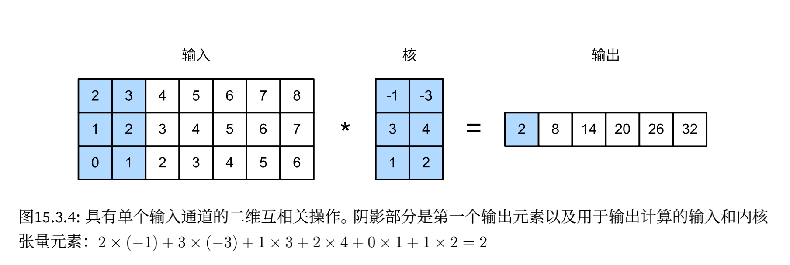

## 自然语言处理：应用

- 预训练文本可以通过不同模型架构，放入不同的下游自然语言处理应用

    

### 情感分析及数据集

- 读取数据集

    ```python
    #@save
    d2l.DATA_HUB['aclImdb'] = (
        'http://ai.stanford.edu/~amaas/data/sentiment/aclImdb_v1.tar.gz',
        '01ada507287d82875905620988597833ad4e0903')
    
    data_dir = d2l.download_extract('aclImdb', 'aclImdb')
    ```

    每个样本都是一个评论及其标签：1 表示积极，0 表示消极

    ```python
    def read_imdb(data_dir, is_train):
        '''读取 IMDb 评论数据集文本序列和标签'''
        data, labels = [], []
        for label in ('pos', 'neg'):
            folder_name = os.path.join(data_dir, 'train' if is_train else 'test',
                                       label)
            for file in os.listdir(folder_name):
                with open(os.path.join(folder_name, file), 'rb') as f:
                    review = f.read().decode('utf-8').replace('\n', '')
                    data.append(review)
                    labels.append(1 if label == 'pos' else 0)
        return data, labels
    
    train_data = read_imdb(data_dir, is_train=True)
    print('训练集数目：', len(train_data[0]))
    for x, y in zip(train_data[0][: 3], train_data[1][: 3]):
        print('标签：', y, 'review：', x[0: 60])
        
    >>>
    训练集数目： 25000
    标签： 1 review： For a movie that gets no respect there sure are a lot of mem
    标签： 1 review： Bizarre horror movie filled with famous faces but stolen by 
    标签： 1 review： A solid, if unremarkable film. Matthau, as Einstein, was won
    ```

- 预处理数据集

    将每个单词作为一个词元，过滤掉出现不到 5 次的单词，创建一个词表

    ```python
    train_tokens = d2l.tokenize(train_data[0], token='word')
    vocab = d2l.Vocab(train_tokens, min_freq=5, reserved_tokens=['<pad>'])
    ```

    绘制评论词元长度的直方图

    ```python
    d2l.set_figsize()
    d2l.plt.xlabel('# tokens per review')
    d2l.plt.ylabel('count')
    d2l.plt.hist([len(line) for line in train_tokens], bins=range(0, 1000, 50));
    ```

    

    通过截断和填充创建数据集

    ```python
    num_steps = 500 # 序列长度
    train_features = torch.tensor([d2l.truncate_pad(
        vocab[line], num_steps, vocab['<pad>']) for line in train_tokens])
    print(train_features.shape)
    
    >>> torch.Size([25000, 500])
    ```

- 创建数据迭代器

    ```python
    train_iter = d2l.load_array((train_features, torch.tensor(train_data[1])), 64)
    
    for X, y in train_iter:
        print('X: ', X.shape, ', y: ', y.shape)
        break
    print('小批量数目：', len(train_iter))
    
    >>>
    X:  torch.Size([64, 500]) , y:  torch.Size([64])
    小批量数目： 391
    ```

- 整合代码

    ```python
    def load_data_imdb(batch_size, num_steps=500):
        '''返回数据迭代器和 IMDb 评论数据集的词表'''
        data_dir = d2l.download_extract('aclImdb', 'aclImdb')
        train_data = read_imdb(data_dir, True)
        test_data = read_imdb(data_dir, False)
        train_tokens = d2l.tokenize(train_data[0], token='word')
        test_tokens = d2l.tokenize(test_data[0], token='word')
        vocab = d2l.Vocab(train_tokens, min_freq=5, reserved_tokens=['<pad>'])
        train_features = torch.tensor([d2l.truncate_pad(
            vocab[line], num_steps, vocab['<pad>']) for line in train_tokens])
        test_features = torch.tensor([d2l.truncate_pad(
            vocab[line], num_steps, vocab['<pad>']) for line in test_tokens])
        train_iter = d2l.load_array((train_features, torch.tensor(train_data[1])),
                                   batch_size)
        test_iter = d2l.load_array((test_features, torch.tensor(test_data[1])).
                                   batch_size)
        return train_iter, test_iter, vocab
    ```

### 情感分析：使用递归神经网络

- 使用在大规模语料库上预训练的文本表示可以减少模型的过拟合，我们使用预训练的 GloVe 模型来表示每个词元，并将这些词元表示送入多层双向循环神经网络以获得文本序列表示。

    

- 读入数据

    ```python
    batch_size = 64
    train_iter, test_iter, vocab = d2l.load_data_imdb(batch_size)
    ```

- 使用循环神经网络表示单个文本

    虽然文本序列的每个词元经由 Embedding 层获得其预训练的 GloVe 表示，但是整个序列由 BiLSTM 编码，即 BiLSTM 在（最后一层）初始和最终时间步的隐状态将被连结起来作为文本序列的表示。

    ```python
    class BiRNN(nn.Module):
        def __init__(self, vocab_size, embed_size, num_hiddens,
                     num_layers, **kwargs):
            super(BiRNN, self).__init__(**kwargs)
            self.embedding = nn.Embedding(vocab_size, embed_size)
            self.encoder = nn.LSTM(embed_size, num_hiddens, num_layers=num_layers,
                                   bidirectional=True)
            # 双向 * 2，初始和最后时间步的隐状态连结 * 2
            self.decoder = nn.Linear(4 * num_hiddens, 2)
        
        def forward(self, inputs):
            # inputs: (batch_size, num_steps)
            # embedding = (num_steps, batch_size, embed_size)
            embeddings = self.embedding(inputs.T)
            # 为了提高内存的利用率和效率，调用 flatten_parameters 
            # 让 parameter 的数据存放成 contiguous chunk(连续的块)。
            # 多 GPU 必须加上这句
            self.encoder.flatten_parameters()
            # 返回上一个隐藏层在不同时间步的隐状态
            # outputs: (num_steps, batch_size, num_hiddens * 2)
            outputs, _ = self.encoder(embeddings)
            # 连结初始和最终时间步的隐状态
            # 形状为: (batch_size, num_hiddens * 4)
            encoding = torch.cat((outputs[0], outputs[-1]), dim=1)
            outs = self.decoder(encoding)
            return outs
    ```

    构造具有两个隐藏层的 BiLSTM 网络：

    ```python
    embed_size, num_hiddens, num_layers = 100, 100, 2
    devices = d2l.try_all_gpus()
    net = BiRNN(len(vocab), embed_size, num_hiddens, num_layers)
    
    def init_weights(m):
        if type(m) == nn.Linear:
            nn.init.xavier_uniform_(m.weight)
        if type(m) == nn.LSTM:
            for param in m._flat_weights_names:
                if "weight" in param:
                    nn.init.xavier_uniform_(m._parameters[param])
    net.apply(init_weights)
    ```

- 加载预训练的词向量

    ```python
    glove_embedding = d2l.TokenEmbedding('glove.6b.100d') # 100 维，需要与 embed_size 一致
    embeds = glove_embedding[vocab.idx_to_token]
    embeds.shape
    
    >>> torch.Size([49346, 100])
    
    net.embedding.weight.data.copy_(embeds)
    net.embedding.weight.requires_grad = False
    ```

- 训练和评估模型

    ```python
    lr, num_epochs = 0.01, 5
    trainer = torch.optim.Adam(net.parameters(), lr=lr)
    loss = nn.CrossEntropyLoss(reduction='none')
    d2l.train_ch13(net, train_iter, test_iter, loss, trainer, num_epochs,
                   devices)
    ```

    

    定义函数来使用训练好的模型预测文本序列的情感
    
    ```python
    def predict_sentiment(net, vocab, sequence):
        '''预测文本序列的情感'''
        sequence = torch.tensor(vocab[sequence.split()], device=d2l.try_gpu())
        label = torch.argmax(net(sequence.reshape(1, -1)), dim=1)
        return 'positive' if label == 1 else 'negative'
    ```

    实验
    
    ```python
    predict_sentiment(net, vocab, 'this movie is so great')
    >>> 'positive'
    
    predict_sentiment(net, vocab, 'this movie is so bad')
    >>> 'negative'
    ```
    

### 情感分析：使用卷积神经网络

- 卷积适合用于局部特征，如相邻像素。对于文本序列，只需将其想象成一维图像即可，通过这种方式，一维卷积神经网络可以处理文本中的局部特征，例如 $n$ 元语法。

    

- 一维卷积的计算

    

    ```python
    def corr1d(X, K):
        w = K.shape[0]
        Y = torch.zeros((X.shape[0] - w + 1))
        for i in range(Y.shape[0]):
            Y[i] = (X[i: i + w] * K).sum()
        return Y
    ```

    测试：

    ```python
    X, K = torch.tensor([0, 1, 2, 3, 4, 5, 6]), torch.tensor([1, 2])
    corr1d(X, K)
    
    >>> tensor([ 2.,  5.,  8., 11., 14., 17.])
    ```

    多输入通道计算：卷积核需要具有相同数量的输入通道，对于每个通道，对输入的一维张量和卷积核的一维张量执行互相关运算，将所有通道上的结果相加以产生一维输出张量。

    

    ```python
    def corr1d_multi_in(X, K):
        # 首先，遍历 X 和 K 的第 0 维，然后，把它们的结果相加
        return sum(corr1d(x, k) for x, k in zip(X, K))
    ```

    测试：

    ```python
    X = torch.tensor([[0, 1, 2, 3, 4, 5, 6],
                     [1, 2, 3, 4, 5, 6, 7],
                     [2, 3, 4, 5, 6, 7, 8]])
    K = torch.tensor([[1, 2], [3, 4], [-1, -3]])
    corr1d_multi_in(X, K)
    
    >>> tensor([ 2.,  8., 14., 20., 26., 32.])
    ```

    > 多输入通道的一维互相关等同于单输入通道的二维互相关，其中卷积核的高度必须与输入张量的高度相同。
    >
    > 


- 最大时间汇聚层：我们使用汇聚层从序列表示中提取最大值，作为跨时间步的最重要特征。textCNN 中使用的*最大时间汇聚层*的工作原理类似于一维全局汇聚，对于每个通道在不同时间步存储的值，每个通道的输出是该通道的最大值。最大时间汇聚允许在不同通道上使用不同数量的时间步。

- textCNN 模型

    使用一维卷积和最大时间汇聚，textCNN 模型将单个预训练的词元作为输入，然后获得并转换用于下游应用的序列表示。

    对于具有 $d$ 维向量表示的 $n$ 个词元的单文本序列，输入张量的宽度、高度和通道数分别为 $n、1、d$，textCNN 模型将输入转换为输出：

    1. 定义多个一维卷积核，并分别对输入执行卷积运算。具有不同宽度的卷积核可以捕获不同数目的相邻词元之间的局部特征。
    2. 在所有输出通道上执行最大时间汇聚层，然后将所有标量汇聚输出连结为向量。
    3. 使用全连接层将连结后的向量转换为输出类别。使用 Dropout 来减少过拟合。

    

- 定义模型：使用两个嵌入层，一个可训练，另一个固定

    ```python
    class TextCNN(nn.Module):
        def __init__(self, vocab_size, embed_size, kernel_sizes, num_channels, 
                    **kwargs):
            super(TextCNN, self).__init__(**kwargs)
            self.embedding = nn.Embedding(vocab_size, embed_size)
            self.constant_embedding = nn.Embedding(vocab_size, embed_size)
            self.dropout = nn.Dropout(0.5)
            self.decoder = nn.Linear(sum(num_channels), 2)
            # 最大时间汇聚层没有参数，因此可以共享实例
            self.pool = nn.AdaptiveAvgPool1d(1)
            self.relu = nn.ReLU()
            # 创建多个一维卷积层
            self.convs = nn.ModuleList()
            for c, k in zip(num_channels, kernel_sizes):
                # 输入通道在这里是词向量的维度（这里有两个嵌入层）
                self.convs.append(nn.Conv1d(2 * embed_size, c, k))
            
        def forward(self, inputs):
            # 沿着词向量维度将两个嵌入层连结起来
            # 每个嵌入层的输出形状：(batch_size, num_steps, embed_size)
            embeddings = torch.cat((
                self.embedding(inputs), self.constant_embedding(inputs)), dim=2)
            # (batch_size, embed_size * 2, num_steps) 输入通道作为第二维
            embeddings = embeddings.permute(0, 2, 1)
            # 每个一维卷积层在最大时间汇聚层合并后，获得的形状为：(batch_size, out_channels, 1)
            # 删除最后一个维度并沿通道维度连结
            encoding = torch.cat([
                torch.squeeze(self.relu(self.pool(conv(embeddings))), dim=-1)
                for conv in self.convs
            ], dim=1)
            # encoding: (batch_size, sum(num_channels))
            outputs = self.decoder(self.dropout(encoding))
            return outputs
    ```

- 创建实例：它有 3 个卷积层，卷积核宽度分别为 3、4、5，均有 100 个输出通道

    ```python
    embed_size, kernel_sizes, nums_channels = 100, [3, 4, 5], [100, 100, 100]
    devices = d2l.try_all_gpus()
    net = TextCNN(len(vocab), embed_size, kernel_sizes, nums_channels)
    
    def init_weights(m):
        if type(m) in (nn.Linear, nn.Conv1d):
            nn.init.xavier_uniform_(m.weight)
            
    net.apply(init_weights)
    
    >>>
    TextCNN(
      (embedding): Embedding(49346, 100)
      (constant_embedding): Embedding(49346, 100)
      (dropout): Dropout(p=0.5, inplace=False)
      (decoder): Linear(in_features=300, out_features=2, bias=True)
      (pool): AdaptiveAvgPool1d(output_size=1)
      (relu): ReLU()
      (convs): ModuleList(
        (0): Conv1d(200, 100, kernel_size=(3,), stride=(1,))
        (1): Conv1d(200, 100, kernel_size=(4,), stride=(1,))
        (2): Conv1d(200, 100, kernel_size=(5,), stride=(1,))
      )
    )
    ```

- 加载预训练词向量

    ```python
    glove_embedding = d2l.TokenEmbedding('glove.6b.100d')
    embeds = glove_embedding[vocab.idx_to_token]
    net.embedding.weight.data.copy_(embeds)
    net.constant_embedding.weight.data.copy_(embeds)
    net.constant_embedding.weight.requires_grad = False
    ```

- 训练

    ```python
    lr, num_epochs = 0.001, 5
    trainer = torch.optim.Adam(net.parameters(), lr=lr)
    loss = nn.CrossEntropyLoss(reduction='none')
    d2l.train_ch13(net, train_iter, test_iter, loss, trainer, num_epochs, devices)
    ```

    

- 实验

    ```python
    predict_sentiment(net, vocab, 'this movie is so great')
    
    >>> 'positive'
    
    predict_sentiment(net, vocab, 'this movie is so bad')
    
    >>> 'negative'
    ```

- 小结
    1. 一维卷积神经网络可以处理文本中的局部特征，如 $n$ 元语法
    2. 多输入通道的一维互相关等价于单输入通道的二维互相关
    3. 最大时间汇聚层允许在不同通道上使用不同数量的时间步长
    4. textCNN 模型使用一维卷积层和最大时间汇聚层将单个词元表示转换为下游应用输出

### 自然语言推断与数据集

- *自然语言推断*（natural language inference）主要研究 *假设*（hypothesis）是否可以从*前提*（premise）中推断出来， 其中两者都是文本序列。即自然语言推断决定了一对文本序列之间的逻辑关系，这种关系通常分为三种类型：

    1. *蕴含（entailment）*：假设可以从前提中推断出来
    2. *矛盾（contradiction）*：假设的否定可以从前提中推断出来
    3. *中性（neutral）*：其他情况

    自然语言推断也被称为识别文本蕴含任务。

- 读取数据集：返回前提、假设及其标签的列表

    ```python
    def read_snli(data_dir, is_train):
        '''将 SNLI 数据集解析为前提、假设和标签'''
        def extract_text(s):
            s = re.sub('\\(', '', s)
            s = re.sub('\\)', '', s)
            # 用一个空格替换两个或多个连续的空格
            s = re.sub('\\s{2,}', ' ', s)
            return s.strip()
        
        label_set = {'entailment': 0, 'contradiction': 1, 'neutral': 2}
        file_name = os.path.join(data_dir, 'snli_1.0_train.txt'
                                 if is_train else 'snli_1.0_test.txt')
        with open(file_name, 'r') as f:
            rows = [row.split('\t') for row in f.readlines()[1:]]
        premises = [extract_text(row[1]) for row in rows if row[0] in label_set]
        hypotheses = [extract_text(row[2]) for row in rows if row[0] in label_set]
        labels = [label_set[row[0]] for row in rows if row[0] in label_set]
        return premises, hypotheses, labels
    ```
    
    查看不同性质标签的个数：
    
    ```python
    test_data = read_snli(data_dir, is_train=False)
    for data in [train_data, test_data]:
        print([[row for row in data[2]].count(i) for i in range(3)])
        
    >>>
    [183416, 183187, 182764]
    [3368, 3237, 3219]
    ```

- 定义用于加载数据集的类：与之前的任务类似，统一所有文本序列的长度，太长的截断，太短的填充

    ```python
    class SNLIDataset(torch.utils.data.Dataset):
        '''用于加载 SNLI 数据集的自定义数据集'''
        def __init__(self, dataset, num_steps, vocab=None):
            self.num_steps = num_steps
            all_premise_tokens = d2l.tokenize(dataset[0])
            all_hypothesis_tokens = d2l.tokenize(dataset[1])
            if vocab is None:
                self.vocab = d2l.Vocab(all_premise_tokens + \
                    all_hypothesis_tokens, min_freq=5, reserved_tokens=['<pad>'])
            else:
                self.vocab = vocab
            self.premises = self._pad(all_premise_tokens)
            self.hypotheses = self._pad(all_hypothesis_tokens)
            self.labels = torch.tensor(dataset[2])
            print('read ' + str(len(self.premises)) + ' examples')
            
        def _pad(self, lines):
            return torch.tensor([d2l.truncate_pad(
                self.vocab[line], self.num_steps, self.vocab['<pad>'])
                                for line in lines])
        
        def __getitem__(self, idx):
            return (self.premises[idx], self.hypotheses[idx]), self.labels[idx]
        
        def __len__(self):
            return len(self.premises)
    ```

- 整合代码：注意我们必须使用从训练集构造的词表作为测试集的词表，即在训练集中训练的模型将不知道来自测试集的任何新词元

    ```python
    def load_data_snli(batch_size, num_steps=50):
        '''下载 SNLI 数据集并返回数据迭代器和词表'''
        num_workers = d2l.get_dataloader_workers()
        data_dir = d2l.download_extract('SNLI')
        train_data = read_snli(data_dir, True)
        test_data = read_snli(data_dir, False)
        train_set = SNLIDataset(train_data, num_steps)
        # 必须使用从训练集构造的词表作为测试集的词表
        test_set = SNLIDataset(test_data, num_steps, train_set.vocab)
        train_iter = torch.utils.data.DataLoader(train_set, batch_size,
                                                 shuffle=True,
                                                 num_workers=num_workers)
        test_iter = torch.utils.data.DataLoader(test_set, batch_size,
                                                shuffle=True,
                                                num_workers=num_workers)
        return train_iter, test_iter, train_set.vocab
    ```

- 测试

    ```python
    train_iter, test_iter, vocab = load_data_snli(128, 50)
    for X, Y in train_iter:
        print(X[0].shape)
        print(X[1].shape)
        print(Y.shape)
        break
        
    >>>
    torch.Size([128, 50])
    torch.Size([128, 50])
    torch.Size([128])
    ```

### 自然语言推断：使用注意力

- 架构

    

- 与保留前提和假设中词元的顺序相比，我们可以将一个文本序列中的词元与另一个文本序列中的每个词元进行对齐，然后比较和聚合这些信息，以预测前提和假设之间的逻辑关系。与机器翻译中源句和目标句之间的词元对齐类似，前提和假设之间的词元对齐可以通过注意力机制灵活地完成。

    

    基于注意力机制的自然语言推断由三步组成：对齐、比较和汇总。

- 对齐

    上图显示的是使用硬对齐，而实际实现使用的是基于加权平均的软对齐，其中理想情况下较大的权重与要对齐的词元相关联。

    用 $\mathbf A=(\mathbf a_1, \dots, \mathbf a_m)$ 和 $\mathbf B=(\mathbf b_1,\dots, \mathbf b_n)$ 表示前提和假设，其词元数量分别为 $m$ 和 $n$，其中 $\mathbf a_i, \mathbf b_j \in \mathbb R^d(i=1, \dots, m, j=1,\dots, n)$ 是 $d$ 维的词向量。对于软对齐，注意力权重 $e_{ij}\in \mathbb R$ 计算为：
    $$
    e_{ij}=f(\mathbf a_i)^\top f(\mathbf b_j)
    $$
     其中函数 $f$ 是多层感知机：

    ```python
    def mlp(num_inputs, num_hiddens, flatten):
        net = []
        net.append(nn.Dropout(0.2))
        net.append(nn.Linear(num_inputs, num_hiddens))
        net.append(nn.ReLU())
        if flatten:
            net.append(nn.Flatten(start_dim=1))
        net.append(nn.Dropout(0.2))
        net.append(nn.Linear(num_hiddens, num_hiddens))
        net.append(nn.ReLU())
        if flatten:
            net.append(nn.Flatten(start_dim=1))
        return nn.Sequential(*net)
    ```

    在计算注意力权重时，$f$ 分别输入 $\mathbf a_i$ 和 $\mathbf b_j$，而不是将它们一对放在一起作为输入，这种*分解*技巧导致 $f$ 只有 $m+n$ 次计算（线性复杂度），而不是 $mn$ 次计算（二次复杂度）

    对注意力权重进行规范化：

    - 将假设与索引为 $i$ 的前提词元进行软对齐：
        $$
        \boldsymbol{\beta}_i = \sum_{j=1}^{n}\frac{\exp(e_{ij})}{ \sum_{k=1}^{n} \exp(e_{ik})} \mathbf{b}_j
        $$
        用 Attention 的概念来理解，key 和 value 都是 $\mathbf b_j$，query 是 $\mathbf a_i$，$\mathbf a_i$ 查询得到的关于 $\mathbf b_j$ 注意力权重就是 $\frac{\exp(g(\mathbf a_i, \mathbf b_j)=e_{ij})}{\sum_{k=1}^n \exp(g(\mathbf a_i, \mathbf b_k)=e_{ik})}$

    - 将前提与索引为 $j$ 的假设词元进行软对齐：
        $$
        \boldsymbol{\alpha}_j = \sum_{i=1}^{m}\frac{\exp(e_{ij})}{ \sum_{k=1}^{m} \exp(e_{kj})} \mathbf{a}_i
        $$

    ```python
    class Attend(nn.Module):
        def __init__(self, num_inputs, num_hiddens, **kwargs):
            super(Attend, self).__init__(**kwargs)
            self.f = mlp(num_inputs, num_hiddens, flatten=False)
            
        def forward(self, A, B):
            # A / B: (batch_size, 序列 A/B 的词元数, embed_size)
            # f_A / f_B: (batch_size, 序列 A/B 的词元数, num_hiddens)
            f_A = self.f(A)
            f_B = self.f(B)
            # e: (batch_size, num_steps_A, num_steps_B)
            e = torch.bmm(f_A, f_B.permute(0, 2, 1))
            # 意味着序列 B 被软对齐到序列 A 的每个词元
            # F.softmax() => (batch_size, num_steps_A, num_steps_B)
            # B: (batch_size, num_steps_B, embed_size)
            # beta: (batch_size, num_steps_A, embed_size)
            beta = torch.bmm(F.softmax(e, dim=-1), B)
            # 同理，序列 A 被软对齐到序列 B 的每个词元
            alpha = torch.bmm(F.softmax(e.permute(0, 2, 1), dim=-1), A)
            return beta, alpha
    ```

- 比较

    我们将一个序列中的词元和与该词元软对齐的另一个序列进行比较。将来自一个序列的词元，和来自另一个序列的软对齐后的词元送入函数 $g$（一个多层感知机）：
    $$
    \begin{split}\mathbf{v}_{A,i} = g([\mathbf{a}_i, \boldsymbol{\beta}_i]), i = 1, \ldots, m\\ \mathbf{v}_{B,j} = g([\mathbf{b}_j, \boldsymbol{\alpha}_j]), j = 1, \ldots, n\end{split}
    $$

    ```python
    class Compare(nn.Module):
        def __init__(self, num_inputs, num_hiddens, **kwargs):
            super(Compare, self).__init__(**kwargs)
            self.g = mlp(num_inputs, num_hiddens, flatten=False)
            
        def forward(self, A, B, beta, alpha):
            # torch.cat() => (batch_size, num_steps_A/B, embed_size * 2)
            # 因此 num_inputs = embed_size * 2
            # V_A/B: (batch_size, num_steps_A/B, num_hiddens)
            V_A = self.g(torch.cat([A, beta], dim=2))
            V_B = self.g(torch.cat([B, alpha], dim=2))
            return V_A, V_B
    ```

- 聚合

    首先求和这两组的比较向量：
    $$
    \mathbf{v}_A = \sum_{i=1}^{m} \mathbf{v}_{A,i}\\
    \mathbf{v}_B = \sum_{j=1}^{n}\mathbf{v}_{B,j}
    $$
    然后将这两个求和的结果提供给函数 $h$（一个多层感知机），以获得逻辑关系的分类结果：
    $$
    \hat{\mathbf{y}} = h([\mathbf{v}_A, \mathbf{v}_B])
    $$

    ```python
    class Aggregate(nn.Module):
        def __init__(self, num_inputs, num_hiddens, num_outputs, **kwargs):
            super(Aggregate, self).__init__(**kwargs)
            self.h = mlp(num_inputs, num_hiddens, flatten=True)
            self.linear = nn.Linear(num_hiddens, num_outputs)
            
        def forward(self, V_A, V_B):
            # V_A/B: (batch_size, num_hiddens)
            V_A = V_A.sum(dim=1)
            V_B = V_B.sum(dim=1)
            # torch.cat() => (batch_size, num_hiddens * 2)
            # 因此 num_inputs = num_hiddens * 2
            Y_hat = self.linear(self.h(torch.cat([V_A, V_B], dim=1)))
            return Y_hat
    ```

- 整合代码

    ```python
    class DecomposableAttention(nn.Module):
        def __init__(self, vocab, embed_size, num_hiddens, num_inputs_attend=100,
                     num_inputs_compare=200, num_inputs_agg=400, **kwargs):
            super(DecomposableAttention, self).__init__(**kwargs)
            # num_inputs_attend = embed_size
            # num_inputs_compare = embed_size * 2
            # num_inputs_agg = num_hiddens * 2
            
            self.embedding = nn.Embedding(len(vocab), embed_size)
            # => (batch_size, num_steps_A/B, embed_size)
            
            self.attend = Attend(num_inputs_attend, num_hiddens)
            # => (batch_size, num_steps_A/B, embed_size)
            
            self.compare = Compare(num_inputs_compare, num_hiddens)
            # => (batch_size, num_steps_A/B, num_hiddens)
            
            self.aggregate = Aggregate(num_inputs_agg, num_hiddens, num_outputs=3)
            # => (batch_size, num_outputs)
            
        def forward(self, X):
            premises, hypotheses = X
            A = self.embedding(premises)
            B = self.embedding(hypotheses)
            beta, alpha = self.attend(A, B)
            V_A, V_B = self.compare(A, B, beta, alpha)
            Y_hat = self.aggregate(V_A, V_B)
            return Y_hat
    ```

- 训练和评估模型

    ```python
    batch_size, num_steps = 256, 50
    train_iter, test_iter, vocab = load_data_snli(batch_size, num_steps)
    
    embed_size, num_hiddens, devices = 100, 200, d2l.try_all_gpus()
    net = DecomposableAttention(vocab, embed_size, num_hiddens)
    glove_embedding = d2l.TokenEmbedding('glove.6b.100d')
    embeds = glove_embedding[vocab.idx_to_token]
    net.embedding.weight.data.copy_(embeds)
    
    lr, num_epochs = 0.001, 4
    trainer = torch.optim.Adam(net.parameters(), lr=lr)
    loss = nn.CrossEntropyLoss(reduction='none')
    d2l.train_ch13(net, train_iter, test_iter, loss, trainer, num_epochs,
                   devices)
    ```

- 

- 定义预测函数，输出一对前提和假设之间的逻辑关系：

- ```python
    def predict_snli(net, vocab, premise, hypothesis):
        '''预测前提和假设之间的逻辑关系'''
        net.eval()
        premise = torch.tensor(vocab[premise], device=d2l.try_gpu())
        hypothesis = torch.tensor(vocab[hypothesis], device=d2l.try_gpu())
        label = torch.argmax(net([premise.reshape((1, -1)),
                                  hypothesis.reshape((1, -1))]), dim=1)
        return 'entailment' if label == 0 else 'contradiction' if label == 1 \
                else 'neutral'
    ```

    实验：

    ```python
    predict_snli(net, vocab, ['he', 'is', 'good', '.'], ['he', 'is', 'bad', '.'])
    
    >>> 'contradiction'
    ```


### 针对序列级和词元级应用程序微调 BERT

- 在微调期间，不同应用之间的 BERT 所需的“最小架构更改”是额外的全连接层。在下游应用的监督学习期间，额外层的参数是从零开始学习的，而预训练 BERT 模型中的所有参数都是微调的。

- 单文本分类：`<cls>` 的 BERT 表示对整个文本序列的信息进行编码，它将被送入到由全连接层组成的小多层感知机中，以输出所有离散标签值的分布。

    

- 文本对分类或回归：与单文本分类很类似，但对于不同任务，在稠密层可以应用细微的更改，例如对于文本对回归任务，输出连续的标签值和使用均方损失。

    

- 文本标注：每个词元都被分配了一个标签，与上述两种任务的区别在于，输入文本的*每个词元*的 BERT 表示被送到**相同**的额外全连接层中，以输出词元的标签。

    

- 问答：考虑每个问题的答案都是段落中的一段文本，则任务的目标就是在给定问题和段落的情况下预测段落中文本片段的开始和结束。

    在 BERT 的输入中，将问题和段落分别作为第一个和第二个文本序列，并且分别预测文本片段的开始位置和结束位置（通过 softmax 对段落中的每个词元输出概率）。

    

- 预测时只需要寻找开始位置为 $i$，结束位置为 $j$ 时的最高分数即可（$s_i+e_j(i\le j)$）

- 小结：
    1. 对于序列级和词元级的自然语言处理应用，BERT 只需要最小的架构改变（额外的全连接层）。
    2. 在下游应用的监督学习期间，额外层的参数是从零开始学习的，而预训练 BERT 模型中的所有参数都是微调的。

### 自然语言推断：微调 BERT

- 自然语言推断是一个序列级别的文本对分类问题，而微调 BERT 只需要一个额外的基于多层感知机的架构。

    

- 加载预训练的 BERT

    ```python
    import json
    import multiprocessing
    
    def load_pretrained_model(pretrained_model, num_hiddens, ffn_num_hiddens,
                              num_heads, num_layers, dropout, max_len, devices):
        data_dir = d2l.download_extract(pretrained_model)
        # 定义空词表以及加载预定义词表
        vocab = d2l.Vocab()
        vocab.idx_to_token = json.load(open(os.path.join(data_dir,
                                                        'vocab.json')))
        vocab.token_to_idx = {token: idx for idx, token in enumerate(
                                                    vocab.idx_to_token)}
        bert = d2l.BERTModel(len(vocab), num_hiddens, norm_shape=[256],
                             ffn_num_input=256, ffn_num_hiddens=ffn_num_hiddens,
                             num_heads=num_heads, num_layers=num_layers, 
                             dropout=dropout, max_len=max_len, key_size=256, 
                             query_size=256, value_size=256, hid_in_features=256,
                             mlm_in_features=256, nsp_in_features=256)
        # 加载预训练 BERT 参数
        bert.load_state_dict(torch.load(os.path.join(data_dir,
                                                     'pretrained.params')))
        return bert, vocab
      
    devices = d2l.try_all_gpus()
    bert, vocab = load_pretrained_model(
        'bert.small', num_hiddens=256, ffn_num_hiddens=512, num_heads=4,
        num_layers=2, dropout=0.1, max_len=512, devices=devices)
    ```

- 微调 BERT 的数据集：将前提和假设形成一对文本序列，并统一文本序列的长度

    ```python
    class SNLIBERTDataset(torch.utils.data.Dataset):
        def __init__(self, dataset, max_len, vocab=None):
            all_premise_hypothesis_tokens = [[
                p_tokens, h_tokens] for p_tokens, h_tokens in zip(
                *[d2l.tokenize([s.lower() for s in sentences])
                 for sentences in dataset[: 2]])]
            # all_premise_hypothesis_tokens:
            # [[p_tokens1, h_tokens1], ..., [p_tokensN, h_tokensN]]
            self.labels = torch.tensor(dataset[2])
            self.vocab = vocab
            self.max_len = max_len
            (self.all_token_ids, self.all_segments,
             self.valid_lens) = self._preprocess(all_premise_hypothesis_tokens)
            print('read ' + str(len(self.all_token_ids)) + ' examples')
            
        def _preprocess(self, all_premise_hypothesis_tokens):
            # pool = multiprocessing.Pool(4)
            # pool.map() 的第二个参数是一个可迭代对象，它会一个一个传入函数
            # out = pool.map(self._mp_worker, all_premise_hypothesis_tokens)
            # out: [[token_ids1, segments1, valid_len1], ..., 
            #      [tokens_idsN, segmentsN, valid_lenN]]
            out = []
            for premise_hypothesis_tokens in all_premise_hypothesis_tokens:
                out.append(self._mp_worker(premise_hypothesis_tokens))
            all_token_ids = [
                token_ids for token_ids, segments, valid_len in out]
            all_segments = [segments for token_ids, segments, valid_len in out]
            valid_lens = [valid_len for token_ids, segments, valid_len in out]
            return (torch.tensor(all_token_ids, dtype=torch.long),
                    torch.tensor(all_segments, dtype=torch.long),
                    torch.tensor(valid_lens))
        
        def _mp_worker(self, premise_hypothesis_tokens):
            p_tokens, h_tokens = premise_hypothesis_tokens
            self._truncate_pair_of_tokens(p_tokens, h_tokens)
            tokens, segments = d2l.get_tokens_and_segments(p_tokens, h_tokens)
            token_ids = self.vocab[tokens] + [self.vocab['<pad>']] \
                                        * (self.max_len - len(tokens))
            segments = segments + [0] * (self.max_len - len(segments))
            valid_len = len(tokens)
            return token_ids, segments, valid_len
        
        def _truncate_pair_of_tokens(self, p_tokens, h_tokens):
            # 为 BERT 输入中的 '<cls>', '<sep>' 和 '<sep>' 词元保留位置
            while len(p_tokens) + len(h_tokens) > self.max_len - 3:
                if len(p_tokens) > len(h_tokens):
                    p_tokens.pop()
                else:
                    h_tokens.pop()
        
        def __getitem__(self, idx):
            return (self.all_token_ids[idx], self.all_segments[idx],
                    self.valid_lens[idx]), self.labels[idx]
        
        def __len__(self):
            return len(self.all_token_ids)
    ```

    小批量读取

    ```python
    batch_size, max_len, num_workers = 512, 128, d2l.get_dataloader_workers()
    data_dir = d2l.download_extract('SNLI')
    train_set = SNLIBERTDataset(read_snli(data_dir, True), max_len, vocab)
    test_set = SNLIBERTDataset(read_snli(data_dir, False), max_len, vocab)
    train_iter = torch.utils.data.DataLoader(train_set, batch_size, shuffle=True,
                                             num_workers=num_workers)
    test_iter = torch.utils.data.DataLoader(test_set, batch_size,
                                            num_workers=num_workers)
    ```

- 微调 BERT：通过一个额外的多层感知机对 `<cls>` 词元进行转换，输出推断

    ```python
    class BERTClassifier(nn.Module):
        def __init__(self, bert):
            super(BERTClassifier, self).__init__()
            self.encoder = bert.encoder
            self.hidden = bert.hidden
            self.output = nn.Linear(256, 3)
            
        def forward(self, inputs):
            tokens_X, segments_X, valid_lens_x = inputs
            encoded_X = self.encoder(tokens_X, segments_X, valid_lens_x)
            return self.output(self.hidden(encoded_X[:, 0, :]))
    ```

    在 BERT 微调的常见实现中，只有额外的多层感知机（`net.output`）的输出层的参数将从零开始学习。预训练 BERT 编码器（`net.encoder`）和额外的多层感知机的隐藏层（`net.hidden`）的所有参数都是进行微调。

    ```python
    net = BERTClassifier(bert)
    ```

    而其他的一些参数，例如预训练过程中的遮蔽语言模型和下一句预测任务中的参数不会被更新。

- 训练：

    ```python
    lr, num_epochs = 1e-4, 5
    trainer = torch.optim.Adam(net.parameters(), lr=lr)
    loss = nn.CrossEntropyLoss(reduction='none')
    d2l.train_ch13(net, train_iter, test_iter, loss, trainer, num_epochs,
                   devices)
    ```

    