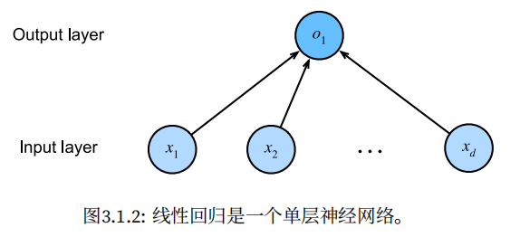
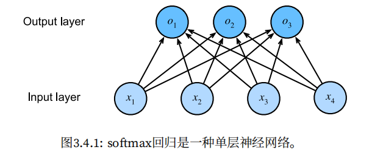

## 线性神经网络

### 线性回归

- 回归是指一类为一个或多个自变量与因变量之间关系建模的方法，在自然科学和社会科学领域，回归经常用来表示输入和输出之间的关系。

- 仿射变换：通过加权和对特征进行线性变换，并通过偏置项来进行平移

- 模型：

    
    $$
    单个数据：\hat {\mathbf{y}}=\mathbf{w}^\top \mathbf{x}+b \\
    多个数据：\hat {\mathbf{y}}=\mathbf{X}\mathbf{w}+b
    $$

- 损失函数：平方误差
    $$
    l^{(i)}(\mathbf{w}, b)=\frac{1}{2}(\hat y^{(i)}-y^{(i)})^2
    $$
    损失均值：
    $$
    L(\mathbf{w}, b)=\frac{1}{n}\sum_{i=1}^nl^{(i)}(\mathbf{w}, b)=\frac{1}{n}\sum_{i=1}^n\frac{1}{2}(\mathbf{w}^\top \mathbf{x}^{(i)}+b-y^{(i)})^2
    $$
    解析解：
    $$
    \mathbf{w}^*=(\mathbf{X}^\top \mathbf{X})^{-1} \mathbf{X}^\top \mathbf{y}
    $$

- 小批量随机梯度下降：梯度下降最简单的用法是计算损失函数（数据集中所有样本的损失均值）关于模型参数的导数（在这里也可以称为梯度）。但实际中的执行可能会非常慢：因为在每一次更新参数之前，我们必须遍历整个数据集。因此，我们通常会在每次需要计算更新的时候随机抽取一小批样本，这种变体叫做*小批量随机梯度下降*（minibatch stochastic gradient descent）。
    $$
    (\mathbf{w},b) \leftarrow (\mathbf{w},b) - \frac{\eta}{|\mathcal{B}|} \sum_{i \in \mathcal{B}} \partial_{(\mathbf{w},b)} l^{(i)}(\mathbf{w},b).
    $$
    对于平方损失和仿射变换：
    $$
    \begin{split}\begin{aligned} \mathbf{w} &\leftarrow \mathbf{w} -   \frac{\eta}{|\mathcal{B}|} \sum_{i \in \mathcal{B}} \partial_{\mathbf{w}} l^{(i)}(\mathbf{w}, b) = \mathbf{w} - \frac{\eta}{|\mathcal{B}|} \sum_{i \in \mathcal{B}} \mathbf{x}^{(i)} \left(\mathbf{w}^\top \mathbf{x}^{(i)} + b - y^{(i)}\right),\\ b &\leftarrow b -  \frac{\eta}{|\mathcal{B}|} \sum_{i \in \mathcal{B}} \partial_b l^{(i)}(\mathbf{w}, b)  = b - \frac{\eta}{|\mathcal{B}|} \sum_{i \in \mathcal{B}} \left(\mathbf{w}^\top \mathbf{x}^{(i)} + b - y^{(i)}\right). \end{aligned}\end{split}
    $$

    > 为什么均方误差损失函数可以用于线性回归？
    >
    > 我们假设了观测钟包含噪声，其中噪声服从正态分布：
    > $$
    > y = \mathbf{w}^\top \mathbf{x} + b + \epsilon \text{ where } \epsilon \sim \mathcal{N}(0, \sigma^2).
    > $$
    > 则通过给定的 $\mathbf{x}$ 观测到特定 $y$ 的可能性（likelihood）：
    > $$
    > P(y \mid \mathbf{x})=\frac{1}{\sqrt{2 \pi \sigma^2}} \exp\left(-\frac{1}{2 \sigma^2} (y - \mathbf{w}^\top \mathbf{x} - b)^2\right).
    > $$
    > 对于整个数据集：
    > $$
    > P(\mathbf y \mid \mathbf X) = \prod_{i=1}^{n} p(y^{(i)}|\mathbf{x}^{(i)}).
    > $$
    > 就是要找到使上式最大的参数 $\mathbf{w}$ 和 $b$，采用最小化负对数似然：
    > $$
    > -\log P(\mathbf y \mid \mathbf X) = \sum_{i=1}^n \frac{1}{2} \log(2 \pi \sigma^2) + \frac{1}{2 \sigma^2} \left(y^{(i)} - \mathbf{w}^\top \mathbf{x}^{(i)} - b\right)^2.
    > $$
    > 忽略常数项，即需要找到使 $(y^{(i)} - \mathbf{w}^\top \mathbf{x}^{(i)} - b)^2$ 最小的参数，这与均方误差损失函数一致。因此，在高斯噪声的假设下，**最小化均方误差等价于对线性模型的最大似然估计**。

### 线性回归从零实现

1. 生成数据集：

    ```python
    def synthetic_data(w, b, num_examples):
        '''生成 y = Xw + b + 噪声 '''
        X = torch.normal(0, 1, (num_examples, len(w)))
        y = torch.matmul(X, w) + b
        y += torch.normal(0, 0.01, y.shape)
        return X, y.reshape((-1, 1))
    ```

2. 读取数据集：

    ```python
    def data_iter(batch_size, features, labels):
        num_examples = len(features)
        indices = list(range(num_examples))
        random.shuffle(indices)
        for i in range(0, num_examples, batch_size):
            batch_indices = torch.tensor(indices[i: min(i + batch_size, num_examples)])
            yield features[batch_indices], labels[batch_indices]
    ```

3. 初始化模型参数：

    ```python
    w = torch.normal(0, 0.01, size=(2, 1), requires_grad=True)
    b = torch.zeros(1, requires_grad=True)
    ```

4. 定义模型：

    ```python
    def linreg(X, w, b):
        return torch.matmul(X, w) + b
    ```

5. 定义损失函数：

    ```python
    def squared_loss(y_hat, y):
        return (y_hat - y.reshape(y_hat.shape)) ** 2 / 2
    ```

6. 定义优化算法：

    ```python
    def sgd(params, lr, batch_size):
        with torch.no_grad(): # 参数更新阶段不进行梯度的计算
            for param in params:
                param -= lr * param.grad / batch_size
                param.grad.zero_()
    ```

7. 训练：

    ```python
    lr = 0.03
    num_epochs = 3
    net = linreg
    loss = squared_loss
    
    for epoch in range(num_epochs):
        for X, y in data_iter(batch_size, features, labels):
            l = loss(net(X, w, b), y) # 此时 l 的形状是 batch_size * 1
            l.sum().backward()
            sgd([w, b], lr, batch_size)
        with torch.no_grad(): # 推理阶段不进行梯度的计算
            train_l = loss(net(features, w, b), labels)
            print(f'epoch {epoch+1}, loss {float(train_l.mean()):f}')
    ```

### 线性回归 Pytorch 简洁实现

1. 生成数据集：

    ```python
    import numpy as np
    import torch
    from torch.utils import data
    from d2l import torch as d2l
    
    true_w = torch.tensor([2, -3.4])
    true_b = 4.2
    features, labels = d2l.synthetic_data(true_w, true_b, 1000)
    ```

2. 读取数据集：

    ```python
    def load_array(data_arrays, batch_size, is_train=True):
        """构造一个 PyTorch 数据迭代器"""
        dataset = data.TensorDataset(*data_arrays)
        return data.DataLoader(dataset, batch_size, shuffle=is_train)
    
    batch_size = 10
    data_iter = load_array((features, labels), batch_size)
    ```

3. 定义模型、初始化模型参数：

    ```python
    from torch import nn
    net = nn.Sequential(nn.Linear(2, 1))
    net[0].weight.data.normal_(0, 0.01)
    net[0].bias.data.fill_(0)
    ```

4. 定义损失函数：

    ```python
    loss = nn.MSELoss()
    ```

5. 定义优化算法：

    ```python
    trainer = torch.optim.SGD(net.parameters(), lr=0.03)
    ```

6. 训练：

    ```python
    num_epochs = 3
    for epoch in range(num_epochs):
        for X, y in data_iter:
            l = loss(net(X), y)
            trainer.zero_grad()
            l.backward()
            trainer.step()
        l = loss(net(features), labels)
        print(f'epoch {epoch+1}, loss {l:f}')
    ```


### Softmax 回归

- 分类问题的解决策略是预测所有可能类别的条件概率

- 需要和输出一样多的仿射函数，每个输出对应于它自己的仿射函数

    
    $$
    \begin{split}\begin{aligned}
    o_1 &= x_1 w_{11} + x_2 w_{12} + x_3 w_{13} + x_4 w_{14} + b_1,\\
    o_2 &= x_1 w_{21} + x_2 w_{22} + x_3 w_{23} + x_4 w_{24} + b_2,\\
    o_3 &= x_1 w_{31} + x_2 w_{32} + x_3 w_{33} + x_4 w_{34} + b_3.
    \end{aligned}\end{split}
    $$

- 为了将未归一化的预测变换为非负并且总和为 1，同时要求模型保持可导，我们首先对每个未归一化的预测求幂，这样可以确保输出非负。为了确保最终输出的总和为 1，我们再对每个求幂后的结果除以他们的总和：
    $$
    \hat{\mathbf{y}} = \mathrm{softmax}(\mathbf{o})\quad \text{其中}\quad \hat{y}_j = \frac{\exp(o_j)}{\sum_k \exp(o_k)}
    $$

- 尽管 Softmax 是一个非线性函数，但 Softmax 回归的输出仍然由输入特征的仿射变换来决定，因此 Softmax 回归仍然是一个线性模型。

- 损失函数：

    Softmax 函数给出了一个向量 $\hat{\mathbf{y}}$，我们可以将其视为给定任意输入 $\mathbf{x}$ 的每个类的估计条件概率。例如，$\hat y_1=P(y=猫 \mid \mathbf{x})$。假设整个数据集 $\{\mathbf{X},\mathbf{Y}\}$ 具有 $n$ 个样本，其中索引 $i$ 的样本的特征由特征向量 $\mathbf{x}^{(i)}$ 和独热标签向量 $\mathbf{y}^{(i)}$ 组成。我们可以将估计值与实际值进行比较：
    $$
    P(\mathbf{Y} \mid \mathbf{X}) = \prod_{i=1}^n P(\mathbf{y}^{(i)} \mid \mathbf{x}^{(i)}).
    $$
    其中 $P(\mathbf{y}^{(i)} \mid \mathbf{x}^{(i)})$ 指实际的样本标签，在模型中被预测得出的概率；

    根据最大似然估计，我们最大化 $P(\mathbf{Y} \mid \mathbf{X})$，相当于最小化负对数似然：
    $$
    -logP(\mathbf{Y}\mid \mathbf{X})=\sum_{i=1}^n -\log P(\mathbf{y}^{(i)}\mid \mathbf{x}^{(i)})=\sum_{i=1}^nl(\mathbf{y}^{(i)},\mathbf{\hat y}^{(i)})
    $$

    其中，对于任何标签 $\mathbf{y}$ 和模型预测 $\mathbf{\hat y}$，损失函数为：
    $$
    l(\mathbf{y}, \hat{\mathbf{y}}) = - \sum_{j=1}^q y_j \log \hat{y}_j.
    $$
    上式的损失函数也被称为**交叉熵损失函数**。由于 $\mathbf{y}$ 是一个长度为 $q$ 的独热编码向量，所以除了一个项以外的所有项 $j$ 都消失了，即最后的结果就是对于实际标签模型预测得出的概率 $\hat y_{correct}$

- Softmax 及其导数
    $$
    \begin{split}\begin{aligned}
    l(\mathbf{y}, \hat{\mathbf{y}}) &= -\sum_{j=1}^q y_j \log \hat{y}_j \\&=  - \sum_{j=1}^q y_j \log \frac{\exp(o_j)}{\sum_{k=1}^q \exp(o_k)} \\
    &= \sum_{j=1}^q y_j \log \sum_{k=1}^q \exp(o_k) - \sum_{j=1}^q y_j o_j\\
    &= \log \sum_{k=1}^q \exp(o_k) - \sum_{j=1}^q y_j o_j.
    \end{aligned}\end{split}
    $$
    考虑相对于任何未归一化的预测 $o_j$ 的导数：
    $$
    \partial_{o_j} l(\mathbf{y}, \hat{\mathbf{y}}) = \frac{\exp(o_j)}{\sum_{k=1}^q \exp(o_k)} - y_j = \mathrm{softmax}(\mathbf{o})_j - y_j.
    $$
    换句话说，导数是我们模型分配的概率（由 softmax 得到）与实际发生的情况（由独热标签向量表示）之间的差异。从这个意义上讲，与我们在回归中看到的非常相似，其中梯度是观测值 $y$ 和估计值 $\hat y$ 之间的差异。

### MNIST 数据集

- 小批量读取数据集：

    ```python
    %matplotlib inline
    import torch
    import torchvision
    from torch.utils import data
    from torchvision import transforms
    from d2l import torch as d2l
    d2l.use_svg_display()
    
    def get_dataloader_workers():
        '''使用4个进程来读取数据'''
        return 4
    
    def load_data_fashion_mnist(batch_size, resize=None):
        '''下载Fashion-MNIST数据集，然后将其加载到内存中，返回迭代器'''
        trans = [transforms.ToTensor()]
        if resize: # 调整图像大小
            trans.insert(0, transforms.Resize(resize))
        trans = transforms.Compose(trans)
        mnist_train = torchvision.datasets.FashionMNIST(root="../data", train=True, transform=trans, download=True)
        mnist_test = torchvision.datasets.FashionMNIST(root="../data", train=False, transform=trans, download=True)
        return (data.DataLoader(mnist_train, batch_size, shuffle=True, num_workers=get_dataloader_workers()),
                data.DataLoader(mnist_test, batch_size, shuffle=True, num_workers=get_dataloader_workers()))
    ```

- 标签名转换：

    ```python
    def get_fashion_mnist_labels(labels):
        '''返回 Fashion-MNIST数据集的文本标签'''
        text_labels = ['t-shirt', 'trouser', 'pullover', 'dress', 'coat', 'sandal', 'shirt', 'sneaker', 'bag', 'ankle boot']
        return [text_labels[int(i)] for i in labels]
    ```

- 可视化：

    ```python
    def show_images(imgs, num_rows, num_cols, titles=None, scale=1.5):
        """Plot a list of images."""
        figsize = (num_cols * scale, num_rows * scale)
        _, axes = d2l.plt.subplots(num_rows, num_cols, figsize=figsize)
        axes = axes.flatten()
        for i, (ax, img) in enumerate(zip(axes, imgs)):
            if torch.is_tensor(img):
                ax.imshow(img.numpy())
            else:
                ax.imshow(img)
            ax.axes.get_xaxis().set_visible(False)
            ax.axes.get_yaxis().set_visible(False)
            if titles:
                ax.set_title(titles[i])
        return axes
    ```

### Softmax 回归从零实现

1. 初始化模型参数：将 28*28 的图像展平（暂时不考虑图像的空间结构）

    ```python
    num_inputs = 784
    num_outputs = 10
    
    W = torch.normal(0, 0.01, size=(num_inputs, num_outputs), requires_grad=True)
    b = torch.zeros(num_outputs, requires_grad=True)
    ```

2. 定义 Softmax 操作：（1）对每个项求幂（使用 `exp` ）；（2）对每一行求和（小批量中每个样本是一行），得到每个样本的归一化常数；（3）将每一行除以其归一化常数，确保结果的和为 1

    ```python
    def softmax(X):
        X_exp = torch.exp(X)
        partition = X_exp.sum(1, keepdim=True)
        return X_exp / partition # 这里应用了广播机制
    ```

3. 定义模型

    ```python
    def net(X):
        return softmax(torch.matmul(X.reshape((-1, W.shape[0])), W) + b)
    ```

4. 定义损失函数

    ```python
    def cross_entropy(y_hat, y):
        # 这里 y 是非 ont-hot 编码
        return -torch.log(y_hat[range(len(y_hat)), y])
    ```

5. 分类准确率：正确预测数量与总预测数量之比

    首先，如果 `y_hat` 是矩阵，那么假定第二个维度存储每个类的预测分数。我们使用 `argmax` 获得每行中最大元素的索引来获得预测类别。然后我们将预测类别与真实 `y` 元素进行比较。由于等式运算符 “`==`” 对数据类型很敏感，因此我们将 `y_hat` 的数据类型转换为与 `y` 的数据类型一致。结果是一个包含 0（错）和 1（对）的张量。进行求和会得到正确预测的数量。

    ```python
    def accuracy(y_hat, y):
        '''计算预测正确的数量'''
        if len(y_hat.shape) > 1 and y_hat.shape[1] > 1:
            y_hat = y_hat.argmax(axis=1)
        cmp = y_hat.type(y.dtype) == y
        return float(cmp.type(y.dtype).sum())
    
    def evaluate_accuracy(net, data_iter):
        """计算在指定数据集上模型的精度"""
        if isinstance(net, torch.nn.Module):
            net.eval() # 将模型设置为评估模式
        metric = Accumulator(2) # 正确预测数、预测总数
        for X, y in data_iter:
            metric.add(accuracy(net(X), y), y.numel())
        return metric[0] / metric[1]
    ```

6. 训练

    定义一个函数来训练一个迭代周期

    ```python
    def train_epoch_ch3(net, train_iter, loss, updater):
        '''训练模型一个迭代周期'''
        # 将模型设置为训练模式
        if isinstance(net, torch.nn.Module):
            net.train()
        # 训练损失总和、训练准确度总和、样本数
        metric = Accumulator(3)
        for X, y in train_iter:
            # 计算梯度并更新参数
            y_hat = net(X)
            l = loss(y_hat, y)
            if isinstance(updater, torch.optim.Optimizer):
                # 使用 PyTorch 内置的优化器和损失函数
                updater.zero_grad()
                l.backward()
                updater.step()
                metric.add(float(l) * len(y), accuracy(y_hat, y), y.size().numel())
            else:
                # 使用定制的优化器和损失函数
                l.sum().backward()
                updater(X.shape[0])
                metric.add(float(l.sum()), accuracy(y_hat, y), y.numel())
        # 返回训练损失和训练准确率
        return metric[0] / metric[2], metric[1] / metric[2]
    ```

    实现一个训练函数，它会在 `train_iter` 访问到的训练数据集上训练一个模型 `net`。该训练函数将会运行多个迭代周期（由 `num_epochs` 指定）。在每个迭代周期结束时，利用 `test_iter` 访问到的测试数据集对模型进行评估。

    ```python
    def train_ch3(net, train_iter, test_iter, loss, num_epochs, updater):
        '''训练模型'''
        animator = Animator(xlabel='epoch', xlim=[1, num_epochs], ylim=[0.3, 0.9], legend=['train loss', 'train acc', 'test acc'])
        for epoch in range(num_epochs):
            train_metrics = train_epoch_ch3(net, train_iter, loss, updater)
            test_acc = evaluate_accuracy(net, test_iter)
            animator.add(epoch + 1, train_metrics + (test_acc, ))
        train_loss, train_acc = train_metrics
        assert train_loss < 0.5, train_loss
        assert train_acc <= 1 and train_acc > 0.7, train_acc
        assert test_acc <= 1 and test_acc > 0.7, test_acc
    ```

7. 预测

    ```python
    def predict_ch3(net, test_iter, n=6):
        '''预测标签'''
        for X, y in test_iter:
            break
        trues = d2l.get_fashion_mnist_labels(y)
        preds = d2l.get_fashion_mnist_labels(net(X).argmax(axis=1))
        titles = [true + '\n' + pred for true, pred in zip(trues, preds)]
        d2l.show_images(X[0: n].reshape((n, 28, 28)), 1, n, titles=titles[0: n])
    ```

### Softmax 回归 PyTorch 简洁实现

1. 初始化模型参数

    ```python
    batch_size = 256
    train_iter, test_iter = d2l.load_data_fashion_mnist(batch_size)
    
    # PyTorch不会隐式地调整输入的形状。因此，
    # 我们在线性层前定义了展平层（flatten），来调整网络输入的形状
    net = nn.Sequential(nn.Flatten(), nn.Linear(784, 10))
    # 注意，此时的 net 并没有 softmax 层，因为在下面会将 softmax 和 cross-entropy 结合为一层损失函数
    
    def init_weights(m):
        if type(m) == nn.Linear:
            nn.init.normal_(m.weight, std=0.01)
        
    net.apply(init_weights)
    ```

2. 损失函数

    Softmax 函数 $\hat y_j = \frac{\exp(o_j)}{\sum_k\exp(o_k)}$ 当 $o_k$ 值很大时，$\exp(o_k)$会出现上溢（overflow），解决办法可以是在计算 softmax 之前，先从所有 $o_k$ 中减去 $\max(o_k)$，这样不会改变 softmax 的返回值。但是可能会使得一些 $o_j$ 具有较大的负值，从而使 $\exp(o_j)$ 接近 0，出现下溢（underflow），导致 $\hat y_j$ 为 0，这样会使得 $\log (\hat y_j)$ 的值变为 -inf。

    尽管我们要计算指数函数，但我们最终在计算交叉熵损失时会取它们的对数。通过**将 softmax 和交叉熵结合在一起，可以避免反向传播过程中可能会困扰我们的数值稳定性问题。**如下面的等式所示，我们避免计算 $\exp(o_j)$，而可以直接使用 $o_j$。因为 $\log(\exp(\dots))$ 被抵消了：（上溢通过减去最大值解决）
    $$
    \begin{split}\begin{aligned}
    \log{(\hat y_j)} & = \log\left( \frac{\exp(o_j)}{\sum_k \exp(o_k)}\right) \\
    & = \log{(\exp(o_j))}-\log{\left( \sum_k \exp(o_k) \right)} \\
    & = o_j -\log{\left( \sum_k \exp(o_k) \right)}.
    \end{aligned}\end{split}
    $$
    我们也希望保留传统的 softmax 函数，以备我们需要评估通过模型输出的概率。但是，我们没有将softmax 概率传递到损失函数中，而是**在交叉熵损失函数中传递未归一化的预测**，并同时计算 softmax 及其对数，这是一件聪明的事情 [“LogSumExp技巧”](https://en.wikipedia.org/wiki/LogSumExp)。

    ```python
    loss = nn.CrossEntropyLoss() # 在该函数内部，使用了 softmax
    ```

3. 优化算法

    ```python
    trainer = torch.optim.SGD(net.parameters(), lr=0.01)
    ```

4. 训练

    ```python
    num_epochs = 10
    d2l.train_ch3(net, train_iter, test_iter, loss, num_epochs, trainer)
    ```

