## 多层感知机

### 多层感知机

- 线性模型意味着单调假设：特征的任何增大都会导致模型输出增大（如果对应的权重为正），或者导致模型输出减少（如果对应的权重为负），但不是所有情况都是如此。

- 我们的数据可能会有一种表示，这种表示会考虑到我们的特征之间的相关交互作用。在此表示的基础上建立一个线性模型可能会是合适的，但我们不知道如何手动计算这么一种表示。对于深度神经网络，我们使用观测数据来联合学习隐藏层表示和应用于该表示的线性预测器。

- 我们可以通过在网络中加入一个或多个隐藏层来克服线性模型的限制，使其能处理更普遍的函数关系类型。要做到这一点，最简单的方法是将许多全连接层堆叠在一起。每一层都输出到上面的层，直到生成最后的输出。我们可以把**前 L−1 层看作表示，把最后一层看作线性预测器**。这种架构通常称为*多层感知机*（multilayer perceptron），通常缩写为*MLP*。

    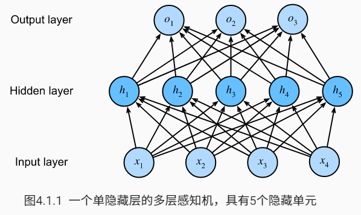

- 输出：
    $$
    \begin{split}\begin{aligned}
        \mathbf{H} & = \mathbf{X} \mathbf{W}^{(1)} + \mathbf{b}^{(1)}, \\
        \mathbf{O} & = \mathbf{H}\mathbf{W}^{(2)} + \mathbf{b}^{(2)}.
    \end{aligned}\end{split}
    $$
    但目前为止，仍是线性模型。因为 输入层 -仿射函数-> 隐藏层 -仿射函数-> 输出层，经历了两次仿射变换，但仿射变换的仿射变换仍是仿射变换：
    $$
    \mathbf{O} = (\mathbf{X} \mathbf{W}^{(1)} + \mathbf{b}^{(1)})\mathbf{W}^{(2)} + \mathbf{b}^{(2)} = \mathbf{X} \mathbf{W}^{(1)}\mathbf{W}^{(2)} + \mathbf{b}^{(1)} \mathbf{W}^{(2)} + \mathbf{b}^{(2)} = \mathbf{X} \mathbf{W} + \mathbf{b}.
    $$
    为了发挥多层结构的潜力，我们还需要一个额外的关键要素：在仿射变换之后对每个隐藏单元应用非线性的*激活函数*（activation function）$σ$。激活函数的输出（例如，$σ(⋅)$）被称为*激活值*（activations）。一般来说，有了激活函数，就不可能再将我们的多层感知机退化成线性模型：
    $$
    \begin{split}\begin{aligned}
        \mathbf{H} & = \sigma(\mathbf{X} \mathbf{W}^{(1)} + \mathbf{b}^{(1)}), \\
        \mathbf{O} & = \mathbf{H}\mathbf{W}^{(2)} + \mathbf{b}^{(2)}.\\
    \end{aligned}\end{split}
    $$

- 虽然一个单隐层网络能学习任何函数，但并不意味着应该尝试使用单隐藏层网络来解决所有问题。事实上，通过使用更深（而不是更广）的网络，我们可以更容易地逼近许多函数。

- 激活函数：激活函数通过计算加权和并加上偏置来确定神经元是否应该被激活。它们是将输入信号转换为输出的可微运算。大多数激活函数都是非线性的。

    1. ReLU 函数（线性整流单元）：仅保留正元素并丢弃所有负元素，当输入值精确等于 0 时，默认使用左边的导数。
        $$
        ReLU(x)=max(x,0)
        $$
        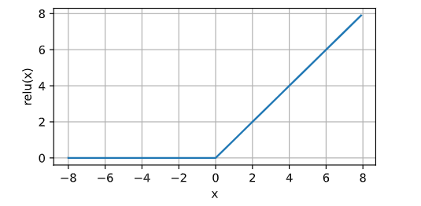

        使用 ReLU 的原因是，它求导表现得特别好：要么让参数消失，要么让参数通过。这使得优化表现得更好，并且 ReLU 减轻了困扰以往神经网络的梯度消失问题。

        导数：

        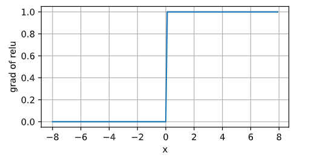

        变体：参数化 ReLU 函数，该变体为 ReLU 添加了一个线性项，因此即使参数是负的，某些信息仍然可以通过：
        $$
        pReLU(x)=max(0,x)+\alpha min(0,x)
        $$

    2. sigmoid 函数（挤压函数）：将输入变换为区间（0，1）上的输出，
        $$
        sigmoid(x)=\frac{1}{1+\exp (-x)}
        $$
        当我们想要将输出视作**二分类**问题的概率时，sigmoid 仍然被广泛用作输出单元上的激活函数（你可以将 sigmoid 视为 softmax 的特例）。然而，sigmoid 在隐藏层中已经较少使用，它在大部分时候已经被更简单、更容易训练的 ReLU 所取代。

        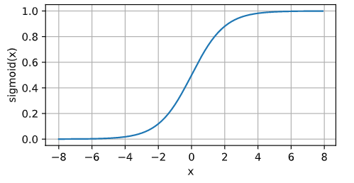

        导数：
        $$
        \frac{d}{dx}sigmoid(x)=\frac{\exp (-x)}{(1+\exp(-x))^2}=sigmoid(x)(1-sigmoid(x))
        $$
        

    3. tanh 函数：将输入压缩到区间（-1，1）上，
        $$
        tanh(x)=\frac{1-\exp(-2x)}{1+\exp(-2x)}=2sigmoid(2x)-1
        $$
        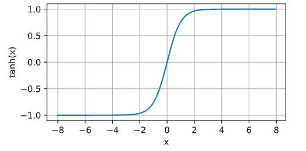

        tanh 函数关于坐标系原点中心对称。

        导数：是 sigmoid 函数的 4 倍
        $$
        \frac{d}{dx}tanh(x)=1-tanh^2(x)
        $$
        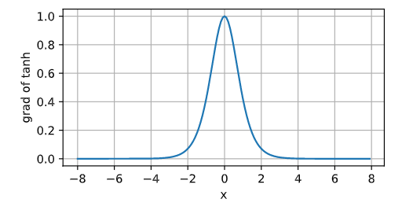

### 多层感知机的从零实现

1. 数据集

    ```python
    import torch
    from torch import nn
    from d2l import torch as d2l
    
    batch_size = 256
    train_iter, test_iter = d2l.load_data_fashion_mnist(batch_size)
    ```

2. 初始化模型参数

    ```python
    num_inputs, num_outputs, num_hiddens = 784, 10, 256
    
    W1 = nn.Parameter(torch.randn(num_inputs, num_hiddens, requires_grad=True) * 0.01)
    b1 = nn.Parameter(torch.zeros(num_hiddens, requires_grad=True))
    W2 = nn.Parameter(torch.randn(num_hiddens, num_outputs, requires_grad=True) * 0.01)
    b2 = nn.Parameter(torch.zeros(num_outputs, requires_grad=True))
    params = [W1, b1, W2, b2]
    ```

3. 激活函数

    ```python
    def relu(X):
        a = torch.zeros_like(X)
        return torch.max(X, a)
    ```

4. 模型

    ```python
    def net(X):
        X = X.reshape((-1, num_inputs))
        H = relu(X@W1 + b1) # '@' 代表矩阵乘法
        return (H@W2 + b2)
    ```

5. 损失函数

    ```python
    loss = nn.CrossEntropyLoss()
    ```

6. 训练

    ```python
    num_epochs, lr = 10, 0.1
    updater = torch.optim.SGD(params, lr=lr)
    d2l.train_ch3(net, train_iter, test_iter, loss, num_epochs, updater)
    ```

7. 评估

    ```python
    d2l.predict_ch3(net, test_iter)
    ```

### 多层感知机的简洁实现

```python
import torch
from torch import nn
from d2l import torch as d2l

net = nn.Sequential(nn.Flatten(),
                    nn.Linear(784, 256),
                    nn.ReLU(),
                    nn.Linear(256, 10))
def init_weights(m):
    if type(m) == nn.Linear:
        nn.init.normal_(m.weight, std=0.01)

net.apply(init_weights)

batch_size, lr, num_epochs = 256, 0.1, 10
loss = nn.CrossEntropyLoss()
trainer = torch.optim.SGD(net.parameters(), lr=lr)

train_iter, test_iter = d2l.load_data_fashion_mnist(batch_size)
d2l.train_ch3(net, train_iter, test_iter, loss, num_epochs, trainer)
```

### 模型选择、欠拟合和过拟合

- 过拟合：将模型在训练数据上拟合得比在潜在分布中更接近的现象

- 正则化：用于对抗过拟合的技术

- 训练误差：模型在训练数据集上计算得到的误差

- 泛化误差：模型应用在同样从原始样本的分布中抽取的无限多的数据样本时误差的期望。我们永远不能准确地计算出泛化误差。这是因为无限多的数据样本是一个虚构的对象。在实际中，我们只能通过将模型应用于一个独立的测试集来*估计*泛化误差，该测试集由随机选取的、未曾在训练集中出现的数据样本构成。

- 在我们目前已探讨、并将在之后继续探讨的标准的监督学习中，我们假设训练数据和测试数据都是从*相同的*分布中*独立*提取的。这通常被称为*独立同分布假设*（i.i.d. assumption），这意味着对数据进行采样的过程没有进行“记忆”。但现实情况很有可能不满足这个假设。

- 当我们训练模型时，我们试图找到一个能够尽可能拟合训练数据的函数。如果该函数灵活到可以像捕捉真实模式一样容易地捕捉到干扰的模式，那么它可能执行得“太好了”，而不能产生一个对看不见的数据做到很好泛化的模型。这种情况正是我们想要避免，或起码控制的。

- 影响模型泛化的因素：

    - 可调整参数的数量（自由度）：越大越容易过拟合
    - 参数采用的值（取值范围）：越大越容易过拟合
    - 训练样本的数量：越小越容易过拟合

- 验证集：用于调整模型的超参数和用于对模型的能力进行初步评估。

    > 为什么不能用测试集来评估？可能会有过拟合测试数据的风险。

- K 折交叉验证：当训练数据稀缺时，我们甚至可能无法提供足够的数据来构成一个合适的验证集。这个问题的一个流行的解决方案是采用 K 折交叉验证。这里，原始训练数据被分成 K 个不重叠的子集。然后执行 K 次模型训练和验证，每次在 K−1 个子集上进行训练，并在剩余的一个子集（在该轮中没有用于训练的子集）上进行验证。最后，通过对 K 次实验的结果取平均来估计训练和验证误差。

- 欠拟合：训练误差和验证误差都很严重，但它们之间仅有一点差距。如果模型不能降低训练误差，这可能意味着我们的模型过于简单（即表达能力不足），无法捕获我们试图学习的模式。此外，由于我们的训练和验证误差之间的*泛化误差*很小，我们有理由相信可以用一个更复杂的模型降低训练误差。这种现象被称为*欠拟合*（underfitting）。

- 过拟合：当我们的训练误差明显低于验证误差时要小心，这表明严重的*过拟合*（overfitting）。注意，*过拟合*并不总是一件坏事。特别是在深度学习领域，众所周知，最好的预测模型在训练数据上的表现往往比在保留数据上好得多。最终，我们通常更关心验证误差，而不是训练误差和验证误差之间的差距。

- 模型复杂性：高阶多项式函数比低阶多项式函数复杂得多。高阶多项式的参数较多，模型函数的选择范围较广。因此在固定训练数据集的情况下，高阶多项式函数相对于低阶多项式的训练误差应该始终更低（最坏也是相等）。事实上，当数据样本包含了 $x$ 的不同值时，函数阶数等于数据样本数量的多项式函数可以完美拟合训练集。

    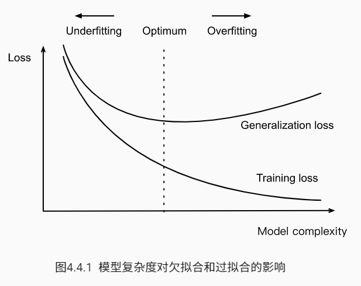

- 数据集大小：训练数据集中的样本越少，我们就越有可能（且更严重地）遇到过拟合。随着训练数据量的增加，泛化误差通常会减小。此外，一般来说，更多的数据不会有什么坏处。对于固定的任务和数据分布，模型复杂性和数据集大小之间通常存在关系。给出更多的数据，我们可能会尝试拟合一个更复杂的模型。能够拟合更复杂的模型可能是有益的。如果没有足够的数据，简单的模型可能更有用。对于许多任务，深度学习只有在有数千个训练样本时才优于线性模型。

- 通过多项式回归来理解：

    标准数据：三阶多项式
    $$
    y = 5 + 1.2x - 3.4\frac{x^2}{2!} + 5.6 \frac{x^3}{3!} + \epsilon \text{ where }
    \epsilon \sim \mathcal{N}(0, 0.1^2).
    $$

    1. 三阶多项式函数拟合（正态）

        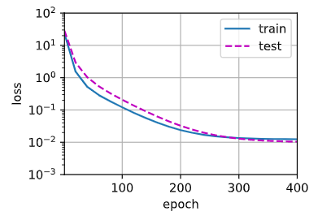

    2. 线性函数拟合（欠拟合）

        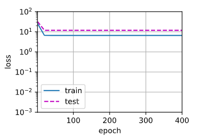

    3. 高阶多项式函数拟合（过拟合）：在这种情况下，没有足够的数据用于学到高阶系数应该具有接近于零的值。因此，这个过于复杂的模型会轻易受到训练数据中噪声的影响。虽然训练损失可以有效地降低，但测试损失仍然很高。结果表明，复杂模型对数据造成了过拟合。

        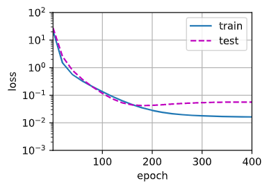

### 权重衰减

- 限制特征的数量是缓解过拟合的一种常用技术。然而，简单地丢弃特征对于这项工作来说可能过于生硬。

- 在训练参数化机器学习模型时，*权重衰减*（通常称为 L2 正则化）是最广泛使用的正则化的技术之一。这项技术是基于一个基本直觉，即在所有函数 $f$ 中，函数 $f=0$（所有输入都得到值 $0$）在某种意义上是最简单的，我们可以通过函数与零的距离来衡量函数的复杂度。

- 一种简单的方法是通过线性函数 $f(x)=w^\top x$ 中的权重向量的某个范数来度量其复杂性，例如 $\| \mathbf{w} \|^2$。要保证权重向量比较小，最常用方法是将其范数作为惩罚项加到最小化损失的问题中。将原来的训练目标*最小化训练标签上的预测损失*，调整为*最小化预测损失和惩罚项之和*。现在，如果我们的权重向量增长的太大，我们的学习算法可能会更集中于最小化权重范数 $\| \mathbf{w} \|^2$。这正是我们想要的。
    $$
    L(\mathbf{w},b)=\frac{1}{n}\sum_{i=1}^n\frac{1}{2}(\mathbf{w}^\top\mathbf{x}^{(i)}+b-y^{(i)})^2+\frac{\lambda}{2}\| \mathbf{w} \|^2
    $$
    通过正则化常数 $\lambda$ （非负超参数）来平衡这个新的额外惩罚的损失，使用除以 2 和平方范数使得导数更容易计算：
    $$
    \partial_\mathbf{w}L(\mathbf{w}, b)=\frac{1}{n}\sum_{i=1}^n\mathbf{x}^{(i)}(\mathbf{w}^\top\mathbf{x}^{(i)}+b-y^{(i)})+\lambda \mathbf{w}
    $$

- 使用 $L_2$ 范数的一个原因是它对权重向量的大分量施加了巨大的惩罚，这使得我们的学习算法偏向于在大量特征上均匀分布权重的模型。在实践中，这可能使它们对单个变量中的观测误差更为鲁棒。相比之下，$L_1$ 惩罚会导致模型将其他权重清除为零而将权重集中在一小部分特征上。这称为*特征选择*（feature selection），这可能是其他场景下需要的。

- 梯度下降：
    $$
    \begin{split}\begin{aligned}
    \mathbf{w} & \leftarrow \mathbf{w}-\eta\partial_\mathbf{w}L(\mathbf{w},b) \\
    		   & \leftarrow (1-\eta\lambda)\mathbf{w}-\frac{\eta}{|\mathcal{B}|}\sum_{i \in \mathcal{B}} \mathbf{x}^{(i)} \left(\mathbf{w}^\top \mathbf{x}^{(i)} + b - y^{(i)}\right)
    \end{aligned}\end{split}
    $$
    我们根据估计值与观测值之间的差异来更新 $\mathbf{w}$。然而，**我们同时也在试图将 $\mathbf{w}$ 的大小缩小到零**。这就是为什么这种方法有时被称为*权重衰减*。我们仅考虑惩罚项，优化算法在训练的每一步*衰减*权重。与特征选择相比，权重衰减为我们提供了一种连续的机制来调整函数的复杂度。较小的 $λ$ 值对应较少约束的 $\mathbf{w}$，而较大的 $λ$ 值对 $\mathbf{w}$ 的约束更大。

- 是否对相应的偏置 $b^2$ 进行惩罚在不同的实现中会有所不同。在神经网络的不同层中也会有所不同。通常，我们不正则化网络输出层的偏置项。

- 从零实现权重衰减：

    1. 生成数据：将特征的维数增加到 200，制造过拟合
        $$
        y = 0.05 + \sum_{i = 1}^d 0.01 x_i + \epsilon \text{ where }
        \epsilon \sim \mathcal{N}(0, 0.01^2).
        $$

        ```python
        %matplotlib inline
        import torch
        from torch import nn
        from d2l import torch as d2l
        
        n_train, n_test, num_inputs, batch_size = 20, 100, 200, 5
        true_w, true_b = torch.ones((num_inputs, 1)) * 0.01, 0.05
        train_data = d2l.synthetic_data(true_w, true_b, n_train)
        train_iter = d2l.load_array(train_data, batch_size)
        test_data = d2l.synthetic_data(true_w, true_b, n_test)
        test_iter = d2l.load_array(test_data, batch_size, is_train=False)
        ```

    2. 初始化模型参数

        ```python
        def init_params():
            w = torch.normal(0, 1, size=(num_inputs, 1), requires_grad=True)
            b = torch.zeros(1, requires_grad=True)
            return [w, b]
        ```

    3. 定义 $L_2$ 范数惩罚

        ```python
        def l2_penalty(w):
            return torch.sum(w.pow(2)) / 2
        ```

    4. 训练

        ```python
        def train(lambd):
            w, b = init_params()
            net, loss = lambda X: d2l.linreg(X, w, b), d2l.squared_loss
            num_epochs, lr = 100, 0.003
            animator = d2l.Animator(xlabel='epochs', ylabel='loss', yscale='log',
                                    xlim=[5, num_epochs], legend=['train', 'test'])
            for epoch in range(num_epochs):
                for X, y in train_iter:
                    with torch.enable_grad():
                        l = loss(net(X), y) + lambd * l2_penalty(w)
                    l.sum().backward()
                    d2l.sgd([w, b], lr, batch_size)
                if (epoch + 1) % 5 == 0:
                    animator.add(epoch + 1, (d2l.evaluate_loss(net, train_iter, loss),
                                             d2l.evaluate_loss(net, test_iter, loss)))
            print('w的L2范数是：', torch.norm(w).item())
        ```

        忽略正则化直接训练：严重过拟合（训练误差减小，测试误差没有减小）

        ```python
        train(lambd=0)
        
        >>> w的L2范数是： 13.684905052185059
        ```

        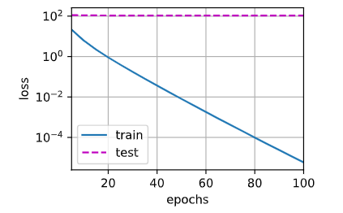

        使用权重衰减：训练误差减小，测试误差减小

        ```python
        train(lambd=10)
        
        >>> w的L2范数是： 0.020103851333260536
        ```

        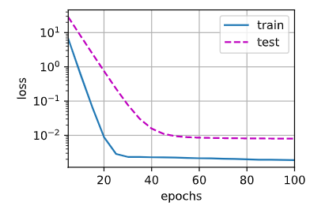

- 使用 PyTorch 简洁实现：深度学习框架为了便于使用权重衰减，便将权重衰减集成到优化算法中，以便与任何损失函数结合使用。

    ```python
    def train_concise(wd):
        net = nn.Sequential(nn.Linear(num_inputs, 1))
        for param in net.parameters():
            param.data.normal_()
        loss = nn.MSELoss()
        num_epochs, lr = 100, 0.003
        trainer = torch.optim.SGD([
            {'params': net[0].weight, 'weight_decay': wd},
            {'params': net[0].bias}
        ], lr=lr)
        animator = d2l.Animator(xlabel='epochs', ylabel='loss', yscale='log',
                                xlim=[5, num_epochs], legend=['train', 'test'])
        for epoch in range(num_epochs):
            for X, y in train_iter:
                with torch.enable_grad():
                    trainer.zero_grad()
                    l = loss(net(X), y)
                l.backward()
                trainer.step()
            if (epoch + 1) % 5 == 0:
                animator.add(epoch + 1, (d2l.evaluate_loss(net, train_iter, loss),
                                         d2l.evaluate_loss(net, test_iter, loss)))
        print('w的L2范数是：', net[0].weight.norm().item())
    ```

### Dropout

- 简单性的另一个有用角度是平滑性，即函数不应该对其输入的微小变化敏感。例如，当我们对图像进行分类时，我们预计向像素添加一些随机噪声应该是基本无影响的。

- 当训练一个有多层的深层网络时，注入噪声只会在输入-输出映射上增强平滑性。

- 他们的想法被称为*暂退法*（dropout），dropout 在正向传播过程中，计算每一内部层的同时注入噪声，这已经成为训练神经网络的标准技术。这种方法之所以被称为 *dropout* ，因为我们从表面上看是在训练过程中丢弃（drop out）一些神经元。 在整个训练过程的每一次迭代中，dropout 包括在计算下一层之前将当前层中的一些节点置零。

- 神经网络过拟合的特征是每一层都依赖于前一层激活值的特定模式，称这种情况为“共适应性”。dropout 会破坏共适应性，就像有性生殖会破坏共适应的基因一样。

- 关键的挑战就是如何注入这种噪声。一种想法是以一种*无偏*的方式注入噪声。这样在固定住其他层时，每一层的期望值等于没有噪音时的值。

- 在标准 dropout 正则化中，通过按保留（未丢弃）的节点的分数进行归一化来消除每一层的偏差。换言之，每个中间激活值 $h$ 以*丢弃概率* $p$ 由随机变量 $h'$ 替换，期望值保持不变，即 $E[h']=h$：
    $$
    \begin{split}\begin{aligned}
    h' =
    \begin{cases}
        0 & \text{ 概率为 } p \\
        \frac{h}{1-p} & \text{ 其他情况}
    \end{cases}
    \end{aligned}\end{split}
    $$

- 在下图中，删除了 $h_2$ 和 $h_5$。因此，输出的计算不再依赖于 $h_2$ 或 $h_5$，并且它们各自的梯度在执行反向传播时也会消失。这样，输出层的计算不能过度依赖于 $h1,…,h5$ 的任何一个元素。

    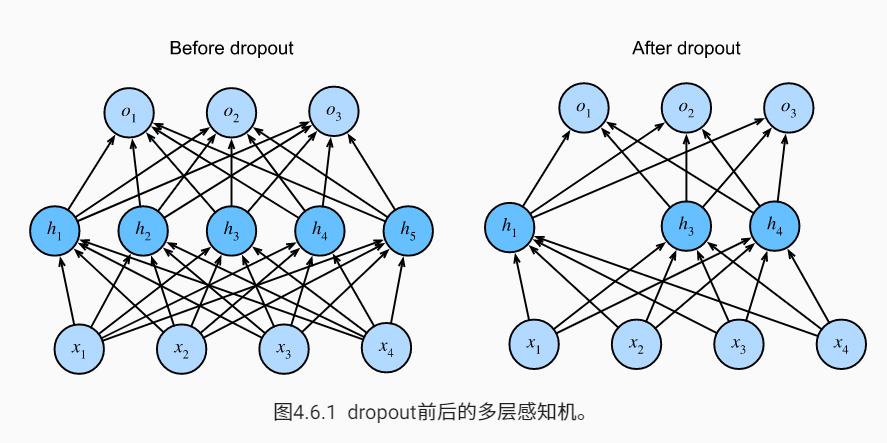

- 通常，我们在测试时禁用 dropout。给定一个训练好的模型和一个新的样本，我们不会丢弃任何节点，因此不需要标准化。然而，也有一些例外：一些研究人员使用测试时的 dropout 作为估计神经网络预测的“不确定性”的启发式方法：如果预测在许多不同的 dropout 掩码上都是一致的，那么我们可以说网络更有自信心。

- 从零实现 Dropout

    1. dropout 层

        ```python
        import torch
        from torch import nn
        from d2l import torch as d2l
        
        def dropout_layer(X, dropout):
            assert 0 <= dropout <= 1
            if dropout == 1:
                return torch.zeros_like(X)
            if dropout == 0:
                return X
            mask = (torch.Tensor(X.shape).uniform_(0, 1) > dropout).float()
            return mask * X / (1.0 - dropout)
        ```

    2. 模型：一种常见的技巧是**在靠近输入层的地方设置较低的丢弃概率**

        ```python
        dropout1, dropout2 = 0.2, 0.5
        
        class Net(nn.Module):
            def __init__(self, num_inputs, num_outputs, num_hiddens1, num_hiddens2, is_training=True):
                super(Net, self).__init__()
                self.num_inputs = num_inputs
                self.training = is_training
                self.lin1 = nn.Linear(num_inputs, num_hiddens1)
                self.lin2 = nn.Linear(num_hiddens1, num_hiddens2)
                self.lin3 = nn.Linear(num_hiddens2, num_outputs)
                self.relu = nn.ReLU()
                
            def forward(self, X):
                H1 = self.relu(self.lin1(X.reshape((-1, self.num_inputs))))
                # 只有在训练模式才使用 dropout
                if self.training == True:
                    H1 = dropout_layer(H1, dropout1)
                H2 = self.relu(self.lin2(H1))
                if self.training == True:
                    H2 = dropout_layer(H2, dropout2)
                out = self.lin3(H2)
                return out
            
        num_inputs, num_outputs, num_hiddens1, num_hiddens2 = 784, 10, 256, 256
        net = Net(num_inputs, num_outputs, num_hiddens1, num_hiddens2)
        ```

    3. 训练

        ```python
        num_epochs, lr, batch_size = 10, 0.5, 256
        loss = nn.CrossEntropyLoss()
        train_iter, test_iter = d2l.load_data_fashion_mnist(batch_size)
        trainer = torch.optim.SGD(net.parameters(), lr=lr)
        d2l.train_ch3(net, train_iter, test_iter, loss, num_epochs, trainer)
        ```

- 使用 PyTorch 简洁实现

    ```python
    net = nn.Sequential(
            nn.Flatten(),
            nn.Linear(784, 256),
            nn.ReLU(),
            nn.Dropout(dropout1),
            nn.Linear(256, 256),
            nn.ReLU(),
            nn.Dropout(dropout2),
            nn.Linear(256, 10)
    )
    
    def init_weights(m):
        if type(m) == nn.Linear:
            nn.init.normal_(m.weight, std=0.01)
            
    net.apply(init_weights)
    trainer = torch.optim.SGD(net.parameters(), lr=lr)
    d2l.train_ch3(net, train_iter, test_iter, loss, num_epochs, trainer)
    ```

### 正向传播、反向传播和计算图

- 正向传播在神经网络定义的计算图中按顺序计算和存储中间变量。它的顺序是从输入层到输出层。
- 反向传播按相反的顺序计算和存储神经网络的中间变量和参数的梯度。
- 在训练深度学习模型时，正向传播和反向传播是相互依赖的。一方面，在正向传播期间计算正则项取决于模型参数 $\mathbf{W}^{(1)}$ 和 $\mathbf{W}^{(2)}$ 的当前值。它们是由优化算法根据最近迭代的反向传播给出的。另一方面，反向传播期间参数的梯度计算取决于由正向传播给出的隐藏变量 $\mathbf{h}$ 的当前值。
- 训练比预测需要更多的内存（显存），因为需要存储中间值。

### 数值稳定性和模型初始化

- 初始化方案的选择在神经网络学习中起着非常重要的作用，它对保持数值稳定性至关重要。此外，这些选择可以与非线性激活函数的选择以有趣的方式结合在一起。我们选择哪个函数以及如何初始化参数可以决定优化算法收敛的速度有多快。糟糕选择可能会导致我们在训练时遇到梯度爆炸或梯度消失。

- 正向传播的网络：
    $$
    \mathbf{h}^{(l)} = f_l (\mathbf{h}^{(l-1)}) \text{ 因此 } \mathbf{o} = f_L \circ \ldots \circ f_1(\mathbf{x}).
    $$
    反向传播的梯度：
    $$
    \partial_{\mathbf{W}^{(l)}} \mathbf{o} = \underbrace{\partial_{\mathbf{h}^{(L-1)}} \mathbf{h}^{(L)}}_{ \mathbf{M}^{(L)} \stackrel{\mathrm{def}}{=}} \cdot \ldots \cdot \underbrace{\partial_{\mathbf{h}^{(l)}} \mathbf{h}^{(l+1)}}_{ \mathbf{M}^{(l+1)} \stackrel{\mathrm{def}}{=}} \underbrace{\partial_{\mathbf{W}^{(l)}} \mathbf{h}^{(l)}}_{ \mathbf{v}^{(l)} \stackrel{\mathrm{def}}{=}}.
    $$
    该梯度是 $L-l$ 个矩阵 $$\mathbf{M}^{(L)} \cdot \ldots \cdot \mathbf{M}^{(l+1)}$$ 与梯度向量 $\mathbf{v}^{(l)}$ 的乘积，但矩阵 $\mathbf{M}^{(l)}$ 可能具有各种各样的特征值。他们可能很小，也可能很大，他们的乘积可能*非常大*，也可能*非常小*。

- 不稳定梯度带来的风险不止在于数值表示。不稳定梯度也威胁到我们优化算法的稳定性。我们可能面临一些问题。要么是*梯度爆炸*（gradient exploding）问题：参数更新过大，破坏了模型的稳定收敛；要么是*梯度消失*（gradient vanishing）问题：参数更新过小，在每次更新时几乎不会移动，导致无法学习。

- 梯度消失：一个常见原因 —— sigmoid 函数

    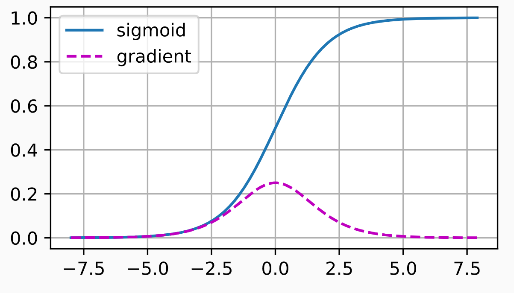

    当它的输入很大或是很小时，sigmoid 函数的梯度都会消失。此外，当反向传播通过许多层时，除非我们在刚刚好的地方，这些地方 sigmoid 函数的输入接近于零，否则整个乘积的梯度可能会消失。当我们的网络有很多层时，除非我们很小心，否则在某一层可能会切断梯度。所以，**更稳定的 ReLU 系列函数已成为很多人的默认选择**。

- 梯度爆炸：初始化不得当，矩阵乘积多次后容易产生梯度爆炸。

- 打破对称性：考虑具有两个隐藏单元的单隐藏层多层感知机，假设将隐藏层的所有参数初始化为 $\mathbf{W}^{(1)}=c$。在正向传播期间，两个隐藏单元采用相同的输入和参数，产生相同的激活，该激活被送到输出单元；在反向传播期间，根据参数 $\mathbf{W}^{(1)}$ 对输出单元进行微分，得到一个梯度，其元素都取相同的值。因此，在基于梯度的迭代(例如，小批量随机梯度下降)之后，$\mathbf{W}^{(1)}$ 的所有元素仍然采用相同的值。这样的迭代永远不会打破对称性，我们可能永远也无法实现网络的表达能力。隐藏层的行为就好像只有一个单元（Dropout 正则化可以打破这种对称性）。

- 参数初始化：要用随机初始化来打破对称性，用启发式的初始化方法可以确保初始梯度既不太大也不太小

    - 默认初始化：正态分布，对于中等规模的问题，这种方法通常很有效。

    - Xavier 初始化：

        对于没有非线性激活函数的全连接层：
        $$
        o_{i} = \sum_{j=1}^{n_\mathrm{in}} w_{ij} x_j.
        $$
        假设权重 $w_{ij}$ 是从同一分布中独立抽取，且该分布具有零均值和方差 $\sigma^2$；假设输入层 $x_j$ 也具有零均值和方差 $\gamma^2$，它们独立于 $w_{ij}$ 并且彼此独立，则正向传播中：
        $$
        \begin{split}\begin{aligned}
            E[o_i] & = \sum_{j=1}^{n_\mathrm{in}} E[w_{ij} x_j] \\&= \sum_{j=1}^{n_\mathrm{in}} E[w_{ij}] E[x_j] \\&= 0, \\
            \mathrm{Var}[o_i] & = E[o_i^2] - (E[o_i])^2 \\
                & = \sum_{j=1}^{n_\mathrm{in}} E[w^2_{ij} x^2_j] - 0 \\
                & = \sum_{j=1}^{n_\mathrm{in}} E[w^2_{ij}] E[x^2_j] \\
                & = n_\mathrm{in} \sigma^2 \gamma^2.
        \end{aligned}\end{split}
        $$
        保持方差不变需要设置 $n_{in}\sigma^2=1$

        在反向传播中，显然梯度的方差为 $n_{out}\sigma^2\gamma^2$，保持方差不变需要设置 $n_{out}\sigma^2=1$

        因为 $n_{in}$ 不一定与 $n_{out}$ 相等，所以不可能同时满足这两个条件，但可以满足：
        $$
        \begin{aligned}
        \frac{1}{2} (n_\mathrm{in} + n_\mathrm{out}) \sigma^2 = 1 \text{ 或等价于 }
        \sigma = \sqrt{\frac{2}{n_\mathrm{in} + n_\mathrm{out}}}.
        \end{aligned}
        $$
        所以 Xavier 初始化从均值为零，方差 $\sigma^2=\frac{2}{n_{in}+n_{out}}$的高斯分布中采样权重，均匀分布中因为 $U(-a, a)$ 的方差为 $\frac{a^3}{3}$，将 $\frac{a^3}{3}$ 带入到 $\sigma^2$ 的条件中，初始化为：
        $$
        U\left(-\sqrt{\frac{6}{n_\mathrm{in} + n_\mathrm{out}}}, \sqrt{\frac{6}{n_\mathrm{in} + n_\mathrm{out}}}\right).
        $$
        Xavier 初始化表明，**对于每一层，输出的方差不受输入数量的影响，任何梯度的方差不受输出数量的影响**。

- 其他方法：参数绑定（共享）、超分辨率、序列模型等

### 环境和分布偏移

- 在许多情况下，训练集和测试集并不来自同一个分布。这就是所谓的分布偏移。
- 真实风险是从真实分布中抽取的所有数据的总体损失的预期。然而，这个数据总体通常是无法获得的。经验风险是训练数据的平均损失，用于近似真实风险。在实践中，我们进行经验风险最小化。
- 在相应的假设条件下，可以在测试时检测并纠正协变量偏移和标签偏移。在测试时，不考虑这种偏移可能会成为问题。
- 在某些情况下，环境可能会记住自动操作并以令人惊讶的方式做出响应。在构建模型时，我们必须考虑到这种可能性，并继续监控实时系统，并对我们的模型和环境以意想不到的方式纠缠在一起的可能性持开放态度。（模型影响了环境，环境又输入模型，如此循环往复）

### 实战 Kaggle 比赛：预测房价

- 数据预处理
    $$
    x' \leftarrow \frac{x - \mu}{\sigma}.
    $$
    将特征重新缩放到零均值和单位方差来标准化数据：
    $$
    \begin{split}\begin{aligned}
    E[x']&=E[\frac{x-\mu}{\sigma}]=\frac{1}{\sigma}E[x-\mu]=\frac{1}{\sigma}(E[x]-E[\mu])=\frac{1}{\sigma}\cdot(\mu-\mu)=0 \\
    D[x']&=E[(x'-E[x'])^2]=E[x'^2]=E[(\frac{x-\mu}{\sigma})^2]=\frac{1}{\sigma^2}E[(x-\mu)^2]=\frac{1}{\sigma^2}D[x]=1 \  \ \ \ \ \text{证法1} \\
    &=D[\frac{x-\mu}{\sigma}]=\frac{1}{\sigma^2}D[x-\mu]=\frac{1}{\sigma^2}D[x]=1 \ \ \ \ \text{证法2}
    \end{aligned}\end{split}
    $$
    标准化数据有两个原因。首先，它方便优化。其次，因为我们不知道哪些特征是相关的，所以我们不想让惩罚分配给一个特征的系数比分配给其他任何特征的系数更大。

    ```python
    numeric_features = all_features.dtypes[all_features.dtypes != 'object'].index # 每个数值列的索引
    all_features[numeric_features] = all_features[numeric_features].apply(
        lambda x: (x - x.mean()) / (x.std()))
    # 在标准化后，所有数据的均值为 0，所以可以将缺失值设为 0
    all_features[numeric_features] = all_features[numeric_features].fillna(0)
    ```

    处理离散值：将多类别标签转换为独热编码

    ```python
    # `Dummy_na=True` 将 'na' 视为有效的特征值，并为其创建指示符特征
    all_features = pd.get_dummies(all_features, dummy_na=True)
    ```

    <div align="center">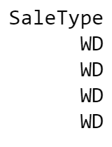   转变为  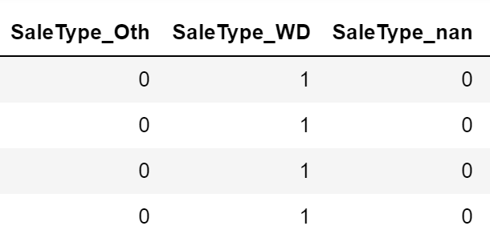</div>

    通过`values`属性，我们可以从`pandas`格式中提取 NumPy 格式，并将其转换为张量表示用于训练。

    ```python
    n_train = train_data.shape[0]
    train_features = torch.tensor(all_features[:n_train].values, dtype=d2l.float32)
    test_features = torch.tensor(all_features[n_train:].values, dtype=d2l.float32)
    train_labels = torch.tensor(
        train_data.SalePrice.values.reshape(-1, 1), dtype=d2l.float32)
    ```

- 模型选择：线性模型（线性模型将作为基线模型，让我们直观地知道简单的模型离报告最好的模型有多近）

    ```python
    in_features = train_features.shape[1]
    
    def get_net():
        net = nn.Sequential(nn.Linear(in_features, 1))
        return net
    ```

- 损失函数：均方损失

    ```python
    loss = nn.MSELoss()
    ```

- 模型评价：相对误差

    用价格预测的对数来衡量差异。事实上，这也是比赛中官方用来评价提交质量的误差指标。即将 $\delta$ for $|\log y - \log \hat{y}| \leq \delta$ 转换为 $e^{-\delta} \leq \frac{\hat{y}}{y} \leq e^\delta$，这使得预测价格的对数与真实标签价格的对数之间出现以下均方根误差：
    $$
    \sqrt{\frac{1}{n}\sum_{i=1}^n\left(\log y_i -\log \hat{y}_i\right)^2}.
    $$

    ```python
    def log_rmse(net, features, labels):
        # 为了在取对数时进一步稳定该值，将小于 1 的值设置为 1
        # torch.clamp() 将输入t张量每个元素的范围限制到区间 [min,max]
        clipped_preds = torch.clamp(net(features), 1, float('inf'))
        rmse = torch.sqrt(loss(torch.log(clipped_preds), torch.log(labels)))
        return rmse.item()
    ```

- 训练：采用 Adam 优化器（对初始学习率不那么敏感）

    ```python
    def train(net, train_features, train_labels, test_features, test_labels,
              num_epochs, learning_rate, weight_decay, batch_size):
        train_ls, test_ls = [], []
        train_iter = d2l.load_array((train_features, train_labels), batch_size)
        optimizer = torch.optim.Adam(net.parameters(),
                                     lr = learning_rate,
                                     weight_decay = weight_decay)
        for epoch in range(num_epochs):
            for X, y in train_iter:
                optimizer.zero_grad()
                l = loss(net(X), y) # 训练的时候采用均方损失函数
                l.backward()
                optimizer.step()
            # 每个 epoch 结束后，采用对数均方损失评价模型
            train_ls.append(log_rmse(net, train_features, train_labels)) 
            if test_labels is not None:
                test_ls.append(log_rmse(net, test_features, test_labels))
        return train_ls, test_ls
    ```

    训练方式：K 折交叉验证（有助于模型选择和超参数调整）

    首先需要一个函数，在 $K$ 折交叉验证过程中返回第 $i$ 折的数据。它选择第 $i$ 个切片作为验证数据，其余部分作为训练数据。

    ```python
    def get_k_fold_data(k, i, X, y):
        assert k > 1
        fold_size = X.shape[0] // k
        X_train, y_train = None, None
        for j in range(k):
            idx = slice(j * fold_size, (j + 1) * fold_size)
            X_part, y_part = X[idx, :], y[idx]
            if j == i:
                X_valid, y_valid = X_part, y_part
            elif X_train is None:
                X_train, y_train = X_part, y_part
            else:
                X_train = torch.cat([X_train, X_part], 0)
                y_train = torch.cat([y_train, y_part], 0)
        return X_train, y_train, X_valid, y_valid
    ```

    当我们在 $K$ 折交叉验证中训练 $K$ 次后，返回训练和验证误差的平均值（每轮记录最后一个 epoch 的损失值）。

    ```python
    def k_fold(k, X_train, y_train, num_epochs, learning_rate, weight_decay, 
               batch_size):
        train_l_sum, valid_l_sum = 0, 0
        for i in range(k):
            data = get_k_fold_data(k, i, X_train, y_train)
            net = get_net()
            train_ls, valid_ls = train(net, *data, num_epochs, learning_rate,
                                       weight_decay, batch_size)
            train_l_sum += train_ls[-1]
            valid_l_sum += valid_ls[-1]
            if i == 0:
                d2l.plot(list(range(1, num_epochs + 1)), [train_ls, valid_ls],
                         xlabel='epoch', ylabel='rmse', xlim=[1, num_epochs],
                         legend=['train', 'valid'], yscale='log')
            print(f'fold {i+1}, train log rmse {float(train_ls[-1]):f}, '
                  f'valid log rmse {float(valid_ls[-1]):f}')
        return train_l_sum / k, valid_l_sum / k
    ```

- 结果：有时一组超参数的训练误差可能非常低，但 $K$ 折交叉验证的误差要高得多，这表明我们过拟合了。

    ```python
    k, num_epochs, lr, weight_decay, batch_size = 5, 100, 5, 0, 64
    train_l, valid_l = k_fold(k, train_features, train_labels, num_epochs, lr,
                              weight_decay, batch_size)
    print(f'{k}-折验证：平均训练log rmse: {float(train_l):f}, '
          f'平均验证log rmse: {float(valid_l):f}')
    ```

    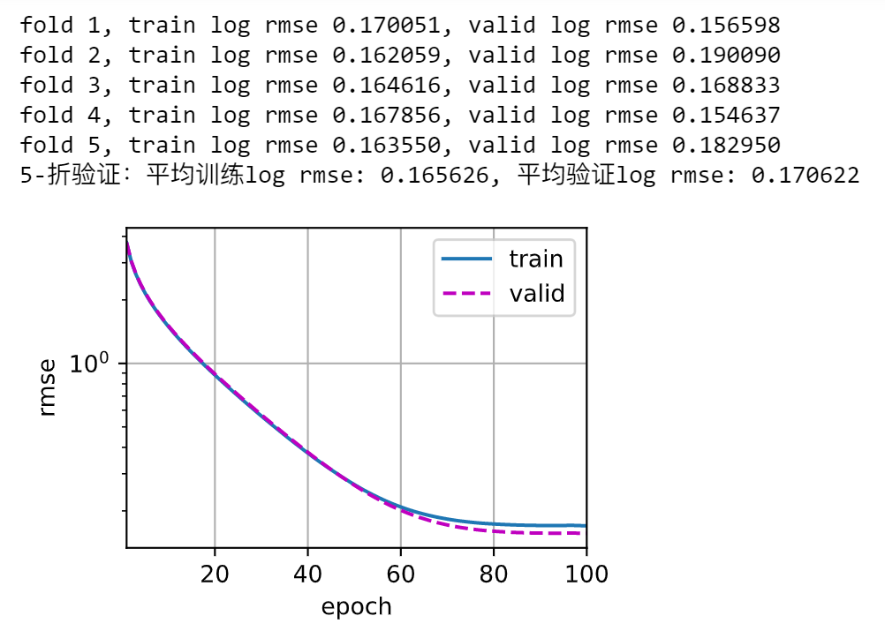

- 提交 Kaggle 预测

    既然我们知道应该选择什么样的超参数，我们不妨使用所有数据对其进行训练（而不是仅使用交叉验证中使用的 $1−1/K$ 的数据）。然后，我们通过这种方式获得的模型可以应用于测试集。将预测保存在 CSV 文件中可以简化将结果上传到 Kaggle 的过程。

    ```python
    def train_and_pred(train_features, test_features, train_labels, test_data, 
                       num_epochs, lr, weight_decay, batch_size):
        net = get_net()
        train_ls, _ = train(net, train_features, train_labels, None, None,
                            num_epochs, lr, weight_decay, batch_size)
        d2l.plot(np.arange(1, num_epochs + 1), [train_ls], xlabel='epoch',
                 ylabel='log rmse', xlim=[1, num_epochs], yscale='log')
        print(f'train log rmse {float(train_ls[-1]):f}')
        # 将网络应用于测试集
        preds = net(test_features).detach().numpy() # 列向量
        # 将其重新格式化以导出到 Kaggle
        #test_data['SalePrice'] = pd.Series(preds.reshape(1, -1)[0]) # 转换为单行矩阵后提取为行向量
        test_data['SalePrice'] = pd.Series(preds.reshape(-1)) # 必须要行向量
        submission = pd.concat([test_data['Id'], test_data['SalePrice']], axis=1)
        submission.to_csv('submission.csv', index=False)
    ```

    一种良好的完整性检查是查看测试集上的预测是否与 $K$ 倍交叉验证过程中的预测相似。

    ```python
    train_and_pred(train_features, test_features, train_labels, test_data,
                   num_epochs, lr, weight_decay, batch_size)
    ```

    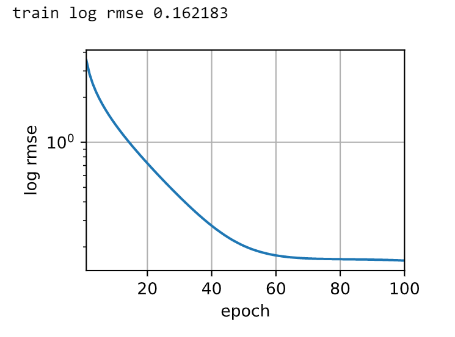