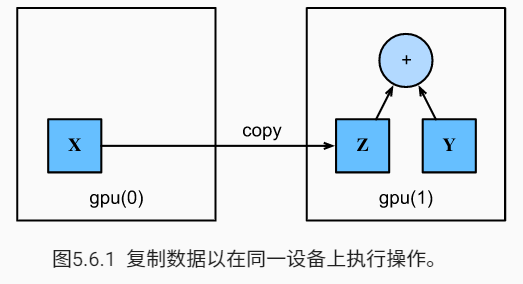

## 深度学习计算

### 层和块

- 单个神经元：

    - 接受一些输入
    - 生成相应的标量输出
    - 具有一组相关参数，这些参数可以更新以优化某些感兴趣的目标函数

- 层：

    - 接受一组输入
    - 生成相应的输出
    - 有一组可调整参数描述

- 块：块可以描述单个层、由多个层组成的组件或整个模型本身。使用块进行抽象的一个好处是可以将一些块组合成更大的组件，这一过程通常是递归的。

- 自定义块

    - 将输入数据作为其正向传播函数的参数。
    - 通过正向传播函数来生成输出。请注意，输出的形状可能与输入的形状不同。
    - 计算其输出关于输入的梯度，可通过其反向传播函数进行访问。通常这是自动发生的。
    - 存储和访问正向传播计算所需的参数。
    - 根据需要初始化模型参数。

    ```python
    class MLP(nn.Module):
        # 用模型参数声明层，这里，我们声明两个全连接的层
        def __init__(self):
            # 调用 `MLP` 的父类 `Block` 的构造函数来执行必要的初始化
            # 这样，在类实例化时也可以指定其他函数参数，例如模型参数 `params`
            super().__init__()
            self.hidden = nn.Linear(20, 256)
            self.out = nn.Linear(256, 10)
            
        # 定义模型的正向传播，即如何根据输入 `X` 返回所需的模型输出
        def forward(self, X):
            # 注意，这里我们使用 ReLU 的函数版本，其在 nn.functional 模块中定义
            return self.out(F.relu(self.hidden(X)))
        
    net = MLP()
    net(X)
    ```

    除非我们实现一个新的运算符，否则我们不必担心反向传播函数或参数初始化，系统将自动生成这些。

- 顺序块：层和块的顺序连接由`Sequential`块处理，实现自己的 Sequential 类

    - 一种将块逐个追加到列表中的函数。
    - 一种正向传播函数，用于将输入按追加块的顺序传递给块组成的“链条”。

    ```python
    class MySequential(nn.Module):
        def __init__(self, *args):
            super().__init__()
            for block in args:
                # 这里，`block` 是 `Module` 子类的一个实例。我们把它保存在 `Module` 类的成员变量
                # `_modules` 中。`block` 的类型是 OrderedDict
                self._modules[block] = block
            
        def forward(self, X):
            # OrderedDict 保证了按照成员添加的顺序遍历它们
            for block in self._modules.values(): # self._modules 好像也行，因为键值一样
                X = block(X)
            return X
    
    net = MySequential(nn.Linear(20, 256), nn.ReLU(), nn.Linear(256, 10))
    net(X)
    ```

    `_modules`的主要优点是，在块的参数初始化过程中，系统知道在`_modules`字典中查找需要初始化参数的子块。

- 在正向传播函数中执行代码

    有时我们可能希望合并既不是上一层的结果也不是可更新参数的项。我们称之为常数参数（constant parameters）。例如，我们需要一个计算函数 $f(\mathbf{x},\mathbf{w})=c⋅\mathbf{w}^\top \mathbf{x}$ 的层，其中 $\mathbf{x}$ 是输入，$\mathbf{w}$ 是我们的参数，$c$ 是某个在优化过程中没有更新的指定常量。

    ```python
    class FixedHiddenMLP(nn.Module):
        def __init__(self):
            super().__init__()
            # 不计算梯度的随机权重函数，因此其在训练期间保持不变
            self.rand_weight = torch.rand((20, 20), requires_grad=False)
            self.linear = nn.Linear(20, 20)
            
        def forward(self, X):
            X = self.linear(X)
            # 使用创建的常量参数以及 `relu` 和 `dot` 函数
            X = F.relu(torch.mm(X, self.rand_weight) + 1)
            # 复用全连接层，相当于两个全连接层共享参数
            X = self.linear(X)
            # 控制流
            while X.abs().sum() > 1:
                X /= 2
            return X.sum()
        
    net = FixedHiddenMLP()
    net(X)
    ```

- 嵌套块

    ```python
    class NestMLP(nn.Module):
        def __init__(self):
            super().__init__()
            self.net = nn.Sequential(nn.Linear(20, 64), nn.ReLU(),
                                     nn.Linear(64, 32), nn.ReLU())
            self.linear = nn.Linear(32, 16)
        
        def forward(self, X):
            return self.linear(self.net(X))
    
    chimera = nn.Sequential(NestMLP(), nn.Linear(16, 20), FixedHiddenMLP())
    chimera(X)
    ```

### 参数管理

- 参数访问：当通过 Sequential 类定义模型时，我们可以通过索引来访问模型的任意层，这就像一个列表一样，每层的参数都在其属性中。

    ```python
    import torch
    from torch import nn
    
    net = nn.Sequential(nn.Linear(4, 8), nn.ReLU(), nn.Linear(8, 1))
    X = torch.rand(size=(2, 4))
    net(X)
    
    print(net[2].state_dict())
    
    >>> OrderedDict([('weight', tensor([[ 0.2977, -0.0771,  0.1549, -0.2106, -0.2900, -0.1914, -0.2428,  0.2992]])), ('bias', tensor([0.1465]))])
    ```

    每个参数都是 parameter 类的一个实例，要对参数执行任何操作，首先需要访问底层的数值。

    ```python
    print(type(net[2].bias))
    print(net[2].bias)
    print(net[2].bias.data)
    
    >>> <class 'torch.nn.parameter.Parameter'>
    	Parameter containing:
    	tensor([0.1465], requires_grad=True)
    	tensor([0.1465])
    ```

    - 参数的梯度：`net[2].weight.grad`

    - 一次性访问所有参数：

        ```python
        print(*[(name, param.shape) for name, param in net[0].named_parameters()])
        print(*[(name, param.shape) for name, param in net.named_parameters()])
        
        >>> ('weight', torch.Size([8, 4])) ('bias', torch.Size([8]))
          ('0.weight', torch.Size([8, 4])) ('0.bias', torch.Size([8])) ('2.weight', torch.Size([1, 8])) ('2.bias', torch.Size([1]))
        
        # 另一种访问方式
        net.state_dict()['2.bias'].data, net[0].state_dict()['weight'].data
        ```

    - 嵌套块的参数：

        设计网络

        ```python
        def block1():
            return nn.Sequential(nn.Linear(4, 8), nn.ReLU(),
                                 nn.Linear(8, 4), nn.ReLU())
        
        def block2():
            net = nn.Sequential()
            for i in range(4):
                net.add_module(f'block {i}', block1())
            return net
        
        rgnet = nn.Sequential(block2(), nn.Linear(4, 1))
        rgnet(X)
        ```

        查看网络的组织

        ```python
        print(rgnet)
        
        >>> 
        Sequential(
          (0): Sequential(
            (block 0): Sequential(
              (0): Linear(in_features=4, out_features=8, bias=True)
              (1): ReLU()
              (2): Linear(in_features=8, out_features=4, bias=True)
              (3): ReLU()
            )
            (block 1): Sequential(
              (0): Linear(in_features=4, out_features=8, bias=True)
              (1): ReLU()
              (2): Linear(in_features=8, out_features=4, bias=True)
              (3): ReLU()
            )
            (block 2): Sequential(
              (0): Linear(in_features=4, out_features=8, bias=True)
              (1): ReLU()
              (2): Linear(in_features=8, out_features=4, bias=True)
              (3): ReLU()
            )
            (block 3): Sequential(
              (0): Linear(in_features=4, out_features=8, bias=True)
              (1): ReLU()
              (2): Linear(in_features=8, out_features=4, bias=True)
              (3): ReLU()
            )
          )
          (1): Linear(in_features=4, out_features=1, bias=True)
        )
        ```

        访问参数：像嵌套列表索引一样访问

        ```python
        rgnet[0][1][0].bias.data
        ```

- 参数初始化：深度学习框架提供默认随机初始化，也允许创建自定义初始化方法。默认情况下，PyTorch 会根据一个范围均匀地初始化权重和偏置矩阵，这个范围是根据输入和输出维度计算出的，PyTorch 的 nn.init 模块提供了多种预置初始化的方法。

    - 内置初始化

        ```python
        def init_normal(m):
            if type(m) == nn.Linear:
                nn.init.normal_(m.weight, mean=0, std=0.01)
                # nn.init.constant_(m.weight, 1)
                nn.init.zeros_(m.bias)
        
        net.apply(init_normal)
        ```

        对不同块应用不同的初始化方法：

        ```python
        def xavier(m):
            if type(m) == nn.Linear:
                nn.init.xavier_uniform_(m.weight)
                
        def init_42(m):
            if type(m) == nn.Linear:
                nn.init.constant_(m.weight, 42)
                
        net[0].apply(xavier)
        net[2].apply(init_42)
        ```

    - 自定义初始化
        $$
        \begin{split}\begin{aligned}
            w \sim \begin{cases}
                U(5, 10) & \text{ with probability } \frac{1}{4} \\
                    0    & \text{ with probability } \frac{1}{2} \\
                U(-10, -5) & \text{ with probability } \frac{1}{4}
            \end{cases}
        \end{aligned}\end{split}
        $$

        ```python
        def my_init(m):
            if type(m) == nn.Linear:
                print("Init", *[(name, param.shape) for name, param in m.named_parameters()][0]) 
                # [0] 是指定 weight，[1] 是 bias
                nn.init.uniform_(m.weight, -10, 10)
                m.weight.data *= m.weight.data.abs() >= 5 # (-5, 5) 之间的设为 0
            
        net.apply(my_init)
        ```

- 参数绑定：在多个层间共享参数，此时共享层的梯度会叠加在一起

    ```python
    # 我们需要给共享层一个名称，以便可以引用它的参数
    shared = nn.Linear(8, 8)
    net = nn.Sequential(nn.Linear(4, 8), nn.ReLU(),
                        shared, nn.ReLU(),
                        shared, nn.ReLU(),
                        nn.Linear(8, 1))
    net(X)
    print(net[2].weight.data[0] == net[4].weight.data[0]) # True
    net[2].weight.data[0, 0] = 100
    print(net[4].weight.data[0, 0]) # 100
    ```

    共享参数通常可以节省内存，并在以下方面具有特定的好处：

    - 对于图像识别中的 CNN，共享参数使网络能够在图像中的任何地方而不是仅在某个区域中查找给定的功能。
    - 对于 RNN，它在序列的各个时间步之间共享参数，因此可以很好地推广到不同序列长度的示例。
    - 对于自动编码器，编码器和解码器共享参数。在具有线性激活的单层自动编码器中，共享权重会在权重矩阵的不同隐藏层之间强制正交。

### 自定义层

- 不带参数的层

    ```python
    class CenteredLayer(nn.Module):
        def __init__(self):
            super().__init__()
            
        def forward(self, X):
            return X - X.mean()
        
    layer = CenteredLayer()
    layer(torch.FloatTensor([1, 2, 3, 4, 5]))
    ```

    可以将层作为组件合并到构建更复杂的模型中：

    ```python
    net = nn.Sequential(nn.Linear(8, 128), CenteredLayer())
    ```

- 带参数的层

    ```python
    class MyLinear(nn.Module):
        def __init__(self, in_units, units):
            super().__init__()
            self.weight = nn.Parameter(torch.randn(in_units, units))
            self.bias = nn.Parameter(torch.randn(units, ))
            
        def forward(self, X):
            linear = torch.matmul(X, self.weight.data) + self.bias.data
            return F.relu(linear)
    ```

### 读写文件

- 加载和保存张量：`save` 和 `load`

    ```python
    x = torch.arange(4)
    torch.save(x, 'x-file')
    x2 = torch.load('x-file')
    ```

    存储张量列表

    ```python
    y = torch.zeros(4)
    torch.save([x, y], 'x-files')
    x2, y2 = torch.load('x-files')
    ```

    存储张量字典

    ```python
    mydict = {'x': x, 'y': y}
    torch.save(mydict, 'mydict')
    mydict2 = torch.load('mydict')
    ```

- 加载和保存模型参数：这将保存模型的参数而不是保存整个模型。因为模型本身可以包含任意代码，所以模型本身难以序列化。因此，为了恢复模型，我们需要用代码生成结构，然后从磁盘加载参数。

    ```python
    class MLP(nn.Module):
        def __init__(self):
            super().__init__()
            self.hidden = nn.Linear(20, 256)
            self.output = nn.Linear(256, 10)
            
        def forward(self, X):
            return self.output(F.relu(self.hidden(X)))
        
    net = MLP()
    X = torch.randn(size=(2, 20))
    Y = net(X)
    
    torch.save(net.state_dict(), 'mlp.params')
    ```

    恢复模型：此时 clone 和 net 两个实例具有相同的模型参数

    ```python
    clone = MLP()
    clone.load_state_dict(torch.load('mlp.params'))
    clone.eval() # 用来让模型“准备好”，以便下面的语句接收测试数据
    
    >>> 
    MLP(
      (hidden): Linear(in_features=20, out_features=256, bias=True)
      (output): Linear(in_features=256, out_features=10, bias=True)
    )
    ```

### GPU

- 计算设备：默认情况下，数据在主内存中创建，然后使用CPU进行计算。

    ```python
    def try_gpu(i=0):
        """如果存在，则返回gpu(i)，否则返回cpu()。"""
        if torch.cuda.device_count() >= i + 1:
            return torch.device(f'cuda:{i}')
        return torch.device('cpu')
    
    def try_all_gpus():
        """返回所有可用的GPU，如果没有GPU，则返回[cpu(),]。"""
        devices = [torch.device(f'cuda:{i}')
                  for i in range(torch.cuda.device_count())]
        return devices if devices else [torch.device('cpu')]
    
    try_gpu(), try_gpu(10), try_all_gpus()
    
    >>> (device(type='cuda', index=0),
    	 device(type='cpu'),
     	[device(type='cuda', index=0)])
    ```

- 张量与 GPU

    - 查询张量所在设备

        ```python
        x = torch.tensor([1, 2, 3])
        x.device
        
        >>> device(type='cpu')
        ```

    - 存储在 gpu 上

        ```python
        X = torch.ones(2, 3, device=try_gpu())
        X
        
        >>> tensor([[1., 1., 1.],
                	[1., 1., 1.]], device='cuda:0')
        ```

    - **深度学习框架要求计算的所有输入数据都在同一设备上，无论是 CPU 还是 GPU**。如果 X 与 Y 不在一个 GPU 上，需要将其中一个复制过去。*不要*简单地`X`加上`Y`， 因为这会导致异常。运行时引擎不知道该怎么做：它在同一设备上找不到数据会导致失败。

        

- 在设备（CPU、GPU 和其他机器）之间传输数据比计算慢得多。这也使得并行化变得更加困难，因为我们必须等待数据被发送（或者接收），然后才能继续进行更多的操作。这就是为什么拷贝操作要格外小心。

- 当我们打印张量或将张量转换为 NumPy 格式时，如果数据不在内存中，框架会首先将其复制到内存中，这会导致额外的传输开销。更糟糕的是，它现在受制于可怕的全局解释器锁，这使得一切都得等待 Python 完成。

- 神经网络与 GPU

    ```python
    net = nn.Sequential(nn.Linear(3, 1))
    net = net.to(device=try_gpu()) # 直接 net.to(device=try_gpu()) 也可以，.to() 是 in-place 操作
    net(X)
    
    >>> tensor([[0.4430],
            	[0.4430]], device='cuda:0', grad_fn=<AddmmBackward0>)
    
    net[0].weight.data.device
    
    >>> device(type='cuda', index=0)
    ```


