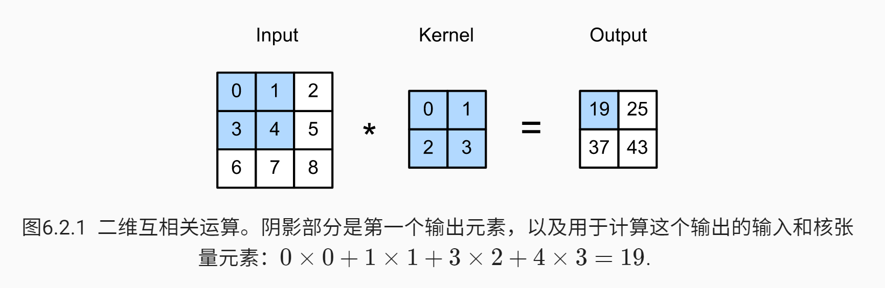
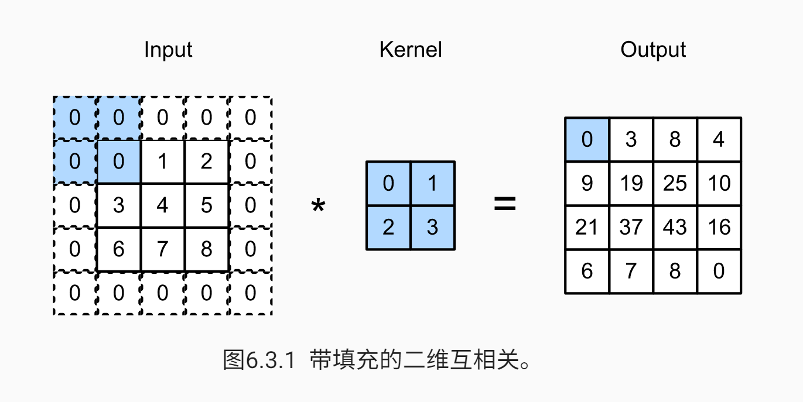
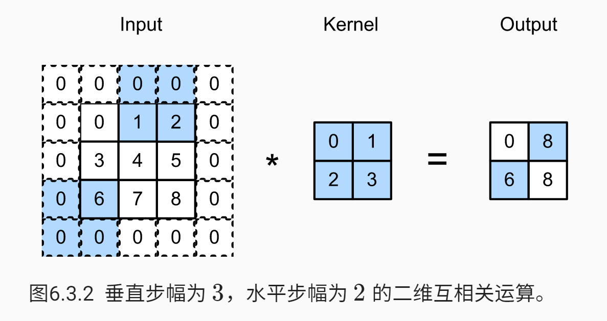
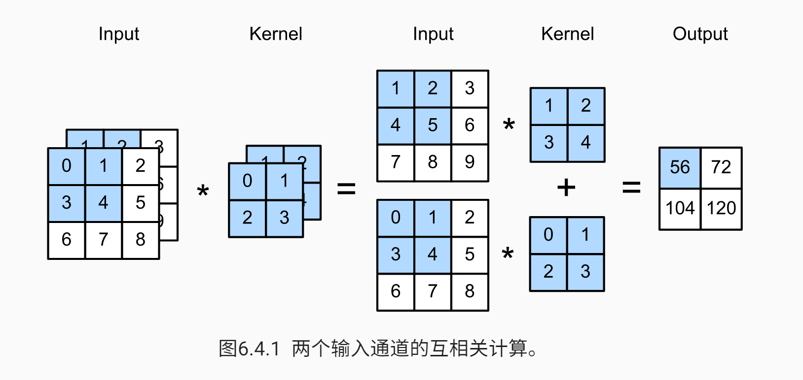
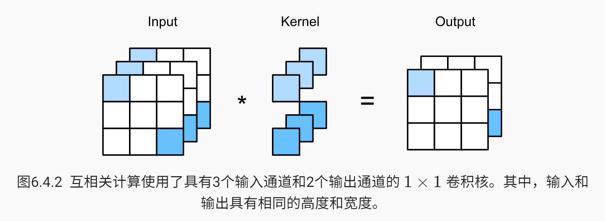
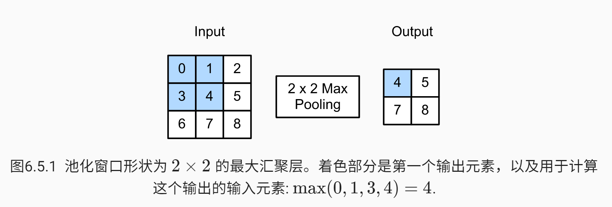
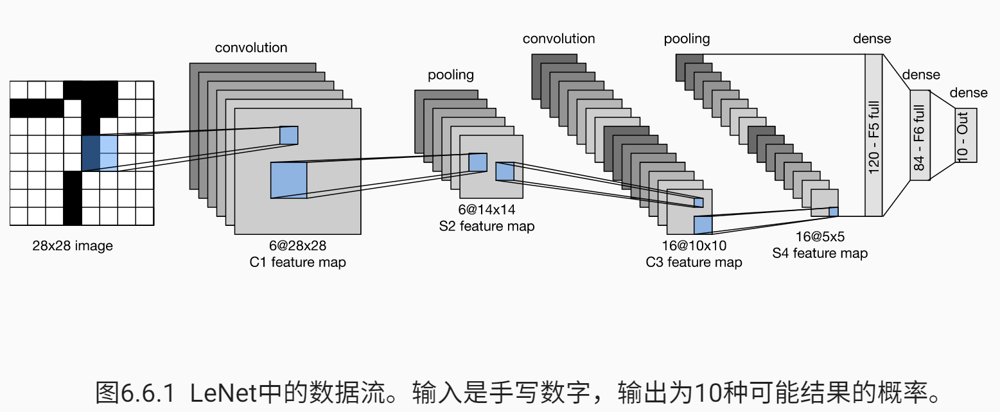
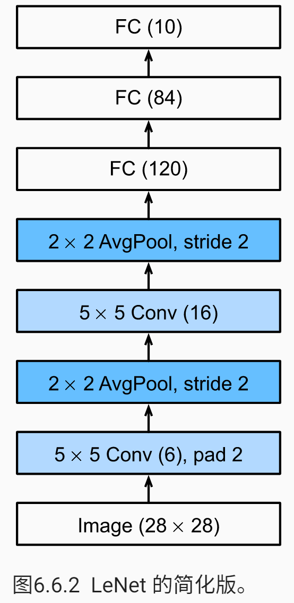
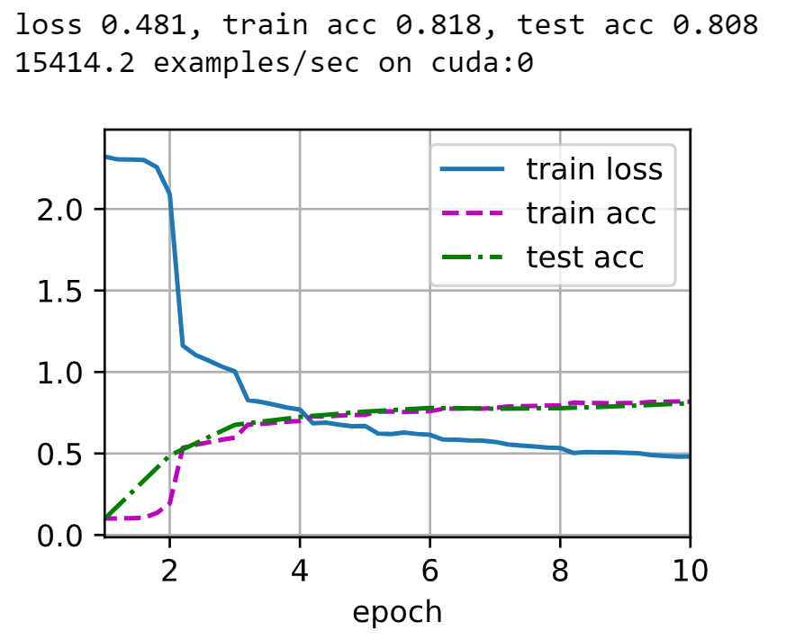

## 卷积神经网络

### 从全连接层到卷积

- 多层感知机十分适合处理表格数据，其中行对应样本，列对应特征，然而对于高维感知数据，这种缺少结构的网络可能会变得不实用。

- 不变性：

  - 平移不变性：不管检测对象出现在图像中的哪个位置，神经网络的前面几层应该都对相同的图像区域具有相似的反应。 
  - 局部性：神经网络的前面几层应该只探索输入图像中的局部区域，而不过度在意图像中相隔较远区域的关系。最终，在后续神经网络，整个图像级别上可以集成这些局部特征用于预测。

- 限制多层感知机：输入和隐藏表示都拥有空间结构（二位张量）

  为了使每个隐藏神经元都能接收到每个输入像素的信息，将参数从权重矩阵替换为四阶权重张量 $\mathsf{W}$，假设 $\mathbf{U}$ 包含偏置参数，则全连接层：
  $$
  \begin{split}\begin{aligned} \left[\mathbf{H}\right]_{i, j} &= [\mathbf{U}]_{i, j} + \sum_k \sum_l[\mathsf{W}]_{i, j, k, l} [\mathbf{X}]_{k, l}\\ &= [\mathbf{U}]_{i, j} + \sum_a \sum_b [\mathsf{V}]_{i, j, a, b} [\mathbf{X}]_{i+a, j+b}.\end{aligned}\end{split}\
  $$
  从 $\mathsf{W}$ 到 $\mathsf{V}$ 的转换只是形式上的转换，因为在这两个四阶张量的元素之间存在一一对应的关系。只需重新索引下标 $(k,l)$，使 $k=i+a、l=j+b$，由此可得 $[\mathsf{V}]_{i,j,a,b}=[\mathsf{W}]_{i,j,i+a,j+b}$ 索引 $a$ 和 $b$ 通过在正偏移和负偏移之间移动覆盖了整个图像。对于隐藏表示中任意给定位置 $(i,j)$ 处的像素值 $[\mathbf{H}]_{i,j}$，可以通过在 $x$ 中以 $(i,j)$ 为中心对像素进行加权求和得到，加权使用的权重为 $[\mathsf{V}]_{i,j,a,b}$

  - 平移不变性：意味着检测对象在 $\mathbf{X}$ 中的平移，应该仅仅导致隐藏表示 $\mathbf{H}$ 中的平移，也就是说，$\mathsf{V}$ 和 $\mathbf{U}$ 实际上不依赖于 $(i,j)$ 的值，即 $[\mathsf{V}]_{i,j,a,b}=[\mathbf{V}]_{a,b}$。并且 $\mathbf{U}$ 是一个常数，比如 $u$。因此，可以简化 $\mathbf{H}$ 定义为：
    $$
    [\mathbf{H}]_{i, j} = u + \sum_a\sum_b [\mathbf{V}]_{a, b} [\mathbf{X}]_{i+a, j+b}.
    $$
    这就是卷积（convolution）。我们是在使用系数 $[\mathbf{V}]_{a,b}$ 对位置 $(i,j)$ 附近的像素 $(i+a,j+b)$ 进行加权得到 $[\mathbf{H}]_{i,j}$。$[\mathbf{V}]_{a,b}$ 的系数比 $[\mathsf{V}]_{i,j,a,b}$ 少很多，因为前者不再依赖于图像中的位置，即图像中每个位置对应的 $\mathsf{V}$ 都一样（一张图只有一个 $\mathsf{V}$ —— 卷积核）。所以，可以认为**卷积实际上就是全连接层的共享权重**，所有位置 $(i,j)$ 共享一个 $\mathsf{V}$。

  - 局部性：为了收集用来训练参数 $[\mathbf{H}]_{i,j}$ 的相关信息，不应偏离到距 $(i,j)$ 很远的地方。这意味着在 $|a|\gt \Delta$ 或 $|b| \gt \Delta$ 的范围之外，设置 $[\mathbf{V}]_{a,b}=0$，则：
    $$
    [\mathbf{H}]_{i,j}=u+\sum_{a=-\Delta}^\Delta\sum_{b=-\Delta}^\Delta[\mathbf{V}]_{a,b}[\mathbf{X}]_{i+a,j+b}
    $$

  $\mathbf{V}$ 被称为卷积核（convolution kernel）或者滤波器（filter），它仅仅是可学习的一个层的权重。当图像处理的局部区域很小时，卷积神经网络与多层感知机的训练差异可能是巨大的：以前，多层感知机可能需要数十亿个参数来表示网络中的一层，而现在卷积神经网络通常只需要几百个参数，而且不需要改变输入或隐藏表示的维数。参数大幅减少的代价是，我们的特征现在是平移不变的，并且当确定每个隐藏激活的值时，每一层只能包含局部的信息。

  > 卷积是特殊的全连接：对全连接层使用平移不变性和局部性得到卷积层

  以上所有的权重学习都将依赖于归纳偏置。当这种偏置与现实相符时，我们就能得到样本有效的模型，并且这些模型能很好地泛化到未知数据中。 但如果这偏置与现实不符时，比如当图像不满足平移不变时，我们的模型可能难以拟合我们的训练数据。

- 卷积：

  - 数学中，两个函数的卷积被定义为：
    $$
    (f*g)(\mathbf{x})=\int f(\mathbf{z}) g(\mathbf{x}-\mathbf{z}) d\mathbf{z}
    $$
    也就是说，卷积是测量 $f$ 和 $g$ 之间（把其中一个函数翻转并移位 $\mathbf{x}$ 时）的重叠。当我们有离散对象时，积分就变成求和。

  - 离散定义：
    $$
    (f * g)(i) = \sum_a f(a) g(i-a)
    $$
    对于二维张量：
    $$
    (f * g)(i, j) = \sum_a\sum_b f(a, b) g(i-a, j-b)
    $$

- 通道：

  - 图像不是二维张量，而是一个由高度、宽度和颜色组成的三维张量。前两个轴与像素的空间位置相关，而第三个轴可以看作是每个像素的多维表示。将 $\mathsf{X}$ 索引为 $[\mathsf{X}]_{i,j,k}$，卷积相应地调整为 $[\mathsf{V}]_{a,b,c}$ 而不是 $[\mathbf{V}]_{a,b}$。

  - 由于输入图像是三维的，隐藏表示 $\mathsf{H}$ 也最好采用三维张量。即对于每个空间位置，我们想要采用一组而不是一个隐藏表示。这样一组隐藏表示可以想象成一些相互堆叠的二维网格。因此，我们可以把隐藏表示想象为一系列具有二维张量的通道，这些通道有时也被称为特征映射，因为每个通道都向后续层提供一组空间化的学习特征。直观上你可以想象在靠近输入的底层，一些通道专门识别边，而其他通道专门识别纹理。

  - 为了支持输入 $\mathsf{X}$ 和隐藏表示 $\mathsf{H}$ 中的多个通道，我们可以在 $\mathsf{V}$ 中添加第四个坐标：
    $$
    [\mathsf{H}]_{i,j,d} = \sum_{a = -\Delta}^{\Delta} \sum_{b = -\Delta}^{\Delta} \sum_c [\mathsf{V}]_{a, b, c, d} [\mathsf{X}]_{i+a, j+b, c}
    $$
    其中隐藏表示 $\mathsf{H}$ 中的 $d$ 索引表示输出通道（可以理解为卷积核的个数），而随后的输出将继续以三维张量 $\mathsf{H}$ 作为输入进入下一个卷积层。

    

  - 多个输入和输出通道使模型在每个空间位置可以获取图像的多方面特征。

### 图像卷积

- 卷积层的计算是互相关计算

  

  

- 输出大小略小于输入大小，这是因为卷积核的宽度和高度大于 1，而卷积核只与图像中每个大小完全适合的位置进行互相关运算，设输入大小为 $n_h \times n_w$，卷积核大小为 $k_h \times k_w$，则输出大小为：
  $$
  (n_h - k_h + 1) \times (n_w - k_w + 1)
  $$

  ```python
  def corr2d(X, K):
      '''计算二维互相关运算'''
      h, w = K.shape
      Y = torch.zeros((X.shape[0] - h + 1, X.shape[1] - w + 1))
      for i in range(Y.shape[0]):
          for j in range(Y.shape[1]):
              Y[i, j] = (X[i: i + h, j: j + w] * K).sum()
      return Y
  ```

- 卷积层：卷积层对输入和卷积核权重进行互相关运算，并在添加标量偏置之后产生输出。所以，卷积层中的两个被训练的参数是卷积核权重和标量偏置。

  ```python
  class Conv2D(nn.Module):
      def __init__(self, kernel_size):
          super().__init__()
          self.weight = nn.Parameter(torch.rand(kernel_size))
          self.bias = nn.Parameter(torch.zeros(1))
          
      def forward(self, x):
          return corr2d(x, self.weight) + self.bias
  ```

- 边缘检测学习卷积核：

  ```python
  X = torch.ones((6, 8))
  X[:, 2: 6] = 0
  K = torch.tensor([[1.0, -1.0]]) 
  # 当进行互相关运算时，如果水平相邻的两元素相同，则输出为零，否则输出为非零。
  Y = corr2d(X, K)
  
  # 构造一个二维卷积层，它具有 1 个输出通道和形状为 (1, 2) 的卷积核
  conv2d = nn.Conv2d(1, 1, kernel_size=(1, 2), bias=False)
  # conv2d = Conv2D((1, 2))
  
  # 四维输入格式和输入格式
  # （批量大小，通道，高度，宽度）
  X = X.reshape((1, 1, 6, 8))
  Y = Y.reshape((1, 1, 6, 7))
  
  for i in range(10):
      Y_hat = conv2d(X)
      l = (Y_hat - Y) ** 2
      conv2d.zero_grad()
      l.sum().backward()
      # 迭代卷积核
      conv2d.weight.data[:] -= 3e-2 * conv2d.weight.grad
      if (i + 1) % 2 == 0:
          print(f'batch {i+1}, loss {l.sum():.3f}')
  ```

- 互相关运算与卷积运算：它们差别不大，为了得到严格卷积运算输出，我们只需水平和垂直翻转二维卷积核张量，然后对输入张量执行*互相关*运算。由于卷积核是从数据中学习到的，因此无论这些层执行严格的卷积运算还是互相关运算，卷积层的输出都不会受到影响。

- 特征映射（特征图 Feature Map）：卷积层的输出，因为它可以被视为一个输入映射到下一层的空间维度的转换器。

- 感受野（Receptive Field）：对于某一层的任意元素 $x$，其感受野是指在前向传播期间可能影响 $x$ 计算的所有元素（来自所有先前层）。

  感受野的覆盖率可能大于某层输入的实际区域大小：以<a href="#cov">上图</a>为例，给定 $2\times 2$ 卷积核，阴影输出元素值 19 的接收域是输入阴影部分的四个元素。假设之前输出为 $\mathbf{Y}$，其大小为 $2\times 2$，现在我们在其后附加一个卷积层，该卷积层以 $\mathbf{Y}$ 为输入，输出单个元素 $z$。在这种情况下，$\mathbf{Y}$ 上的 $z$ 的接受字段包括 $\mathbf{Y}$ 的所有四个元素，而输入的感受野包括最初所有九个输入元素。因此，**当一个特征图中的任意元素需要检测更广区域的输入特征时，我们可以构建一个更深的网络。**

### 填充和步幅

- 有时，在应用了连续的卷积之后，最终的输出远小于输入大小，这是由于卷积核的高度和宽度通常大于 1 所导致的，原始图像的边界丢失了许多有用信息，解决方法则是**填充**。

  

  如果添加 $p_h$ 行填充（一半顶部，一半底部）和 $p_w$ 列填充（一半左边，一半右边），则输出形状为：
  $$
  (n_h-k_h+p_h+1)\times (n_w-k_w+p_w+1)
  $$

  - 为了使输入和输出具有形同的高度和宽度，则可以设置 $p_h=k_h-1$ 和 $p_w=k_w-1$。

  - 卷积神经网络中卷积核的高度和宽度通常为奇数，这样就可以保持在顶部和底部填充相同数量的行，在左侧和右侧填充相同数量的列。

    ```python
    # 此函数初始化卷积层权重，并对输入和输出提高和缩减相应的维度
    def comp_conv2d(conv2d, X):
        X = X.reshape((1, 1) + X.shape) # 批量大小和通道数都是 1
        Y = conv2d(X)
        # 省略前两个维度：批量大小和通道
        return Y.reshape(Y.shape[2:])
    
    conv2d = nn.Conv2d(1, 1, kernel_size=3, padding=1) # 每边填充 1 列/行
    X = torch.rand(size=(8, 8))
    comp_conv2d(conv2d, X).shape
    
    >>> torch.Size([8, 8])
    ```

  - 在保证输入与输出具有相同高度与宽度、卷积核为奇数后，同时也可以保证输出 $Y[i,j]$ 是通过以输入 $X[i,j]$ 为中心与卷积核进行互相关计算得到的。

  - 当卷积内核的高度和宽度不同时，我们可以填充不同的高度和宽度，使输出和输入具有相同的高度和宽度。

- 如果希望大幅度降低图像的宽度和高度，例如发现原始的输入分辨率十分冗余，解决方法则是**步幅**。

  - 卷积窗口在输入张量上每次滑动的元素数量为步幅，默认步幅是 1.

  

  当垂直步幅为 $s_h$、水平步幅为 $s_w$ 时，输出形状为：
  $$
  \lfloor(n_h-k_h+p_h+s_h)/s_h\rfloor \times \lfloor(n_w-k_w+p_w+s_w)/s_w\rfloor
  $$
  如果设置了 $p_h=k_h-1$ 和 $p_w=k_w-1$，则输出形状可以简化为：
  $$
  \lfloor(n_h+s_h-1)/s_h\rfloor \times \lfloor(n_w+s_w-1)/s_w\rfloor
  $$
  如果进一步，输入的高度和宽度可以被垂直和水平步幅整除，则输出形状为：
  $$
  (n_h/s_h) \times (n_w/s_w)
  $$

  ```python
  conv2d = nn.Conv2d(1, 1, kernel_size=3, padding=1, stride=2)
  comp_conv2d(conv2d, X).shape
  
  >>> torch.Size([4, 4])
  ```

- 填充和步幅可用于有效地调整数据的维度。默认情况下，填充为 1，步幅为 0，并且很少使用不一致的步幅与填充，即通常 $p_h=p_w$ 和 $s_h=s_w$。

### 多输入多输出通道

- 多输入通道：当输入包含多个通道时，需要构造一个与输入数据具有相同输入通道数目的卷积核。假设输入和卷积核都有 $c_i$ 个通道，我们可以对每个通道输入的二维张量和卷积核的二位张量进行互相关运算，再对通道求和（将 $c_i$ 个结果相加）得到二维张量。

  

  ```python
  def corr2d_multi_in(X, K):
      # 先遍历 X 和 K 的第 0 个维度（输入通道维度），再把他们加在一起
      return sum(corr2d(x, k) for x, k in zip(X, K))
  ```

- 多输出通道：随着神经网络层数的加深，我们常会增加输出通道的维数，通过减少空间分辨率以获得更大的通道深度。直观地说，我们可以将**每个通道看作是对不同特征的响应**。而现实可能更为复杂一些，因为每个通道不是独立学习的，而是为了共同使用而优化的。因此，多输出通道并不仅是学习多个单通道的检测器。

  用 $c_i$ 和 $c_o$ 分别表示输入和输出通道的数目，我们可以为每个输出通道创建一个形状为 $c_i\times k_h \times k_w$ 的卷积核张量（即但输出通道情况下的卷积核），这样卷积核的形状为 $c_o\times c_i\times k_h\times k_w$。在互相关运算中，每个输出通道先获取所有输入通道，再以对应该输出通道的卷积核计算出结果。

  ```python
  def corr2d_multi_in_out(X, K):
      # 迭代 K 的第 0 个维度，每次都对输入 X 执行多输入通道互相关运算
      # 最后将所有结果都叠加在一起
      return torch.stack([corr2d_multi_in(X, k) for k in K], 0)
  ```

- $1\times 1$ 卷积层：它失去了卷积层的特有能力——在高度和宽度维度上，识别相邻元素间相互作用的能力，但这个卷积核的唯一计算发生在通道上：

  

  输出中的每个元素都是从输入图像中同一位置的元素的线性组合，我们可以将 $1\times 1$ 卷积层看作是在每个像素位置应用的**全连接层**，以 $c_i$ 个输入值转换为 $c_0$ 个输出值。但因为这仍然是一个卷积层，所以跨像素的权重是一致的（平移不变性）。

  ```python
  def corr2d_multi_in_out_1x1(X, K):
      c_i, h, w = X.shape
      c_o = K.shape[0]
      X = X.reshape((c_i, h * w))
      K = K.reshape((c_o, c_i))
      # 全连接层中的矩阵乘法
      Y = torch.matmul(K, X)
      return Y.reshape((c_o, h, w))
  ```

  $1\times1$ 卷积层通常用于调整网络层的通道数量和控制模型复杂性。

### 汇聚层

- 通常当我们处理图像时，我们希望逐渐降低隐藏表示的空间分辨率，聚集信息，这样随着我们在神经网络中层叠的上升，每个神经元对其敏感的感受野（输入）就越大。

- 而我们的机器学习任务通常会跟全局图像的问题有关，所以我们最后一层的神经元应该对整个输入的全局敏感。通过逐渐聚合信息，生成越来越粗糙的映射，最终实现学习全局表示的目标，同时将卷积图层的所有优势保留在中间层。

- 此外，当检测较底层的特征时，我们通常希望这些特征保持某种程度上的平移不变性。例如可能图像的边缘会有一个像素的移位，最后卷积输出的结果可能会相差很大，也就是说卷积层对位置太过敏感。

- **汇聚层的目的：降低卷积层对位置的敏感性；降低对空间降采样表示的敏感性。**

- 汇聚层与卷积层类似，有一个固定形状的窗口，该窗口根据其步幅大小在输入的所有区域上滑动，为汇聚窗口遍历的每个位置计算一个输出。但这个计算并不是互相关运算，汇聚层不包含参数。汇聚层运算符是确定性的，通常计算汇聚窗口中所有元素的最大值或平均值（这使得卷积层能够容忍窗口大小的位置误差）。

- 最大汇聚层：

  

  使用了该 $2\times 2$ 的最大汇聚层，即使在高度或宽度上移动一个元素，卷积层仍然可以识别到模式。

  ```python
  def pool2d(X, pool_size, mode='max'):
      p_h, p_w = pool_size
      Y = torch.zeros((X.shape[0] - p_h + 1, X.shape[1] - p_w + 1))
      for i in range(Y.shape[0]):
          for j in range(Y.shape[1]):
              if mode == 'max':
                  Y[i, j] = X[i: i + p_h, j: j + p_w].max()
              elif mode == 'avg':
                  Y[i, j] = X[i: i + p_h, j: j + p_w].mean()
      return Y
  ```

- 填充和步幅：与卷积层一样，汇聚层也可以改变输出形状。**默认情况下，步幅与窗口大小相同。**使用最大汇聚层以及大于 1 的步幅，可减少空间维度（如高度和宽度）。

  - 默认的 $3\times 3$ 汇聚窗口：

    ```python
    X = torch.arange(16, dtype=d2l.float32).reshape((1, 1, 4, 4))
    # 前两个维度是样本数和通道数
    
    pool2d = nn.MaxPool2d(3) # 窗口大小 3 x 3，步幅也是 3
    pool2d(X)
    
    >>> tensor([[[[10.]]]])
    ```

  - 手动设定填充和步幅：

    ```python
    pool2d = nn.MaxPool2d(3, padding=1, stride=2)
    pool2d(X)
    
    >>> tensor([[[[ 5.,  7.],
              	  [13., 15.]]]])
    ```

- 多个通道：在处理多通道输入数据时，汇聚层**在每个输入通道上单独运算**，而不是像卷积层一样在通道上对输入进行汇总，这意味着**汇聚层的输出通道数与输入通道数相同**。

  ```python
  X = torch.cat((X, X + 1), 1) # 构建两个输入通道
  pool2d = nn.MaxPool2d(3, padding=1, stride=2)
  pool2d(X)
  
  >>> tensor([[[[ 5.,  7.],
            	  [13., 15.]],
  
           	 [[ 6.,  8.],
            	  [14., 16.]]]])
  ```

### 卷积神经网络（LeNet）

- 用卷积层代替全连接层的好处是：可以在图像中保留空间结构；更简洁的模型所需的参数更少。

- LeNet 由两个部分组成：卷积编码器-由两个卷积层组成；全连接层密集块：由三个全连接层组成：

  

  - 每个卷积块中的基本单元是一个卷积层、一个 Sigmoid 激活函数和平均汇聚层（ReLU 和最大汇聚层更有效，但当时还未出现）。每个卷积层使用 $5\times 5$ 卷积核和一个 Sigmoid 激活函数，这些层将输入映射到多个二维特征输出，通常同时增加通道的数量。第一个卷积层有 6 个输出通道，第二个则有 16 个。每个 $2\times 2$ 汇聚操作，通过空间下采样将维度减少 4 倍。
  - 为了将卷积块的输出传递给稠密块，我们必须在小批量中展平每个样本，即将四维输入转换成全连接层所期望的二维输入，第一维索引小批量中的样本，第二维给出每个样本的平面向量表示。三个全连接层的维度是 120、84、10.

  ```python
  class Reshape(torch.nn.Module):
      def forward(self, x):
          return x.view(-1, 1, 28, 28)
      
  net = torch.nn.Sequential(
      Reshape(),
      nn.Conv2d(1, 6, kernel_size=5, padding=2), # 输入通道，输出通道
      nn.Sigmoid(),
      nn.AvgPool2d(kernel_size=2, stride=2),
      nn.Conv2d(6, 16, kernel_size=5),
      nn.Sigmoid(),
      nn.AvgPool2d(kernel_size=2, stride=2),
      nn.Flatten(), # 保持批量数不变，将后面几个维度平铺
      nn.Linear(16 * 5 * 5, 120),
      nn.Sigmoid(),
      nn.Linear(120, 84),
      nn.Sigmoid(),
      nn.Linear(84, 10)
  )
  ```

  

- 模型训练：

  ```python
  batch_size = 256
  train_iter, test_iter = d2l.load_data_fashion_mnist(batch_size=batch_size)
  
  # 该训练函数假定从高级 API 创建的模型作为输入，并进行相应的优化
  def train_ch6(net, train_iter, test_iter, num_epochs, lr, device):
      '''用 GPU 训练模型'''
      def init_weights(m):
          if type(m) == nn.Linear or type(m) == nn.Conv2d:
              nn.init.xavier_uniform_(m.weight)
      net.apply(init_weights)
      print('training on', device)
      net.to(device)
      optimizer = torch.optim.SGD(net.parameters(), lr=lr)
      loss = nn.CrossEntropyLoss()
      animator = d2l.Animator(xlabel='epoch', xlim=[1, num_epochs],
                              legend=['train loss', 'train acc', 'test acc'])
      timer, num_batches = d2l.Timer(), len(train_iter)
      for epoch in range(num_epochs):
          # 训练损失之和，训练准确数量之和，范例数
          metric = d2l.Accumulator(3)
          net.train()
          for i, (X, y) in enumerate(train_iter):
              timer.start()
              optimizer.zero_grad()
              X, y = X.to(device), y.to(device)
              y_hat = net(X)
              l = loss(y_hat, y) # 交叉熵损失会自动取平均
              l.backward()
              optimizer.step()
              with torch.no_grad():
                  metric.add(l * X.shape[0], d2l.accuracy(y_hat, y), X.shape[0])
              timer.stop()
              train_l = metric[0] / metric[2]
              train_acc = metric[1] / metric[2]
              if (i + 1) % (num_batches // 5) == 0 or i == num_batches - 1:
                  animator.add(epoch + (i + 1) / num_batches,
                               (train_l, train_acc, None))
          test_acc = evaluate_accuracy_gpu(net, test_iter)
          animator.add(epoch + 1, (None, None, test_acc))
      print(f'loss {train_l:.3f}, train acc {train_acc:.3f}, '
            f'test acc {test_acc:.3f}')
      print(f'{metric[2] * num_epochs / timer.sum():.1f} examples/sec '
            f'on {str(device)}')
  ```

  

- 总结：

  - 在卷积神经网络中，我们组合使用卷积层、非线性激活函数和汇聚层。
  - 为了构造高性能的卷积神经网络，我们通常对卷积层进行排列，逐渐降低其表示的空间分辨率，同时增加通道数。
  - 在传统的卷积神经网络中，卷积块编码得到的表征在输出之前需由一个或多个全连接层进行处理。