## 现代卷积神经网络

### 深度卷积神经网络（AlexNet）

- 学习表征：之前图像特征都是机械地计算出来的，但一些研究人员认为特征本身应该被学习。

  AlexNet 网络的最底层，模型学习到了一些类似于传统滤波器的特征抽取器，而它的更高层建立在这些底层表示的基础上，以表示更大的特征，如眼睛、鼻子等。最终的隐藏神经元可以学习图像的综合表示，从而使属于不同类别的数据易于区分。

- AlexNet 架构：AlexNet 由八层组成：五个卷积层、两个全连接隐藏层和一个全连接输出层。其次，AlexNet 使用 ReLU 而不是 sigmoid 作为其激活函数，并且使用 Dropout 控制全连接层的模型复杂度（LeNet 只使用了权重衰减）。

  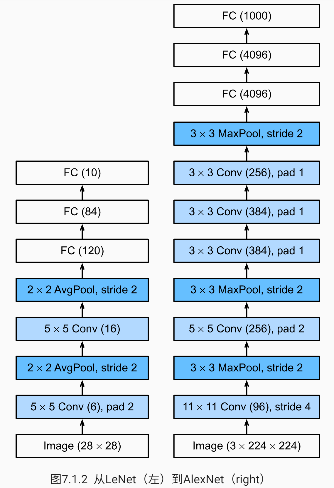

- 当 sigmoid 激活函数的输出非常接近于 0 或 1 时，这些区域的梯度几乎为 0，因此反向传播无法继续更新一些模型参数。相反，ReLU 激活函数在正区间的梯度总是 1。因此，如果模型参数没有正确初始化，sigmoid 函数可能在正区间内得到几乎为 0 的梯度，从而使模型无法得到有效的训练。

- 实现：

  ```python
  net = nn.Sequential(
      # 这里，我们使用一个 11*11 的更大窗口来捕捉对象
      # 同时，步幅为 4，以减少输出的高度和宽度
      # 另外，输出通道的数目远大于 LeNet
      nn.Conv2d(1, 96, kernel_size=11, stride=4, padding=1),
      nn.ReLU(),
      nn.MaxPool2d(kernel_size=3, stride=2),
      # 减小卷积窗口，使用填充为 2 来使得输入和输出的高和宽一致，且增大输出通道数
      nn.Conv2d(96, 256, kernel_size=5, padding=2),
      nn.ReLU(),
      nn.MaxPool2d(kernel_size=3, stride=2),
      # 使用三个连续的卷积层和较小的卷积窗口
      # 除了最后的卷积层，输出通道的数量进一步增加
      # 在前两个卷积层之后，不用汇聚层来减少输入的高度和维度
      nn.Conv2d(256, 384, kernel_size=3, padding=1),
      nn.ReLU(),
      nn.Conv2d(384, 384, kernel_size=3, padding=1),
      nn.ReLU(),
      nn.Conv2d(384, 256, kernel_size=3, padding=1),
      nn.ReLU(),
      nn.MaxPool2d(kernel_size=3, stride=2),
      nn.Flatten(),
      # 这里全连接层的输出数量是 LeNet 中的好几倍，使用 Dropout 层来减轻过度拟合
      nn.Linear(6400, 4096),
      nn.ReLU(),
      nn.Dropout(p=0.5),
      nn.Linear(4096, 4096),
      nn.ReLU(),
      nn.Dropout(p=0.5),
      # 最后是输出层，由于这里使用 Fashion-MNIST，所以类别数为 10
      nn.Linear(4096, 10)
  )
  ```

- 训练：

  ```python
  batch_size = 128
  train_iter, test_iter = d2l.load_data_fashion_mnist(batch_size, resize=224) # 调整分辨率
  
  lr, num_epochs = 0.01, 10
  train_ch6(net, train_iter, test_iter, num_epochs, lr, d2l.try_gpu())
  ```

  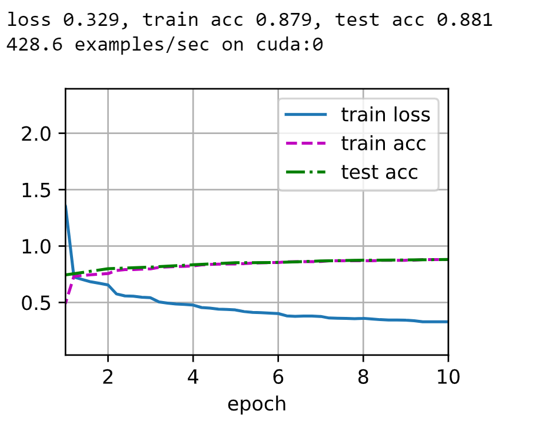

### 使用块的网络（VGG）

- 经典卷积神经网络的基本组成部分是：

  1. 带填充以保持分辨率的卷积层
  2. 非线性激活函数，如 ReLU
  3. 汇聚层，如最大汇聚层

- 一个 VGG 块与之类似，由一系列卷积层组成，后面再加上用于空间下采样的最大汇聚层：

  1. $3\times 3$ 卷积核，填充为 1（保持高宽）
  2. $2\times 2$ 汇聚窗口，步幅为 2（每个块后的分辨率减半）的最大汇聚层

  ```python
  def vgg_block(num_convs, in_channels, out_channels):
      layers = []
      for _ in range(num_convs):
          layers.append(nn.Conv2d(in_channels, out_channels, kernel_size=3, padding=1))
          layers.append(nn.ReLU())
          in_channels = out_channels
      layers.append(nn.MaxPool2d(kernel_size=2, stride=2))
      return nn.Sequential(*layers)
  ```

- VGG 网络可以分为两部分：

  1. 卷积层 + 汇聚层（VGG 块）
  2. 全连接层

  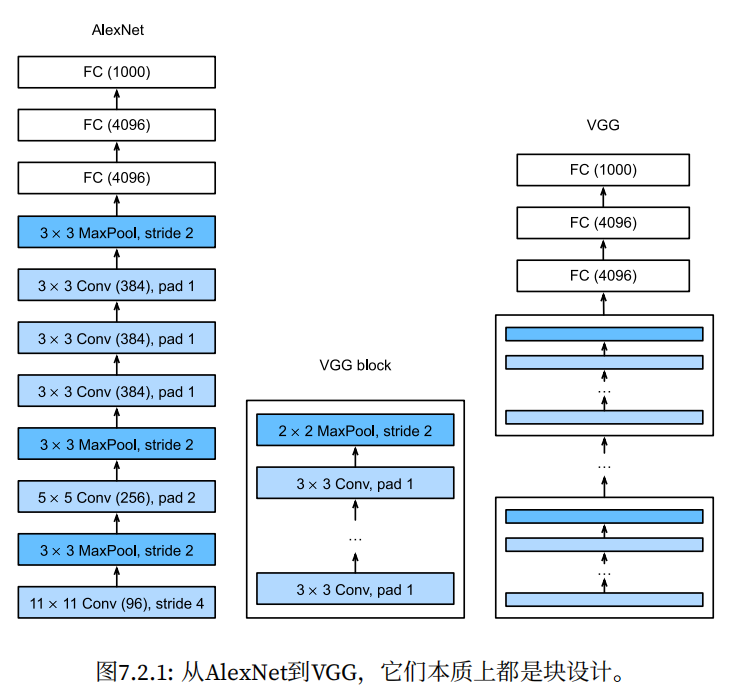

  每个 VGG 块中卷积层的个数和输出的通道数是超参数。原始 VGG 网络中由 5 个卷积块，前两个块各有一个卷积层，后三个块各包含两个卷积层，每个后续模块将输出通道数量翻倍（直到 512）。由于该网络使用了 8 个卷积层和 3 个全连接层，因此被称为 VGG-11。

  ```python
  conv_arch = ((1, 64), (1, 128), (2, 256), (2, 512), (2, 512))
  
  def vgg(conv_arch):
      conv_blks = []
      in_channels = 1
      # 卷积层部分
      for (num_convs, out_channels) in conv_arch:
          conv_blks.append(vgg_block(num_convs, in_channels, out_channels))
          in_channels = out_channels
      
      return nn.Sequential(
          *conv_blks, # 块嵌套
          nn.Flatten(),
          # 全连接层部分
          nn.Linear(out_channels * 7 * 7, 4096),
          nn.ReLU(),
          nn.Dropout(0.5),
          nn.Linear(4096, 4096),
          nn.ReLU(),
          nn.Dropout(0.5),
          nn.Linear(4096, 10)
      )
  
  net = vgg(conv_arch)
  ```

- 训练：由于 VGG-11 比 AlexNet 计算量更大，因此我们构建了一个通道数较少的网络，足够用于训练 Fashion-MNIST 数据集。

  ```python
  ratio = 4 # 通道数变为 1/4
  small_conv_arch = [(pair[0], pair[1] // ratio) for pair in conv_arch]
  net = vgg(small_conv_arch)
  
  lr, num_epochs, batch_size = 0.05, 10, 128
  train_iter, test_iter = d2l.load_data_fashion_mnist(batch_size, resize=224)
  train_ch6(net, train_iter, test_iter, num_epochs, lr, d2l.try_gpu())
  ```

  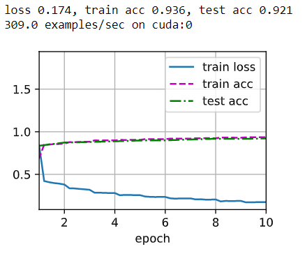

- 深层且窄的卷积（即 $3\times3$）⽐较浅层且宽的卷积更有效。

### 网络中的网络（NiN）

- LeNet、AlexNet 和 VGG 都是通过一系列的卷积层和汇聚层来提取空间结构特征，然后通过全连接层对特征的表征进行处理，但如果使用了稠密层，可能会完全放弃表征的空间结构；而 NiN 提供了一个简单的解决方案：在每个像素的通道上分别使用多层感知机。

- NiN 的想法是在每个像素位置应用一个全连接层，即使用 $1\times 1$ 的卷积层；从另一个角度看，即将空间维度中的每个像素视为单个样本，将通道维度视为不同的特征。

- NiN 块以一个普通卷积层开始，后面是两个 $1\times1$ 的卷积层，这两个 $1\times1$ 的卷积层充当带有 ReLU 激活函数的逐像素全连接层。

  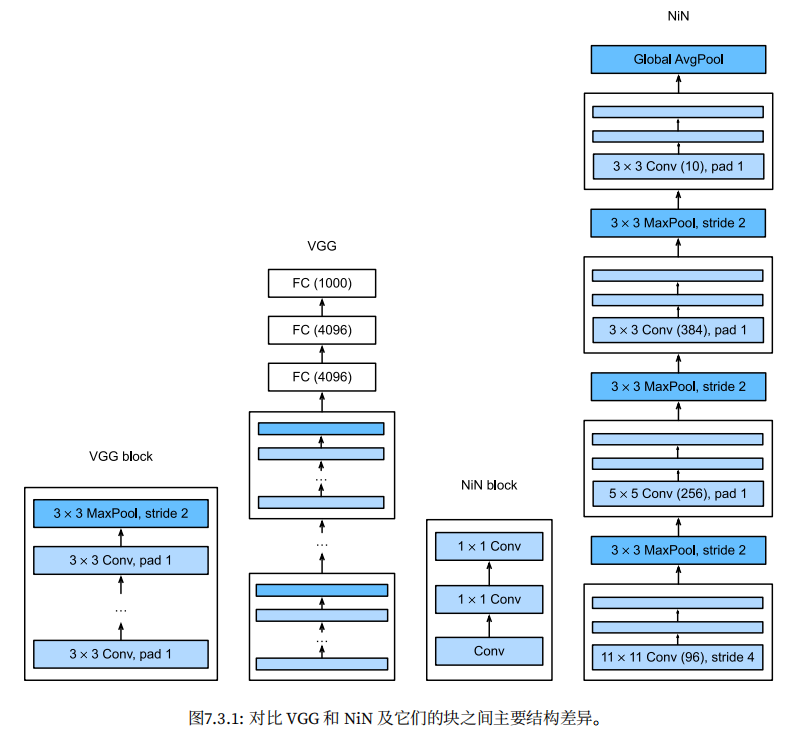

  ```python
  def nin_block(in_channels, out_channels, kernel_size, strides, padding):
      return nn.Sequential(
          nn.Conv2d(in_channels, out_channels, kernel_size, strides, padding),
          nn.ReLU(),
          nn.Conv2d(out_channels, out_channels, kernel_size=1),
          nn.ReLU(),
          nn.Conv2d(out_channels, out_channels, kernel_size=1),
          nn.ReLU()
      )
  ```

- NiN 网络：使用窗口形状为 $11\times11$、$5\times5$ 和 $3\times3$ 的卷积层，输出通道数量与 AlexNet 中的相同。每个 NiN 块后有一个最大汇聚层，汇聚窗口形状为 $3\times3$，步幅为 2。

  NiN 和 AlexNet 的最大区别是：NiN **完全取消了全连接层（减少过拟合与参数）**，使用了一个 NiN 块（最后一块），其输出通道数等于标签类别的数量，最后放一个全局平均汇聚层，生成一个多元逻辑向量（logits）。所以它的优点是，显著减少了模型所需参数的数量。

  ```python
  net = nn.Sequential(
      nin_block(1, 96, kernel_size=11, strides=4, padding=0),
      nn.MaxPool2d(3, stride=2),
      nin_block(96, 256, kernel_size=5, strides=1, padding=2),
      nn.MaxPool2d(3, stride=2),
      nin_block(256, 384, kernel_size=3, strides=1, padding=1),
      nn.MaxPool2d(3, stride=2),
      nn.Dropout(0.5),
      # 标签类别数是 10
      nin_block(384, 10, kernel_size=3, strides=1, padding=1),
      nn.AdaptiveAvgPool2d((1, 1)), # 指定输出形状：（批量大小，通道数-10，1，1）
      # 将四维的输出转成二维的输出，其形状为（批量大小，10）
      nn.Flatten()
  )
  ```

- 训练：

  ```python
  lr, num_epochs, batch_size = 0.1, 10, 128
  train_iter, test_iter = d2l.load_data_fashion_mnist(batch_size, resize=224)
  train_ch6(net, train_iter, test_iter, num_epochs, lr, d2l.try_gpu())
  ```

  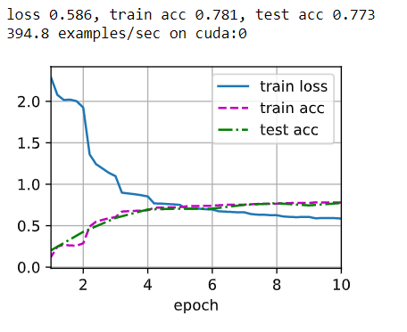

### 含并行连结的网络（GoogleNet）

- Inception 块：由四条并行路径组成。前三条路径使用窗口大小为 $1\times1$、$3\times3$ 和 $5\times5$ 的卷积层，从不同空间大小中提取信息。 中间的两条路径在输入上执行 $1\times1$ 卷积，以减少通道数，从而降低模型的复杂性。第四条路径使用 $3\times3$ 最大汇聚层，然后使用 $1\times1$ 卷积层来改变（减少）通道数。这四条路径都使用合适的填充来使输入与输出的高和宽一致，最后我们将每条线路的输出在通道维度上连结，并构成 Inception 块的输出。在 Inception 块中，通常调整的超参数是每层输出通道的数量。

  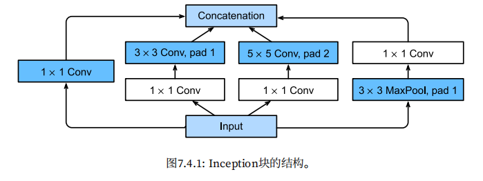

  ```python
  class Inception(nn.Module):
      # `c1`--`c4` 是每条路径的输出通道数
      def __init__(self, in_channels, c1, c2, c3, c4, **kwargs):
          super(Inception, self).__init__(**kwargs)
          # 线路 1，单 1 x 1 卷积层
          self.p1_1 = nn.Conv2d(in_channels, c1, kernel_size=1)
          # 线路 2，1 x 1 卷积层后接 3 x 3 卷积层
          self.p2_1 = nn.Conv2d(in_channels, c2[0], kernel_size=1)
          self.p2_2 = nn.Conv2d(c2[0], c2[1], kernel_size=3, padding=1)
          # 线路 3，1 x 1 卷积层后接 5 x 5 卷积层
          self.p3_1 = nn.Conv2d(in_channels, c3[0], kernel_size=1)
          self.p3_2 = nn.Conv2d(c3[0], c3[1], kernel_size=5, padding=2)
          # 线路 4，3 x 3 最大汇聚层后接 1 x 1 卷积层
          self.p4_1 = nn.MaxPool2d(kernel_size=3, stride=1, padding=1)
          self.p4_2 = nn.Conv2d(in_channels, c4, kernel_size=1)
      
      def forward(self, x):
          p1 = F.relu(self.p1_1(x))
          p2 = F.relu(self.p2_2(F.relu(self.p2_1(x))))
          p3 = F.relu(self.p3_2(F.relu(self.p3_1(x))))
          p4 = F.relu(self.p4_2(self.p4_1(x)))
          # 在通道维度上连结
          return torch.cat((p1, p2, p3, p4), dim=1)
  ```

- 有效性：不同滤波器的组合可以有效地识别不同范围的图像细节，同时可以为不同的滤波器分配不同数量的参数。

- GoogleNet 网络：采用 9 个 Inception 块和全局平均汇聚层的堆叠来生成估计值。Inception 块之间的最大汇聚层可以降低维度。第一个模块类似于 AlexNet 和 LeNet，Inception 块的栈从 VGG 继承，全局平均汇聚层避免了在最后使用全连接层。

  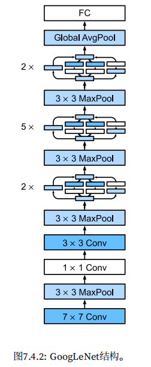

  ```python
  # 第一个模块，64 通道的 7 x 7 卷积层
  b1 = nn.Sequential(
      nn.Conv2d(1, 64, kernel_size=7, stride=2, padding=3),
      nn.ReLU(),
      nn.MaxPool2d(kernel_size=3, stride=2, padding=1)
  )
  
  # 第二个模块，第一个卷积层是 64 通道 1 x 1，第二个卷积层通道数量增加三倍，3 x 3，对应于 Inception 块中的第二条路径
  b2 = nn.Sequential(
      nn.Conv2d(64, 64, kernel_size=1),
      nn.ReLU(),
      nn.Conv2d(64, 192, kernel_size=3, padding=1),
      nn.MaxPool2d(kernel_size=3, stride=2, padding=1)
  )
  
  # 第三个模块，串联两个完整的 Inception 块
  # 第一个块的输出通道数为 64 + 128 + 32 + 32 = 256
  # 第二个块的输出通道数为 128 + 192 + 96 + 64 = 480
  b3 = nn.Sequential(
      Inception(192, 64, (96, 128), (16, 32), 32),
      Inception(256, 128, (128, 192), (32, 96), 64),
      nn.MaxPool2d(kernel_size=3, stride=2, padding=1)
  )
  
  # 第四个模块，串联五个完整的 Inception 块
  # 第一个块的输出通道数为 192 + 208 + 48 + 64 = 512
  # 第二个块的输出通道数为 160 + 224 + 64 + 64 = 512
  # 第三个块的输出通道数为 128 + 256 + 64 + 64 = 512
  # 第四个块的输出通道数为 112 + 288 + 64 + 64 = 528
  # 第五个块的输出通道数为 256 + 320 + 128 + 128 = 832
  b4 = nn.Sequential(
      Inception(480, 192, (96, 208), (16, 48), 64),
      Inception(512, 160, (112, 224), (24, 64), 64),
      Inception(512, 128, (128, 256), (24, 64), 64),
      Inception(512, 112, (144, 288), (32, 64), 64),
      Inception(528, 256, (160, 320), (32, 128), 128),
      nn.MaxPool2d(kernel_size=3, stride=2, padding=1)
  )
  
  # 第五个模块，串联两个完整的 Inception 块
  # 第一个块的输出通道数为 256 + 320 + 128 + 128 = 832
  # 第二个块的输出通道数为 384 + 384 + 128 + 128 = 1024
  b5 = nn.Sequential(
      Inception(832, 256, (160, 320), (32, 128), 128),
      Inception(832, 384, (192, 384), (48, 128), 128),
      nn.AdaptiveAvgPool2d((1, 1)),
      nn.Flatten()
  )
  
  net = nn.Sequential(
      b1,
      b2,
      b3,
      b4,
      b5,
      nn.Linear(1024, 10) # 再接一个输出个数为标签类别数的全连接层
  )
  ```

  在 Inception 块中路径的通道数分配策略：首先是含 $3\times3$ 卷积层的第二条路径输出最多通道，其次是含 $1\times1$ 卷积层的第一条路径，之后是含 $5\times5$ 卷积层的第三条路经和含 $3\times3$ 最大汇聚层的第四条路径。其中第二、第三条路经都会先按比例减小通道数，这些比例在各个 Inception 块中都略有不同。

- 训练

  ```python
  lr, num_epochs, batch_size = 0.1, 10, 128
  train_iter, test_iter = d2l.load_data_fashion_mnist(batch_size, resize=96)
  train_ch6(net, train_iter, test_iter, num_epochs, lr, d2l.try_gpu())
  ```

  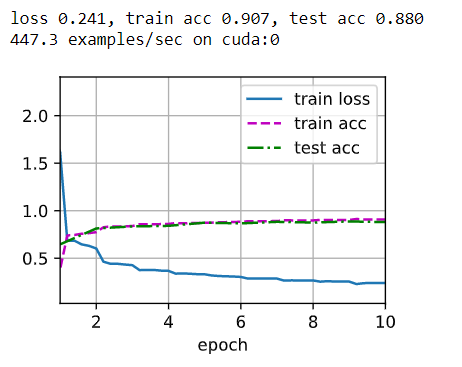

### 批量归一化

- 批量归一化（batch normalization）可持续加速深层网络的收敛速度。

- 神经网络训练时的挑战：

  - 数据预处理的方式：标准化可以很好地与优化器配合使用，因为它可以将参数的量级进行统一。
  - 训练时，中间层的变量变化的范围会很广，模型参数随着训练更新变幻莫测。批量归一化的发明者非正式地假设，这些变量分布中的这种偏移可能会阻碍网络的收敛。例如，如果一个层的可变值是另一层的 100 倍，这可能需要对学习率进行补偿调整。
  - 更深层的网络很复杂，容易过拟合。

- 批量归一化应用于单个可选层（也可以应用到所有层），其原理如下：**在每次训练迭代中，我们首先归一化输入**，即通过减去其均值并除以其标准差，其中两者均基于当前小批量处理。接下来，我们应用比例系数和比例偏移。正是由于这个基于批量统计的标准化，才有了批量归一化的名称。

- 如果我们尝试使用大小为 1 的小批量应用批量归一化，我们将无法学到任何东西。这是因为在减去均值之后，每个隐藏单元将为 0。所以，只有使用足够大的小批量，批量归一化这种方法才是有效且稳定的。请注意，**在应用批量归一化时，批量大小的选择可能比没有批量归一化时更重要**。

- 批量归一化表达式：
  $$
  \mathrm{BN}(\mathbf{x}) = \boldsymbol{\gamma} \odot \frac{\mathbf{x} - \hat{\boldsymbol{\mu}}_\mathcal{B}}{\hat{\boldsymbol{\sigma}}_\mathcal{B}} + \boldsymbol{\beta}.
  $$
  由于单位方差（与其他一些魔法数）是一个任意的选择，因此我们通常包含拉伸参数 $\boldsymbol{\gamma}$ 和偏移参数 $\boldsymbol{\beta}$，它们的形状与 $\mathbf{x}$ 相同，并且也是需要与其他模型参数一起被学习。

  由于在训练过程中，中间层的变化幅度不能过于剧烈，而批量归一化将每一层主动居中，并将它们重新调整为给定的平均值和大小（通过 $\hat{\boldsymbol{\mu}}_\mathcal{B}$ 和 ${\hat{\boldsymbol{\sigma}}_\mathcal{B}}$），其中：
  $$
  \begin{split}\begin{aligned} \hat{\boldsymbol{\mu}}_\mathcal{B} &= \frac{1}{|\mathcal{B}|} \sum_{\mathbf{x} \in \mathcal{B}} \mathbf{x},\\
  \hat{\boldsymbol{\sigma}}_\mathcal{B}^2 &= \frac{1}{|\mathcal{B}|} \sum_{\mathbf{x} \in \mathcal{B}} (\mathbf{x} - \hat{\boldsymbol{\mu}}_{\mathcal{B}})^2 + \epsilon.\end{aligned}\end{split}
  $$
  我们在方差估计值中添加一个小常量 $\epsilon > 0$，以确保我们永远不会尝试除以零，即使在经验方差估计值可能消失的情况下也是如此。估计值  $\hat{\boldsymbol{\mu}}_\mathcal{B}$ 和 ${\hat{\boldsymbol{\sigma}}_\mathcal{B}}$ 通过使用平均值和方差的噪声（noise）估计来抵消缩放问题。你可能会认为这种噪声是一个问题，而事实上它是有益的。

  > 由于理论上尚未明确表述的原因，优化中的各种噪声源通常会导致更快的训练和较少的过拟合：这种变化似乎是正则化的一种形式。

  另外，批量归一化图层在”训练模式“（通过小批量统计数据归一化）和“预测模式”（通过数据集统计归一化）中的功能不同。在训练过程中，我们无法得知使用整个数据集来估计平均值和方差，所以只能根据每个小批次的平均值和方差不断训练模型。而在预测模式下，可以根据**整个数据集**精确计算批量归一化所需的平均值和方差。

- 全连接层中的批量归一化：
  $$
  \mathbf{h} = \phi(\mathrm{BN}(\mathbf{W}\mathbf{x} + \mathbf{b}) ).
  $$

- 卷积层中的批量归一化：

  对于卷积层，我们可以在卷积层之后和非线性激活函数之前应用批量归一化。当卷积有多个输出通道时，我们需要对这些通道的“每个”输出执行批量归一化，**每个通道都有自己的拉伸（scale）和偏移（shift）参数**，这两个参数都是标量。但**在计算平均值和方差时，我们会收集所有空间位置的值**，然后在给定通道内**应用相同的均值和方差**，以便在每个空间位置对值进行归一化。

- 预测过程中的批量归一化：

  将训练好的模型用于预测时，我们不再需要样本均值中的噪声以及在微批次上估计每个小批次产生的样本方差了。其次，例如，我们可能需要使用我们的模型对逐个样本进行预测。一种常用的方法是通过移动平均估算整个训练数据集的样本均值和方差，并在预测时使用它们得到确定的输出。可见，和 dropout 一样，批量归一化层在训练模式和预测模式下的计算结果也是不一样的。

- 从零实现：

  数学原理的实现：

  ```python
  def batch_norm(X, gamma, beta, moving_mean, moving_var, eps, momentum):
      # 通过 `is_grad_enabled` 来判断当前模式是训练模式还是预测模式
      if not torch.is_grad_enabled():
          # 如果是在预测模式下，直接使用传入的移动平均所得的均值和方差
          X_hat = (X - moving_mean) / torch.sqrt(moving_var + eps)
      else:
          assert len(X.shape) in (2, 4)
          if len(X.shape) == 2:
              # 使用全连接层的情况，计算特征维度上的均值和方差
              # 这里不需要 keepdim=True
              # X 与它们相减时就是在 axis=1 下进行，即每个特征的值减去该特征在所有
              # 样本中的均值和方差
              mean = X.mean(dim=0)
              var = ((X - mean) ** 2).mean(dim=0)
          else:
              # 使用二维卷积的情况，计算通道维度上（axis=1）的均值和方差
              # 这里我们需要保持 x 的形状以便后面可以做广播运算
              # 此时 mean 和 var 都是每个通道的均值和方差
              # X 与它们相减广播后就是每个通道的元素减去所属通道的均值和方差
              mean = X.mean(dim=(0, 2, 3), keepdim=True)
              var = ((X - mean) ** 2).mean(dim=(0, 2, 3), keepdim=True)
          # 训练模式下，用当前的均值和方差做标准化
          X_hat = (X - mean) / torch.sqrt(var + eps)
          # 更新移动平均的均值和方差
          moving_mean = momentum * moving_mean + (1.0 - momentum) * mean
          moving_var = momentum * moving_var + (1.0 - momentum) * var
      Y = gamma * X_hat + beta # 缩放和移位
      return Y, moving_mean.data, moving_var.data
  ```

  自定义层的实现：主要处理簿记问题，例如将数据移动到训练设备（如 GPU）、分配和初始化任何必需的变量、跟踪移动平均线（此处为均值和方差）等，并且我们需要指定整个特征的数量，其他维度可以通过广播。

  ```python
  class BatchNorm(nn.Module):
      # `num_features`: 全连接层的输出数量或卷积层的输出通道数
      # `num_dims`: 2 表示全连接层，4 表示卷积层
      def __init__(self, num_features, num_dims):
          super().__init__()
          if num_dims == 2:
              shape = (1, num_features)
          else:
              shape = (1, num_features, 1, 1)
          # 参与求梯度和迭代的拉伸和偏移参数，分别初始化为 1 和 0
          # 每个特征或通道的参数都不同
          self.gamma = nn.Parameter(torch.ones(shape))
          self.beta = nn.Parameter(torch.zeros(shape))
          # 非模型参数的变量初始化为 0 和 1
          self.moving_mean = torch.zeros(shape)
          self.moving_var = torch.ones(shape)
          
      def forward(self, X):
          # 如果 `X` 不再内存上，将 `moving_mean` 和 `moving_var`
          # 复制到 `X` 所在显存上
          if self.moving_mean.device != X.device:
              self.moving_mean = self.moving_mean.to(X.device)
              self.moving_var = self.moving_var.to(X.device)
          # 保存更新过的 `moving_mean` 和 `moving_var`
          Y, self.moving_mean, self.moving_var = batch_norm(
              X, self.gamma, self.beta, self.moving_mean,
              self.moving_var, eps=1e-5, momentum=0.9)
          return Y
  ```

- 使用批量归一化层的 LeNet：

  ```python
  net = nn.Sequential(
      nn.Conv2d(1, 6, kernel_size=5),
      BatchNorm(6, num_dims=4),
      nn.Sigmoid(),
      nn.MaxPool2d(kernel_size=2, stride=2),
      nn.Conv2d(6, 16, kernel_size=5),
      BatchNorm(16, num_dims=4),
      nn.Sigmoid(),
      nn.MaxPool2d(kernel_size=2, stride=2),
      nn.Flatten(),
      nn.Linear(16 * 4 * 4, 120),
      BatchNorm(120, num_dims=2),
      nn.Sigmoid(),
      nn.Linear(120, 84),
      BatchNorm(84, num_dims=2),
      nn.Sigmoid(),
      nn.Linear(84, 10)
  )
  
  lr, num_epochs, batch_size = 1.0, 10, 256
  train_iter, test_iter = d2l.load_data_fashion_mnist(batch_size)
  train_ch6(net, train_iter, test_iter, num_epochs, lr, d2l.try_gpu())
  ```

  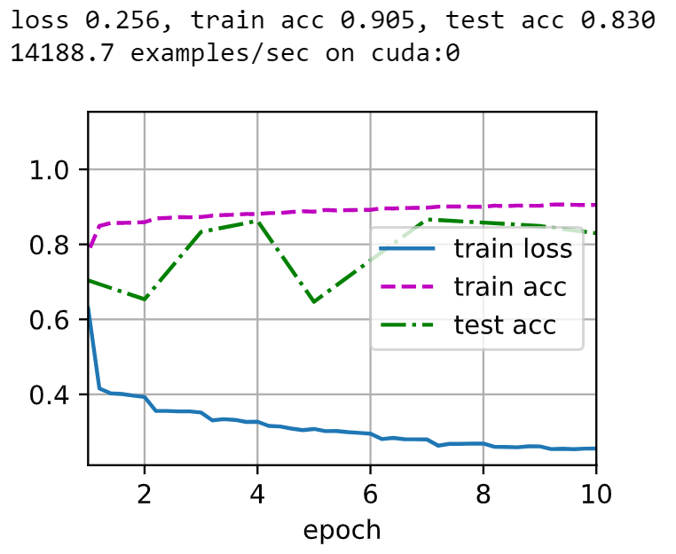

- 简明实现：

  ```python
  net = nn.Sequential(
      nn.Conv2d(1, 6, kernel_size=5),
      nn.BatchNorm2d(6),
      nn.Sigmoid(),
      nn.MaxPool2d(kernel_size=2, stride=2),
      nn.Conv2d(6, 16, kernel_size=5),
      nn.BatchNorm2d(16),
      nn.Sigmoid(),
      nn.MaxPool2d(kernel_size=2, stride=2),
      nn.Flatten(),
      nn.Linear(256, 120),
      nn.BatchNorm1d(120),
      nn.Sigmoid(),
      nn.Linear(120, 84),
      nn.BatchNorm1d(84),
      nn.Sigmoid(),
      nn.Linear(84, 10)
  )    
  ```

- 批量归一化被认为可以使优化更加平滑。但为什么如此有效更像是一种投机直觉，作者的“减少内部协变量偏移”解释不太严格。

- 总结：

  - 在模型训练过程中，批量归一化利用小批量的均值和标准差，不断调整神经网络的中间输出，使整个神经网络各层的中间输出值更加稳定。
  - 批量归一化有许多有益的副作用，主要是正则化。另一方面，“减少内部协变量偏移”的原始动机似乎不是一个有效的解释。

### 残差网络（ResNet）

- 想法：如何设计网络能使得**添加层**会使网络更具表现力？

  假设我们有一类特定的神经网络结构 $\mathcal{F}$，包含固定的超参数设置，我们可以在其上面进行训练；假设 $f^*$ 是我们真正想要找到的函数，如果 $f^* \in \mathcal{F}$，那么可以直接训练出来，否则我们只能找到一个 $\mathcal{F}$ 中的最优选择 $f^*_\mathcal{F}$。

  但如果我们设计一个更强大的 $\mathcal{F}'$，如何保证 $\mathcal{F}'$ 比 $\mathcal{F}$ 更接近 $f^*$ 呢？只要保证 $\mathcal{F} \in \mathcal{F}'$（嵌套函数）即可。

  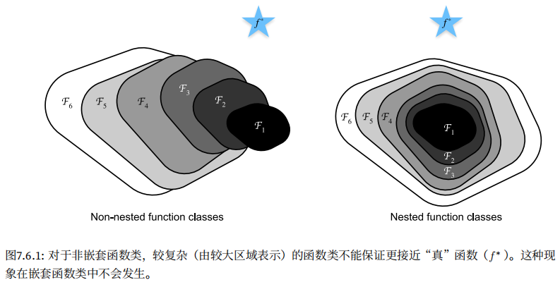

  因此，只有当较复杂的函数类包含较小的函数类时，我们才能确保提高它们的性能。对于深度神经网络，如果我们能将新添加的层训练成 *恒等映射*（identity function） $f(x)=x$ ，新模型和原模型将同样有效。同时，由于新模型可能得出更优的解来拟合训练数据集，因此添加层似乎更容易降低训练误差。

  所以，残差网络的核心思想：**每个附加层都应该更容易地包含原始函数作为其元素之一**。

- 残差块：输入可通过跨层数据线路更快地向前传播

  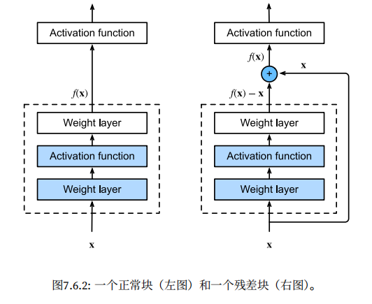
  
  ResNet 沿用了 VGG 完整的 $3\times3$ 卷积层设计。残差块里首先有 2 个相同输出通道的 $3\times3$ 卷积层。每个卷积层后接一个批量归一化层和 ReLU 激活函数。然后通过跨层数据通路，跳过这 2 个卷积运算，将输入直接加在最后的 ReLU 激活函数前。这样的设计要求 2 个卷积层的输出与输入形状一样，从而可以相加。如果想改变通道数，就需要引入一个额外的 $1\times1$ 卷积层来将输入变换成需要的形状后再做相加运算。
  
  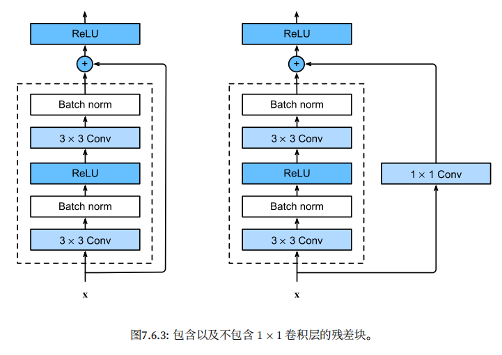
  
  ```python
  class Residual(nn.Module):
      def __init__(self, input_channels, num_channels, use_1x1conv=False, strides=1):
          super().__init__()
          self.conv1 = nn.Conv2d(input_channels, num_channels, kernel_size=3, padding=1, stride=strides)
          self.conv2 = nn.Conv2d(num_channels, num_channels, kernel_size=3, padding=1)
          if use_1x1conv:
              self.conv3 = nn.Conv2d(input_channels, num_channels, kernel_size=1, stride=strides)
          else:
              self.conv3 = None
          self.bn1 = nn.BatchNorm2d(num_channels)
          self.bn2 = nn.BatchNorm2d(num_channels)
          self.relu = nn.ReLU(inplace=True)
      
      def forward(self, X):
          Y = F.relu(self.bn1(self.conv1(X)))
          Y = self.bn2(self.conv2(Y))
          if self.conv3:
              X = self.conv3(X)
          Y += X
          return F.relu(Y)
  ```
  
- ResNet 模型

  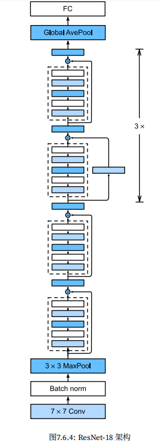

  - ResNet 的前两层与 GoogleNet 一样：在输入通道数为 64、步幅为 2 的 $7\times7$ 卷积层后，接步幅为 2 的 $3\times3$ 的最大汇聚层，不同之处在于 ResNet 每个卷积层后增加了批量归一化层：

    ```python
    b1 = nn.Sequential(
        nn.Conv2d(1, 64, kernel_size=7, stride=2, padding=3),
        nn.BatchNorm2d(64),
        nn.ReLU(),
        nn.MaxPool2d(kernel_size=3, stride=2, padding=1)
    )
    ```

  - GoogleNet 在后面接了 4 个由 Inception 块组成的模块。ResNet 则使用 4 个由残差块组成的模块，每个模块使用若干个同样输出通道数的残差块。第一个模块的通道数和输入通道数一致，由于之前已经使用了步幅为 2 的最大汇聚层，所以无需减少高和宽；之后的每个模块在第一个残差块里将上一个模块的通道数翻倍，并将高和宽减半：

    ```python
    # 后续的模块
    def resnet_block(input_channels, num_channels, num_residuals, first_block=False):
        blk = []
        for i in range(num_residuals):
            if i == 0 and not first_block: 
                # 如果是第一个模块的第一块，则不需要改变通道数，也不需要减半高宽；
                # 后续模块的第一块都需要将通道数翻倍，并且减半高宽
                blk.append(Residual(input_channels, num_channels, use_1x1conv=True, strides=2))
            else:
                blk.append(Residual(num_channels, num_channels))
        return blk
    
    # 这里每个模块使用 2 个残差块
    b2 = nn.Sequential(*resnet_block(64, 64, 2, first_block=True))
    b3 = nn.Sequential(*resnet_block(64, 128, 2))
    b4 = nn.Sequential(*resnet_block(128, 256, 2))
    b5 = nn.Sequential(*resnet_block(256, 512, 2))
    ```

  - 最后，和 GoogleNet 一样，在 ResNet 中加入全局平均汇聚层，以及全连接层输出：

    ```python
    net = nn.Sequential(
        b1,
        b2,
        b3,
        b4,
        b5,
        nn.AdaptiveAvgPool2d((1, 1)),
        nn.Flatten(),
        nn.Linear(512, 10)
    )
    ```

    b2 ~ b5 每个模块都有 4 个卷积层，加上第一个 $7\times7$ 卷积层和最后一个全连接层，一共 18 层，所以这个模型也被称为 ResNet-18。

- 训练模型：

  ```python
  lr, num_epochs, batch_size = 0.05, 10, 256
  train_iter, test_iter = d2l.load_data_fashion_mnist(batch_size, resize=96)
  train_ch6(net, train_iter, test_iter, num_epochs, lr, d2l.try_gpu())
  ```

  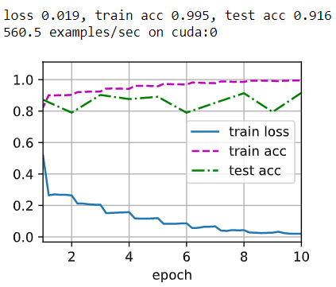

- 小结：

  - 学习嵌套函数是训练神经网络的理想情况。在深层神经网络中，学习另一层作为恒等映射较容易（尽管这是一个极端情况）。残差映射可以更容易地学习同一函数，例如将权重层中的参数近似为零（恒等映射）。也就是说，加入了残差块的新模型 $\mathcal{F}'$ 很容易达到简单模型 $\mathcal{F}$ 的效果。
  - 利用残差块可以训练出一个有效的深层神经网络：输入可以通过层间的残余连接更快地向前传播。
  - 残差连接可以帮助训练更深层的网络，减轻了梯度消失的现象（反向传播导数由相乘优化为相加）——梯度高速通道。

### 稠密连接网络（DenseNet）

- 从 ResNet 到 DenseNet：

  将一个任意函数分解（泰勒展开）：
  $$
  f(x) = f(0) + f'(0) x + \frac{f''(0)}{2!}  x^2 + \frac{f'''(0)}{3!}  x^3 + \ldots.
  $$
  在 ResNet 中：
  $$
  f(\mathbf{x})=\mathbf{x}+g(\mathbf{x})
  $$
  也就是说，ResNet 将 $f$ 分解为两部分：一个简单的线性项和一个更复杂的非线性项，如果想要将 $f$ 拓展成超过两部分的信息，一种解决方案就是 DenseNet：

  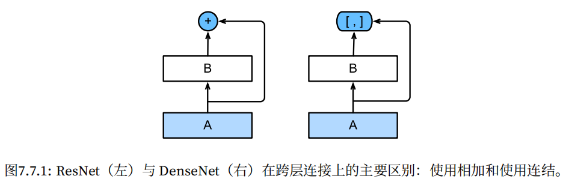

  ResNet 和 DenseNet 的关键区别在于，DenseNet 输出是连接而不是相加。因此，在应用越来越复杂的函数序列后，我们执行从 $\mathbf{x}$ 到其展开式的映射：
  $$
  \mathbf{x} \to \left[
  \mathbf{x},
  f_1(\mathbf{x}),
  f_2([\mathbf{x}, f_1(\mathbf{x})]), f_3([\mathbf{x}, f_1(\mathbf{x}), f_2([\mathbf{x}, f_1(\mathbf{x})])]), \ldots\right].
  $$
  将这些展开式结合到多层感知机中，再次减少特征的数量。稠密连接（Dense）指的就是最后一层与之前的所有层紧密相连。

  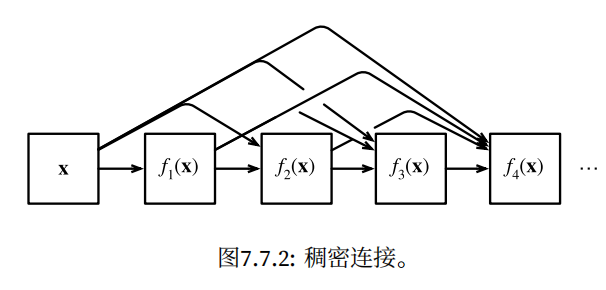

  稠密网络主要由 2 部分构成：稠密块（dense block）和过渡层（transition layer）。前者定义如何连接输入和输出，后者控制通道数量，使其不会太复杂。

- 稠密块体：DenseNet 使用了 ResNet 改良版的“批量归一化、激活和卷积”

  ```python
  def conv_block(input_channels, num_channels):
      return nn.Sequential(
          nn.BatchNorm2d(input_channels),
          nn.ReLU(),
          nn.Conv2d(input_channels, num_channels, kernel_size=3, padding=1)
      )
  ```

  一个稠密块由多个卷积块组成，每个卷积块使用相同数量的输出通道，在前向传播中，我们将每个卷积块的输入和输出在通道维度上连结。

  ```python
  class DenseBlock(nn.Module):
      def __init__(self, num_convs, input_channels, num_channels):
          super(DenseBlock, self).__init__()
          layer = []
          for i in range(num_convs):
              layer.append(conv_block(num_channels * i + input_channels, num_channels))
          self.net = nn.Sequential(*layer)
          
      def forward(self, X):
          for blk in self.net:
              Y = blk(X)
              # 连接通道维度上每个块的输入和输出
              X = torch.cat((X, Y), dim=1)
          return X
  ```

- 过渡层：由于每个稠密块都会带来通道数的增加（输出通道数 = 输入通道数 + 卷积层输出通道数 * 卷积层数），使用过多则会过于复杂化模型，过渡层通过 $1\times1$ 卷积层来减小通道数，并使用步幅为 2 的平均汇聚层减半高和宽，从而进一步降低模型复杂度：

  ```python
  def transition_block(input_channels, num_channels):
      return nn.Sequential(
          nn.BatchNorm2d(input_channels),
          nn.ReLU(),
          nn.Conv2d(input_channels, num_channels, kernel_size=1),
          nn.AvgPool2d(kernel_size=2, stride=2)
      )
  ```

- DenseNet 模型

  - 首先使用同 ResNet 一样的单卷积层和最大汇聚层

    ```python
    b1 = nn.Sequential(
        nn.Conv2d(1, 64, kernel_size=7, stride=2, padding=3),
        nn.BatchNorm2d(64),
        nn.ReLU(),
        nn.MaxPool2d(kernel_size=3, stride=2, padding=1)
    )
    ```

  - 接下来，类似于 ResNet 的 4 个残差块组成的模块，DenseNet 使用的是 4 个稠密块，每个稠密块使用 4 个卷积层。稠密块里的卷积层通道数（即增长率）设为 32，所以每个稠密块将增加 128 个通道。

    每个模块之间，ResNet 通过步幅为 2 的残差块减小高和宽，DenseNet 则使用过渡层来减半高和宽，并减半通道数。

    ```python
    # `num_channels` 为当前的通道数
    num_channels, growth_rate = 64, 32
    num_convs_in_dense_blocks = [4, 4, 4, 4]
    blks = []
    for i, num_convs in enumerate(num_convs_in_dense_blocks):
        blks.append(DenseBlock(num_convs, num_channels, growth_rate))
        # 加上上一个稠密块的输出通道数
        num_channels += num_convs * growth_rate
        # 在稠密块之间添加一个过渡层，使通道数量减半
        if i != len(num_convs_in_dense_blocks) - 1:
            blks.append(transition_block(num_channels, num_channels // 2))
            num_channels //= 2
    ```

  - 最后，与 ResNet 类似，接上全局汇聚层和全连接层来输出结果

    ```python
    net = nn.Sequential(
        b1,
        *blks,
        nn.BatchNorm2d(num_channels),
        nn.ReLU(),
        nn.AdaptiveMaxPool2d((1, 1)),
        nn.Flatten(),
        nn.Linear(num_channels, 10))
    ```

- 训练模型：

  ```python
  lr, num_epochs, batch_size = 0.1, 10, 256
  train_iter, test_iter = d2l.load_data_fashion_mnist(batch_size, resize=96)
  train_ch6(net, train_iter, test_iter, num_epochs, lr, d2l.try_gpu())
  ```

  

- 小结：

  - 在跨层连接上，不同于 ResNet 中将输入与输出相加，稠密连接网络（DenseNet）在通道维上连结输入与输出。
  - DenseNet 的优点之一是其模型参数比 ResNet 小。