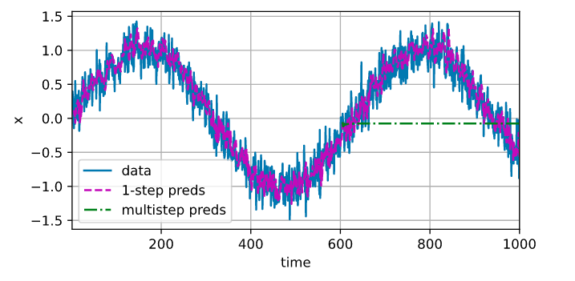
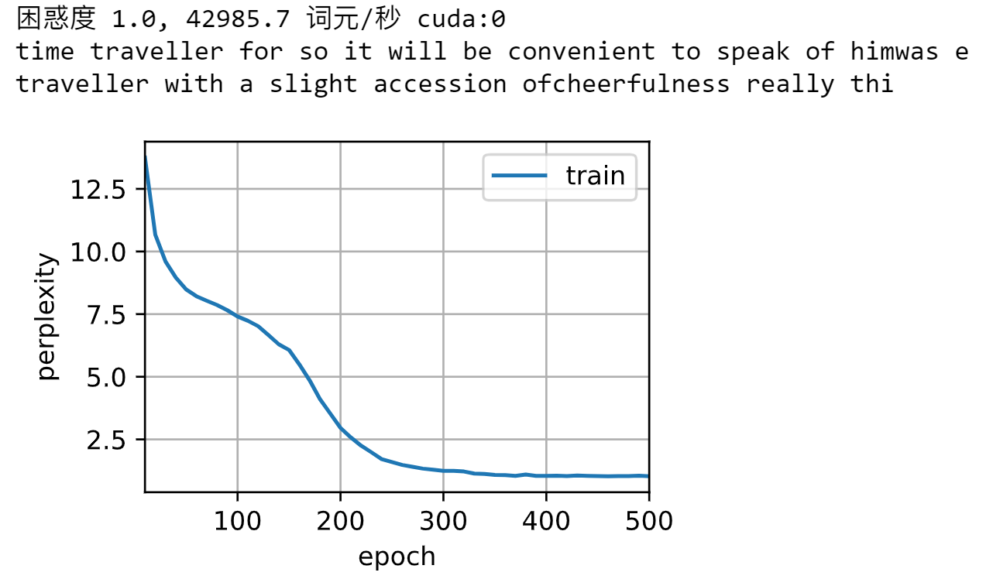

## 循环神经网络

### 序列模型

- 对超出已知观测范围进行预测是外推法，在现有观测值之间进行估计是内插法。

- 对于序列的回归模型：$x_t \sim P(x_t \mid x_{t-1}, \ldots, x_1)$

  自回归模型：考虑某个长度为 $\tau$ 的时间跨度，即 $x_t \sim P(x_t \mid x_{t-1}, \ldots, x_{t-\tau})$，好处在于参数数量不变（对自己执行回归）

  隐变量自回归模型：保留一些对过去观测的总结 $h_t$，并且同时更新预测 $\hat x_t$ 和总结 $h_t$，即 $\hat x_t = P(x_t\mid h_t)$，以及公式 $h_t = g(h_{t-1}, x_{t-1})$ 更新的模型（对隐变量 $h_t$ 执行回归）

  

- 整个序列的估计值：
  $$
  P(x_1, \ldots, x_T) = \prod_{t=1}^T P(x_t \mid x_{t-1}, \ldots, x_1).
  $$

- 训练：

  生成数据：正弦函数 + 噪声

  ```python
  %matplotlib inline
  import torch
  from torch import nn
  from d2l import torch as d2l
  
  T = 1000
  time = torch.arange(1, T + 1, dtype=torch.float32)
  x = torch.sin(0.01 * time) + torch.normal(0, 0.2, (T,))
  d2l.plot(time, [x], 'time', 'x', xlim=[1, 1000], figsize=(6, 3))
  ```

  

  基于嵌入维度 $\tau$，将数据映射为数据对 $y_t=x_t$ 和 $\mathbf{x}_t = [x_{t-\tau}, \ldots, x_{t-1}]$。
  
  > 例如 $\tau=4$，则 $\mathbf{x}_4=[x_3,x_2,x_1,x_0], y_4=x_4$，前 $\tau$ 个样本 $\mathbf{x}_3,\dots \mathbf{x}_0$ 可以丢弃或者用零填充
  >
  
  ```python
  tau = 4
  features = torch.zeros((T - tau, tau))
  
  for i in range(tau):
      features[:, i] = x[i: T - tau + i] # 一列一列填充
  labels = x[tau:].reshape((-1, 1)) # 一个值对应一行的标签
  
  batch_size, n_train = 16, 600
  train_iter = d2l.load_array((features[:n_train], labels[:n_train]),
                              batch_size, is_train=True)
  ```
  
  网络：双层 MLP，ReLU 激活函数和 MSELoss
  
  ```python
  def init_weights(m):
      if type(m) == nn.Linear:
          nn.init.xavier_uniform_(m.weight)
          
  def get_net():
      net = nn.Sequential(nn.Linear(4, 10),
                          nn.ReLU(),
                          nn.Linear(10, 1))
      net.apply(init_weights)
      return net
  
  loss = nn.MSELoss(reduction='none')
  ```
  
  训练模型：
  
  ```python
  def train(net, train_iter, loss, epochs, lr):
      trainer = torch.optim.Adam(net.parameters(), lr)
      for epoch in range(epochs):
          for X, y in train_iter:
              trainer.zero_grad()
              l = loss(net(X), y)
              l.sum().backward()
              trainer.step()
          print(f'epoch {epoch + 1}, '
                f'loss: {d2l.evaluate_loss(net, train_iter, loss):f}')
  
  net = get_net()
  train(net, train_iter, loss, 5, 0.01)
  ```
  
- 预测

  - 单步预测：预测下一个时间步
  
    ```python
    onestep_preds = net(features) # 用完整的原始 feature 预测
    d2l.plot([time, time[tau:]],
             [x.detach().numpy(), onestep_preds.detach().numpy()],
             'time', 'x', legend=['data', '1-step preds'],
             xlim=[1, 1000], figsize=(6, 3))
    ```
  
    
  
  - k 步预测：如果数据观察的时间步只到 604，我们必须使用自己的预测来进行后续的预测
    $$
    \begin{split}\hat{x}_{605} = f(x_{601}, x_{602}, x_{603}, x_{604}), \\
    \hat{x}_{606} = f(x_{602}, x_{603}, x_{604}, \hat{x}_{605}), \\
    \hat{x}_{607} = f(x_{603}, x_{604}, \hat{x}_{605}, \hat{x}_{606}),\\
    \hat{x}_{608} = f(x_{604}, \hat{x}_{605}, \hat{x}_{606}, \hat{x}_{607}),\\
    \hat{x}_{609} = f(\hat{x}_{605}, \hat{x}_{606}, \hat{x}_{607}, \hat{x}_{608}).
    \end{split}
    $$
    对于直到 $x_t$ 的观测序列，其在时间步 $t+k$ 处的预测输出 $\hat x_{t+k}$ 称为 $k$ 步预测。
  
    ```python
    multistep_preds = torch.zeros(T)
    multistep_preds[:n_train + tau] = x[:n_train + tau]
    # 第 600 行训练数据是 600 ~ 600 + tau - 1
    # tau + 1 ~ 600 + tau - 1 行的预测采用原始数据
    # [600 + tau: ] 采用之前的预测数据进行预测
    for i in range(n_train + tau, T):
        multistep_preds[i] = net(
            multistep_preds[i - tau: i].reshape((1, -1)))
        
    d2l.plot([time, time[tau:], time[n_train + tau:]],
             [x.detach().numpy(), onestep_preds.detach().numpy(),
              multistep_preds[n_train + tau:].detach().numpy()],
             'time', 'x', legend=['data', '1-step preds', 'multistep preds'],
             xlim=[1, 1000], figsize=(6, 3))
    ```
  
    
  
    预测的误差产生了累积。
  
  - 基于 $k=1,4,16,64$ 的预测：
  
    ```python
    max_steps = 64
    
    features = torch.zeros((T - tau - max_steps + 1, tau + max_steps))
    # 列 i (i < tau) 是来自 x 的观测
    # 其时间步从 i + 1 到 i + T - tau - max_steps + 1（时间步从 1 开始）
    for i in range(tau):
        features[:, i] = x[i: i + T - tau - max_steps + 1]
        
    # 列 i (i >= tau) 是 (i - tau + 1) 步的预测
    # 其时间步从 i + 1 到 i + T - tau - max_steps + 1（时间步从 1 开始）
    for i in range(tau, tau + max_steps):
        features[:, i] = net(features[:, i - tau: i]).reshape(-1)
        
    steps = (1, 4, 16, 64)
    
    # 因为 features 的行是 0 ~ T - tau - max_steps，所以对于 k 步预测，x 轴范围是 tau - 1 + k ~ T - tau - max_steps + tau + k - 1
    # => tau - 1 + k ~ T - max_steps + k - 1
    d2l.plot([time[tau + k - 1: T - max_steps + k] for k in steps],
             [features[:, (tau + k - 1)].detach().numpy() for k in steps], # 选择对应的 tau + k - 1 列
             'time', 'x', legend=[f'{k}-step preds' for k in steps],
             xlim=[5, 1000], figsize=(6, 3))
    ```
  
    
  
    以上例子清楚地说明了当我们试图预测更远的未来时，预测的质量是如何变化的。
  
- 总结：

  - 内插法（在现有观测值之间进行估计）和外推法（对超出已知观测范围进行预测）在实践的难度上差别很大。因此，对于你所拥有的序列数据，在训练时始终要尊重其时间顺序，即最好不要基于未来的数据进行训练。
  - 对于时间是向前推进的因果模型，正向估计通常比反向估计更容易。
  - 对于直到时间步 $t$ 的观测序列，其在时间步 $t+k$ 的预测输出是“$k$ 步预测”。随着我们对预测时间 $k$ 值的增加，会造成误差的快速累积和预测质量的极速下降。

### 文本预处理

- 预处理步骤：
  1. 将文本作为字符串加载到内存中
  2. 将字符串拆分为词元
  3. 建立一个词表，将拆分的词元映射到数字索引
  4. 将文本转换为数字索引序列，方便模型操作
  
- 读取数据集：将数据集读取到由多条文本行组成的列表中，每行文本都是一个字符串，并且忽略标点和大小写

  ```python
  def read_time_machine():
      '''将时间机器数据集加载到文本行的列表中'''
      with open(d2l.download('time_machine'), 'r') as f:
          lines = f.readlines()
      # 忽略标点符号和大小写
      return [re.sub('[^A-Za-z]+', ' ', line).strip().lower() for line in lines]
  ```

- 词元化：将列表中的每个文本序列拆分成一个词元列表，词元是文本的基本单位，其中每个词元都是一个字符串（或者字符）

  ```python
  def tokenize(lines, token='word'):
      '''将列表中的每个文本行拆分为单词或字符词元组成的列表'''
      if token == 'word':
          return [line.split() for line in lines]
      elif token == 'char':
          return [list(line) for line in lines]
      else:
          print('错误：未知词元类型：' + token)
  ```

- 词汇表：将字符串类型的词元映射到从 0 开始的数字索引中。先对词元进行统计，统计结果称为语料，然后根据每个词元的出现频率为其分配数字索引，很少出现的词元将被移除。语料库中不存在或已删除的任何词元都将其映射到一个特定的未知词元 `<unk>`。其他被保留的词元如：填充词元 `pad`；序列开始词元 `bos`；序列结束词元 `eos`

  ```python
  class Vocab:
      '''文本词表'''
      def __init__(self, tokens=None, min_freq=0, reserved_tokens=None):
          if tokens is None:
              tokens = []
          if reserved_tokens is None:
              reserved_tokens = []
          # 按出现的频率排序
          counter = count_corpus(tokens)
          self._token_freqs = sorted(counter.items(), key=lambda x: x[1],
                                     reverse=True) # 按频率倒序排
          
          self.idx_to_token, self.token_to_idx = [], dict()
          # 未知词元的索引为 0
          self.idx_to_token = ['<unk>'] + reserved_tokens
          self.token_to_idx['<unk>'] = 0
          for idx, token in enumerate(reserved_tokens):
              self.token_to_idx[token] = idx + 1
          
          for token, freq in self._token_freqs:
              if freq < min_freq:
                  break
              if token not in self.token_to_idx:
                  self.idx_to_token.append(token)
                  self.token_to_idx[token] = len(self.idx_to_token) - 1
      
      def __len__(self):
          return len(self.idx_to_token)
      
      def __getitem__(self, tokens):
          if not isinstance(tokens, (list, tuple)):
              return self.token_to_idx.get(tokens, self.unk) # tokens 不在字典中时，默认返回 0
          return [self.__getitem__(token) for token in tokens]
      
      def to_tokens(self, indices):
          if not isinstance(indices, (list, tuple)):
              return self.idx_to_token[indices]
          return [self.idx_to_token[index] for index in indices]
      
      @property # 自动创建了 self.unk
      def unk(self): # 未知词元的索引为 0
          return 0
      
      @property
      def token_freqs(self):
          return self._token_freqs
      
  def count_corpus(tokens):
      '''统计词元的频率'''
      if len(tokens) == 0 or isinstance(tokens[0], list):
          # 将词元列表展平成一个列表
          tokens = [token for line in tokens for token in line]
          # 不能 tokens = [token for token in line for line in tokens]
          # 因为要先定义 line
      return collections.Counter(tokens) # 返回一个 Counter 对象，保存的是键值对 词元：频率
  ```

- 使用字符实现数据集的文本词元化，并得到词元索引列表（corpus）和词汇表（vocab）

  ```python
  def load_corpus_time_machine(max_tokens=-1):
      '''返回时光机器数据集的词元索引列表和词表'''
      lines = read_time_machine()
      tokens = tokenize(lines, 'char')
      vocab = Vocab(tokens)
      # 因为时光机器数据集中的每个文本行不一定是一个句子或一个段落，
      # 所以将所有文本行展平到一个列表中
      corpus = [vocab[token] for line in tokens for token in line] # token 是一个字符
      # 在上面的 __getitem__ 函数中返回一个 id 值，而不是列表
      # 所以整个 corpus 是一个一维列表
      if max_tokens > 0:
          corpus = corpus[: max_tokens]
      return corpus, vocab
  
  ```

### 语言模型和数据集

- 自然语言统计

  ```python
  tokens = tokenize(read_time_machine())
  corpus = [token for line in tokens for token in line]
  vocab = Vocab(corpus)
  freqs = [freq for token, freq in vocab.token_freqs]
  d2l.plot(freqs, xlabel='token: x', ylabel='frequency: n(x)', xscale='log', yscale='log')
  ```

  

  词频以一种明确的方式迅速衰减。将前几个单词（停用词）作为例外消除后，剩余的所有单词大致遵循双对数坐标图上的一条直线。这意味着单词的频率满足*齐普夫定律*（Zipf’s law）， 即第 $i$ 个最常用单词的频率 $n_i$ 为：
  $$
  n_i \propto \frac{1}{i^\alpha},
  $$
  等价于：
  $$
  \log n_i = -\alpha\log i+c
  $$
  这告诉我们想要通过计数统计和平滑来建模单词是不可行的，因为这样建模的结果会大大高估尾部单词的频率，也就是所谓的不常用单词。

  二元语法、三元语法的统计情况：

  ```python
  bigram_tokens = [pair for pair in zip(corpus[:-1], corpus[1:])]
  bigram_vocab = Vocab(bigram_tokens)
  
  trigram_tokens = [triple for triple in zip(corpus[:-2], corpus[1:-1], corpus[2:])]
  trigram_vocab = Vocab(trigram_tokens)
  
  bigram_freqs = [freq for token, freq in bigram_vocab.token_freqs]
  trigram_freqs = [freq for token, freq in trigram_vocab.token_freqs]
  d2l.plot([freqs, bigram_freqs, trigram_freqs], xlabel='token: x',
           ylabel='frequency: n(x)', xscale='log', yscale='log',
           legend=['unigram', 'bigram', 'trigram'])
  ```

  

  除了一元语法词，单词序列似乎也遵循齐普夫定律，只是 $\alpha$ 受序列长度影响。很多 $n$ 元组很少出现，这使得拉普拉斯平滑非常不适合语言建模。作为代替，我们将使用基于深度学习的模型。

- 读取长序列数据：假设我们将使用神经网络来训练语言模型，模型中的网络一次处理具有预定义长度（例如 $n$ 个时间步）的一个小批量序列。

  

  如果我们只选择一个偏移量，那么用于训练网络的、所有可能的子序列的覆盖范围将是有限的。因此，我们可以从随机偏移量开始划分序列，以同时获得*覆盖性*（coverage）和*随机性*（randomness）。

- 随机采样：每个样本都是在原始的长序列上任意捕获的子序列，标签即是移位了一个词元的原始序列。在迭代过程中，来自两个相邻的、随机的、小批量中的子序列不一定在原始序列上相邻。

  ```python
  def seq_data_iter_random(corpus, batch_size, num_steps):
      '''使用随机抽样生成一个小批量子序列'''
      # 从随即偏移量开始对序列进行分区，随机范围包括 num_steps - 1
      corpus = corpus[random.randint(0, num_steps - 1): ]
      # 计算子序列的个数，这里减去 1，是因为需要考虑标签
      num_subseqs = (len(corpus) - 1) // num_steps
      # 长度为 num_steps 的子序列的起始索引
      initial_indices = list(range(0, num_subseqs * num_steps, num_steps))
      # 打乱起始索引
      # 在随机抽样的迭代过程中
      # 来自两个相邻的，随机的，小批量中的子序列不一定在原始序列上相邻
      random.shuffle(initial_indices)
      
      def data(pos):
          # 返回从 pos 位置开始的长度为 num_steps 的序列
          return corpus[pos: pos + num_steps]
      
      # 每个 batch 包含的子序列的个数
      num_batches = num_subseqs // batch_size 
      for i in range(0, batch_size * num_batches, batch_size):
          # 在这里 initial_indices 包含子序列的随机起始索引
          initial_indices_per_batch = initial_indices[i: i + batch_size]
          X = [data(j) for j in initial_indices_per_batch]
          Y = [data(j + 1) for j in initial_indices_per_batch]
          yield torch.tensor(X), torch.tensor(Y)
  ```

- 顺序分区：保证两个相邻的小批量中的子序列在原始序列上也是相邻的。

  ```python
  def seq_data_iter_sequential(corpus, batch_size, num_steps):
      '''使用顺序分区生成一个小批量子序列'''
      # 从随机偏移量开始划分序列
      offset = random.randint(0, num_steps)
      num_tokens = ((len(corpus) - offset - 1) // batch_size) * batch_size # 计算考虑的总序列的长度
      Xs = torch.tensor(corpus[offset: offset + num_tokens])
      Ys = torch.tensor(corpus[offset + 1: offset + 1 + num_tokens])
      Xs, Ys = Xs.reshape(batch_size, -1), Ys.reshape(batch_size, -1)
      num_batches = Xs.shape[1] // num_steps # 相当于 Time
      for i in range(0, num_steps * num_batches, num_steps):
          X = Xs[:, i: i + num_steps]
          Y = Ys[:, i: i + num_steps]
          yield X, Y
  ```

- 将上面的两个采样函数包装到一个类中，以便稍后可以将其用作数据迭代器。

  ```python
  class SeqDataLoader:
      '''加载序列数据的迭代器'''
      def __init__(self, batch_size, num_steps, use_random_iter, max_tokens):
          if use_random_iter:
              self.data_iter_fn = seq_data_iter_random
          else:
              self.data_iter_fn = seq_data_iter_sequential
          self.corpus, self.vocab = load_corpus_time_machine(max_tokens)
          self.batch_size, self.num_steps = batch_size, num_steps
          
      def __iter__(self):
          return self.data_iter_fn(self.corpus, self.batch_size, self.num_steps)
  ```

  定义一个函数 `load_data_time_machine`， 它同时返回数据迭代器和词表：

  ```python
  def load_data_time_machine(batch_size, num_steps, use_random_iter=False, max_tokens=10000):
      '''返回时光机器数据集的迭代器和词汇表'''
      data_iter = SeqDataLoader(batch_size, num_steps, use_random_iter, max_tokens)
      return data_iter, data_iter.vocab
  ```


### 循环神经网络

- n 元语言模型中增加 n，模型参数的数量会随之呈指数增长，因此不如使用隐变量模型（循环神经网络模型的参数数量不会随着时间步的增加而增加）：
  $$
  P(x_t \mid x_{t-1}, \ldots, x_1) \approx P(x_t \mid h_{t-1}),
  $$
  其中，隐状态更新：
  $$
  h_t = f(x_{t}, h_{t-1}).
  $$

- 有隐状态的循环神经网络：
  $$
  \mathbf{H}_t = \phi(\mathbf{X}_t \mathbf{W}_{xh} + \mathbf{H}_{t-1} \mathbf{W}_{hh}  + \mathbf{b}_h).
  $$
  其中，$\mathbf{X}_t \in \mathbb{R}^{n \times d},\mathbf{W}_{xh} \in \mathbb{R}^{d \times h}, \mathbf{H}_{t-1} \in \mathbb{R}^{n \times h},\mathbf{W}_{hh} \in \mathbb{R}^{h \times h},\mathbf{b}_h \in \mathbb{R}^{1 \times h}.$

  输出层：
  $$
  \mathbf{O}_t = \mathbf{H}_t \mathbf{W}_{hq} + \mathbf{b}_q.
  $$
  其中，$\mathbf{W}_{hq} \in \mathbb{R}^{h \times q},\mathbf{b}_q \in \mathbb{R}^{1 \times q}.$

  

  > 隐状态中 $\mathbf{X}_t \mathbf{W}_{xh} + \mathbf{H}_{t-1} \mathbf{W}_{hh}$ 的计算，相当于 $\mathbf{X}_t$ 和 $\mathbf{H}_{t-1}$ 的拼接（dim=1）与 $\mathbf{W}_{xh}$ 和 $\mathbf{W}_{hh}$ 的拼接的矩阵乘法（$[n\times(d+h)]\times[(d+h)\times h]$）

- 字符级语言模型：

  

  输出的批量大小为 $n>1$，每个词元都由一个 $d$ 维向量表示，因此在时间步 $t$ 的输入 $\mathbf{X}_t$ 是一个 $n\times d$ 的矩阵。

- 困惑度：表示**概率的倒数**，困惑度越小越好（也可以用分叉度、候选单词个数来解释）（困惑度也称为平

  均分叉度）
  $$
  \begin{split}
  Plex &=\exp\left(-\frac{1}{n} \sum_{t=1}^n \log P(x_t \mid x_{t-1}, \ldots, x_1)\right) \\
  	&=\exp(-\frac{1}{n} \sum_{t=1}^n \sum_{k=1}^vy_{tk}\log\hat y_{tk}) \\
  	&=\exp(-\frac{1}{n} \sum_{t=1}^n \log P_t) \\
  	&=\exp[\log (\prod_{t=1}^nP_t)^{-\frac{1}{n}}] \\
  	&=(\prod_{t=1}^nP_t)^{-\frac{1}{n}}
  \end{split}
  $$
  在基线上，该模型的预测是词表的所有可用词元上的均匀分布。在这种情况下，困惑度等于词表中唯一词元的数量：
  $$
  (\prod_{t=1}^n \frac{1}{m})^{-\frac{1}{n}}=\frac{1}{m^{n\times ({-\frac{1}{n}})}}=m
  $$

### 循环神经网络的从零实现

- 读取数据集

  ```python
  batch_size, num_steps = 32, 35
  train_iter, vocab = load_data_time_machine(batch_size, num_steps)
  ```

- 将词 `id` 转换为独热编码，这样输入 $\mathbf{X}$ 维度从 $n\times t$ 变为 $n\times t \times d$. 独热编码等价于为每个对象选择不同的嵌入表示。

- 初始化模型参数

  ```python
  def get_params(vocab_size, num_hiddens, device):
      num_inputs = num_outputs = vocab_size
      # 输入是独热编码 len(vocab) 输出是概率
      
      def normal(shape):
          return torch.randn(size=shape, device=device) * 0.01
      
      # 隐藏层参数
      W_xh = normal((num_inputs, num_hiddens))
      W_hh = normal((num_hiddens, num_hiddens))
      b_h = torch.zeros(num_hiddens, device=device)
      # 输出层参数
      W_hq = normal((num_hiddens, num_outputs))
      b_q = torch.zeros(num_outputs, device=device)
      # 附加梯度
      params = [W_xh, W_hh, b_h, W_hq, b_q]
      for param in params:
          param.requires_grad_(True)
      return params
  ```

- 循环神经网络模型

  - 初始化隐状态：用 0 填充，形状为 $n\times h$

    ```python
    def init_rnn_state(batch_size, num_hiddens, device):
        # 设置初始的隐状态，就是输入给第一个时间步的 h
        return (torch.zeros((batch_size, num_hiddens), device=device), )
    ```

  - 一个时间步内的 RNN 网络：

    ```python
    def rnn(inputs, state, params):
        # inputs 的形状：（时间步数量，批量大小，词表大小-独热编码）
        W_xh, W_hh, b_h, W_hq, b_q = params
        H, = state
        outputs = []
        # X 的形状：（批量大小，词表大小）
        for X in inputs:
            H = torch.tanh(torch.mm(X, W_xh) + torch.mm(H, W_hh) + b_h)
            Y = torch.mm(H, W_hq) + b_q
            outputs.append(Y)
        return torch.cat(outputs, dim=0), (H, ) # 按时间步顺序将同一时间步的 Y 拼接在一起
        # 输出形状是（时间步数量 * 批量大小，词表大小）
    ```

  - 定义一个模型类来包装这些函数：

    ```python
    class RNNModelScrath:
        '''从零开始实现的循环神经网络模型'''
        def __init__(self, vocab_size, num_hiddens, device,
                     get_params, init_state, forward_fn):
            self.vocab_size, self.num_hiddens = vocab_size, num_hiddens
            self.params = get_params(vocab_size, num_hiddens, device)
            self.init_state, self.forward_fn = init_state, forward_fn
            
        def __call__(self, X, state):
            # 把输入形状从 n * t
            # 变为 t * n * d
            X = F.one_hot(X.T, self.vocab_size).type(torch.float32)
            return self.forward_fn(X, state, self.params)
        
        def begin_state(self, batch_size, device):
            return self.init_state(batch_size, self.num_hiddens, device)
    ```

- 预测：在循环遍历 `prefix` 中的开始字符时，我们不断地将隐状态传递到下一个时间步，但是不生成任何输出。这被称为*预热*（warm-up）期，因为在此期间模型会自我更新（例如，更新隐状态），但不会进行预测。预热期结束后，隐状态的值通常比刚开始的初始值更适合预测，从而预测字符并输出它们。

  ```python
  def predict_ch8(prefix, num_preds, net, vocab, device):
      '''在 prefix 后面生成新字符'''
      state = net.begin_state(batch_size=1, device=device)
      outputs = [vocab[prefix[0]]]
      # 每次取本次时间步要输入进来的字符-时间步数量：1，批量大小：1
      get_input = lambda: torch.tensor([outputs[-1]], device=device).reshape((1, 1))
      for y in prefix[1:]: # 预热期
          _, state = net(get_input(), state)
          outputs.append(vocab[y])
      for y in range(num_preds): # 预测 num_preds 步
          y, state = net(get_input(), state) # y 是 one-hot 编码
          outputs.append(int(y.argmax(dim=1).reshape(1)))
      return ''.join([vocab.idx_to_token[i] for i in outputs])
  ```

- 梯度裁剪：缓解梯度爆炸，最好不要通过降低学习率，因为大梯度是少数情况，而降低学习率是个全局行为
  $$
  \mathbf{g} \leftarrow \min\left(1, \frac{\theta}{\|\mathbf{g}\|}\right) \mathbf{g}.
  $$

  ```python
  def grad_clipping(net, theta):
      '''梯度裁剪'''
      if isinstance(net, nn.Module):
          params = [p for p in net.parameters() if p.requires_grad]
      else:
          params = net.params
      # 需要整合所有参数的梯度
      norm = torch.sqrt(sum(torch.sum((p.grad ** 2)) for p in params))
      if norm > theta:
          for param in params:
              param.grad[:] *= theta / norm
  ```

- 训练：

  1. 序列数据的不同采样方法（随机采样和顺序分区）将导致隐状态初始化的差异。
     - 当使用顺序分区时，我们只在**每个迭代周期的开始位置**初始化隐状态。当前小批量数据最后一个样本的隐状态，将用于初始化下一个小批量数据第一个样本的隐状态。这样，存储在隐状态中的序列的历史信息可以在一个迭代周期内流经相邻的子序列。然而，这使得梯度计算变得复杂。为了降低计算量，在处理任何一个小批量数据之前，我们先分离梯度，**使得隐状态的梯度计算总是限制在一个小批量数据的时间步内**。
     - 当使用随机抽样时，因为每个样本都是在一个随机位置抽样的，因此需要为每个小批量重新初始化隐状态。此时不需要分离梯度，因为不会梯度流到上一批时间步中。
  2. 我们在更新模型参数之前裁剪梯度。这样的操作的目的是：即使训练过程中某个点上发生了梯度爆炸，也能保证模型不会发散。
  3. 我们用困惑度来评价模型。

  ```python
  def train_epoch_ch8(net, train_iter, loss, updater, device, use_random_iter):
      '''训练网络一个迭代周期'''
      state, timer = None, d2l.Timer()
      metric = d2l.Accumulator(2) # 训练损失之和，词元数量
      for X, Y in train_iter:
          if state is None or use_random_iter:
              # 在第一次迭代或使用随机抽样时初始化 state(h_0)
              state = net.begin_state(batch_size=X.shape[0], device=device)
          else:
              # 在顺序分区处理任何一个小批量数据之前，控制梯度不流传到上一个时间步
              if isinstance(net, nn.Module) and not isinstance(state, tuple):
                  # state 对于 nn.GRU 是个张量
                  state.detach_()
              else:
                  # state 对于 nn.LSTM 或对于我们从零开始实现的模型是个张量
                  for s in state:
                      s.detach_()
          y = Y.T.reshape(-1) # 将 Y 中同一列（同一时间步）的元素按时间步顺序拼接
          '''
          [[1, 2, 3],
           [4, 5, 6],
           [7, 8, 9]]
          =>
          y: [1, 4, 7, 2, 5, 8, 3, 6, 9]
          因为 net(X) 的结果是这样拼接的
          y_hat: [[..], [..], [..], [..], [..], [..], [..], [..], [..]]
          这样做交叉熵才没问题
          '''
          X, y = X.to(device), y.to(device)
          y_hat, state = net(X, state)
          l = loss(y_hat, y.long()).mean()
          if isinstance(updater, torch.optim.Optimizer):
              updater.zero_grad()
              l.backward()
              # 反向传播梯度之前，先进行梯度裁剪
              grad_clipping(net, 1)
              updater.step()
          else:
              l.backward(retain_graph=True)
              grad_clipping(net, 1)
              # 因为已经调用了 mean 函数
              updater(batch_size=1)
          metric.add(l * y.numel(), y.numel())
      # 返回困惑度和训练效率
      return math.exp(metric[0] / metric[1]), metric[1] / timer.stop()
  ```

  ```python
  def train_ch8(net, train_iter, vocab, lr, num_epochs, device,
                use_random_iter=False):
      '''训练模型'''
      loss = nn.CrossEntropyLoss()
      animator = d2l.Animator(xlabel='epoch', ylabel='perplexity',
                              legend=['train'], xlim=[10, num_epochs])
      # 初始化
      if isinstance(net, nn.Module):
          updater = torch.optim.SGD(net.parameters(), lr)
      else:
          updater = lambda batch_size: d2l.sgd(net.params, lr, batch_size)
      predict = lambda prefix: predict_ch8(prefix, 50, net, vocab, device)
      # 训练和预测
      for epoch in range(num_epochs):
          ppl, speed = train_epoch_ch8(
              net, train_iter, loss, updater, device, use_random_iter)
          if (epoch + 1) % 10 == 0:
              print(predict('time traveller'))
              animator.add(epoch + 1, [ppl])
      print(f'困惑度 {ppl:.1f}, {speed:.1f} 词元/秒 {str(device)}')
      print(predict('time traveller'))
      print(predict('traveller'))
  ```

- 实验：

  - 顺序分区：

    ```python
    num_epochs, lr = 500, 1
    train_ch8(net, train_iter, vocab, lr, num_epochs, d2l.try_gpu())
    ```

    

  - 随机分区：

    ```python
    net = RNNModelScrath(len(vocab), num_hiddens, d2l.try_gpu(), get_params,
                         init_rnn_state, rnn)
    train_ch8(net, train_iter, vocab, lr, num_epochs, d2l.try_gpu(),
              use_random_iter=True)
    ```

    

- 小结

  - 循环神经网络模型在训练以前需要初始化状态，不过随机抽样和顺序划分使用初始化方法不同。
  - 当使用顺序划分时，我们需要分离梯度以减少计算量。
  - 在进行任何预测之前，模型通过预热期进行自我更新（例如，获得比初始值更好的隐状态）。
  - 梯度裁剪可以防止梯度爆炸，但不能应对梯度消失。

### 循环神经网络的简洁实现

- 读取数据

  ```python
  batch_size, num_steps = 32, 35
  train_iter, vocab = d2l.load_data_time_machine(batch_size, num_steps)
  ```

- 定义模型：单层 RNN

  ```python
  num_hiddens = 256
  rnn_layer = nn.RNN(len(vocab), num_hiddens)
  ```

- 初始化隐状态

  ```python
  state = torch.zeros((1, batch_size, num_hiddens))
  ```

- 通过一个隐状态和一个输入，我们就可以用更新后的隐状态计算输出。需要强调的是，`rnn_layer` 的 “输出”（`Y`）不涉及输出层的计算：**它是指每个时间步的隐状态，这些隐状态可以用作后续输出层的输入。**也就是说，$\mathbf{Y}$ 的维度是 $t \times n \times h$.

- 定义模型类

  ```python
  class RNNModel(nn.Module):
      def __init__(self, rnn_layer, vocab_size, **kwargs):
          super(RNNModel, self).__init__(**kwargs)
          self.rnn = rnn_layer
          self.vocab_size = vocab_size
          self.num_hiddens = self.rnn.hidden_size
          # 如果 RNN 是双向的（之后将介绍），num_directions 应该是 2，否则应该是 1
          if not self.rnn.bidirectional:
              self.num_directions = 1
              self.linear = nn.Linear(self.num_hiddens, self.vocab_size)
          else:
              self.num_directions = 2
              self.linear = nn.Linear(self.num_hiddens * 2, self.vocab_size)
      
      def forward(self, inputs, state):
          # inputs: (batch_size, time_steps)
          # X: (time_steps, batch_size, vocab_size) 所以需要 .T
          # state: (1, batch_size, hidden_nums)
          X = F.one_hot(inputs.T.long(), self.vocab_size)
          X = X.to(torch.float32)
          Y, state = self.rnn(X, state)
          # 这里输出的 Y 的形状和我们手写的不一样
          # 形状是（时间步数，批量大小，隐藏单元数）
          
          # 全连接层首先将 Y 的形状改为（时间步数 * 批量大小，隐藏单元数）
          # 它的输出形状是（时间步数 * 批量大小，词表大小）
          output = self.linear(Y.reshape((-1, Y.shape[-1])))
          return output, state
      
      def begin_state(self, device, batch_size=1):
          if not isinstance(self.rnn, nn.LSTM):
              # 普通 RNN 和 nn.GRU 以张量作为隐状态
              return torch.zeros((self.num_directions * self.rnn.num_layers,
                                  batch_size, self.num_hiddens), device=device)
          else:
              # nn.LSTM 以元组作为隐状态
              # self.rnn.num_layers 是 RNN 的层数（深度方向上）
              return (torch.zeros((
                  self.num_directions * self.rnn.num_layers,
                  batch_size, self.num_hiddens), device=device),
                      torch.zeros((
                  self.num_directions * self.rnn.num_layers,
                  batch_size, self.num_hiddens), device=device))
  ```

- 训练

  ```python
  device = d2l.try_gpu()
  net = RNNModel(rnn_layer, vocab_size=(len(vocab)))
  net = net.to(device)
  num_epochs, lr = 500, 1
  train_ch8(net, train_iter, vocab, lr, num_epochs, device)
  ```

  