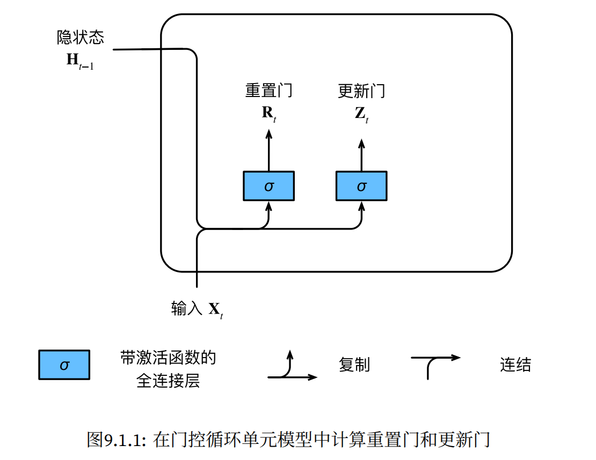

## 现代循环神经网络

循环神经网络在实践中一个常见问题是数值不稳定性，*门控循环单元*（gated recurrent units，GRU）和 *长短期记忆网络*（long short-term memory，LSTM）可以处理这个问题。

### 门控循环单元（GRU）

- 普通循环神经网络中的梯度异常

  - 如果第一个词元的影响非常重要，我们希望有某些机制能够在一个记忆元里存储重要的早期信息。如果没有这样的机制，我们将不得不给这个观测值指定一个非常大的梯度，因为它会影响所有后续的观测值。
  - 可能某些词元没有相关的观测值，我们需要有一些机制**跳过**隐状态表示中的此类词元。
  - 可能序列的各个部分之间存在逻辑中断，例如，书的章节之间可能会有过渡存在，或者证券的熊市和牛市之间可能会有过渡存在。在这种情况下，最好有一种方法来**重置**我们的内部状态表示。

- 门控循环单元与普通的循环神经网络之间的关键区别在于：后者支持隐状态的门控。这意味着**模型有专门的机制来确定应该何时更新隐状态，以及应该何时重置隐状态**。这些机制是可学习的，并且能够解决了上面列出的问题。

  - 例如，如果第一个词元非常重要，模型将学会在第一次观测之后不更新隐状态。
  - 同样，模型也可以学会跳过不相关的临时观测。
  - 最后，模型还将学会在需要的时候重置隐状态。

- 重置门和更新门

  我们把它们设计成 $(0,1)$ 区间中的向量，这样我们就可以进行凸组合。==重置门允许我们控制“可能还想记住”的过去状态的数量；更新门将允许我们控制新状态中有多少个是旧状态的副本。==
  $$
  \begin{split}\begin{aligned}
  \mathbf{R}_t = \sigma(\mathbf{X}_t \mathbf{W}_{xr} + \mathbf{H}_{t-1} \mathbf{W}_{hr} + \mathbf{b}_r),\\
  \mathbf{Z}_t = \sigma(\mathbf{X}_t \mathbf{W}_{xz} + \mathbf{H}_{t-1} \mathbf{W}_{hz} + \mathbf{b}_z),
  \end{aligned}\end{split}
  $$
  其中，$\mathbf{X}_t \in \mathbb{R}^{n \times d},\mathbf{H}_{t-1},\mathbf{R}_t,\mathbf{Z}_t \in \mathbb{R}^{n \times h},\mathbf{W}_{xr}, \mathbf{W}_{xz} \in \mathbb{R}^{d \times h},\mathbf{W}_{hr}, \mathbf{W}_{hz} \in \mathbb{R}^{h \times h},\mathbf{b}_r, \mathbf{b}_z \in \mathbb{R}^{1 \times h}$，sigmoid 函数将输入值转换到区间 $(0,1)$。

  

- 候选隐状态：将重置门 $\mathbf{R}_t$ 与常规隐状态更新机制集成，得到在时间步 $t$ 的候选隐状态 $\tilde{\mathbf{H}}_t \in \mathbb{R}^{n \times h}$：
  $$
  \tilde {\mathbf{H}}_t=\tanh(\mathbf{X}_t\mathbf{W}_{xh}+(\mathbf{R}_t\odot \mathbf{H}_{t-1})\mathbf{W}_{hh}+\mathbf{b}_h)
  $$
  其中 $\mathbf{W}_{xh}, \mathbf{W}_{hh} \in \mathbb{R}^{d \times h},\mathbf{b}_h \in \mathbb{R}^{1 \times h}$，tanh 函数将候选隐状态的值保持在区间 $(-1,1)$ 中。

  $\mathbf{R}_t$ 和 $\mathbf{H}_{t-1}$ 的元素相乘可以减少以往状态的影响：当 $\mathbf{R}_t$ 中的项接近 $1$ 时，就是普通的循环神经网络；当 $\mathbf{R}_t$ 中的项接近 0 时，就是以 $\mathbf{X}_t$ 作为输入的多层感知机的结果，因此，任何预先存在的隐状态都会被**重置**为默认值。

  

- 隐状态：我们需要结合更新门 $\mathbf{Z}_t$ 的效果，进一步确定新的隐状态 $\mathbf{H}_t$ 在多大程度上来自旧的状态 $\mathbf{H}_{t-1}$ 和新的候选状态 $\tilde{\mathbf{H}}_t$：
  $$
  \mathbf{H}_t=\mathbf{Z}_t\odot\mathbf{H}_{t-1}+(1-\mathbf{Z}_t)\odot\tilde{\mathbf{H}}_t
  $$
  每当更新门 $\mathbf{Z}_t$ 接近 $1$ 时，模型就倾向只保留旧状态。此时，来自 $\mathbf{X}_t$ 的信息基本上被忽略，从而有效地**跳过**了依赖链条中的时间步 $t$。相反，当 $\mathbf{Z}_t$ 接近 $0$ 时，新的隐状态 $\mathbf{H}_t$ 就会接近候选隐状态 $\tilde{\mathbf{H}}_t$。这些设计可以帮助我们处理循环神经网络中的梯度消失问题，并更好地捕获时间步距离很长的序列的依赖关系。例如，如果整个子序列的所有时间步的更新门都接近于 $1$，则无论序列的长度如何，在序列起始时间步的旧隐状态都将很容易保留并传递到序列结束。

  

  总之，门控循环单元具有以下两个显著特征：

  - **重置门有助于捕获序列中的短期依赖关系（重置隐状态）。**
  - **更新门有助于捕获序列中的长期依赖关系（跳过不相关的观测）。**
  - 重置门打开时，门控循环单元包含基本循环神经网络；更新门打开时，门控循环单元可以跳过子序列。

- GRU 的从零实现

  - 读取数据

    ```python
    batch_size, num_steps = 32, 35
    train_iter, vocab = d2l.load_data_time_machine(batch_size, num_steps)
    ```

  - 初始化模型参数

    ```python
    def get_params(vocab_size, num_hiddens, device):
        num_inputs = num_outputs = vocab_size
    
        def normal(shape):
            return torch.randn(size=shape, device=device)*0.01
    
        def three():
            return (normal((num_inputs, num_hiddens)),
                    normal((num_hiddens, num_hiddens)),
                    torch.zeros(num_hiddens, device=device))
    
        W_xz, W_hz, b_z = three()  # 更新门参数
        W_xr, W_hr, b_r = three()  # 重置门参数
        W_xh, W_hh, b_h = three()  # 候选隐状态参数
        # 输出层参数
        W_hq = normal((num_hiddens, num_outputs))
        b_q = torch.zeros(num_outputs, device=device)
        # 附加梯度
        params = [W_xz, W_hz, b_z, W_xr, W_hr, b_r, W_xh, W_hh, b_h, W_hq, b_q]
        for param in params:
            param.requires_grad_(True)
        return params
    ```

  - 定义模型

    隐状态的初始化函数

    ```python
    def init_gru_state(batch_size, num_hiddens, device):
        return (torch.zeros((batch_size, num_hiddens), device=device), )
    ```

    门控循环单元模型

    ```python
    def gru(inputs, state, params):
        W_xz, W_hz, b_z, W_xr, W_hr, b_r, W_xh, W_hh, b_h, W_hq, b_q = params
        H, = state
        outputs = []
        for X in inputs:
            Z = torch.sigmoid((X @ W_xz) + (H @ W_hz) + b_z)
            R = torch.sigmoid((X @ W_xr) + (H @ W_hr) + b_r)
            H_tilda = torch.tanh((X @ W_xh) + ((R * H) @ W_hh) + b_h)
            H = Z * H + (1 - Z) * H_tilda
            Y = H @ W_hq + b_q
            outputs.append(Y)
        return torch.cat(outputs, dim=0), (H,)
    ```

  - 训练与预测

    ```python
    vocab_size, num_hiddens, device = len(vocab), 256, d2l.try_gpu()
    num_epochs, lr = 500, 1
    model = RNNModelScratch(len(vocab), num_hiddens, device, get_params,
                                init_gru_state, gru)
    train_ch8(model, train_iter, vocab, lr, num_epochs, device)
    ```

    

- 简洁实现

  ```python
  num_inputs = vocab_size
  gru_layer = nn.GRU(num_inputs, num_hiddens)
  model = RNNModel(gru_layer, len(vocab))
  model = model.to(device)
  train_ch8(model, train_iter, vocab, lr, num_epochs, device)
  ```

  


### 长短期记忆网络（LSTM）

- 引入了记忆元，有些文献认为记忆元是隐状态的一种特殊类型，它们与隐状态具有相同的形状，其设计目的是用于记录附加的信息。为了控制记忆元，我们需要许多门。

  - 其中一个门用来从单元中输出条目，我们将其称为*输出门*（output gate）。
  - 另外一个门用来决定何时将数据读入单元，我们将其称为*输入门*（input gate）。
  - 我们还需要一种机制来重置单元的内容，由*遗忘门*（forget gate）来管理，这种设计的动机与门控循环单元相同，能够通过专用机制决定什么时候记忆或忽略隐状态中的输入。

  $$
  \begin{split}\begin{aligned}
  \mathbf{I}_t &= \sigma(\mathbf{X}_t \mathbf{W}_{xi} + \mathbf{H}_{t-1} \mathbf{W}_{hi} + \mathbf{b}_i),\\
  \mathbf{F}_t &= \sigma(\mathbf{X}_t \mathbf{W}_{xf} + \mathbf{H}_{t-1} \mathbf{W}_{hf} + \mathbf{b}_f),\\
  \mathbf{O}_t &= \sigma(\mathbf{X}_t \mathbf{W}_{xo} + \mathbf{H}_{t-1} \mathbf{W}_{ho} + \mathbf{b}_o),
  \end{aligned}\end{split}
  $$

- 候选记忆元
  $$
  \tilde{\mathbf{C}}_t = \text{tanh}(\mathbf{X}_t \mathbf{W}_{xc} + \mathbf{H}_{t-1} \mathbf{W}_{hc} + \mathbf{b}_c),
  $$

- 记忆元：输入门 $\mathbf{I}_t$ 控制采用多少来自 $\tilde{\mathbf{C}}_t$ 的新数据，而遗忘门 $\mathbf{F}_t$ 控制保留多少过去的记忆元 $\mathbf{C}_{t-1}$ 的内容。使用按元素乘法，得出：
  $$
  \mathbf{C}_t = \mathbf{F}_t \odot \mathbf{C}_{t-1} + \mathbf{I}_t \odot \tilde{\mathbf{C}}_t.
  $$

- 隐状态：在长短期记忆网络中，它仅仅是记忆元的 $\tanh$ 的门控版本。这就确保了 $\mathbf{H}_t$ 的值始终在区间$(−1,1)$ 内：
  $$
  \mathbf{H}_t = \mathbf{O}_t \odot \tanh(\mathbf{C}_t).
  $$
  只要输出门接近 $1$，我们就能够有效地将所有记忆信息传递给预测部分，而对于输出门接近 $0$，我们只保留记忆元内的所有信息，而不需要更新隐状态。

  

- 从零实现

  - 读取数据

    ```python
    batch_size, num_steps = 32, 35
    train_iter, vocab = load_data_time_machine(batch_size, num_steps)
    ```

  - 初始化模型参数

    ```python
    def get_lstm_params(vocab_size, num_hiddens, device):
        num_inputs = num_outputs = vocab_size
    
        def normal(shape):
            return torch.randn(size=shape, device=device)*0.01
    
        def three():
            return (normal((num_inputs, num_hiddens)),
                    normal((num_hiddens, num_hiddens)),
                    torch.zeros(num_hiddens, device=device))
    
        W_xi, W_hi, b_i = three()  # 输入门参数
        W_xf, W_hf, b_f = three()  # 遗忘门参数
        W_xo, W_ho, b_o = three()  # 输出门参数
        W_xc, W_hc, b_c = three()  # 候选记忆元参数
        # 输出层参数
        W_hq = normal((num_hiddens, num_outputs))
        b_q = torch.zeros(num_outputs, device=device)
        # 附加梯度
        params = [W_xi, W_hi, b_i, W_xf, W_hf, b_f, W_xo, W_ho, b_o, W_xc, W_hc,
                  b_c, W_hq, b_q]
        for param in params:
            param.requires_grad_(True)
        return params
    ```

  - 定义模型：隐状态除了 $\mathbf{H}$ 还有 $\mathbf{C}$

    ```python
    def init_lstm_state(batch_size, num_hiddens, device):
        return (torch.zeros((batch_size, num_hiddens), device=device),
                torch.zeros((batch_size, num_hiddens), device=device))
    ```

    实际模型定义：$\mathbf{C}$ 不直接参与输出计算

    ```python
    def lstm(inputs, state, params):
        [W_xi, W_hi, b_i, W_xf, W_hf, b_f, W_xo, W_ho, b_o, W_xc, W_hc, b_c,
         W_hq, b_q] = params
        (H, C) = state
        outputs = []
        for X in inputs:
            I = torch.sigmoid((X @ W_xi) + (H @ W_hi) + b_i)
            F = torch.sigmoid((X @ W_xf) + (H @ W_hf) + b_f)
            O = torch.sigmoid((X @ W_xo) + (H @ W_ho) + b_o)
            C_tilda = torch.tanh((X @ W_xc) + (H @ W_hc) + b_c)
            C = F * C + I * C_tilda
            H = O * torch.tanh(C)
            Y = (H @ W_hq) + b_q
            outputs.append(Y)
        return torch.cat(outputs, dim=0), (H, C)
    ```

  - 训练和预测

    ```python
    vocab_size, num_hiddens, device = len(vocab), 256, d2l.try_gpu()
    num_epochs, lr = 500, 1
    model = RNNModelScrath(len(vocab), num_hiddens, device, get_lstm_params,
                           init_lstm_state, lstm)
    train_ch8(model, train_iter, vocab, lr, num_epochs, device)
    ```

    

- 简洁实现

  ```python
  num_inputs = vocab_size
  lstm_layer = nn.LSTM(num_inputs, num_hiddens)
  model = d2l.RNNModel(lstm_layer, len(vocab))
  model = model.to(device)
  d2l.train_ch8(model, train_iter, vocab, lr, num_epochs, device)
  ```

  

- 小结

  - 长短期记忆网络的隐藏层输出包括“隐状态”和“记忆元”。只有隐状态会传递到输出层，而记忆元完全属于内部信息。
  - 长短期记忆网络可以缓解梯度消失和梯度爆炸。

### 深度循环神经网络

- $L$ 个隐藏层构成的深度循环神经网络：隐状态的信息被传递到当前层的下一时间步和下一层的当前时间步

  
  $$
  \mathbf{H}_t^{(l)} = \phi_l(\mathbf{H}_t^{(l-1)} \mathbf{W}_{xh}^{(l)} + \mathbf{H}_{t-1}^{(l)} \mathbf{W}_{hh}^{(l)}  + \mathbf{b}_h^{(l)}) \\
  \mathbf{O}_t = \mathbf{H}_t^{(L)} \mathbf{W}_{hq} + \mathbf{b}_q,
  $$
  和多层感知机一样，隐藏层数目 $L$ 和隐藏单元数目 $h$ 都是超参数。

- 简洁实现

  - 读取数据

    ```python
    batch_size, num_steps = 32, 35
    train_iter, vocab = d2l.load_data_time_machine(batch_size, num_steps)
    ```

  - 定义模型，多了一个超参数 `num_layers`

    ```python
    vocab_size, num_hiddens, num_layers = len(vocab), 256, 2
    num_inputs = vocab_size
    device = d2l.try_gpu()
    lstm_layer = nn.LSTM(num_inputs, num_hiddens, num_layers)
    model = d2l.RNNModel(lstm_layer, len(vocab))
    model = model.to(device)
    ```

  - 训练与预测

    ```python
    num_epochs, lr = 500, 2
    d2l.train_ch8(model, train_iter, vocab, lr, num_epochs, device)
    ```

    

### 双向循环神经网络

- 正向传播和反向传播的隐状态连接起来送入下一层，并且它们隐藏单元数量可以不同

  
  $$
  \begin{split}\begin{aligned}
  \overrightarrow{\mathbf{H}}_t &= \phi(\mathbf{X}_t \mathbf{W}_{xh}^{(f)} + \overrightarrow{\mathbf{H}}_{t-1} \mathbf{W}_{hh}^{(f)}  + \mathbf{b}_h^{(f)}),\\
  \overleftarrow{\mathbf{H}}_t &= \phi(\mathbf{X}_t \mathbf{W}_{xh}^{(b)} + \overleftarrow{\mathbf{H}}_{t+1} \mathbf{W}_{hh}^{(b)}  + \mathbf{b}_h^{(b)}), \\
  \mathbf{O}_t &= \mathbf{H}_t \mathbf{W}_{hq} + \mathbf{b}_q.
  \end{aligned}\end{split}
  $$

- 双向循环神经网络的一个关键特性是：使用来自序列两端的信息来估计输出。也就是说，我们使用来自过去和未来的观测信息来预测当前的观测。但是在对下一个词元进行预测的情况中，这样的模型并不是我们所需的。因为在预测下一个词元时，我们终究无法知道下一个词元的下文是什么，所以将不会得到很好的精度。具体地说，在训练期间，我们能够利用过去和未来的数据来估计现在空缺的词；而在测试期间，我们只有过去的数据，因此精度将会很差。

- 双向层的使用在实践中非常少，并且仅仅应用于部分场合。例如，填充缺失的单词、词元注释（例如，用于命名实体识别）以及作为序列处理流水线中的一个步骤对序列进行编码（例如，用于机器翻译）。 

- 错误应用实例：预测下一个词元

  ```python
  # 加载数据
  batch_size, num_steps, device = 32, 35, d2l.try_gpu()
  train_iter, vocab = d2l.load_data_time_machine(batch_size, num_steps)
  # 通过设置“bidirective=True”来定义双向LSTM模型
  vocab_size, num_hiddens, num_layers = len(vocab), 256, 2
  num_inputs = vocab_size
  lstm_layer = nn.LSTM(num_inputs, num_hiddens, num_layers, bidirectional=True)
  model = d2l.RNNModel(lstm_layer, len(vocab))
  model = model.to(device)
  # 训练模型
  num_epochs, lr = 500, 1
  d2l.train_ch8(model, train_iter, vocab, lr, num_epochs, device)
  ```

  

### 机器翻译与数据集

- 机器翻译是将输入序列转换成输出序列的**序列转换模型**的核心问题。机器翻译的数据集是由源语言和目标语言的文本序列对组成的。因此，我们需要一种完全不同的方法来预处理机器翻译数据集 而不是复用语言模型的预处理程序。

- 下载和预处理数据集：

  ```python
  d2l.DATA_HUB['fra-eng'] = (d2l.DATA_URL + 'fra-eng.zip',
                             '94646ad1522d915e7b0f9296181140edcf86a4f5')
  
  def read_data_nmt():
      """载入 英语－法语 数据集"""
      data_dir = d2l.download_extract('fra-eng')
      with open(os.path.join(data_dir, 'fra.txt'), 'r',
               encoding='utf-8') as f:
          return f.read()
      
  raw_text = read_data_nmt()
  print(raw_text[:75])
  
  >>>
  Downloading ../data/fra-eng.zip from http://d2l-data.s3-accelerate.amazonaws.com/fra-eng.zip...
  Go. Va !
  Hi. Salut !
  Run!        Cours !
  Run!        Courez !
  Who?        Qui ?
  Wow!        Ça alors !
  ```

- 数据预处理：使用空格代替不间断空格，使用小写字母替换大写字母，在单词和标点符号之间插入空格

  ```python
  def preprocess_nmt(text):
      """预处理 英语－法语 数据集"""
      def no_space(char, prev_char):
          return char in set(',.!?') and prev_char != ' '
  
      # 使用空格替换不间断空格
      # 使用小写字母替换大写字母
      text = text.replace('\u202f', ' ').replace('\xa0', ' ').lower()
      # 在单词和标点符号之间插入空格
      out = [' ' + char if i > 0 and no_space(char, text[i - 1]) else char
             for i, char in enumerate(text)]
      return ''.join(out)
  
  text = preprocess_nmt(raw_text)
  print(text[:80])
  
  >>>
  go .        va !
  hi .        salut !
  run !       cours !
  run !       courez !
  who ?       qui ?
  wow !       ça alors !
  ```

- 词元化：对前 `num_examples` 个文本序列进行词元化，其中每个词元要么是一个词，要么是一个标点符号

  ```python
  def tokenize_nmt(text, num_examples=None):
      """词元化 英语－法语 数据数据集"""
      source, target = [], []
      for i, line in enumerate(text.split('\n')):
          if num_examples and i > num_examples:
              break
          parts = line.split('\t')
          if len(parts) == 2:
              source.append(parts[0].split(' '))
              target.append(parts[1].split(' '))
      return source, target
  
  source, target = tokenize_nmt(text)
  source[:6], target[:6]
  
  >>>
  ([['go', '.'],
    ['hi', '.'],
    ['run', '!'],
    ['run', '!'],
    ['who', '?'],
    ['wow', '!']],
   [['va', '!'],
    ['salut', '!'],
    ['cours', '!'],
    ['courez', '!'],
    ['qui', '?'],
    ['ça', 'alors', '!']])
  ```

- 检查数据：绘制每个文本序列所包含的词元数量的直方图

  ```python
  def show_list_len_pair_hist(legend, xlabel, ylabel, xlist, ylist):
      """绘制列表长度对的直方图"""
      d2l.set_figsize()
      _, _, patches = d2l.plt.hist(
          [[len(l) for l in xlist], [len(l) for l in ylist]])
      d2l.plt.xlabel(xlabel)
      d2l.plt.ylabel(ylabel)
      for patch in patches[1].patches:
          patch.set_hatch('/')
      d2l.plt.legend(legend)
  
  show_list_len_pair_hist(['source', 'target'], '# tokens per sequence',
                          'count', source, target);
  ```

  

  可以看到，大多数文本序列的词元数量小于 20 个。

- 构建词表：为源语言和目标语言分别构建此表，使用单词级词元化。因为词表大小会比较大（字符级则大小固定），将出现次数少于 2 次的低频率词元视为相同的未知 `<unk>` 词元。并且指定：用于将序列填充到相同长度的填充词元 `<pad>`；序列的开始词元 `<bos>`；序列的结束词元 `<eos>`

  ```python
  src_vocab = Vocab(source, min_freq=2,
                        reserved_tokens=['<pad>', '<bos>', '<eos>'])
  len(src_vocab)
  
  >>> 10012
  
  src_vocab.to_tokens([i for i in range(10)])
  
  >>> ['<unk>', '<pad>', '<bos>', '<eos>', '.', 'i', 'you', 'to', 'the', '?']
  ```

- 加载数据集：通过截断和填充的方式实现一次只处理一个小批量的文本序列。假设同一个小批量中的每个序列都应该具有相同的长度 `num_steps`，那么如果文本序列的词元数目少于 `num_steps`时，我们将继续在其末尾添加特定的 `<pad>` 词元，直到其长度达到 `num_steps`；反之，我们将截断文本序列时，只取其前 `num_steps` 个词元，并且丢弃剩余的词元。这样，每个文本序列将具有相同的长度，以便以相同形状的小批量进行加载。

  ```python
  def truncate_pad(line, num_steps, padding_token):
      """截断或填充文本序列"""
      if len(line) > num_steps:
          return line[:num_steps]  # 截断
      return line + [padding_token] * (num_steps - len(line))  # 填充
  
  truncate_pad(src_vocab[source[0]], 10, src_vocab['<pad>'])
  
  >>>
  [47, 4, 0, 0, 0, 0, 0, 0, 0, 0]
  ```

  定义一个函数，将文本序列转换成小批量数据集，将 `<eos>` 词元添加到所有序列的末尾，表示序列的结束。此外，记录每一个文本序列的有效长度。

  ```python
  def build_array_nmt(lines, vocab, num_steps):
      """将机器翻译的文本序列转换成小批量"""
      lines = [vocab[l] for l in lines]
      lines = [l + [vocab['<eos>']] for l in lines]
      array = torch.tensor([truncate_pad(
          l, num_steps, vocab['<pad>']) for l in lines])
      valid_len = (array != vocab['<pad>']).type(torch.int32).sum(1)
      return array, valid_len
  ```

- 构建数据迭代器：

  ```python
  def load_data_nmt(batch_size, num_steps, num_examples=600):
      """返回翻译数据集的迭代器和词表"""
      text = preprocess_nmt(read_data_nmt())
      source, target = tokenize_nmt(text, num_examples)
      src_vocab = Vocab(source, min_freq=2,
                            reserved_tokens=['<pad>', '<bos>', '<eos>'])
      tgt_vocab = Vocab(target, min_freq=2,
                            reserved_tokens=['<pad>', '<bos>', '<eos>'])
      src_array, src_valid_len = build_array_nmt(source, src_vocab, num_steps)
      tgt_array, tgt_valid_len = build_array_nmt(target, tgt_vocab, num_steps)
      data_arrays = (src_array, src_valid_len, tgt_array, tgt_valid_len)
      data_iter = d2l.load_array(data_arrays, batch_size)
      return data_iter, src_vocab, tgt_vocab
  
  train_iter, src_vocab, tgt_vocab = load_data_nmt(batch_size=2, num_steps=8)
  for X, X_valid_len, Y, Y_valid_len in train_iter:
      print(src_vocab.to_tokens(X[0].tolist()))
      print(tgt_vocab.to_tokens(Y[0].tolist()))
      print('X: ', X.type(torch.int32))
      print('X 的有效长度: ', X_valid_len)
      print('Y: ', Y.type(torch.int32))
      print('Y 的有效长度: ', Y_valid_len)
      break
      
  >>>
  ['i', 'rested', '.', '<eos>', '<pad>', '<pad>', '<pad>', '<pad>']
  ['je', 'me', 'suis', '<unk>', '.', '<eos>', '<pad>', '<pad>']
  X:  tensor([[  6, 145,   4,   3,   1,   1,   1,   1],
          [  7,  35,   4,   3,   1,   1,   1,   1]], dtype=torch.int32)
  X 的有效长度:  tensor([4, 4])
  Y:  tensor([[  6,  27,   7,   0,   4,   3,   1,   1],
          [  6,   7, 165,   4,   3,   1,   1,   1]], dtype=torch.int32)
  Y 的有效长度:  tensor([6, 5])
  ```

### 编码器-解码器架构

- 机器翻译是序列转换模型的一个核心问题，其输入和输出都是长度可变的序列。为了处理这种类型的输入和输出，我们可以设计一个包含两个主要组件的架构：

  - 第一个组件是一个*编码器*（encoder）：它接**受一个长度可变的序列作为输入，并将其转换为具有固定形状的编码状态**。
  - 第二个组件是*解码器*（decoder）：它**将固定形状的编码状态映射到长度可变的序列**。

  这被称为*编码器-解码器*（encoder-decoder）架构：

  

- 编码器：只指定长度可变的序列作为编码器的输入

  ```python
  class Encoder(nn.Module):
      """编码器-解码器架构的基本编码器接口"""
      def __init__(self, **kwargs):
          super(Encoder, self).__init__(**kwargs)
  
      def forward(self, X, *args):
          raise NotImplementedError
  ```

- 解码器：新增一个 `init_state` 函数，用于将编码器的输出（`enc_outputs`）转换为编码后的状态。注意，此步骤可能需要额外的输入，例如：输入序列的有效长度。为了逐个地生成长度可变的词元序列，解码器在每个时间步都会将输入（例如：在前一时间步生成的词元）和编码后的状态映射成当前时间步的输出词元。

  ```python
  class Decoder(nn.Module):
      """编码器-解码器架构的基本解码器接口"""
      def __init__(self, **kwargs):
          super(Decoder, self).__init__(**kwargs)
  
      def init_state(self, enc_outputs, *args):
          raise NotImplementedError
  
      def forward(self, X, state):
          raise NotImplementedError
  ```

- 合并编码器和解码器：在前向传播中，编码器的输出用于生成编码状态，这个状态又被解码器作为其输入的一部分。

  ```python
  class EncoderDecoder(nn.Module):
      """编码器-解码器架构的基类"""
      def __init__(self, encoder, decoder, **kwargs):
          super(EncoderDecoder, self).__init__(**kwargs)
          self.encoder = encoder
          self.decoder = decoder
  
      def forward(self, enc_X, dec_X, *args):
          enc_outputs = self.encoder(enc_X, *args)
          dec_state = self.decoder.init_state(enc_outputs, *args)
          return self.decoder(dec_X, dec_state)
  ```

### 序列到序列学习

- 输入序列的信息被*编码*到循环神经网络编码器的隐状态中。为了连续生成输出序列的词元，独立的循环神经网络解码器是**基于输入序列的编码信息和输出序列已经看见的或者生成的词元**来预测下一个词元。

  

  - 使用循环神经网络编码器**最终的隐状态**来初始化解码器的隐状态。编码器最终的隐状态在**每一个时间步**都作为解码器的输入序列的一部分（通过拼接）。
  - 特定的 `<bos>` 表示序列开始词元，它是解码器的输入序列的第一个词元。
  - 特定的 `<eos>` 表示序列结束词元。一旦输出序列生成此词元，模型就会停止预测。

- 编码器：编码器将长度可变的输入序列转换成形状固定的上下文变量 $\mathbf{c}$，并且将输入序列的信息在该上下文变量中进行编码。
  $$
  \mathbf{h}_t = f(\mathbf{x}_t, \mathbf{h}_{t-1}). \\
  \mathbf{c} =  q(\mathbf{h}_1, \ldots, \mathbf{h}_T).
  $$
  编码器通过选定的函数 $q$，将所有时间步的隐状态转换为上下文变量。例如，当选择 $q(\mathbf{h}_1, \ldots, \mathbf{h}_T) = \mathbf{h}_T$ 时，相当于指定编码器**最后一个时间步**的隐状态为上下文变量。

  同时，我们使用*嵌入层*（embedding layer）来获得输入序列中每个词元的特征向量。嵌入层的权重是一个矩阵，其行数等于输入词表的大小（`vocab_size`），其列数等于特征向量的维度（`embed_size`）。对于任意输入词元的索引 $i$，嵌入层获取权重矩阵的第 $i$ 行（从 $0$ 开始）以返回其特征向量。

  ```python
  class Seq2SeqEncoder(Encoder):
      '''用于序列到序列学习的循环神经网络编码器'''
      def __init__(self, vocab_size, embed_size, num_hiddens, num_layers,
                   dropout=0, **kwargs):
          super(Seq2SeqEncoder, self).__init__(**kwargs)
          # 嵌入层
          self.embedding = nn.Embedding(vocab_size, embed_size)
          self.rnn = nn.GRU(embed_size, num_hiddens, num_layers, 
                            dropout=dropout)
          
      def forward(self, X, *args):
          # 输入 X 的形状：(batch_size, num_steps)
          # 经过 embedding 层变为：(batch_size, num_steps, embed_size)
          X = self.embedding(X)
          # 在循环神经网络中，第一个轴对应于时间步
          X = X.permute(1, 0, 2)
          # 如果未提及状态，则默认为 0
          output, state = self.rnn(X)
          # output 的形状：(num_steps, batch_size, num_hiddens)
          # state 的形状：(num_layers, batch_size, num_hiddens) (GRU)
          # output 代表最后一层所有时间步的隐状态
          # state 代表每一层最后一个时间步的隐状态
          return output, state
  ```

- 解码器：解码器在时间步 $t'$ 的输出，取决于其上一个时间步的输出 $y_{t-1}'$（作为本次的输入）、编码器传递的上下文变量 $\mathbf{c}$ 以及上一个时间步的隐状态 $\mathbf{s}_{t-1}'$，所以解码器隐藏层的变换为：
  $$
  \mathbf{s}_{t^\prime} = g(y_{t^\prime-1}, \mathbf{c}, \mathbf{s}_{t^\prime-1}).
  $$
  当实现解码器时，我们直接**使用编码器最后一个时间步的隐状态来初始化解码器的隐状态**。这就要求使用循环神经网络实现的编码器和解码器具有相同数量的层和隐藏单元。为了进一步包含经过编码的输入序列的信息，**上下文变量（这里指的是最后一层最后一个时间步的隐状态）在所有的时间步与解码器的输入进行拼接**（concatenate）。为了预测输出词元的概率分布，在循环神经网络解码器的最后一层使用全连接层来变换隐状态。

  

  ```python
  class Seq2SeqDecoder(Decoder):
      '''用于序列到序列学习的循环神经网络解码器'''
      def __init__(self, vocab_size, embed_size, num_hiddens, num_layers,
                   dropout=0, **kwargs):
          super(Seq2SeqDecoder, self).__init__(**kwargs)
          self.embedding = nn.Embedding(vocab_size, embed_size)
          self.rnn = nn.GRU(embed_size + num_hiddens, num_hiddens, num_layers,
                            dropout=dropout)
          self.dense = nn.Linear(num_hiddens, vocab_size)
          
      def init_state(self, enc_outputs, *args):
          return enc_outputs[1] # 即选择 encoder 输出的 state
      
      def forward(self, X, enc_state, dec_state):
          # X 的形状变换为：(num_steps, batch_size, embed_size)
          X = self.embedding(X).permute(1, 0, 2)
          # 直接使用编码器最后一个时间步的隐状态来初始化解码器的隐状态
          # 上下文变量（在这里是编码器最后一层最后一个时间步的隐状态）
          # 在所有的时间步与解码器的输入进行拼接
          # 即广播 context，使其具有与 X 相同的 num_steps
          # context 的形状从 (1, batch_size, num_hiddens) 变为
          # (num_steps, batch_size, num_hiddens)
          context = enc_state[-1].repeat(X.shape[0], 1, 1)
          # X_and_context 的形状为：
          # (num_steps, batch_size, (num_hiddens + embed_size))
          X_and_context = torch.cat((X, context), 2)
          output, dec_state = self.rnn(X_and_context, dec_state)
          output = self.dense(output).permute(1, 0, 2)
          # output 的形状：(batch_size, num_steps, vocab_size)
          # state 的形状：(num_layers, batch_size, num_hiddens)
          return output, dec_state
  ```

- 损失函数：我们使用了特定的填充词元使得不同长度的序列可以以相同形状的小批量加载，但是，在计算损失函数的时候应该将填充词元排除。

  使用下面的 `sequence_mask` 函数通过零值化屏蔽不相关的项，以便后面任何不相关预测的计算都是与零的乘积，结果都等于零。

  ```python
  def sequence_mask(X, valid_len, value=0):
      '''在序列中屏蔽不相关的项'''
      maxlen = X.size(1) # 第一轴（列）的维度
      # maxlen = num_steps
      # mask 的形状是：(num_steps)
      # valid_len 的形状是：(batch_size)
      mask = torch.arange((maxlen), dtype=torch.float32,
                          device=X.device)[None, :] < valid_len[:, None]
      # [None, :] 的作用是：为原 Tensor 增加 None 所在的轴（增加一维）
      # mask 的形状变为：(1, num_steps)
      # valid_len 的形状变为：(batch_size, 1)
      # mask 和 valid_len 都广播为 (batch_size, num_steps) 进行比较运算
      # 最终 mask 是形状为 (batch_size, num_steps) 的逻辑矩阵
      # 每一行只有前 valid_len 个值是 True，保证序列有效长度之前的值都有效
      # 有效长度之后的值都被清零
      
      # X 的形状是：(batch_size, num_steps)
      X[~mask] = value
      return X
  
  X = torch.tensor([[1, 2, 3], [4, 5, 6]])
  sequence_mask(X, torch.tensor([1, 2]))
  
  >>> # 第一行有效长度为 1，第二行有效长度为 2
  tensor([[1, 0, 0],
          [4, 5, 0]])
  ```

  通过扩展 softmax 交叉熵损失函数来遮蔽不相关的预测。最初，所有预测词元的掩码都设置为1。一旦给定了有效长度，与填充词元对应的掩码将被设置为0。最后，将所有词元的损失乘以掩码，以过滤掉损失中填充词元产生的不相关预测。

  ```python
  class MaskedSoftmaxCELoss(nn.CrossEntropyLoss):
      '''带遮蔽的 softmax 交叉熵损失函数'''
      # pred 的形状：(batch_size, num_steps, vocab_size)
      # label 的形状：(batch_size, num_steps)
      # valid_len 的形状：(batch_size, )
      def forward(self, pred, label, valid_len):
          weights = torch.ones_like(label)
          weights = sequence_mask(weights, valid_len)
          self.reduction = 'none'
          # pyTorch 要求预测必须放在 dim=1 维
          unweighted_loss = super(MaskedSoftmaxCELoss, self).forward(
              pred.permute(0, 2, 1), label)
          # unweighted_loss 的形状：(batch_size, num_steps)
          weighted_loss = (unweighted_loss * weights).mean(dim=1)
          return weighted_loss
  ```

- 训练：特定的序列开始词元（`<bos>`）和 **原始（正确）**的输出序列（不包括序列结束词元 `<eos>`） 拼接在一起作为解码器的输入。这被称为*强制教学*（teacher forcing），因为原始的输出序列（词元的标签）被送入解码器。（或者，将来自上一个时间步的*预测*得到的词元作为解码器的当前输入）

  ```python
  def train_seq2seq(net, data_iter, lr, num_epochs, tgt_vocab, device):
      '''训练序列到序列模型'''
      def xavier_init_weights(m):
          if type(m) == nn.Linear:
              nn.init.xavier_uniform_(m.weight)
          if type(m) == nn.GRU:
              for param in m._flat_weights_names:
                  if "weight" in param:
                      nn.init.xavier_uniform_(m._parameters[param])
                      
      net.apply(xavier_init_weights)
      net.to(device)
      optimizer = torch.optim.Adam(net.parameters(), lr=lr)
      loss = MaskedSoftmaxCELoss()
      net.train()
      animator = d2l.Animator(xlabel='epoch', ylabel='loss',
                              xlim=[10, num_epochs])
      for epoch in range(num_epochs):
          timer = d2l.Timer()
          metric = d2l.Accumulator(2) # 训练损失总和，词元数量
          for batch in data_iter:
              optimizer.zero_grad()
              X, X_valid_len, Y, Y_valid_len = [x.to(device) for x in batch]
              # bos 的形状：(batch_size, 1)
              bos = torch.tensor([tgt_vocab['<bos>']] * Y.shape[0],
                                 device=device).reshape(-1, 1)
              # 将 bos 和正确的输出序列拼接在一起作为解码器的输入
              # 同时去掉正确的输出序列的最后一个词
              # Y[:, :-1] 的形状为：(batch_size, num_steps - 1)
              # dec_input 的形状为：(batch_size, num_steps)
              dec_input = torch.cat([bos, Y[:, :-1]], 1) # 强制教学
              Y_hat, _ = net(X, dec_input, X_valid_len)
              l = loss(Y_hat, Y, Y_valid_len)
              l.sum().backward()
              grad_clipping(net, 1)
              num_tokens = Y_valid_len.sum()
              optimizer.step()
              with torch.no_grad():
                  metric.add(l.sum(), num_tokens)
          if (epoch + 1) % 10 == 0:
              animator.add(epoch + 1, (metric[0] / metric[1], ))
      print(f'loss {metric[0] / metric[1]:.3f}, {metric[1] / timer.stop():.1f} '
            f'tokens/sec on {str(device)}')
  ```

  实验：

  ```python
  embed_size, num_hiddens, num_layers, dropout = 32, 32, 2, 0.1
  batch_size, num_steps = 64, 10
  lr, num_epochs, device = 0.005, 300, d2l.try_gpu()
  
  train_iter, src_vocab, tgt_vocab = load_data_nmt(batch_size, num_steps)
  encoder = Seq2SeqEncoder(len(src_vocab), embed_size, num_hiddens, num_layers,
                           dropout)
  decoder = Seq2SeqDecoder(len(tgt_vocab), embed_size, num_hiddens, num_layers,
                           dropout)
  net = EncoderDecoder(encoder, decoder)
  train_seq2seq(net, train_iter, lr, num_epochs, tgt_vocab, device)
  ```

  

- 预测：为了采用一个接着一个词元的方式预测输出序列，每个解码器当前时间步的输入都将来自于前一时间步的预测词元。与训练类似，序列开始词元（`<bos>`）在初始时间步被输入到解码器中，当输出序列的预测遇到序列结束词元（`<eos>`）时，预测就结束了。

  ==但需要注意，encoder 输出的上下文变量需要与 decoder 每一个时间步的输入进行拼接！在训练中，由于 decoder 的输入是正确的预测序列，即 num_steps 为序列长度，所以，直接将 context 复制 num_steps 份即可；但是在预测时，每次 decoder 的输入都仅仅是一个词元（要么是 `<bos>`，要么是上一个时间步的输入，此时需要保存 encoder 输出的上下文变量，在每一个时间步送入 decoder 进行拼接，同时也要更新 decoder 的隐藏层状态 $h$，也要送入下一个时间步继续更新。==

  

  ```python
  def predict_seq2seq(net, src_sentence, src_vocab, tgt_vocab, num_steps,
                      device, save_attention_weights=False):
      '''序列到序列模型的预测'''
      net.eval()
      # 将原始句子转换成词元列表
      src_tokens = src_vocab[src_sentence.lower().split(' ')] + [
          src_vocab['<eos>']]
      enc_valid_len = torch.tensor([len(src_tokens)], device=device)
      src_tokens = truncate_pad(src_tokens, num_steps, src_vocab['<pad>'])
      # 添加批量轴 batch_size = 1
      enc_X = torch.unsqueeze(
          torch.tensor(src_tokens, dtype=torch.long, device=device), dim=0)
      # enc_X = torch.tensor(src_tokens, dtype=torch.long, device=device)[None, :]
      enc_outputs = net.encoder(enc_X, enc_valid_len)
      dec_state = net.decoder.init_state(enc_outputs, enc_valid_len)
      enc_state = dec_state.clone().detach()
      # 添加批量轴 batch_size = 1, 第一次输入的只有词元 <bos>
      dec_X = torch.unsqueeze(torch.tensor(
          [tgt_vocab['<bos>']], dtype=torch.long, device=device), dim=0)
      # dec_X = torch.tensor(
          # [tgt_vocab['<bos>']], dtype=torch.long, device=device)[None, :]
      output_seq, attention_weight_seq = [], []
      for _ in range(num_steps):
          # encoder 的输出隐状态是不变的
          # 与训练中保持一致，和每个时间步的 X 进行拼接
          # 而 decoder 每个时间步输出的隐状态是要改变的
          # 相当于 decoder 中 RNN 的隐状态 h，需要传给下一个时间步
          Y, dec_state = net.decoder(dec_X, enc_state, dec_state)
          # 我们使用具有最高可能性的词元，作为解码器在下一时间步的输入
          dec_X = Y.argmax(dim=2)
          # dec_X 的维度是 (batch_size, 1) 即 (1, 1)
          # 需要变成标量
          pred = dec_X.squeeze(dim=0).type(torch.int32).item() # 降维
          # pred = dec_X.flatten().item()
          # 保存注意力权重
          if save_attention_weights:
              attention_weight_seq.append(net.decoder.attention_weights)
          # 一旦序列结束词元被预测，输出序列的生成就结束了
          if pred == tgt_vocab['<eos>']:
              break
          output_seq.append(pred)
      return ' '.join(tgt_vocab.to_tokens(output_seq)), attention_weight_seq
  ```

- 预测序列的评估：BLEU，它通过测量预测序列和标签序列之间的 $n$ 元语法的匹配度来评估预测。
  $$
  \exp\left(\min\left(0, 1 - \frac{\mathrm{len}_{\text{label}}}{\mathrm{len}_{\text{pred}}}\right)\right) \prod_{n=1}^k p_n^{1/2^n}
  $$
  其中 $len_{label}$ 表示标签序列中的词元数和 $len_{pred}$ 表示预测序列中的词元数，$k$ 是用于匹配的最长的 $n$ 元语法。另外，用 $p_n$ 表示 $n$ 元语法的精确度，它是两个数量的比值：第一个是预测序列与标签序列中匹配的 $n$ 元语法的数量，第二个是预测序列中 $n$ 元语法的数量的比率。

  ```python
  def bleu(pred_seq, label_seq, k):
      '''计算 BLEU'''
      pred_tokens, label_tokens = pred_seq.split(' '), label_seq.split(' ')
      len_pred, len_label = len(pred_tokens), len(label_tokens)
      score = math.exp(min(0, 1 - len_label / len_pred))
      for n in range(1, k + 1):
          num_matches, label_subs = 0, collections.defaultdict(int)
          for i in range(len_label - n + 1):
              label_subs[' '.join(label_tokens[i: i + n])] += 1
          for i in range(len_pred - n + 1):
              if label_subs[' '.join(pred_tokens[i: i + n])] > 0:
                  num_matches += 1
                  label_subs[' '.join(pred_tokens[i: i + n])] -= 1
          score *= math.pow(num_matches / (len_pred - n + 1), math.pow(0.5, n))
      return score
  ```

  实验：

  ```python
  for line in text.split('\n'):
      idx = line.find('\t')
      eng, fra = line[: idx], line[idx + 1: ]
      translation, attention_weight_seq = predict_seq2seq(
          net, eng, src_vocab, tgt_vocab, num_steps, device)
      print(f'({eng}) => ({translation}), bleu {bleu(translation, fra, k=2):.3f},', 
            f' correct ({fra})')
      
  >>>
  (go .) => (va !), bleu 1.000,  correct (va !)
  (hi .) => (salut !), bleu 1.000,  correct (salut !)
  (run !) => (courez !), bleu 0.000,  correct (cours !)
  (run !) => (courez !), bleu 1.000,  correct (courez !)
  (who ?) => (qui ?), bleu 1.000,  correct (qui ?)
  (wow !) => (fantastique !), bleu 0.000,  correct (ça alors !)
  ```

- 总结：

  - 我们可以使用遮蔽来过滤不相关的计算，例如在计算损失时。
  - 在“编码器－解码器”训练中，强制教学方法将原始输出序列（而非预测结果）输入解码器。这样可以加速收敛，如果用前一时间步的预测输入到解码器来代替强制教学，那么训练会很慢。

### 束搜索

- 贪心搜索：每次搜索具有最高条件概率的词元。

  - 时间复杂度：$\mathcal{O}(\left|\mathcal{Y}\right|T')$，$\mathcal{Y}$ 是词元总数，$T$ 是序列长度
  - 只能保证局部最优，不能保证最终序列的全局的条件概率最大

- 穷举搜索：穷举地列举所有可能的输出序列及其条件概率， 然后计算输出条件概率最高的一个。

  - 时间复杂度：$\mathcal{O}(\left|\mathcal{Y}\right|^{T'})$
  - 时间复杂度太高，但可以保证全局最优

- 束搜索：在时间步 $1$，选择具有最高条件概率的 $k$ 个词元。这 $k$ 个词元将分别是 $k$ 个候选输出序列的第一个词元。在随后的每个时间步，基于上一时间步的 $k$ 个候选输出序列， 继续从 $k\left|\mathcal{Y}\right|$ 个可能的选择中挑出具有最高条件概率的 $k$ 个候选输出序列。

  

  例如上图，得到候选输出序列 $A、C、AB、CE、ABD、CED$，然后选择其中条件概率乘积最高的序列作为输出序列：
  $$
  \frac{1}{L^\alpha} \log P(y_1, \ldots, y_{L}\mid \mathbf{c}) = \frac{1}{L^\alpha} \sum_{t'=1}^L \log P(y_{t'} \mid y_1, \ldots, y_{t'-1}, \mathbf{c})
  $$
  其中 $L$ 是最终候选序列的长度， $α$ 通常设置为 $0.75$。因为一个较长的序列在求和中会有更多的对数项，因此分母中的 $L^α$ 用于惩罚长序列。

  - 时间复杂度：$\mathcal{O}(k\left|\mathcal{Y}\right|T')$，介于贪心搜索和穷举搜索之间。
  - 实际上，贪心搜索可以看作是一种束宽为 $1$ 的特殊类型的束搜索，穷举搜索可以看作是一种束宽为 $\mathcal{Y}$ 的特殊类型的束搜索。可以这么理解，束搜索在每一个时间步做宽为 $k$ 的贪心搜索，而最后对候选序列做穷举搜索。